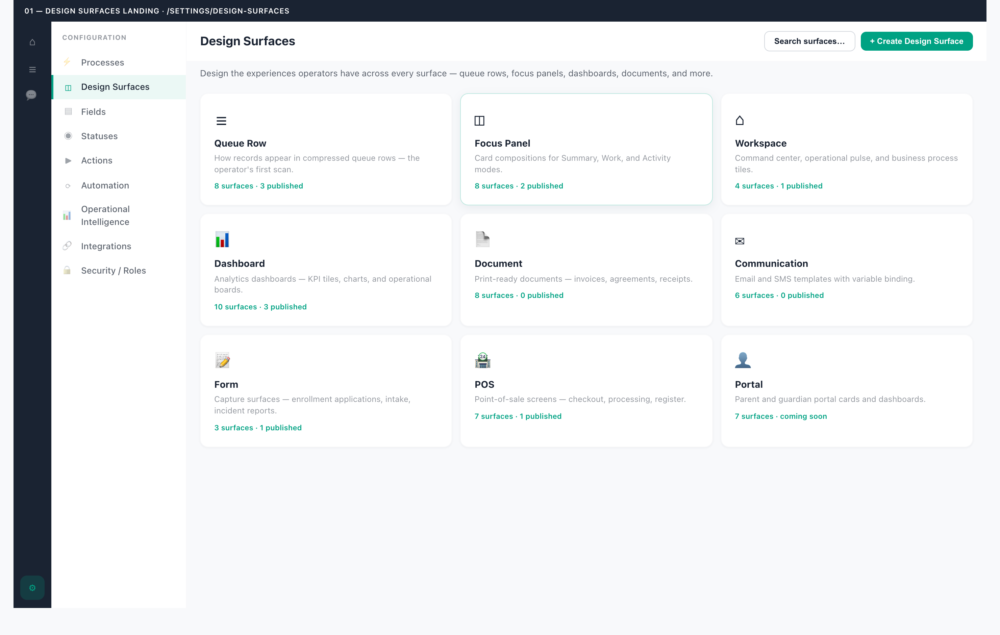
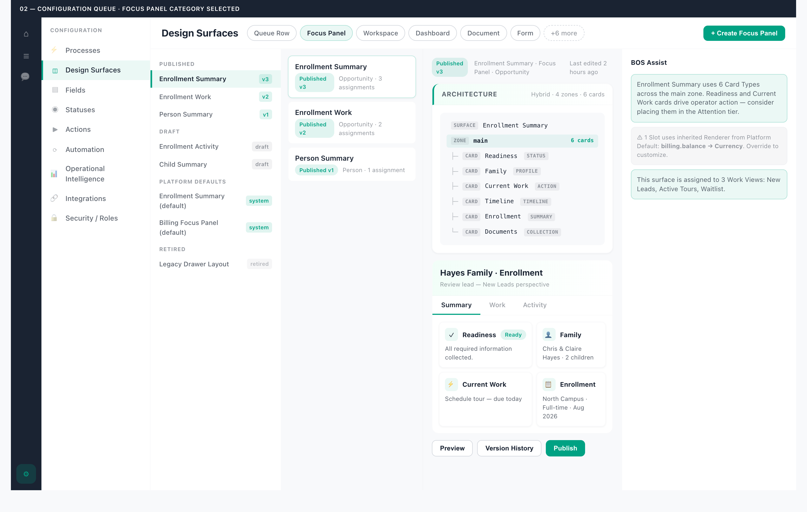
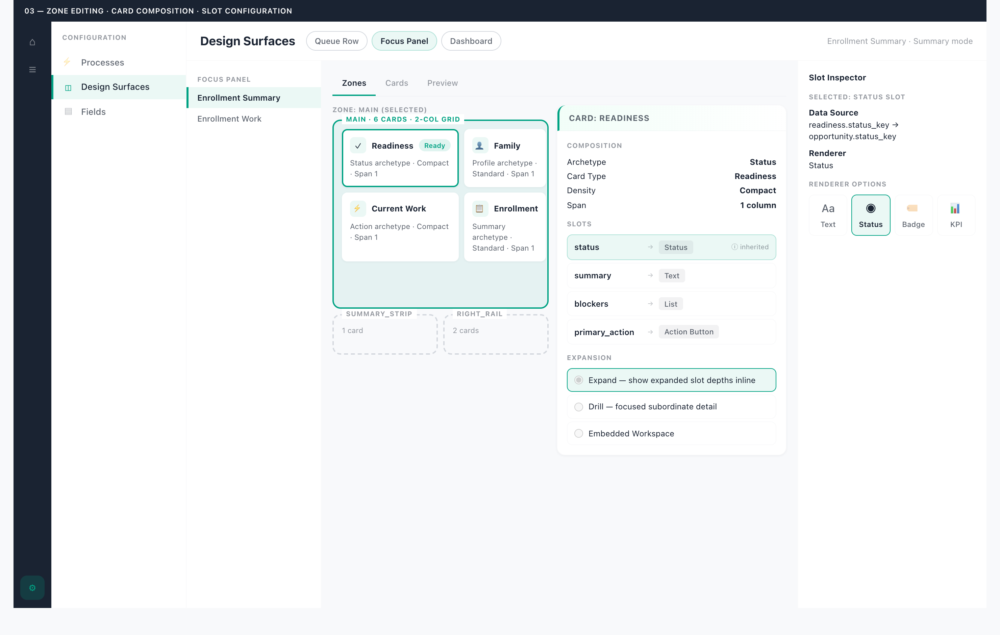
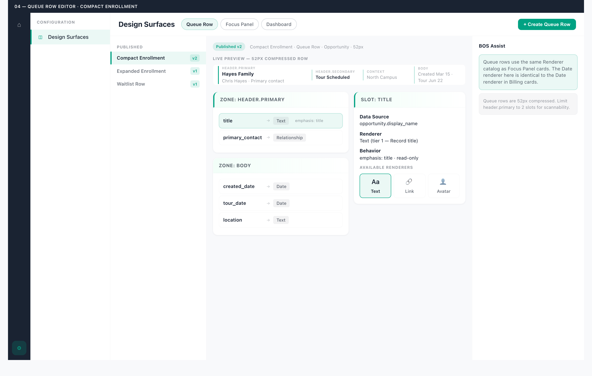
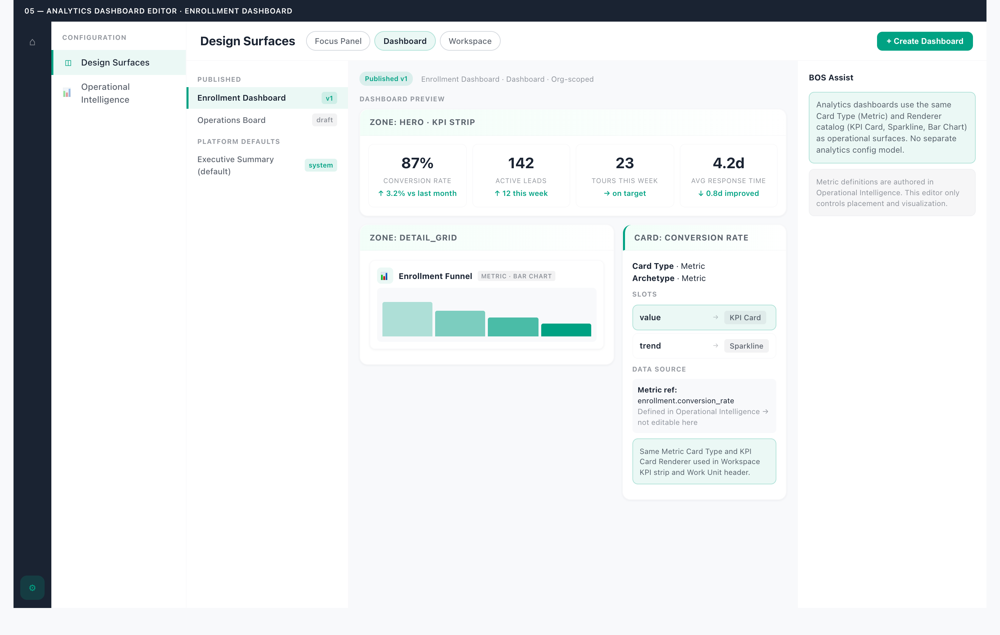
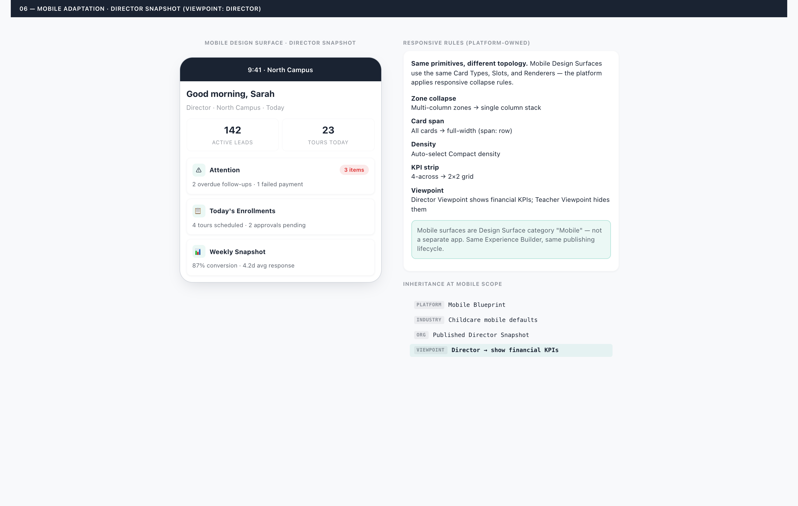

# Mockups — Presentation Runtime Architecture

**Path:** `docs/sprints/06_2026/presentation-runtime-architecture/mockups/`
**Status:** Architecture sprint — design only (June 2026)
**Format:** Self-contained HTML + shared CSS. Open in a browser for full fidelity. Screenshot to PNG for doc embedding.

---

## Mockup index

Each mockup ships as an editable HTML source and a captured PNG (1480px, 2× scale, via system Chrome). The PNGs are the canonical reference for review; the HTML is the source of truth for edits.

| # | HTML source | PNG | Shows | Deliverable |
|---|---|---|---|---|
| 01 | [`01-design-surfaces-landing.html`](./01-design-surfaces-landing.html) | [`01-design-surfaces-landing.png`](./01-design-surfaces-landing.png) | `/settings/design-surfaces` hub with category tiles | IA §3, Deliverable 5 |
| 02 | [`02-configuration-queue-focus-panel.html`](./02-configuration-queue-focus-panel.html) | [`02-configuration-queue-focus-panel.png`](./02-configuration-queue-focus-panel.png) | Configuration Mode shell: Context → Queue → List → Workspace → BOS; Focus Panel category selected; architecture panel + live preview | IA §2–5, Interaction §2 |
| 03 | [`03-zone-editing-card-composition.html`](./03-zone-editing-card-composition.html) | [`03-zone-editing-card-composition.png`](./03-zone-editing-card-composition.png) | Zone editing, card composition, slot configuration, renderer picker, expansion model selection | Deliverable 5 (zone, card, slot, renderer, expansion) |
| 04 | [`04-queue-row-editor.html`](./04-queue-row-editor.html) | [`04-queue-row-editor.png`](./04-queue-row-editor.png) | Queue Row category editor: 52px row preview, zone/slot editing, shared Renderer catalog | Deliverable 5 (queue row editor) |
| 05 | [`05-analytics-dashboard-editor.html`](./05-analytics-dashboard-editor.html) | [`05-analytics-dashboard-editor.png`](./05-analytics-dashboard-editor.png) | Dashboard category editor: KPI strip, metric cards, same primitives as operational surfaces | Deliverable 5 (analytics dashboard editor) |
| 06 | [`06-mobile-adaptation.html`](./06-mobile-adaptation.html) | [`06-mobile-adaptation.png`](./06-mobile-adaptation.png) | Mobile Design Surface with responsive collapse rules and Viewpoint inheritance | Deliverable 5 (mobile adaptation) |

Shared styles: [`_shared.css`](./_shared.css)

### Rendered previews

**01 — Design Surfaces Landing**



**02 — Configuration Queue · Focus Panel**



**03 — Zone Editing · Card Composition**



**04 — Queue Row Editor**



**05 — Analytics Dashboard Editor**



**06 — Mobile Adaptation**



---

## Visual contract

All mockups follow the locked Alloy visual language:

| Token | Value | Usage |
|---|---|---|
| Bend Pine | `#00a283` | Active states, accents, primary actions |
| Midnight | `#1a2332` | Primary text, app rail |
| Stone | `#d4d8de` | Borders, dividers |
| White canvas | `#ffffff` | Cards, panels, workspace |
| Canvas bg | `#f8f9fb` | Page background |
| Emerald gradient | `from-emerald-50/70` | Panel headers |
| Selected state | Pine soft bg + pine left accent | Queue items, nav items, chips |
| Typography | 6-tier hierarchy | Values win over labels |

No blue, slate, or gray active states (Configuration Mode visual doctrine).

---

## What each mockup demonstrates

### 01 — Design Surfaces Landing

- Settings Mode nav with "Design Surfaces" (renamed from "Layouts")
- Category hub tiles: Queue Row, Focus Panel, Workspace, Dashboard, Document, Communication, Form, POS, Portal
- Surface counts per category
- "Create Design Surface" primary action

### 02 — Configuration Queue + Focus Panel

- Full Configuration Mode shell (Context → Queue → List → Workspace → BOS)
- Category chips in Context bar
- Queue grouped by Published / Draft / Platform Defaults / Retired
- Architecture panel showing Zone → Card hierarchy
- Focus Panel live preview with Summary mode cards
- BOS rail with contextual suggestions

### 03 — Zone Editing + Card Composition

- Zone canvas with selected zone (main) showing card grid
- Card inspector: Archetype, Card Type, density, span
- Slot list with Data Source → Renderer bindings
- Inheritance indicator (ⓘ inherited)
- Renderer picker grid
- Expansion model selection (System 5B models)
- BOS slot inspector

### 04 — Queue Row Editor

- 52px compressed row live preview with zone regions labeled
- Zone-specific slot editing (header.primary, body)
- Same Renderer catalog as Focus Panel (Date, Text, Relationship)
- BOS guidance on row density limits

### 05 — Analytics Dashboard Editor

- Dashboard category with KPI strip zone
- Metric Card Type with KPI Card + Sparkline Renderers
- Metric ref as Data Source (defined in OI, not editable in EB)
- Same Card Type + Renderer as operational KPI surfaces
- Explicit "no separate analytics config model" demonstration

### 06 — Mobile Adaptation

- Mobile frame with Director Snapshot Design Surface
- Responsive collapse rules (platform-owned)
- Viewpoint inheritance (Director shows financial KPIs)
- Same primitives, different topology

---

## Screens not yet mocked (deferred to implementation sprints)

| Screen | Reason deferred |
|---|---|
| Document / Print editor | Document composition exists; EB editor is P7 |
| Communication template editor | Communications v2 not started |
| Form capture editor | Forms share authoring chrome; capture editor is P7 |
| POS checkout editor | POS shell partial; editor is P7 |
| Portal card editor | Portal product not started; P8 |
| Viewpoint assignment UI | Viewpoint layer is P6 |
| Publishing impact analysis modal | Interaction spec complete; UI is implementation |
| Version history diff view | Interaction spec complete; UI is implementation |
| Inheritance cascade visualization | Interaction spec complete; UI is P6 |

---

## How to view

```bash
open docs/sprints/06_2026/presentation-runtime-architecture/mockups/01-design-surfaces-landing.html
```

Or open any `.html` file in a browser. All mockups are 1440px wide (except mobile mockup which includes a 375px frame).

### Regenerating the PNGs

The PNGs were captured with Playwright driving system Chrome (the sandbox cache lacks the bundled chromium shell). To regenerate after editing the HTML, run a short Playwright script that loads each `file://` URL at a 1480×940 viewport, `deviceScaleFactor: 2`, and `fullPage: true`, launching with `chromium.launch({ channel: "chrome" })`. Output each `*.png` beside its `*.html` source. (The capture script is intentionally not committed — it is a throwaway dev utility.)

---

## Cross-references

| Concern | Doc |
|---|---|
| IA + routes | [`../03-information-architecture.md`](../03-information-architecture.md) |
| Interaction model | [`../04-interaction-model.md`](../04-interaction-model.md) |
| Visual language | `docs/platform/operator/alloy-visual-language.md` |
| Configuration Runtime mockups (reference) | `docs/sprints/06_2026/configuration-runtime-core-interaction/` |
| Workspace V3 mockups (reference) | `docs/sprints/06_2026/workspace-v3-operational-command-center/mockups/` |
