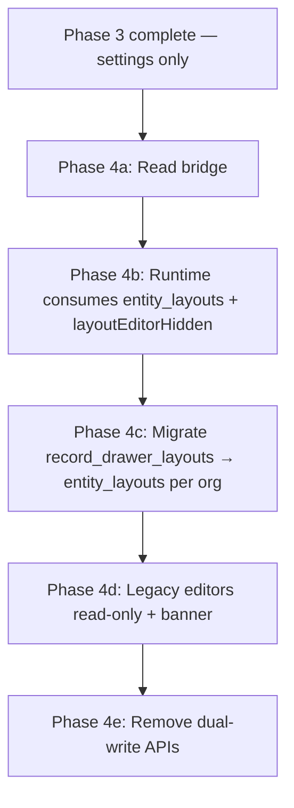

# Visual Layout Configuration Builder — Phase 3 Audit

**Date:** 2026-06-15  
**Scope:** Settings-only visual Opportunity Drawer editor (`OpportunityDrawerLayoutVisualEditor`) before runtime adoption.

---

## 1. UX review

### Drawer shape fidelity

| Area | Assessment |
|------|------------|
| Zone topology | **Good.** Summary strip → main + right rail → footer matches `surfaceLayoutRegistry` and `splitDrawerLayoutDocShellZones`. |
| Header / lifecycle / tabs | **Approximate.** Locked placeholders mirror slot order in `EntityDrawerOperatingShell` + `OpportunityDrawerVmRuntime`, but use simplified chips—not `ProofDoctrineLifecycleRail` or real tab strip styling. |
| Main composition grid | **Partial.** Production uses `leadOverviewComposition` (household left, enrollment center). Editor stacks main-zone sections vertically; order is correct but spatial composition differs. |
| Drawer width | **Improved (polish).** Frame capped at ~720px to approximate panel width. |
| Content rendering | **Strong.** Section previews use `LayoutRuntimePlanView` + `LAYOUT_DRAWER_PREVIEW_RECORD`—same engine as settings preview elsewhere. |

**Verdict:** Close enough for **layout authoring** (sections/fields/zones). Not pixel-parity with operational drawer chrome. Acceptable for internal/admin beta; polish composition grid before broad admin rollout.

### Locked platform areas

- Dashed borders + “Platform · locked” badge + `pointer-events-none` — **clear and non-interactive**.
- Footer actions correctly shown as platform-owned with Settings → Actions hint.
- **Risk:** Three consecutive locked bands before editable summary may feel heavy; acceptable for v1 because it teaches the shell model.

### Editability affordance

- Section cards: solid border, hover, selection ring, **“Editable”** badge (polish).
- Locked bands: visually distinct (dashed, muted).
- Side panel only activates on section select — **obvious once selected**; empty state copy guides click.
- **Gap:** Field chips list top-level items only; nested `field_group` fields not individually editable (V1 limitation).

### Save / Publish state

| Before polish | After polish |
|---------------|--------------|
| Publish enabled even with invalid in-memory doc (could publish stale DB copy) | Publish blocked when `!validation.ok` |
| “Save draft” always labeled same | Shows **Unsaved changes** / **Draft saved** / validation error tone |
| Published immutability shown only via disabled buttons | Explicit status: “Published — create a new draft from the gallery” |

Server remains authoritative: PATCH and publish both re-validate with `parseLayoutDoc(..., { inferSurfaceKey: true })`.

### Validation errors

- Shown as bullet list (not JSON).
- **Polish:** `formatLayoutValidationErrors` maps registry errors to plain language (e.g. disallowed field refKeys).
- Load now uses surface inference so invalid drafts surface immediately on open.

---

## 2. Data safety

### `layoutEditorHidden` and runtime

**Confirmed:** metadata key exists only in:

- `opportunityDrawerLayoutEditorModel.ts` (settings partition/preview)
- `validateLayoutDocForSurface.ts` (allow-list)
- Visual editor UI

**Not read by:**

- `resolveLayoutRuntimeSectionVisibility.ts`
- `evaluateOpportunityLayoutRuntimeBody.ts`
- `OpportunityDrawerVmRuntime.tsx` / `DrawerLayoutRuntimeShellZoneView.tsx`

Runtime section hiding today uses `collapseWhenEmpty` / `showWhenEmpty` + content probes—not `layoutEditorHidden`.

**Editor preview** filters hidden sections via `filterHiddenSectionsForPreview`; **live drawer ignores the flag until Phase 4.**

### Invalid docs cannot publish

| Layer | Guard |
|-------|--------|
| Client | Save disabled when `!validation.ok`; publish disabled when `!validation.ok` (polish) |
| PATCH | `parseLayoutDoc(..., { inferSurfaceKey: true })` → 400 |
| POST publish | Re-validates **stored** doc before flip → 400 `Cannot publish invalid doc` |

### Fallback to default layout

Production path (`resolveEffectiveProductionLayoutDoc`) unchanged:

- Malformed / empty org published doc → `buildLeadDrawerDefaultDoc()` with `usedFallback: true`.
- Visual editor does not alter this path.
- Settings invalid draft never becomes published without passing validation.

---

## 3. Product fit

### vs `LayoutConfigClient` (advanced builder)

| Dimension | Visual editor | Advanced builder |
|-----------|---------------|------------------|
| Mental model | Edit the drawer | Edit JSON tree / rows / columns |
| Surface registry | Enforced in UI | Enforced on save |
| Section discovery | Click cards in zones | Scroll abstract sections |
| Row/column geometry | Implicit (first column append) | Explicit |
| Widget / related_list editing | View + remove/reorder top-level | Full |
| Power-user needs | Link to `?advanced=1` | Complete |

**Verdict:** Better primary UX for **opportunity drawer section/field tuning**. Not a replacement for row/column surgery or queue surfaces.

### Must improve before real admin exposure

1. **Composition fidelity** — main zone grid matching `leadOverviewComposition` (household | enrollment | rail).
2. **Hide section semantics** — either wire runtime (Phase 4) or rename until wired (partially addressed with Phase 4 disclaimer).
3. **Field picker UX** — 120-item `<select>`; needs searchable grouped picker from field catalog API.
4. **Nested field editing** — `contact_block` / enrollment table columns not editable in place.
5. **Published read-only** — gallery should route published rows to “duplicate as draft” not dead-end editor.
6. **Dual-write awareness** — admins may still edit `record_drawer_layouts` via legacy workflow v1 settings; see Phase 4.

---

## 4. Phase 4 prep

### Runtime files to consume `layoutEditorHidden`

Apply **after** flag semantics are product-approved (hide vs collapse):

| File | Change |
|------|--------|
| `web/lib/layout/runtime/resolveLayoutRuntimeSectionVisibility.ts` | Early return `false` when `section.metadata.layoutEditorHidden === true` |
| `web/lib/layout/opportunityDrawerLayoutEditorModel.ts` | Export shared reader; align naming with runtime |
| `web/lib/layout/runtime/leadOverviewComposition.ts` | Exclude hidden sections from slot partition |
| `web/lib/layout/runtime/resolveLeadOverviewRightRailSections.ts` | Filter hidden before priority sort |
| `web/lib/layout/runtime/splitDrawerLayoutDocShellZones.ts` | Optional: strip hidden before split (or rely on visibility helper) |
| `web/components/admin/vmDrawer/DrawerLayoutRuntimeShellZoneView.tsx` | No logic change if visibility helper handles it |
| `web/lib/layout/runtime/evaluateOpportunityLayoutRuntimeBody.ts` | Optional: strip hidden at resolve boundary for evidence/logging |
| `web/tests/layout/resolveLayoutRuntimeSectionVisibility.test.ts` | New cases for `layoutEditorHidden` |

Do **not** weaken reveal gates or drawer shell contracts.

### Legacy `record_drawer_layouts` dual-write risk

**Write paths (still active):**

| Path | Table | What it writes |
|------|-------|----------------|
| `web/lib/admin/recordDrawerLayoutPersist.ts` | `record_drawer_layouts` | `config_json` org override |
| `web/app/api/admin/record-drawer-layouts/opportunity-workflow-v1-sections/route.ts` | via persist | `overview_section_order`, `overview_hidden_sections`, `inquiry_workflow_sections` |
| `web/app/api/admin/record-drawer-layouts/opportunity-workflow-v1-order/route.ts` | via persist | section order |
| `web/app/api/admin/record-drawer-layouts/opportunity-workflow-v1-field-placements/route.ts` | via persist | `field_placements_v1` |
| `web/components/adminV2/settings/OpportunityWorkflowV1SectionsEditor.tsx` | client → above APIs | section visibility/order |
| `web/components/adminV2/settings/OpportunityWorkflowV1DrawerOrderEditor.tsx` | client → order API | section order |
| `web/components/adminV2/settings/LayoutFieldBehaviorControls.tsx` | client → placements API | field required/editable |

**Read paths (runtime still bridged):**

| Path | Notes |
|------|-------|
| `web/lib/admin/effectiveRecordDrawerLayout.ts` | Effective legacy layout |
| `web/lib/admin/person/personDrawerLayoutRuntime.ts` | Person bridge (pattern reference) |
| VM workflow v1 overview (`OpportunityDrawerInquiryWorkflowOverview`) | When layout runtime body flag off |

**Risk:** Org edits in visual `entity_layouts` editor do not update `record_drawer_layouts`; legacy settings editors do the opposite. Until cutover, operators can have **conflicting section order / visibility** across stores.

### Safe cutover plan (recommended)



**Steps:**

1. **4a — Observability:** Log which layout source wins in `evaluateOpportunityLayoutRuntimeBody` (already exposes `layoutSource` / fallback).
2. **4b — Runtime adoption (flagged):** Enable published `entity_layouts` for opportunity drawer body under existing layout runtime flags; wire `layoutEditorHidden` in visibility helper only.
3. **4c — Migration script:** For each org, read effective `record_drawer_layouts.config_json` → map section order/hidden → publish equivalent `entity_layouts` draft (do not auto-publish without review).
4. **4d — Settings consolidation:** Point workflow v1 section/order editors at gallery visual editor; show “legacy — changes won’t affect runtime after DATE” on old panels.
5. **4e — Decommission writes:** Remove PATCH handlers to `record_drawer_layouts` for opportunity; keep read-bridge one release.

**Rollback:** Revert layout runtime flag; published `entity_layouts` remain in DB but unused; `resolveEffectiveProductionLayoutDoc` fallback to builtin default still safe.

---

## Polish applied (this pass)

- Publish blocked client-side when validation fails
- `resolveVisualEditorActionState` for toolbar status copy
- Load uses `inferSurfaceKey: true`
- Human-readable validation messages
- Editable badge, drawer frame width, Phase 4 hide disclaimer
- Tests for action state + runtime isolation of `layoutEditorHidden`

---

## Suggested commit message

```
fix(settings): polish Phase 3 visual layout editor before runtime adoption

Block publish on invalid docs, clarify save/publish state, improve validation
copy, and document layoutEditorHidden as settings-only until Phase 4.
```
