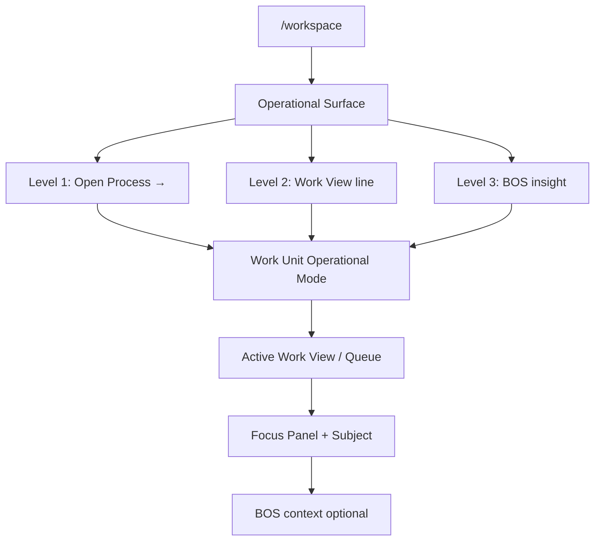
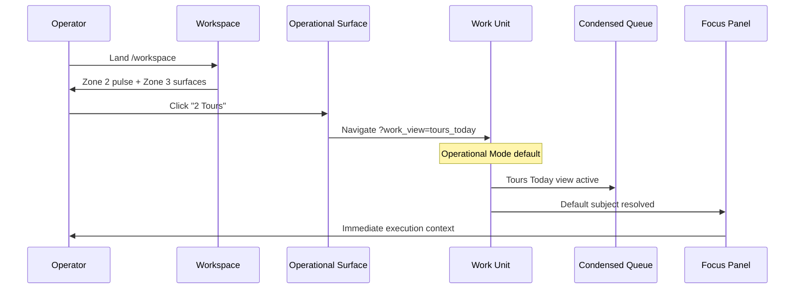
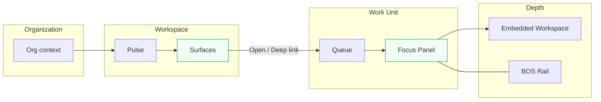
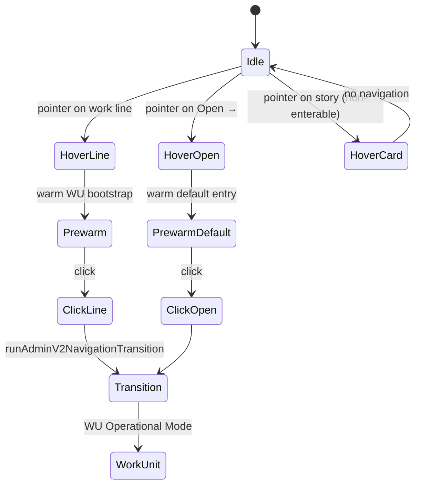

# Workspace V3 — Sprint 2 — Operational Command Center Evolution

**Status:** Design blueprint (pre-implementation) — June 2026  
**Note:** Visual mockups in this doc are **superseded** by [`sprint-3-evolution-reset.md`](./sprint-3-evolution-reset.md) — architecture and routing remain valid; mockups must evolve from baseline Alloy screenshot.

---

## Executive summary

Sprint 1 established Workspace as an operational command center with four zones. Sprint 2 refines that foundation with architectural realizations that emerged after implementation planning:

1. **Operational Surfaces** replace "Business Process cards" as the mental model  
2. **Operational storytelling** replaces metric-first display  
3. **Enterability law** — visible numbers become work entry points  
4. **Three-level deep-link navigation** (Process · Work View · BOS insight)  
5. **Work Views** as the exposure layer — no new queue invention  
6. **Role-aware Workspace** architecture (future)  
7. **One question per zone** — strict zone contract  
8. **Progressive operational depth** — full OS zoom stack  

---

## 1. Updated information architecture

### 1.1 Zone contract — one question each

| Zone | Name | Question | Must not answer |
|------|------|----------|-----------------|
| **1** | Organization Pulse | *How is the organization?* | Where to go · What to do · Historical trends |
| **2** | Operational Pulse | *What requires attention?* | Process-specific stories · Record detail |
| **3** | Operational Surfaces | *Where should I go?* | Org-wide health · Activity history |
| **4** | Operational Activity | *What just happened?* | Launch · Execution · Forecasting |

**Law:** If two zones answer the same question, redesign until they do not.

Sprint 1 "five questions" scan contract collapses into this zone model:

- Zone 1 → operational health confidence  
- Zone 2 → cross-process attention  
- Zone 3 → launch + storytelling + enterable work lines  
- Zone 4 → recent context  

### 1.2 Page hierarchy (Sprint 2)

```
/workspace
├── Zone 1 — Organization Pulse           "How is the organization?"
│   └── Org name + health heartbeat chips
│
├── Zone 2 — Operational Pulse            "What requires attention?"
│   └── Cross-process enterable indicators
│
├── Zone 3 — Operational Surfaces         "Where should I go?"  [DOMINANT]
│   └── Domain launch environments (story + today's work + Open →)
│
└── Zone 4 — Operational Activity         "What just happened?"
    └── Quiet chronological feed
```

### 1.3 Progressive operational depth (full stack)

Alloy is organized around **progressively deeper operational context**, not pages:

```
Organization
  ↓
Workspace                          ← Sprint 2 focus
  ↓
Operational Surface                ← Zone 3 launcher
  ↓
Work Unit                          ← frozen
  ↓
Queue (condensed)                  ← frozen
  ↓
Focus Panel                        ← frozen
  ↓
Embedded Workspace                 ← frozen
  ↓
BOS                                ← frozen
```

**Design implications:**

| Concern | Guidance |
|---------|----------|
| Spacing | Zone 3 surfaces grow; Zones 1–2 compress further |
| Transitions | Shared shell + rail persist; content column zooms |
| Motion | Depth-in, not page-swap; 150–220ms ease, no decorative bounce |
| Typography | Story weight increases at Zone 3; history lightens at Zone 4 |
| Breadcrumbs | Implicit: `Home · {Process} · {Work View} · {Subject}` |

---

## 2. Deep-link routing strategy

### 2.1 Routing levels



### 2.2 URL contract

**Product paths** (operator-facing, via rewrite):

| Level | URL pattern | Example |
|-------|-------------|---------|
| L1 — Default | `/workspace/work-unit/{slug}` | `/workspace/work-unit/enrollment-pipeline` |
| L2 — Work View | `/workspace/work-unit/{slug}?work_view={id}` | `?work_view=tours_today` |
| L2 — Queue compat | `/workspace/work-unit/{slug}?queue={key}` | `?queue=follow_ups` |
| L2 — Attention | `/workspace/work-unit/{slug}?queue=needs_attention&attention_bucket={key}` | bucket lens |
| L3 — BOS (future) | `/workspace/work-unit/{slug}?work_view={id}&bos_insight={id}` | insight-scoped cohort |

**Internal compat** (tests, prefetch, legacy):

```
/adminV2/workspace/dept/{deptId}/work-unit/{wuId}?work_view={id}&queue={key}
```

Built by: `buildOperationalViewPreviewRuntimeHref` in `mergeOperationalViewMetadata.ts`.

### 2.3 Resolution order (existing runtime — do not change)

On Work Unit load:

1. URL `?queue=` — route-owned, wins when present  
2. URL `?work_view=` — resolves to compat queue via `resolveActiveWorkViewRuntimeContext`  
3. Bootstrap default lane — when no URL params  
4. Default Operational Subject — after queue resolved  

Reference: `workUnitQueueSelection.ts`, `operational-mode-default-state-doctrine.md`.

### 2.4 Deep link payload model (new — landing API)

Extend `OperatorLifecycleLandingCard` → `OperatorOperationalSurface`:

```typescript
type OperationalSurfaceWorkLine = {
  /** Operator copy — "2 Tours" */
  label: string;
  /** Story support — optional subline */
  detail?: string | null;
  /** Enterability */
  entryLevel: 1 | 2 | 3;
  /** L2 routing */
  workViewId?: string | null;
  queueKey?: string | null;          // compat when work_view absent
  attentionBucketKey?: string | null;
  /** Prebuilt href — server authoritative */
  href: string;
  count: number | null;
  attention?: boolean;
};

type OperatorOperationalSurface = {
  // identity (from lifecycle catalog)
  id: string;
  processKey: string;
  label: string;
  health: "healthy" | "warning" | "critical" | "unknown";
  /** Operational story — one sentence */
  story: string;
  /** Section label — "Today's work", "Requires action", … */
  workSectionLabel: string;
  workLines: OperationalSurfaceWorkLine[];
  /** L1 */
  entryHref: string;
  openLabel: string;                 // "Open Enrollment →"
};
```

**Law:** `href` on each work line is **server-built** — client does not construct routing.

### 2.5 Operational Pulse enterability

Zone 2 indicators follow the same law when mappable:

| Pulse indicator | Target |
|-----------------|--------|
| Needs Attention (org) | Highest-attention process WU + `needs_attention` view |
| Outstanding Payments | Billing WU + `outstanding` work view |
| Children Starting Soon | Attendance WU + `starting_soon` work view |
| Licensing Deadlines | Compliance WU + `licensing_items` work view |

Unmapped indicators remain **orient-only** until Work View exists.

### 2.6 Prewarm and performance

Deep links use the same prewarm contract as L1:

- Hover/focus on work line → `warmOperatorWorkUnitEntryFromHref(href)`  
- Click → `runAdminV2NavigationTransition({ variant: "work_unit" })`  
- Never block Workspace above-fold reveal for deep-link target resolution  

---

## 3. Work View strategy

### 3.1 Principle

Work Views are **Configuration Runtime artifacts** on the Business Process. Operational Surfaces **reference** them — they do not define queue behavior.

```
Business Process (config)
  └── Work Views (conditions + queue + layouts)
        └── Operational Surface work line (Workspace exposure)
              └── Deep link URL
                    └── Work Unit runtime (frozen)
```

### 3.2 Work View → story line mapping

| Config field | Workspace use |
|--------------|---------------|
| `work_view.id` | `?work_view=` param |
| `display_label` | Line label ("Follow Ups") |
| `mission` / description | Story sentence input (when no OIP narrative) |
| `conditions` | Count query for line (preview API) |
| `queue_key` (compat) | Fallback `?queue=` when work_view omitted |

### 3.3 Default surface work line sets (platform seeds)

Tenants override via configuration. Platform provides **sensible defaults** per process key:

**Enrollment**

| Line | Work View key (example) | Story role |
|------|-------------------------|------------|
| Today's Tours | `tours_today` | Time-bound work |
| Enrollments in progress | `enrolling` | Pipeline work |
| Follow Ups | `follow_ups` | Attention work |
| Waiting Families | `waiting_families` | Cohort waiting |

**Billing**

| Line | Work View key | Story role |
|------|---------------|------------|
| Outstanding | `outstanding` | Balance work |
| Overdue Accounts | `overdue` | Attention work |
| Collections | `collections` | Recovery work |

*(Scheduling, Attendance, Compliance, Staffing, Health — see §7 validation matrix)*

### 3.4 Count semantics

Preview counts on Workspace follow Sprint 1 truth boundaries:

- Resolver-backed or summary API — **not queue row iteration on client**  
- Same site scope as `workspace_site_id`  
- `null` ≠ zero — coordinated reveal  
- Authoritative counts inside Work Unit after entry  

---

## 4. Role-aware Workspace strategy

**Not required for implementation now.** Architecture must support it without structural rework.

### 4.1 Model

```
WorkspaceLayout (future config)
  ├── role_keys[] | persona_keys[] | access_profile_ids[]
  ├── surface_order: processKey[]
  ├── pulse_placements: OIP placement ids[]
  └── per-process overrides
        └── OperationalSurfaceConfig
              ├── visible: boolean
              ├── story_template_id
              └── work_line_ids[] (ordered Work View refs)
```

### 4.2 Reference personas (design targets)

| Persona | Surfaces shown | Rationale |
|---------|----------------|-----------|
| **Executive** | Enrollment · Billing · Staffing · Compliance | Org-wide risk and capacity |
| **Center Director** | Enrollment · Attendance · Scheduling · Health | Daily center operations |
| **Finance** | Billing · Collections · Revenue · Forecasting* | Financial operations |

\*Forecasting links to Analytics workspace — not an Operational Surface.

### 4.3 Resolution order (future)

1. User's active role / access profile  
2. Org default Workspace layout  
3. Platform default (all entitled processes)  

### 4.4 Fallback law

When role layout is unconfigured, show **all entitled Operational Surfaces** (current behavior). Role awareness is **additive**, never blocking.

---

## 5. Future configuration architecture

Design for configuration **without implementing** a Workspace builder in this sprint.

### 5.1 Configuration ownership matrix

| Concern | Owner | Future surface |
|---------|-------|----------------|
| Process visibility | Business Processes / Lifecycle | Process catalog |
| Work View definitions | Configuration Runtime / BP | Work Views editor |
| Work line → Work View binding | **New:** Workspace Surface Config | Per-process launcher config |
| Story templates | OIP + template slots | Metric narrative + copy templates |
| Surface ordering | Workspace Layout | Role/layout admin |
| Pulse indicators | OIP placements | Existing placement UI |
| Role layouts | Access profiles + Workspace Layout | Settings (future) |
| Hide process | Workspace Surface Config | Toggle per org/role |

### 5.2 Metadata shape (reserved)

Store under org or department metadata — exact table TBD:

```json
{
  "workspace_v3": {
    "layouts": [{
      "id": "center_director",
      "label": "Center Director",
      "role_keys": ["center_director"],
      "surface_order": ["enrollment", "attendance", "scheduling", "health"],
      "surfaces": {
        "enrollment": {
          "work_section_label": "Today's work",
          "work_view_ids": ["tours_today", "follow_ups", "waiting_families"],
          "story_placement_id": "enrollment_waiting_contact"
        }
      }
    }]
  }
}
```

### 5.3 Questions answered (design-only)

| Question | Answer |
|----------|--------|
| How are surfaces ordered? | `surface_order` in role layout; fallback catalog order |
| How are Work Views assigned? | `work_view_ids[]` per surface config |
| How are summary rows configured? | OIP story placement + work line bindings |
| Can orgs hide processes? | `visible: false` on surface config |
| Can roles get different layouts? | `WorkspaceLayout` matched by role key |
| Can surfaces expose custom preview metrics? | OIP `tile_metrics` zone — already planned |

**Law:** Experience Builder does **not** author Workspace layout. Workspace configuration is a **launch configuration** concern — sibling to BP Work Views, not layout composition.

---

## 6. Navigation flow diagrams

### 6.1 Operator journey — enterable work line



### 6.2 Zoom continuity



### 6.3 Interaction flow — Operational Surface



---

## 7. Domain validation matrix (Sprint 2)

Each domain validates **storytelling + enterability + Work View routing**.

### Enrollment

| Element | Sprint 2 target |
|---------|-----------------|
| Story | "3 families are waiting for contact." |
| Today's work | 2 Tours · 1 Enrollment · 3 Follow Ups — **all enterable** |
| L1 | `Open Enrollment →` → default WU |
| L2 examples | `tours_today`, `follow_ups`, `waiting_families` |
| Zone 2 link | Waiting Families → enrollment waiting view |

### Billing

| Element | Sprint 2 target |
|---------|-----------------|
| Story | "$14,200 requires action across 6 accounts." |
| Today's work | Outstanding · Overdue · Collections |
| L2 | `outstanding`, `overdue`, `collections` work views |

### Scheduling

| Element | Sprint 2 target |
|---------|-----------------|
| Story | "4 staffing conflicts need resolution today." |
| Today's work | Room Changes · Conflicts · Coverage |

### Attendance

| Element | Sprint 2 target |
|---------|-----------------|
| Story | "12 children expected — 2 missing check-ins." |
| Today's work | Missing Check-ins · Late Pickups · Capacity Issues |

### Compliance

| Element | Sprint 2 target |
|---------|-----------------|
| Story | "3 licensing items expire this week." |
| Today's work | Licensing Items · Expiring Documents |

### Staffing

| Element | Sprint 2 target |
|---------|-----------------|
| Story | "5 shifts uncovered for next week." |
| Today's work | Open Shifts · Coverage Gaps |

### Health

| Element | Sprint 2 target |
|---------|-----------------|
| Story | "8 immunization records need review." |
| Today's work | Expiring Immunizations · Records Needing Review |

### Cross-domain rules

| Rule | Validation |
|------|------------|
| Story before numbers | Copy audit — no metric-first surfaces |
| Enterability | Every work line has `href` or is omitted |
| No new queues | Work Views only |
| Same anatomy | Single `OperationalSurface` component |
| L1 preserved | `Open →` always present |
| Analytics separated | No trend UI on Workspace |

---

## 8. Conceptual mockups

Sprint 2 mockups in [`mockups/sprint-2/`](./mockups/sprint-2/):

| File | Concept |
|------|---------|
| `A-mission-control.png` | Version A — large surfaces, compact pulse |
| `B-card-first-dense.png` | Version B — dense launcher, minimal chrome |
| `C-executive-role.png` | Version C — Executive role subset |
| `D-center-director.png` | Version D — operations-first role layout |
| `E-mobile-tablet.png` | Version E — mobile/tablet adaptation |
| `operational-surface-enrollment-story.png` | Enrollment surface — storytelling + enterable lines |
| `deep-link-flow.png` | Visual: click Tours → WU with Focus Panel continuity |

Sprint 1 mockups remain valid for zone structure — Sprint 2 supersedes **surface anatomy** only.

---

## 9. Updated implementation roadmap

### Sprint 1 phases (unchanged baseline)

| Phase | Status | Notes |
|-------|--------|-------|
| 0 Doctrine | ✅ Sprint 1 + Sprint 2 docs | This document |
| 1 Zone restructuring | Pending | Org Pulse / Op Pulse split |
| 2 Surface anatomy | **Superseded by Sprint 2** | Story + work lines, not metric grid |
| 3 Activity feed | Pending | Zone 4 |
| 4 Motion | Pending | Zoom continuity |
| 5 OIP migration | Pending | Pulse placements |

### Sprint 2 phases (new)

#### Phase 2A — Operational Surface component (~5–7 days)

| Task | Files |
|------|-------|
| Rename mental model in UI copy | `WorkspaceRootShell`, section kickers |
| `OperationalSurfaceLauncher` component | New — replaces grid tile anatomy |
| Story + work lines layout | System 5 tokens |
| Enterable line hover/click | Deep link navigation |

#### Phase 2B — Landing API enrichment (~5–8 days)

| Task | Files |
|------|-------|
| `OperatorOperationalSurface` type | `buildOperatorLifecycleLanding.ts` |
| Work View count resolution | Server summary endpoint |
| Story sentence generation | OIP narrative + template fallback |
| Prebuilt `href` per work line | Uses `buildOperationalViewPreviewRuntimeHref` |

#### Phase 2C — Pulse enterability (~3–5 days)

| Task | Files |
|------|-------|
| Map pulse placements → deep links | OIP placement metadata extension |
| Click handlers on Zone 2 indicators | `OperationalPulseBand` |

#### Phase 2D — Role layout readiness (~2–3 days, schema only)

| Task | Files |
|------|-------|
| Reserve metadata shape | Doctrine + types only |
| `resolveWorkspaceSurfacesForPrincipal()` stub | Returns full catalog until config exists |

#### Phase 2E — Motion polish (~3–5 days)

| Task | Files |
|------|-------|
| Depth-in transition on L2 entry | `runAdminV2NavigationTransition` |
| Surface → WU visual continuity | Shell persistence (existing) |

#### Phase 3+ — Unchanged from Sprint 1

Activity feed, OIP migration, BOS Level 3 routing when insights API exists.

### Out of scope (explicit)

- Work Unit / Queue / Focus Panel / Universal Card / BOS redesign  
- Work View **authoring** UI changes (Configuration Runtime)  
- Role layout **admin UI**  
- BOS Level 3 implementation  
- Analytics workspace  

---

## 10. Documentation index

| Doc | Sprint 2 update |
|-----|-----------------|
| [`workspace-v3-command-center-doctrine.md`](../../../platform/operator/workspace-v3-command-center-doctrine.md) | Rev 2 — zones, storytelling, depth stack |
| [`workspace-v3-operational-surface-doctrine.md`](../../../platform/operator/workspace-v3-operational-surface-doctrine.md) | **New** — surface launcher law |
| [`navigation-and-workspace-doctrine.md`](../../../platform/core/navigation-and-workspace-doctrine.md) | Deep links + progressive depth |
| [Sprint 1 README](./README.md) | Superseded surface anatomy — link to Sprint 2 |

---

## Related

- [`operational-mode-default-state-doctrine.md`](../../../platform/operator/operational-mode-default-state-doctrine.md)
- [`operational-surface-design-system.md`](../../../platform/operator/operational-surface-design-system.md) (System 5)
- `web/lib/adminV2/runtime/perspective/mergeOperationalViewMetadata.ts`
- `web/lib/adminV2/workUnitQueueSelection.ts`
