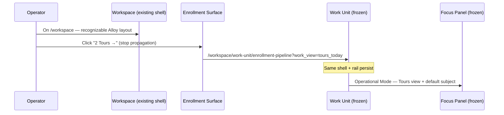
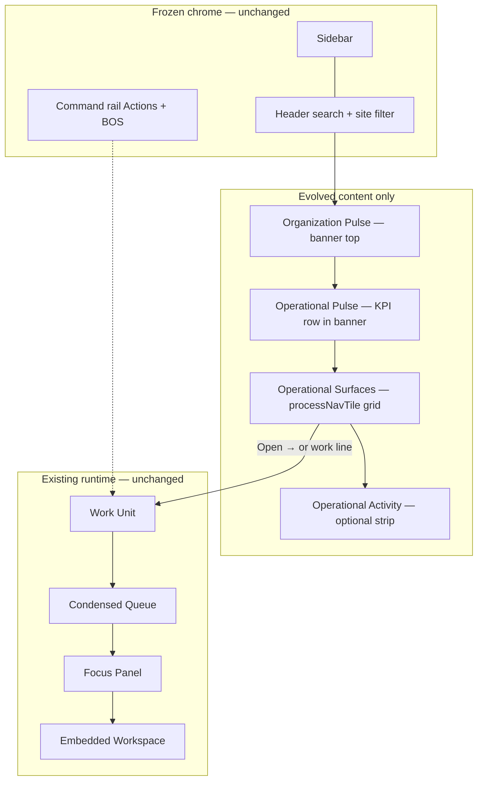

# Workspace V3 — Sprint 3 — Evolution Reset

**Status:** Design blueprint (evolution only) — June 2026  
**Canonical doctrine:** [`workspace-v3-command-center-doctrine.md`](../../../platform/operator/workspace-v3-command-center-doctrine.md) (Rev 2.1)  
**Baseline:** Today's shipped Workspace — **not** a blank canvas  
**Scope:** Refine `/workspace` — **do not** replace shell, sidebar, rail, or runtime

> **Sprint 2 mockups are superseded.** Greenfield concepts in `mockups/sprint-2/` drifted from Alloy. This sprint resets to **evolution mockups** anchored to the current product.

---

## Read this first

### Canonical baseline

**Screenshot:** [`mockups/baseline/01-workspace-current-system5.png`](./mockups/baseline/01-workspace-current-system5.png)

**Source code (today's implementation):**

| Element | Component / token |
|---------|-------------------|
| Shell | `AdminV2Shell` — collapsed sidebar, top search, site filter |
| Page layout | `WorkspaceShellLayout` — 3fr primary \| 1fr command rail (`--ws-rail: 345px`) |
| Root | `WorkspaceRootShell` — `adminv2-ws-company-v2` |
| Health + pulse | `WorkspaceHealthPulseSection` — `WS_COMMAND_BANNER_CLASS` (juniper left rail) |
| Health chips | `OipHealthStrip` — Business / Operational / Enrollment |
| Pulse KPIs | `MetricPlacementRenderer` + `OipPerformanceKpiRow` (command grid) |
| Process tiles | `WorkspaceRootLifecycleGrid` — `WS_LAYOUT.processNavTile`, 2-col grid `max-w-[52rem]` |
| Command rail | `WorkspaceRootActionsRail` + persistent BOS |
| Launch | `runAdminV2NavigationTransition` → `/workspace/work-unit/:slug` |

### Assignment

| ❌ Not this | ✅ This |
|------------|---------|
| Design a better workspace | Make today's Workspace world class |
| New application chrome | Same Alloy shell |
| Greenfield mockups | Evolution mockups from baseline |
| Replace spacing system | Refine within `workspaceLayoutSystem.ts` |
| Invent queue behavior | Expose existing Work Views |

---

## What stays exactly the same (frozen)

| System | Why frozen |
|--------|------------|
| `AdminV2Shell` sidebar | Platform navigation spine |
| Top search + site filter + user menu | Operator context |
| `WorkspaceShellLayout` grid (3fr \| 1fr) | Established workbench |
| Command rail (Actions + BOS) | Persistent command surface |
| `WS_COMMAND_BANNER_CLASS` banner chrome | System 5 command banner |
| `processNavTile` card shell (border, rail, radius, shadow) | Recognizable Alloy tile |
| `Open →` button styling (juniper ghost) | Known launch affordance |
| Work Unit entry + Operational Mode | Runtime complete |
| Reveal gate + prewarm pipeline | Performance doctrine |

**Recognition test:** Would an existing Alloy user instantly recognize the page? If not, the design drifted too far.

---

## Annotated evolution (change log)

Each change starts from today's Workspace.

### Change 1 — Clarify zone labels inside existing banner

**Current:** Single banner contains org name, "Workspace Health", and "Operational Pulse" with `sectionBreak` divider — structure largely exists in `WorkspaceHealthPulseSection.tsx`.

**Evolution:** Rename kickers only:

| Current label | Evolved label | Zone question |
|---------------|---------------|---------------|
| (org name h1) | *(unchanged)* | — |
| Workspace Health | **Organization Pulse** | How is the organization? |
| Operational Pulse | *(unchanged)* | What requires attention? |

**Why:** Aligns copy with doctrine without changing banner chrome.  
**User benefit:** Clearer mental model — health vs attention.  
**Implementation complexity:** **Low** — copy change in one component.  
**Runtime impact:** None.

---

### Change 2 — Operational Pulse rows become enterable (where mapped)

**Current:** `OipPerformanceKpiRow` / `MetricPlacementRenderer` shows KPI values as static display.

**Evolution:** When OIP placement metadata includes a Work View target, wrap count in link using existing `runAdminV2NavigationTransition`.

**Why:** Enterability law — pulse numbers should launch work when mappable.  
**User benefit:** "Outstanding Payments" → Billing Work View in one click.  
**Implementation complexity:** **Medium** — placement metadata + click handler; no new API if href prebuilt server-side.  
**Runtime impact:** None on reveal gates; uses existing WU bootstrap prewarm.

---

### Change 3 — Evolve tile **content** inside existing `processNavTile` shell

**Current:** Metric label/value pairs (Tour Conversion 42%, Needs Attention 7, …) + footer Records / Attention / Stages.

**Evolution:** Replace metric list with operational storytelling **inside same card chrome**:

```
Enrollment                          [Healthy chip — existing OipHealthChip style]
3 families are waiting for contact.

Today's Work
• 2 Tours →
• 1 Enrollment →
• 3 Follow Ups →

[footer unchanged: Records · Attention · Stages]    [Open →]
```

**Why:** Story before numbers; surfaces feel alive not report-like.  
**User benefit:** Immediate priority understanding before entering Work Unit.  
**Implementation complexity:** **Medium** — new inner content component; same outer `article` classes.  
**Runtime impact:** None on shell; landing API extends `OperatorLifecycleLandingCard`.

**What stays:** Tile dimensions, juniper left rail, icon well, footer micro-labels, Open → button.

---

### Change 4 — Today's Work lines deep-link to Work Views

**Current:** Only `Open →` navigates (full card link to `entryHref`).

**Evolution:**

| Line | href |
|------|------|
| 2 Tours | `/workspace/work-unit/enrollment-pipeline?work_view=tours_today` |
| 3 Follow Ups | `?work_view=follow_ups` |
| Open Enrollment → | `/workspace/work-unit/enrollment-pipeline` (L1 default) |

**Why:** Shortcuts into specific work without re-filtering inside WU.  
**User benefit:** One click to the exact cohort.  
**Implementation complexity:** **Medium** — server-built hrefs via `buildOperationalViewPreviewRuntimeHref`; stop propagation on line click vs card click.  
**Runtime impact:** Uses existing `?work_view=` resolution in `workUnitQueueSelection.ts`.

---

### Change 5 — Spacing refinement (within existing tokens)

**Current:** `--ws-dept-section-gap: 16px`; departments zone `margin-top: 1.5rem`.

**Evolution:**

| Token | Current | Refined | Reason |
|-------|---------|---------|--------|
| Banner internal `space-y-2` | 8px stack | `space-y-2.5` | Slightly clearer band separation |
| Tile inner metric area | `mt-2.5` | story block + `mt-2` work list | Better scan rhythm |
| Zone 3 kicker → grid | `mb-2` | `mb-2.5` | Align with section kickers elsewhere |

**Why:** Reduce visual noise without changing page width or grid structure.  
**User benefit:** Calmer scan path from pulse → surfaces.  
**Implementation complexity:** **Low** — CSS only in `workspace.css` / component classes.  
**Runtime impact:** None.

---

### Change 6 — Zone 4 Operational Activity (below grid, optional)

**Current:** Not rendered.

**Evolution:** Collapsed strip below process grid when feed data exists — same width as primary column, quiet typography matching `sectionKicker`.

**Why:** Answers "What just happened?" without competing with Zone 3.  
**User benefit:** Context for returning operators.  
**Implementation complexity:** **Medium** — new section + background API (Sprint 1 Phase 3).  
**Runtime impact:** Background fetch only; never blocks reveal gate.

---

## Comparison matrix (every proposed answer)

| Proposal | Stays the same | Changes | Why | Difficulty | Recognizable? |
|----------|----------------|---------|-----|------------|---------------|
| Zone label rename | Banner, chips, KPI grid | Kicker copy | Doctrine alignment | Low | ✅ Yes |
| Enterable pulse | KPI card shell | Click + href on mapped metrics | Enterability | Medium | ✅ Yes |
| Operational Surface content | `processNavTile` shell, Open → | Inner body: story + work lines | Storytelling | Medium | ✅ Yes |
| Work View deep links | WU runtime, URL params | Line-level navigation | Direct entry | Medium | ✅ Yes |
| Spacing tune | Grid, max-width, rail | Minor margin tokens | Visual rhythm | Low | ✅ Yes |
| Activity strip | Shell | New bottom section | Zone 4 | Medium | ✅ Yes |
| ~~New sidebar~~ | — | — | Out of scope | — | ❌ No |
| ~~Full-width hero cards~~ | — | — | Drift | — | ❌ No |
| ~~Remove command rail~~ | — | — | Breaks OS model | — | ❌ No |

---

## Evolution mockups

All mockups in [`mockups/evolution/`](./mockups/evolution/) **begin from the baseline screenshot** — same sidebar, header, rail, banner chrome, tile shells.

| Version | File | Description |
|---------|------|-------------|
| **Baseline** | [`baseline/01-workspace-current-system5.png`](./mockups/baseline/01-workspace-current-system5.png) | Today's Alloy Workspace — System 5 canonical reference |
| **A** | `A-conservative-evolution.png` | Label rename only; minimal delta |
| **B** | `B-operational-surface-storytelling.png` | Same tiles; inner storytelling + Today's Work |
| **C** | `C-improved-hierarchy.png` | Same layout; refined spacing and scan path |
| **D** | `D-executive-role-layout.png` | Same shell; 4 surfaces for Executive persona |
| **E** | `E-annotated-evolution-callouts.png` | Baseline + numbered change annotations |
| **F** | `F-deep-link-tours-flow.png` | Click "2 Tours" → same Alloy WU runtime |
| **G** | `G-work-view-transition.png` | Progressive depth within existing chrome |

---

## Interaction diagrams

### Deep link — Tours Today



### Progressive depth (no page swap)



### Enterability map — Enrollment

| Operator sees | Clicks | Lands in |
|---------------|--------|----------|
| Open Enrollment → | L1 | Default WU + Default Operational Subject |
| 2 Tours → | L2 | WU + `tours_today` Work View |
| 3 Follow Ups → | L2 | WU + `follow_ups` Work View |
| Waiting Families (pulse) | L2 | WU + `waiting_families` Work View |

Uses **existing** Work Views from Configuration Runtime — no new queue behavior.

---

## Work View philosophy (unchanged from Sprint 2)

Workspace **never performs work**. It **launches work**.

Operational Surfaces expose configured Work Views as Today's Work lines. Reference catalog: Enrollment (Tours, Follow Ups, Ready to Enroll, Needs Attention), Billing (Outstanding, Collections), Scheduling (Room Changes, Conflicts), etc.

---

## Role-aware architecture (future — not implementation)

Same shell; different **surface membership** per role:

| Role | Surfaces shown |
|------|----------------|
| Executive | Enrollment · Billing · Compliance · Staffing |
| Center Director | Enrollment · Attendance · Scheduling · Health |
| Finance | Billing · Collections · (+ Analytics link, not on Workspace) |

Resolved by `resolveWorkspaceSurfacesForPrincipal()` when config exists; fallback = all entitled surfaces (today's behavior).

---

## Updated implementation roadmap

### Phase 1 — Copy + zone labels (1 day)

- Rename kickers in `WorkspaceHealthPulseSection.tsx`
- Add `data-workspace-zone` attributes if missing

### Phase 2 — Operational Surface inner content (5–7 days)

- New `OperationalSurfaceBody.tsx` — renders inside existing `processNavTile`
- Extend `buildOperatorLifecycleLanding.ts` with `story`, `workLines[]`
- **Do not** change `WS_LAYOUT.processNavTile` shell classes

### Phase 3 — Deep links (3–5 days)

- Server-built `href` per work line
- Click stopPropagation on lines vs card
- Prewarm on line hover (existing warm path)

### Phase 4 — Pulse enterability (3–5 days)

- OIP placement → Work View mapping metadata
- Optional click on command KPI cards

### Phase 5 — Spacing pass (1–2 days)

- Token tweaks in `workspace.css` only

### Phase 6 — Activity strip (5–8 days, optional)

- Background fetch; below grid

**Tests unchanged:** `workspaceRevealGatePage.test.ts`, `workspaceLayoutAlignment.test.ts`

---

## Domain validation (evolution criteria)

For each domain, validate on **recognizable Alloy chrome**:

| Domain | Story example | Enterable lines |
|--------|---------------|-----------------|
| Enrollment | "3 families waiting for contact" | Tours · Enrollment · Follow Ups |
| Billing | "$14,200 requires action" | Outstanding · Overdue · Collections |
| Scheduling | "4 conflicts need resolution" | Room Changes · Conflicts · Coverage |
| Attendance | "2 missing check-ins today" | Missing Check-ins · Late Pickups |
| Compliance | "3 licenses expiring" | Licensing Items · Expiring Documents |
| Staffing | "5 shifts uncovered" | Open Shifts · Coverage Gaps |
| Health | "8 immunization records due" | Expiring Immunizations · Records Needing Review |

---

## Success criteria

- [ ] Unmistakably Alloy — sidebar, header, rail, banner, tiles recognizable  
- [ ] Frozen architecture preserved  
- [ ] Tile **content** evolves; tile **shell** unchanged  
- [ ] Operational storytelling replaces metric-first tile body  
- [ ] Work lines enterable via existing Work Views  
- [ ] Open → remains default process launcher  
- [ ] No new queue behavior invented  
- [ ] Refinement, not reinvention  

---

## Related

- [`workspace-v3-command-center-doctrine.md`](../../../platform/operator/workspace-v3-command-center-doctrine.md)
- [`workspace-v3-operational-surface-doctrine.md`](../../../platform/operator/workspace-v3-operational-surface-doctrine.md)
- [`sprint-2-evolution.md`](./sprint-2-evolution.md) — architecture (mockups superseded by this sprint)
- [`README.md`](./README.md) — Sprint 1 foundation

**Supersedes:** `mockups/sprint-2/` greenfield concepts — retain for historical reference only.
