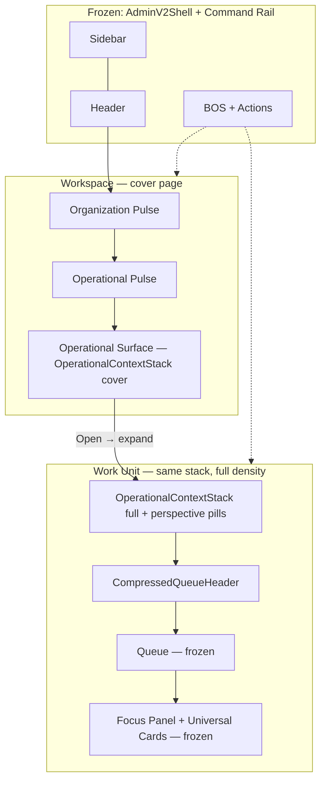

# Alloy UX Continuity Sprint — Workspace ↔ Work Unit (System 5 Reset)

**Status:** Design blueprint — June 2026 (reset)  
**Builds on:** [Workspace V3 doctrine](../../../platform/operator/workspace-v3-command-center-doctrine.md) · [Operational Surface doctrine](../../../platform/operator/workspace-v3-operational-surface-doctrine.md) · [Sprint 3 evolution reset](./sprint-3-evolution-reset.md)  
**Scope:** Visual and informational **continuity** between **today's** Workspace and **today's** Work Unit — not redesign of Queue, Focus Panel, BOS, Universal Cards, or System 5

---

## Reset notice

The first continuity pass used an **obsolete Work Unit screenshot** (pre–System 5, pre–Focus Panel). That asset and all comparisons derived from it are **retired**.

This document compares **only the current product**:

| Surface | Baseline | Captured |
|---------|----------|----------|
| Workspace | [`mockups/baseline/01-workspace-current-system5.png`](./mockups/baseline/01-workspace-current-system5.png) | Firefly Early Learning — org pulse, Operational Pulse, Enrollment tile |
| Work Unit context | [`mockups/baseline/02-work-unit-system5-context.png`](./mockups/baseline/02-work-unit-system5-context.png) | `adminv2-os-context` — ENROLLMENT title, inline KPI strip, perspective pill |
| Queue | [`mockups/baseline/03-work-unit-queue-system5.png`](./mockups/baseline/03-work-unit-queue-system5.png) | Compressed queue header — Active lens · N families |
| Focus Panel split | [`mockups/baseline/04-work-unit-focus-panel-split-system5.png`](./mockups/baseline/04-work-unit-focus-panel-split-system5.png) | New Leads — split State 2, Universal Cards, BOS rail |
| Universal Cards | [`mockups/baseline/05-focus-panel-universal-cards-system5.png`](./mockups/baseline/05-focus-panel-universal-cards-system5.png) | WHY NOW · CURRENT MISSION · CURRENT WORK · archetype stack |

**Capture script:** `web/playwright/tests/workspace-work-unit-continuity-baseline.spec.ts`  
**Runtime flags required:** `NEXT_PUBLIC_ALLOY_OS_RUNTIME=1`

**Retired assets (do not use):**

- `01-current-work-unit-enrollment.png` — deleted
- `00-current-alloy-workspace-baseline.png` — deleted (superseded by `01-workspace-current-system5.png`)
- Previous `mockups/continuity/*` composites — deleted (built on obsolete WU baseline)

---

## Executive summary

Workspace V3 architecture is stable. The continuity objective: **Workspace should feel like page 1 of a Work Unit**, not a separate application.

When an operator clicks **Enrollment → Open**, they should feel:

> *"I'm moving deeper into Enrollment."*

—not—

> *"I opened another page."*

That feeling must be demonstrated using **today's System 5 runtime only**.

---

## 1. Current runtime audit

### 1.1 Operational hierarchy (today's product)

```
AdminV2Shell (frozen)
├── Sidebar + global header + BOS command rail — persist across all surfaces
│
├── Workspace  [`data-ws-surface` implicit on root shell]
│   ├── Organization Pulse     WorkspaceHealthPulseSection + OipHealthStrip
│   ├── Operational Pulse      MetricPlacementRenderer / OipPerformanceKpiRow
│   └── Business Process tiles WorkspaceRootLifecycleGrid → processNavTile
│
└── Work Unit  [`data-ws-surface="work_unit"`]
    ├── Operational Context Bar   WorkUnitCommandSurface → adminv2-os-context
    ├── Perspective rail          stage pills (New Leads, Enrolled, …)
    ├── Queue                     QueueBlock → CompressedQueueHeader + rows
    ├── Focus Panel (State 2)     OpportunityDrawerVmRuntime when split active
    │   ├── FocusPanelCompactHeader
    │   ├── Universal Cards       deriveOpportunityFocusPanelCards
    │   └── Embedded Workspace    card expand (activity tabs)
    └── BOS rail                  unchanged — same column as Workspace
```

**Key implementation files:**

| Layer | File |
|-------|------|
| Workspace page | `web/app/adminV2/workspace/page.tsx` |
| Workspace shell | `web/components/admin/workspace/WorkspaceRootShell.tsx` |
| Org + pulse | `web/components/admin/workspace/layout/WorkspaceHealthPulseSection.tsx` |
| Process tiles | `web/components/admin/workspace/WorkspaceRootLifecycleGrid.tsx` |
| Shell layout | `web/components/admin/workspace/WorkspaceShellLayout.tsx` (3fr primary \| 1fr rail) |
| Work Unit shell | `web/app/adminV2/components/workspace/shells/WorkUnitWorkspace.tsx` |
| Context bar | `web/components/admin/workspace/layout/WorkUnitCommandSurface.tsx` |
| Split controller | `web/app/adminV2/components/AlloyOsRuntimeSplitController.tsx` |
| Queue | `web/app/adminV2/components/workspace/blocks/QueueBlock.tsx` |
| Focus Panel | `web/components/admin/vmDrawer/OpportunityDrawerVmRuntime.tsx` |
| System 5 CSS | `web/app/adminV2/components/alloyOsRuntime.css` |

### 1.2 What is already shared (preserve)

| Layer | Shared today | Evidence |
|-------|--------------|----------|
| **Shell** | Same page grid | `WorkspaceShellLayout` — 3fr primary \| 1fr command rail |
| **Chrome** | Sidebar, header, BOS rail persist | `AdminV2Shell` — no remount on WU entry |
| **Navigation** | Orchestrated transition + prewarm | `runAdminV2NavigationTransition`, `warmOperatorWorkUnitEntryFromHref` |
| **Metrics source** | OIP + placements | `MetricPlacementRenderer` on workspace pulse and WU `adminv2-os-kpi` strip |
| **Process identity** | Lifecycle catalog | `loadOperatorLifecycleLandingCards` ↔ WU `adminv2-os-context__title` |
| **Visual tokens** | Pine accent, midnight text, white canvas | `workspace.css`, `alloyOsRuntime.css`, `WS_LAYOUT` |
| **BOS rail** | Same Actions · Workflow · BOS stack | Visible in all baseline screenshots |
| **Performance** | Reveal gates, session cache | `workspaceRevealGate`, WU bootstrap cache |

These are **continuity assets**. Do not break them.

### 1.3 What already feels continuous

| Signal | Workspace | Work Unit | Continuity |
|--------|-----------|-----------|------------|
| Sidebar + header | ✅ Same dark chrome | ✅ Same | Strong |
| BOS rail geometry | ✅ Right column | ✅ Right column | Strong |
| Primary column width | ✅ 3fr | ✅ 3fr (split adjusts internally) | Strong |
| Metric labels | Tour Conversion, Lead Count, Needs Attention | Same labels in KPI strip | Medium — layout differs |
| Process name | "Enrollment" tile | "ENROLLMENT" context title | Medium — typography differs |
| Pine / juniper accent | Tile rail, Open → | Context title, pills, card rails | Strong |
| Entry route | Tile → `/workspace/work-unit/…` | Same slug family | Strong |

An operator **recognizes Alloy** immediately in both states. The break is in **header grammar and narrative flow**, not chrome.

### 1.4 Where continuity breaks

| Dimension | Workspace (baseline 01) | Work Unit (baseline 02–04) | Gap |
|-----------|---------------------------|----------------------------|-----|
| **Header chrome** | Org banner + boxed health chips | `adminv2-os-context` compact stack + 2px pine rail | **High** |
| **Title typography** | Org name `text-lg semibold` + tile title sentence case | Process `adminv2-os-context__title` uppercase pine 13px | **High** |
| **Health signals** | `OipHealthStrip` boxed chips (Business / Operational / Enrollment) | Inline `adminv2-os-kpi` hairline-separated pairs | **Medium** |
| **Operational pulse** | Boxed command-grid KPI cards | Inline KPI strip inside context bar | **High** |
| **Priority work** | Metric rows + Needs Attention pill inside tile | Perspective pills + queue header "Active lens · N families" | **High** |
| **Operational story** | None at tile level | Queue header + Universal Card mission stack | **High** |
| **Spatial model** | Tile isolated in 2-col grid | Context bar bottom edge = operational surface top (Runtime Spec §1.5) | **High** |
| **Transition** | Full primary column content swap | Context + queue appear; org banner vanishes | **Medium** |
| **Depth model** | Single page | Split State 2 reveals Focus Panel + compressed queue | N/A — by design |

**Diagnosis:** Workspace and Work Unit share **shell, metrics data, and accent language** but use **different header primitives**. The Operational Surface tile does not preview the Work Unit context bar — so entry feels like a page change, not a zoom.

### 1.5 Runtime contract (from code)

From `alloyOsRuntime.css` and `AlloyOsRuntimeSplitController`:

> Operational Context Bar — compact stack whose **bottom is the operational-surface top**.

Split State 2 (`data-alloy-os-runtime-split="true"`) activates when:

1. Active runtime Perspective exists  
2. Focus Panel / drawer is open  
3. Surface is work-unit  

The Work Unit already defines an **operational surface boundary**. The Workspace Operational Surface should be the **cover page above that boundary** — same stack, compressed.

---

## 2. Comparison matrix (current product only)

View baselines **01** and **02** side by side:

| # | Workspace (01) | Work Unit (02) | Shared? |
|---|----------------|----------------|---------|
| A | Firefly Early Learning org title | ENROLLMENT process title (pine uppercase) | Identity layer differs |
| B | Workspace Health chips (Critical / Warning / No data) | Inline KPI strip (Tour Conversion, Lead Count, …) | Data overlap, presentation differs |
| C | Operational Pulse boxed cards (Forms Completion 43.8%, Lead Count 7) | Same metrics in `adminv2-os-kpi` row | **Same OIP — different layout** |
| D | Enrollment tile — Tour Conversion, Needs Attention 6 pill | New Leads perspective pill + queue header | **Same process — different hierarchy** |
| E | Records 1 · Stages 7 · Open → | Active lens · N families · queue rows | Footer vs execution column |
| F | BOS rail — no process context | BOS — "Helping with Work Unit · New Leads" | Rail shared; context enriches on WU |

**Progressive depth (baseline 01 → 04):**

| Step | Surface | Operator reads |
|------|---------|----------------|
| 1 | Workspace | Org health + Enrollment attention signal |
| 2 | WU context | Same process, compressed operational header |
| 3 | Queue | Priority families in active lens |
| 4 | Focus Panel split | Subject mission + Universal Cards + embedded work |

---

## 3. Shared component recommendations

### 3.1 Proposed: `OperationalContextStack`

Extract Work Unit context rows into a shared component with two densities:

| Density | Used on | Renders |
|---------|---------|---------|
| `cover` | Workspace Operational Surface (inside `processNavTile`) | Title + KPI strip + Today's Work lines (≤3) |
| `full` | Work Unit `WorkUnitCommandSurface` | Title + KPI strip + perspective pills (existing) |

**Same CSS tokens:** `adminv2-os-context`, `adminv2-os-context__row`, `adminv2-os-kpi` — no new visual system.

```
OperationalContextStack (NEW — shared)
├── OperationalContextTitleRow      ← adminv2-os-context__title-row
├── OperationalContextKpiStrip      ← MetricPlacementRenderer header_metrics
├── OperationalContextWorkLines     ← cover density only (Today's Work deep links)
└── OperationalContextPerspectiveRail ← full density only (existing stagePills)

OperationalSurfaceTile (evolved processNavTile)
├── processNavTile shell (FROZEN — border, rail, shadow)
├── OperationalContextStack density="cover"
└── Open → footer (FROZEN)

WorkUnitCommandSurface (evolve)
└── OperationalContextStack density="full" + stagePills slot
```

### 3.2 Files to touch (implementation reference — not in this sprint)

| File | Change |
|------|--------|
| **New** `OperationalContextStack.tsx` | Shared rows — cover + full modes |
| `WorkUnitCommandSurface.tsx` | Delegate to shared stack |
| `WorkspaceRootLifecycleGrid.tsx` | Replace inline metric list with cover stack |
| `alloyOsRuntime.css` | Optional `.adminv2-os-context--cover` density tokens |
| `buildOperatorLifecycleLanding.ts` | Work lines aligned to WU perspective labels |

### 3.3 Do NOT share (different jobs)

| Component | Reason |
|-----------|--------|
| `QueueBlock` | Execution only — not on Workspace |
| `CompressedQueueHeader` | Requires active queue — WU only |
| `OipHealthStrip` | Org-scoped — Zone 1 only |
| Focus Panel / Universal Cards | Frozen — WU depth only |
| BOS internals | Frozen |

### 3.4 Continuity improvements (transition only — no redesign)

| # | Improvement | Complexity | Runtime impact |
|---|-------------|------------|----------------|
| 1 | Shared `OperationalContextStack` (cover ↔ full) | Medium | None — presentation |
| 2 | Align tile process title to `adminv2-os-context__title` | Low | None |
| 3 | KPI strip parity — tile preview uses `adminv2-os-kpi` classes | Medium | None |
| 4 | Today's Work lines → perspective pill label alignment | Medium | Routing only |
| 5 | Expand/reveal transition (150–220ms) — tile grows, queue slides in below context bar | Medium–High | UI-only — must not weaken reveal gates |
| 6 | Organization Pulse compresses on entry — does not merge into process context | Low | None |

---

## 4. Transition model

### 4.1 Target operator journey



### 4.2 Expand/reveal sequence (motion spec)

1. Click `Open →` on Enrollment surface  
2. Org banner + sibling tiles **fade/compress** (opacity + max-height — not unmount flash)  
3. Selected tile **expands** to full primary width — context stack stays pixel-aligned with WU entry  
4. Queue column **slides in below** context bar bottom edge  
5. Shell, sidebar, BOS rail **never move**

Uses existing `runAdminV2NavigationTransition` + optional FLIP on `[data-work-unit-process-label]`.

### 4.3 Deep link continuity

| Click | Cover page state | WU initial state |
|-------|------------------|------------------|
| Today's Tours line | Tours highlighted | **Today's Tours** pill active + filtered queue |
| Follow Ups line | Follow Ups highlighted | **Follow Ups** lens |
| Open Enrollment | Full tile launch | Default perspective + Operational Mode subject |

URL contract: `?work_view={id}` via `workUnitQueueSelection.ts`.

---

## 5. Mockups and visual references

All mockups anchor on **live System 5 baselines**. No greenfield layouts. No retired Work Unit chrome.

| Reference | File | Purpose |
|-----------|------|---------|
| Current Workspace | [`baseline/01-workspace-current-system5.png`](./mockups/baseline/01-workspace-current-system5.png) | Left anchor — every comparison starts here |
| Current WU entry | [`baseline/02-work-unit-system5-context.png`](./mockups/baseline/02-work-unit-system5-context.png) | Right anchor — context bar at rest |
| Queue surface | [`baseline/03-work-unit-queue-system5.png`](./mockups/baseline/03-work-unit-queue-system5.png) | Compressed queue header |
| Split + Focus Panel | [`baseline/04-work-unit-focus-panel-split-system5.png`](./mockups/baseline/04-work-unit-focus-panel-split-system5.png) | State 2 — full operational depth |
| Universal Cards | [`baseline/05-focus-panel-universal-cards-system5.png`](./mockups/baseline/05-focus-panel-universal-cards-system5.png) | Archetype stack detail |

**Evolution target (annotated spec — not a new layout):**

The Enrollment tile interior should **compress** to match rows A–D of baseline 02:

- Row 1: `ENROLLMENT` via `adminv2-os-context__title`  
- Row 2: Same KPI strip as WU (`Tour Conversion`, `Lead Count`, `Needs Attention`)  
- Row 3: Today's Work lines mirroring perspective pill labels  
- Footer: `Open →` unchanged  

Opening expands tile row geometry into baseline 02 without changing sidebar, header, queue, Focus Panel, or BOS.

---

## 6. Validation checklist

| Check | Status |
|-------|--------|
| Workspace screenshot is current System 5 | ✅ `01-workspace-current-system5.png` |
| Work Unit screenshot is current System 5 | ✅ `02-work-unit-system5-context.png` |
| Queue screenshot is current | ✅ `03-work-unit-queue-system5.png` |
| Focus Panel screenshot is current | ✅ `04-work-unit-focus-panel-split-system5.png` |
| Universal Cards visible | ✅ `05-focus-panel-universal-cards-system5.png` |
| Documentation references current runtime only | ✅ this document |
| No historical UI references remain | ✅ obsolete assets deleted |
| Obsolete WU comparison removed | ✅ `01-current-work-unit-enrollment.png` deleted |

Re-capture baselines after major runtime UI changes:

```bash
cd web && npx playwright test workspace-work-unit-continuity-baseline.spec.ts --project=chromium
```

---

## 7. Implementation roadmap

| Phase | Work | Est. | Risk |
|-------|------|------|------|
| **C1** | Extract `OperationalContextStack` from `WorkUnitCommandSurface` | 3–4d | Low |
| **C2** | Wire cover density into Operational Surface tile | 3–5d | Medium |
| **C3** | KPI placement parity (tile preview = WU header metrics) | 2–3d | Low |
| **C4** | Work line copy aligned to perspective pill labels | 2d | Low |
| **C5** | Transition polish — expand/reveal motion | 4–6d | Medium |
| **C6** | Deep link → active pill + queue header on landing | 3–4d | Medium |

**Tests:** `workspaceShellRegression.test.ts`, `workUnitRevealGatePage.test.ts`, runtime perf suite — must pass.

---

## 8. Success criteria

- [ ] Operator feels progressively deeper — not on a new app  
- [ ] Process title + KPIs look identical at tile launch and WU entry  
- [ ] Operational Surface reads as **cover page** of the Work Unit  
- [ ] Queue appears as **reveal below** context bar — not unrelated panel  
- [ ] Sidebar, header, BOS rail never remount or shift  
- [ ] No Queue, Focus Panel, BOS, Universal Cards, or System 5 redesign  
- [ ] Someone familiar with **today's Alloy** recognizes all mockup surfaces instantly  

---

## Related

- [`workspace-v3-operational-surface-doctrine.md`](../../../platform/operator/workspace-v3-operational-surface-doctrine.md) §9 Cover-page continuity
- [`operational-mode-default-state-doctrine.md`](../../../platform/operator/operational-mode-default-state-doctrine.md)
- [`operational-surface-design-system.md`](../../../platform/operator/operational-surface-design-system.md)
- [`alloy-runtime-specification.md`](../../../platform/operator/alloy-runtime-specification.md) §1.5 Operational surface boundary
- `web/components/admin/workspace/layout/WorkUnitCommandSurface.tsx`
- `web/app/adminV2/components/alloyOsRuntime.css`
