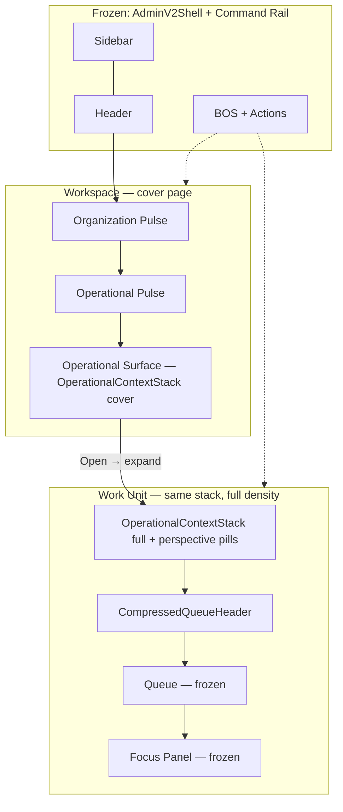

# Alloy UX Continuity Sprint — Workspace ↔ Work Unit

**Status:** Design blueprint — June 2026  
**Builds on:** [Workspace V3 doctrine](../../../platform/operator/workspace-v3-command-center-doctrine.md) · [Sprint 3 evolution reset](./sprint-3-evolution-reset.md)  
**Scope:** Visual and informational **continuity** — not redesign of Queue, Focus Panel, BOS, or System 5

---

## Executive summary

Workspace V3 architecture is stable. The next objective is **continuity**: the Workspace should feel like the **first page of a Work Unit**, not a separate application.

Opening a Work Unit should feel like **revealing more of the same operational surface** — progressively deeper context on one continuous canvas — not navigating to unrelated software.

**Baselines studied:**

| Surface | Screenshot | Primary components |
|---------|------------|------------------|
| Workspace | [`mockups/baseline/00-current-alloy-workspace-baseline.png`](./mockups/baseline/00-current-alloy-workspace-baseline.png) | `WorkspaceRootShell`, `WorkspaceHealthPulseSection`, `WorkspaceRootLifecycleGrid` |
| Work Unit | [`mockups/baseline/01-current-work-unit-enrollment.png`](./mockups/baseline/01-current-work-unit-enrollment.png) | `WorkUnitWorkspace`, `WorkUnitCommandSurface`, `QueueBlock`, `CompressedQueueHeader` |

---

## 1. Workspace ↔ Work Unit continuity audit

### 1.1 What already connects (preserve)

| Layer | Shared today | Evidence |
|-------|--------------|----------|
| **Shell** | Same page grid | Both use `WorkspaceShellLayout` — 3fr primary \| 1fr command rail |
| **Chrome** | Sidebar, header, BOS rail persist | `AdminV2Shell` — no remount on WU entry |
| **Navigation** | Orchestrated transition + prewarm | `runAdminV2NavigationTransition`, `warmOperatorWorkUnitEntryFromHref` |
| **Metrics source** | OIP + placements | `MetricPlacementRenderer` on workspace header and WU header |
| **Process identity** | Lifecycle catalog | `loadOperatorLifecycleLandingCards` ↔ WU `focusLabel` / process name |
| **Visual tokens** | Pine accent, midnight text, white canvas | `workspace.css`, `alloyOsRuntime.css`, `WS_LAYOUT` |
| **Performance** | Reveal gates, session cache | `workspaceRevealGate`, WU bootstrap cache |

These are **continuity assets**. Do not break them.

### 1.2 Continuity gaps (root cause of "different app" feeling)

| Dimension | Workspace today | Work Unit today | Gap severity |
|-----------|-----------------|-----------------|--------------|
| **Header chrome** | `WS_COMMAND_BANNER_CLASS` — large rounded banner, gradient, 4px juniper rail | `adminv2-os-context` — compact stacked bar, 2px pine rail, flat rows | **High** |
| **Title typography** | Org name: `text-lg font-semibold` (sentence case) | Process: `13px uppercase pine` (`adminv2-os-context__title`) | **High** |
| **Health signals** | `OipHealthStrip` — boxed chips (Business / Operational / Enrollment) | Inline KPI strip — hairline-separated value+label pairs | **Medium** |
| **Operational pulse** | Boxed command-grid KPI cards (`OipPerformanceKpiRow layout=command`) | Inline `adminv2-os-kpi` row inside context bar | **High** |
| **Priority work** | Metric label/value rows inside `processNavTile` | Perspective pills + `CompressedQueueHeader` + queue rows | **High** |
| **Operational story** | None — metrics first | Queue header: "Active lens · N families · attention" | **High** |
| **Information hierarchy** | Org → health → pulse → **grid of tiles** | Process → KPI → perspectives → **queue column** | **High** |
| **Spatial model** | Tile is isolated card in 2-col grid | Context bar **bottom edge = operational surface top** (Runtime Spec 1.5) | **High** |
| **Transition** | Full primary column swap | Cold shell → context + queue appear | **Medium** |

**Diagnosis:** Workspace and Work Unit share **shell and data** but use **different header primitives and hierarchy**. The Operational Surface tile does not preview the Work Unit context bar — so entry feels like a page change, not a zoom.

### 1.3 Runtime comment (already documented in code)

From `alloyOsRuntime.css`:

> *Operational Context Bar — compact ~148px stack whose **bottom is the operational-surface top***

The Work Unit already defines an **operational surface boundary**. The Workspace Operational Surface should be the **cover page above that boundary** — same stack, compressed.

---

## 2. Side-by-side comparison (current experience)

### 2.1 Visual comparison

See [`mockups/continuity/01-side-by-side-current.png`](./mockups/continuity/01-side-by-side-current.png)

| # | Workspace (left) | Work Unit (right) |
|---|------------------|-------------------|
| A | Org name + operator copy | **ENROLLMENT** uppercase process title |
| B | Workspace Health chips | Inline KPI strip (Tour Conversion, Lead Count, …) |
| C | Operational Pulse boxed cards | *(same metrics, different layout)* |
| D | Enrollment **tile** — metric rows | Perspective pill **New Leads (1)** |
| E | Records / Attention / Stages footer | **Lead — Active lens · 1 family** queue header |
| F | Open → | Queue rows + Focus Panel (on row select) |

**Operator experience today:** Recognizable Alloy chrome — but the **center column narrative resets** at step D→E.

### 2.2 Hierarchy comparison

```
WORKSPACE (today)                    WORK UNIT (today)
─────────────────                    ─────────────────
[ AdminV2Shell — shared ]            [ AdminV2Shell — shared ]
  Org banner (large)                   Process context bar (compact)
    Health chips                         KPI inline strip
    Pulse KPI cards                      Perspective pills
  BUSINESS PROCESSES                   Queue header (lens + count)
    [ Enrollment tile ]                  Queue rows
      metrics…                           Focus Panel (on select)
      Open →                           BOS rail (shared)
  BOS rail (shared)
```

### 2.3 Identity comparison

| Identity layer | Workspace | Work Unit |
|----------------|-----------|-----------|
| Organization | ✅ Org name in banner | ❌ Not shown (implicit) |
| Business process | Tile title "Enrollment" (16px semibold) | Context title "ENROLLMENT" (13px uppercase pine) |
| Work View / lens | ❌ Not shown | ✅ Pills + queue header |
| Subject | ❌ | ✅ Focus Panel on row open |

**Continuity opportunity:** Process identity typography and KPI presentation should **match at launch** so the operator reads one thread: Enrollment → same KPIs → same priority work → queue reveals.

---

## 3. Proposed continuity improvements

### Principle: Cover page, not cousin page

The Operational Surface becomes the **compressed cover page** of the Work Unit context stack. Opening `Open →` **expands** that stack and **reveals the queue below** — same border, same pine rail, same title row.

### Improvement 1 — Shared `OperationalContextStack` primitive

Extract the Work Unit context bar rows into a shared component usable in two densities:

| Density | Used on | Renders |
|---------|---------|---------|
| `cover` | Workspace Operational Surface (inside `processNavTile`) | Title + KPI strip + Today's Work lines (3 rows max) |
| `full` | Work Unit `WorkUnitCommandSurface` | Title + KPI strip + perspective pills (existing) |

**Same CSS:** `adminv2-os-context`, `adminv2-os-context__row`, `adminv2-os-kpi` — no new visual system.

| Attribute | Value |
|-----------|-------|
| Why | One visual grammar from Workspace through WU |
| User benefit | "I'm still in Enrollment" — instant recognition |
| Complexity | **Medium** — refactor extract, two composition modes |
| Runtime impact | **None** — presentation only |

### Improvement 2 — Align process title typography

| Current WS tile | Target (match WU) |
|-----------------|-------------------|
| `text-base font-semibold` "Enrollment" | `adminv2-os-context__title` "ENROLLMENT" |

Org name stays in Organization Pulse banner only — not duplicated on tile.

| Complexity | **Low** |
| Runtime impact | **None** |

### Improvement 3 — KPI strip parity

Use the **same** `MetricPlacementRenderer` surface bindings:

| Surface | Zone | Today |
|---------|------|-------|
| Workspace tile interior | `business_process_tile` / `context_preview` | Boxed inline metrics |
| Work Unit header | `work_unit_header` / `header_metrics` | Inline os-kpi |

**Evolution:** Render tile preview with `adminv2-os-context__kpi-strip` classes — identical to WU header KPI row.

| Complexity | **Medium** |
| Runtime impact | **None** |

### Improvement 4 — Today's Work → perspective preview

Map Sprint 3 work lines to **Work View labels** that match WU perspective pills:

| Workspace line | WU pill / lens |
|----------------|----------------|
| 2 Tours → | Today's Tours |
| 3 Follow Ups → | Follow Ups |
| Open Enrollment → | Default lens (New Leads) |

Today's Work lines use **same copy** as queue header perspective names.

| Complexity | **Medium** — data alignment |
| Runtime impact | **None** — routing only |

### Improvement 5 — Continuity transition (expand, not navigate)

**Target motion** (150–220ms, ease-out):

1. Click `Open →` on Enrollment surface  
2. Other tiles + org banner **fade/compress** (opacity + max-height, not unmount flash)  
3. Selected tile **expands** to full primary column width — context stack stays pixel-aligned  
4. Queue column **slides in below** context bar bottom edge (operational surface top)  
5. Shell, sidebar, BOS rail **never move**

Uses existing `runAdminV2NavigationTransition` + optional FLIP on `[data-work-unit-process-label]`.

| Complexity | **Medium–High** — motion layer only |
| Runtime impact | **UI-only** — must not weaken reveal gates |

### Improvement 6 — Organization Pulse stays org-scoped

Do **not** merge org banner into process context. Zone 1 (org health) **compresses** on WU entry; process context **replaces** tile grid — not org identity.

---

## 4. Shared component recommendations

### 4.1 Proposed component map

```
OperationalContextStack (NEW — shared)
├── OperationalContextTitleRow      ← adminv2-os-context__title-row
├── OperationalContextKpiStrip      ← adminv2-os-context__kpi-strip + MetricPlacementRenderer
├── OperationalContextWorkLines     ← cover density only (Today's Work deep links)
└── OperationalContextPerspectiveRail ← full density only (existing stagePills)

OperationalSurfaceTile (evolved WorkspaceRootLifecycleGrid inner)
├── processNavTile shell (FROZEN — border, rail, shadow)
├── OperationalContextStack density="cover"
└── Open → footer (FROZEN)

WorkUnitCommandSurface (evolved)
└── OperationalContextStack density="full" + stagePills slot
```

### 4.2 Files to touch (implementation reference)

| File | Change |
|------|--------|
| **New** `OperationalContextStack.tsx` | Shared rows — cover + full modes |
| `WorkUnitCommandSurface.tsx` | Delegate to shared stack |
| `WorkspaceRootLifecycleGrid.tsx` | Replace metric list with cover stack |
| `alloyOsRuntime.css` | Optional `.adminv2-os-context--cover` density tokens |
| `buildOperatorLifecycleLanding.ts` | Story + work lines aligned to WU perspectives |

### 4.3 Do NOT share (different jobs)

| Component | Reason |
|-----------|--------|
| `QueueBlock` | Execution only — not on Workspace |
| `CompressedQueueHeader` | Requires active queue — WU only |
| `OipHealthStrip` | Org-scoped — Zone 1 only, not on process tile |
| Focus Panel / BOS internals | Frozen |

---

## 5. Mockups

Continuity mockups in [`mockups/continuity/`](./mockups/continuity/):

| File | Shows |
|------|-------|
| [`01-side-by-side-current.png`](./mockups/continuity/01-side-by-side-current.png) | Today's WS vs WU — gaps labeled |
| [`02-operational-surface-cover-page.png`](./mockups/continuity/02-operational-surface-cover-page.png) | Enrollment tile using WU context stack (cover density) |
| [`03-work-unit-initial-state.png`](./mockups/continuity/03-work-unit-initial-state.png) | WU entry — context bar connects to queue |
| [`04-transition-expand-reveal.png`](./mockups/continuity/04-transition-expand-reveal.png) | 3-frame: tile → expand → queue revealed |
| [`05-shared-component-diagram.png`](./mockups/continuity/05-shared-component-diagram.png) | OperationalContextStack cover vs full |

All mockups preserve: dark sidebar, search header, BOS rail, Alloy pine/navy palette.

---

## 6. Interaction flow — progressive depth



### Deep link continuity (Today's Work)

| Click | Cover page state | WU initial state |
|-------|------------------|------------------|
| 2 Tours → | Tours line highlighted | Context bar + **Today's Tours** pill active + queue filtered |
| 3 Follow Ups → | Follow Ups highlighted | **Follow Ups** lens + queue |
| Open Enrollment → | Full tile launch | Default perspective + Operational Mode subject |

Same URL contract as Sprint 2: `?work_view={id}`.

---

## 7. Validation — no frozen system redesign required

| System | Redesign required? | Continuity approach |
|--------|-------------------|---------------------|
| **Queue** | ❌ No | Reveals below existing context bar — unchanged |
| **Focus Panel** | ❌ No | Opens on row select — unchanged |
| **BOS** | ❌ No | Rail persists — unchanged |
| **System 5** | ❌ No | Reuse `adminv2-os-context` tokens already in System 5 runtime CSS |
| **Universal Cards** | ❌ No | Not on Workspace; FP unchanged |
| **Work Unit layout** | ❌ No | Context bar + queue geometry frozen (Layout Doctrine V3) |
| **Interaction model** | ❌ No | Same spine — deeper zoom |

**Conclusion:** Continuity is achieved by **shared header primitive + motion** — not by redesigning execution surfaces.

---

## 8. Implementation roadmap

| Phase | Work | Est. | Risk |
|-------|------|------|------|
| **C1** | Extract `OperationalContextStack` from `WorkUnitCommandSurface` | 3–4d | Low |
| **C2** | Wire cover density into Operational Surface tile | 3–5d | Medium |
| **C3** | KPI placement parity (tile preview = WU header metrics) | 2–3d | Low |
| **C4** | Work line copy aligned to perspective pill labels | 2d | Low |
| **C5** | Transition polish — expand/reveal motion | 4–6d | Medium |
| **C6** | Deep link → active pill + queue header on landing | 3–4d | Medium |

**Tests:** Existing `workspaceShellRegression.test.ts`, `workUnitRevealGatePage.test.ts`, runtime perf suite — must pass.

---

## 9. Success criteria

- [ ] Operator feels progressively deeper — not on a new app  
- [ ] Process title + KPIs look identical at tile launch and WU entry  
- [ ] Operational Surface reads as **cover page** of the Work Unit  
- [ ] Queue appears as **reveal below** context bar — not unrelated panel  
- [ ] Sidebar, header, BOS rail never remount or shift  
- [ ] No Queue, Focus Panel, BOS, or System 5 redesign  
- [ ] Existing Alloy user recognizes both states instantly  

---

## Related

- [`workspace-v3-operational-surface-doctrine.md`](../../../platform/operator/workspace-v3-operational-surface-doctrine.md)
- [`operational-mode-default-state-doctrine.md`](../../../platform/operator/operational-mode-default-state-doctrine.md)
- `web/components/admin/workspace/layout/WorkUnitCommandSurface.tsx`
- `web/app/adminV2/components/alloyOsRuntime.css` § Operational Context Bar
