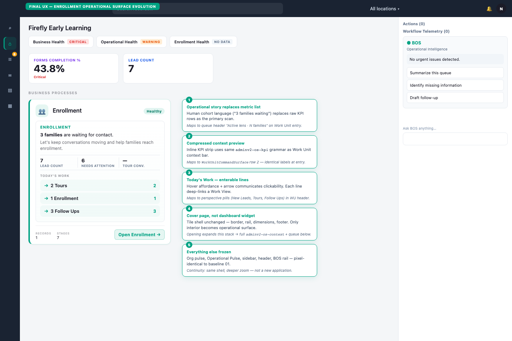
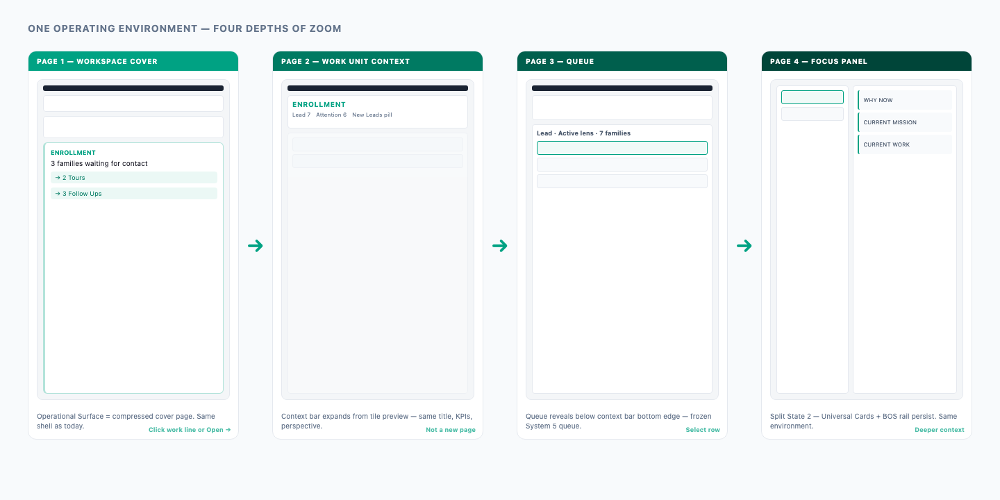

# Workspace V3 — Final UX Validation (Pre-Implementation)

**Status:** Implemented + hardened — June 2026  
**Contract:** [`enrollment-operational-surface-v1-contract.md`](./enrollment-operational-surface-v1-contract.md)  
**Scope:** Enrollment Operational Surface on `/workspace` only

---

## Goal

Validate a single UX direction before code: evolve **only** the Enrollment tile into an Operational Surface that feels like **page one of the Enrollment Work Unit** — without changing anything else on the Workspace.

---

## Primary deliverable

### Mockup — Enrollment Operational Surface evolution



**Source:** [`mockups/final-validation/enrollment-operational-surface-evolution.html`](./mockups/final-validation/enrollment-operational-surface-evolution.html)  
**Re-capture (live implementation):** `cd web && npx playwright test workspace-v3-enrollment-operational-surface.spec.ts --project=chromium`

Live captures: `03-workspace-enrollment-operational-surface-live.png`, `04-workspace-enrollment-work-line-hover-live.png`, `05-workspace-enrollment-work-view-deeplink-live.png`

### Annotation summary

| # | Change | Continuity benefit | Maps to Work Unit |
|---|--------|-------------------|-------------------|
| 1 | **Operational story** replaces metric list as primary scan | Operator reads meaning first — not dashboard numbers | Queue header "Active lens · N families" |
| 2 | **Compressed KPI strip** inside tile (`adminv2-os-kpi` grammar) | Same labels at tile launch and WU entry | `WorkUnitCommandSurface` row 2 |
| 3 | **Today's Work** — enterable lines with hover + arrow | Every line communicates "I can click this" | Perspective pills (New Leads, Tours, Follow Ups) |
| 4 | **Cover page** — tile shell frozen, interior operational | Expanding feels like zoom, not navigation | Full `adminv2-os-context` + queue reveal |
| 5 | **Everything else frozen** | Existing users recognize Workspace instantly | Same shell at all depths |

---

## Optional — continuity depth flow



**Source:** [`mockups/final-validation/continuity-depth-flow.html`](./mockups/final-validation/continuity-depth-flow.html)

```
Workspace (cover)  →  Work Unit context  →  Queue  →  Focus Panel
     page 1                  page 2            page 3      page 4
```

Same operating environment. Progressive depth. No redesign of Work Unit, Queue, or Focus Panel.

---

## What was preserved (unchanged from baseline 01)

- Sidebar, header, search, location selector
- Organization Pulse — Firefly Early Learning + health chips
- Operational Pulse — Forms Completion, Lead Count cards
- Command rail — Actions, Workflow Telemetry, BOS
- Tile shell — `processNavTile` border, left rail, dimensions, shadow, footer meta
- Grid layout, spacing, colors, typography tokens
- Runtime, reveal gates, navigation transition

---

## What evolved (Enrollment tile interior only)

| Before (baseline 01) | After (mockup) |
|----------------------|----------------|
| Tour Conversion % metric row | Operational story — "3 families waiting for contact" |
| Needs Attention pill only | Health pill + narrative subline |
| Static metric list | Compressed KPI strip (Lead Count · Needs Attention · Tour Conv.) |
| No work lines | Today's Work — 3 enterable deep links |
| `Open →` | `Open Enrollment →` (same route, clearer copy) |

---

## Enterability contract

| Affordance | Destination | Route |
|------------|-------------|-------|
| `→ 2 Tours` | Today's Tours Work View | `/workspace/work-unit/{slug}?work_view={toursId}` |
| `→ 1 Enrollment` | Open Enrollment lens | `/workspace/work-unit/{slug}?work_view={enrollmentId}` |
| `→ 3 Follow Ups` | Follow Ups Work View | `/workspace/work-unit/{slug}?work_view={followUpsId}` |
| `Open Enrollment →` | Default WU entry + Operational Mode | `lifecycle.entryHref` (existing) |

Work View hrefs already exist via `buildOperationalViewPreviewRuntimeHref` in `buildOperatorLifecycleLanding.ts` → `workViewNavEntriesForDepartment`.

---

## Implementation readiness review

### Can this be implemented by evolving `processNavTile`?

**Yes.** The mockup changes only the interior of the existing `article` in `WorkspaceRootLifecycleGrid.tsx`. The outer shell (`WS_LAYOUT.processNavTile`, icon well, footer meta, Open button) stays intact.

Recommended approach: extract tile **interior** into a new component; wire it behind a feature flag or enrollment-only branch first, then generalize to all lifecycle cards once validated.

### Components to reuse (no new visual system)

| Component / module | Role |
|--------------------|------|
| `WS_LAYOUT.processNavTile` | Frozen tile shell |
| `OipKpiIcon` + domain rails | Frozen identity row |
| `MetricPlacementRenderer` | KPI strip data (`surface=business_process_tile`, zone `context_preview` or existing `tile_metrics` with new layout) |
| `adminv2-os-kpi` / `adminv2-os-context` CSS | Compressed context preview styling |
| `runAdminV2NavigationTransition` | Open Enrollment + work line clicks |
| `warmOperatorWorkUnitEntryFromHref` | Hover/focus prewarm (unchanged) |
| `buildOperationalViewPreviewRuntimeHref` | Work View deep link URLs |
| `OperatorLifecycleLandingCard.entryHref` | Level 1 launch |

### New component(s) required

| Component | Responsibility | Required? |
|-----------|----------------|-----------|
| **`OperationalSurfaceCover`** | Story + health + compressed KPI strip + Today's Work lines — cover density | **Yes** — one shared primitive |
| **`OperationalSurfaceWorkLine`** | Enterable row — arrow, label, count, href, hover state | **Yes** — small presentational child |
| **`OperationalContextStack`** | Shared wrapper used by cover + (later) `WorkUnitCommandSurface` full density | **Recommended** — continuity sprint C1; can ship cover-only first |

No new layout system. No new routes. No queue or drawer changes.

### Data shape extensions

Extend `OperatorLifecycleLandingCard` (server-side in `buildOperatorLifecycleLanding.ts`):

```typescript
operationalStory?: {
  healthLabel: string;           // "Healthy" | "Needs Attention" | …
  headline: string;              // "3 families are waiting for contact."
  subline?: string;              // optional supporting sentence
};
todaysWork?: readonly {
  label: string;                 // "2 Tours"
  count: number;
  href: string;                  // work_view deep link
  workViewId: string;
}[];
```

Story copy should be derived from existing OIP + queue summaries — not hardcoded enrollment-only strings in shared UI.

### Code changes (expected files)

| File | Change |
|------|--------|
| `web/components/admin/workspace/WorkspaceRootLifecycleGrid.tsx` | Replace metric list block with `OperationalSurfaceCover` for evolved tiles |
| **New** `web/components/admin/workspace/OperationalSurfaceCover.tsx` | Cover density operational surface |
| **New** `web/components/admin/workspace/OperationalSurfaceWorkLine.tsx` | Enterable work line |
| `web/lib/admin/buildOperatorLifecycleLanding.ts` | Add `operationalStory` + `todaysWork` from OIP/queue/work views |
| `web/app/adminV2/components/alloyOsRuntime.css` | Optional `.adminv2-os-context--cover` density modifier inside tile |
| `web/lib/workspace/workspaceLayoutSystem.ts` | No shell token changes |

**Out of scope for v1 implementation:**

- Expand/reveal motion (C5 — follow-on polish)
- `OperationalContextStack` full-density refactor of `WorkUnitCommandSurface` (can parallel but not blocking)
- Other process tiles (enrollment first; pattern generalizes)

### Effort estimate

| Phase | Work | Days |
|-------|------|------|
| **V3-IMP-1** | `OperationalSurfaceCover` + work line components | 2–3 |
| **V3-IMP-2** | Landing data — story + todaysWork from OIP/work views | 2–3 |
| **V3-IMP-3** | Wire into `WorkspaceRootLifecycleGrid` (enrollment first) | 1–2 |
| **V3-IMP-4** | Tests + `tsc` + layout regression | 1 |
| **V3-IMP-5** | Generalize to all lifecycle tiles | 1–2 |

**Total: ~7–11 days** for enrollment + rollout. Motion polish adds 4–6 days separately.

### Risk assessment

| Risk | Mitigation |
|------|------------|
| Weakens reveal gates | UI-only tile interior — no payload gate changes |
| Story copy quality varies by tenant | Derive from OIP packs; fallback to metric-based story template |
| Work View href mismatch | Reuse `buildOperationalViewPreviewRuntimeHref` — already tested |
| Tile height overflow | Cap Today's Work at 3 lines; story max 2 lines |

---

## Success criteria

| Criterion | Mockup evidence |
|-----------|-----------------|
| Existing users recognize Workspace | Org pulse, pulse cards, sidebar, BOS unchanged |
| Enrollment tile feels alive | Story + enterable work lines |
| Tile tells operational story | "3 families waiting…" leads scan |
| Today's Work obviously clickable | Arrow + hover affordance + counts |
| Tile feels like beginning of Work Unit | Compressed context preview maps to WU header |
| No surrounding chrome changed | Baseline 01 shell preserved |
| Side-by-side with WU = same environment | Depth flow diagram + sprint-4 baselines |

---

## After approval

Proceed directly to implementation:

1. Build `OperationalSurfaceCover` + wire enrollment tile  
2. Extend `buildOperatorLifecycleLanding` data  
3. Run workspace regression tests + `tsc`  
4. **Do not** create additional doctrine docs or conceptual mockups  

Parent references (already canonical — do not extend):

- [`workspace-v3-operational-surface-doctrine.md`](../../../platform/operator/workspace-v3-operational-surface-doctrine.md)
- [`sprint-4-ux-continuity.md`](./sprint-4-ux-continuity.md)

---

## Related baselines

| Surface | File |
|---------|------|
| Current Workspace | [`baseline/01-workspace-current-system5.png`](./mockups/baseline/01-workspace-current-system5.png) |
| Work Unit context | [`baseline/02-work-unit-system5-context.png`](./mockups/baseline/02-work-unit-system5-context.png) |
| Focus Panel split | [`baseline/04-work-unit-focus-panel-split-system5.png`](./mockups/baseline/04-work-unit-focus-panel-split-system5.png) |
