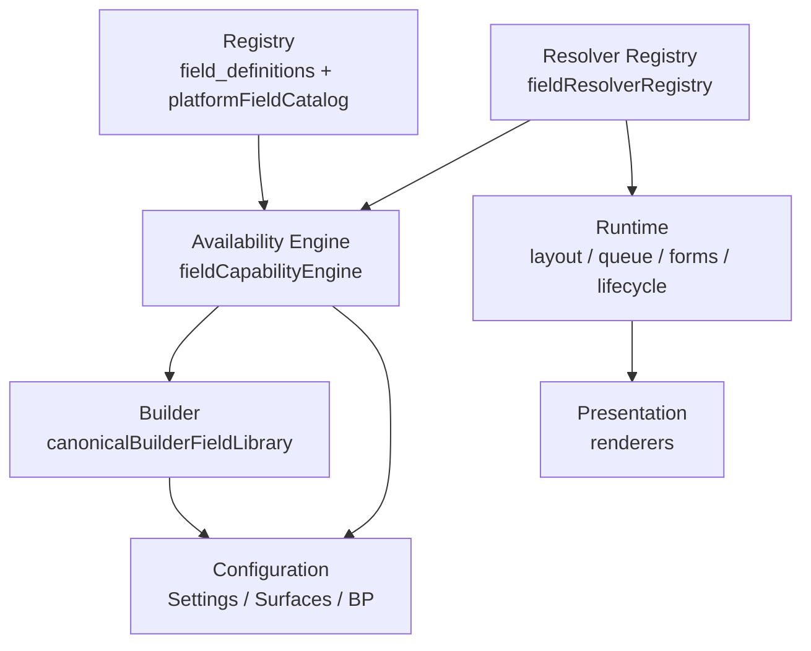

# Field Runtime Unification

**Sprint:** 07/2026 — Field Runtime Completion  
**Status:** Active  
**Branch:** `feat/fields-registry-audit-wt-p2os`  
**Predecessor:** [fields-registry-and-surface-availability-audit.md](./fields-registry-and-surface-availability-audit.md)

## Architecture

Fields are **infrastructure**. Every surface consumes the same canonical stack:



Nothing bypasses the stack. No feature owns its own field list.

## Layer ownership

| Layer | Module | Role |
|-------|--------|------|
| **Registry** | `field_definitions` API, `platformFieldCatalog.ts` | Canonical keys, labels, types, storage |
| **Platform fields** | `platformFieldCatalog.ts` | Native DB columns — read-only in Settings |
| **Custom fields** | `field_definitions` (org-scoped) | Operator-configurable registry rows |
| **Availability** | `fieldCapabilityEngine.ts` | Derived badges — not hand-maintained |
| **Resolver registry** | `fieldResolverRegistry.ts` | Per-surface resolve capability |
| **Builder library** | `canonicalBuilderFieldLibrary.ts` | Single picker source for all builders |
| **Runtime** | Surface-specific resolvers (see below) | Read/write at runtime |
| **Renderer** | Layout/queue/forms render components | Display |
| **Configuration** | Settings → Fields, Surfaces, BP | Operator authoring |

## Resolver ownership

| Surface | Runtime owner | Resolver module |
|---------|---------------|-----------------|
| **Queue rows** | `queueRecordScopedResolve.ts` | `queue_record_scoped` |
| **Focus panel** | `compositionFieldAdapter.ts` | `focus_panel_composition` (shares queue evidence) |
| **Drawers** | `resolveLayoutRuntimeFieldControl.ts` | `layout_runtime` |
| **Forms** | `formFieldRegistryPicker.ts` | `forms_registry` |
| **Documents** | Forms seam (POS-F04) | `forms_registry` |
| **Business processes** | `lifecycleFieldRuleBindings.ts` | `lifecycle_binding` |
| **Tables** | `field_definitions.is_visible_in_table` | `table_visibility` |

Registry: `SURFACE_RESOLVER_OWNERSHIP` in `fieldResolverRegistry.ts`

## Capability model

Availability is **derived** through five layers (all must pass):

1. **Registry** — field exists (platform native or `field_definitions` row)
2. **Resolver** — `canSurfaceResolveField()` returns supported
3. **Renderer** — surface has a render path when resolver supports
4. **Builder** — builder library exposes field for surface grain
5. **Publish** — queue/focus publish validator allows refKey

### Capability states (operator-facing)

| State | Meaning |
|-------|---------|
| **Supported** | All layers pass — badge shows surface as available |
| **Unsupported** | Resolver or publish blocks — badge hidden with reason |
| **Future** | `runtimePhase` fc3/fc5 — drawer resolver not ready |
| **Hidden** | Workflow/internal field — not in operator pickers |
| **Platform-only** | Native column — inspect in Settings, cannot edit/delete |
| **Custom** | Org `field_definitions` — full Configure flow |

## Platform fields (Part 1)

Native DB columns appear in Settings → Fields as **Platform field** cards:

- Same card layout as configurable fields
- Badge: **Platform field** (not System/Custom)
- Shows refKey, type, section, storage path, availability badges
- No Configure / Delete actions
- Deduplicated when same key exists in `field_definitions`

Sources: `canonicalEntitySelectColumns`, entity manifests, `CHILDCARE_STARTER_FIELD_CATALOG`

## Builder library unification (Part 4)

| Builder | Consumer |
|---------|----------|
| Queue Row | `canonicalQueueBuilderFields()` → `compositionFieldAdapter` |
| Focus Panel | Same composition adapter + evidence groups |
| Drawer | `canonicalDrawerBuilderFields()` + field-catalog API |
| Forms | `canonicalFormsBuilderFields()` → `formFieldRegistryPicker` |
| Table | Registry `is_visible_in_table` |
| Business Process | Lifecycle bindings via `fieldRegistryReferenceMatrix` |

**Removed duplicate:** static `QUEUE_FIELD_CATALOG` in `compositionFieldAdapter.ts` — labels now derive from `fieldResolverRegistry.builderFieldEntryForRefKey()`.

## Representative field runtime audit (Part 5)

| Field | Registry | Resolver | Builder | Publish | Runtime render |
|-------|----------|----------|---------|---------|----------------|
| **Person → First Name** | `platformFieldCatalog` `person.first_name` | drawer ✓ forms ✓ | layout + forms picker | N/A | `LayoutRuntimeFieldInput` |
| **Person → Email** | platform native `person.email` | drawer ✓ forms ✓ | same | N/A | layout runtime |
| **Child → DOB** | platform `customer_member.dob` → `child.date_of_birth` | drawer ✓ | drawer catalog | N/A | `resolveChildProfileFieldValue` |
| **Child → Gender** | `field_definitions` `customer_member.gender` | drawer ✓ forms ✓ | forms + drawer | queue ✗ | `childProfileFieldResolution` |
| **Lead → Status** | platform `opportunity.status_key` | drawer ✓ table ✓ | layout | N/A | status control (not inline field) |
| **Family → Name** | platform `customer.name` | drawer ✓ | layout catalog | N/A | customer drawer |
| **Location → Site name** | platform `location.label` | drawer ✓ | layout catalog | N/A | location fields |
| **Lead → Location** | `field_definitions` `opportunity.location_id` | drawer ✓ forms ✓ | all builders | queue ✓ | placement metadata |
| **Queue → Household name** | manifest `customer.display_name` | queue ✓ focus ✓ | composition adapter | validator ✓ | `QueueRecordFieldRenderer` |
| **Waitlist → Position** | manifest `waitlist.positionLabel` | queue ✓ (waitlist) | composition adapter | validator ✓ | waitlist placement field |

No silent translation — `fieldRegistryReferenceMatrix` is the only ID bridge.

## Legacy removal (Part 6)

| Removed / converged | Replacement |
|---------------------|-------------|
| Static `QUEUE_FIELD_CATALOG` field list | `fieldResolverRegistry.queueResolverBackedRefKeys()` |
| Manual availability in `fieldSurfaceAvailability` | `fieldCapabilityEngine.deriveFieldCapability()` |
| `Inquiry child` operator label | `Child` via `adminFieldEntityDisplayLabel` |

**Not converged (intentional):**
- `OPERATIONAL_FORM_SYSTEM_FIELDS` — legacy forms IDs; shrink via matrix overrides over time
- `CHILDCARE_STARTER_FIELD_CATALOG` — operator labels + storage paths; feeds platform catalog
- Workflow `field-catalog` API — schema introspection for conditions, separate domain

## Key modules

```
web/lib/fields/
  platformFieldCatalog.ts       — Platform native field definitions
  fieldResolverRegistry.ts      — Can surface resolve field?
  fieldCapabilityEngine.ts      — Derived availability (5 layers)
  fieldSurfaceAvailability.ts   — Public API (delegates to engine)
  canonicalBuilderFieldLibrary.ts — Unified builder field source

web/components/admin/fields/
  PlatformFieldSettingsCard.tsx   — Read-only platform field cards
  FieldDefinitionSettingsCard.tsx — Configurable field cards
```

## Tests

```bash
cd web && npm run test -- \
  tests/fields/fieldRuntimeUnification.test.ts \
  tests/fields/fieldSurfaceAvailability.test.ts \
  tests/layout/queueRowSiblingFieldPublishGuard.test.ts

cd web && NODE_OPTIONS=--max-old-space-size=8192 npx tsc --noEmit
```

## Known gaps

1. **Calculated / projection fields** (Age, Primary Parent, Waitlist Position) — runtime projections not yet first-class registry entries; next sprint target
2. **`OPERATIONAL_FORM_SYSTEM_FIELDS`** — legacy fallback still exists; matrix convergence incomplete
3. **Focus Panel inspector** — availability badges not yet shown in builder UI (engine ready)
4. **Table builder** — no dedicated picker module; uses registry visibility flags directly
5. **Workflow condition catalog** — separate from layout field platform (by design)

## Next sprint: Calculated Fields / Runtime Projections

Fields like Child Age, Primary Parent, Current Classroom, Waitlist Position should become first-class **runtime projection** entries in the same registry:

- `ownership: "computed"`
- Resolver: derived display functions
- Same availability engine and builder guardrails
- Not stored in `field_definitions` or DB columns

This makes the field platform truly foundational across Alloy.
