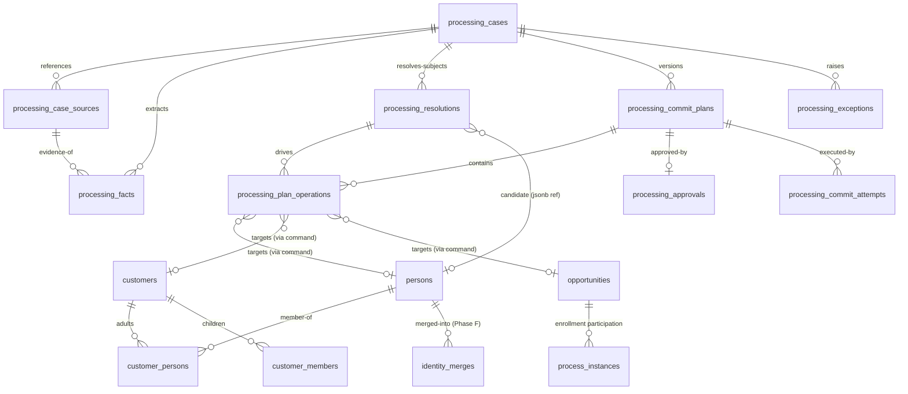

# Processing Identity Resolution — Data Model (V1, refined)

**Baseline:** `origin/staging` @ `65afc8527`. **Design only — no migrations authored.** Evidence: **[C]** confirmed, **[P]** proposed. Reflects the frozen decisions ([open-decisions](processing-identity-resolution-open-decisions.md)).

**Refinement stance.** The prior draft proposed 13 new `processing_*` tables. That is premature proliferation. This revision **folds to 7 typed tables** — typed where state is durable, queryable, business-critical, or audit lineage; **governed JSON** where the shape is intentionally flexible (candidate/signal breakdowns, mappings, per-op results). Rule: *durable/queryable/audited → table; flexible/derived → JSON.*

---

## 1. Table-count challenge (13 → 7)

| Prior proposed table | Verdict | Where it goes |
|---|---|---|
| `processing_facts` | **KEEP** (typed) | evidence lineage, immutable, queryable |
| `processing_mappings` | **FOLD** | jsonb on `processing_facts`/plan operation (mapping is fact→payload_key) |
| `processing_subjects` | **FOLD** | into `processing_resolutions` (one row per subject) |
| `processing_candidates` | **FOLD** | `processing_resolutions.candidates` jsonb (governed) |
| `processing_signals` | **FOLD** | within each candidate's `signals` jsonb |
| `processing_resolutions` | **KEEP** (typed) | subject + decision + candidates(jsonb) |
| `processing_recommendations` | **FOLD** | `processing_plan_operations` (a plan *is* the recommendation set) |
| `processing_commit_plans` | **KEEP** (typed) | versioned immutable plan |
| `processing_plan_operations` | **KEEP** (typed) | typed ops, before/after, DAG |
| `processing_approvals` | **KEEP** (typed) | approval bound to plan version+hash |
| `processing_commit_attempts` | **KEEP** (typed) | execution runs + per-op results (jsonb) |
| `processing_exceptions` | **KEEP** (typed) | duplicate/merge/partial-commit operator queue |
| `identity_merges` | **DEFER** (Phase F) | merge tombstone/alias |

**Result: 7 typed tables** — `processing_facts`, `processing_resolutions`, `processing_commit_plans`, `processing_plan_operations`, `processing_approvals`, `processing_commit_attempts`, `processing_exceptions` — plus `identity_merges` deferred to Phase F. Candidates, signals, contradictions, mappings, and per-op results live as **governed JSON**.

---

## 2. Classification of existing tables

### Retain as-is
`processing_cases`, `processing_case_sources` (on-ramp idempotency `uq_pcs_primary_source_once`), `persons`, `customers`, `customer_persons` (`uq_customer_persons_unique`), `customer_members`, `opportunities`, `opportunity_customer_members` (legacy per Decision B), `opportunity_persons`, `process_instances`, `form_submissions`/`form_public_links`/`form_packet_sessions`/`form_submission_documents`, `documents`/`document_versions`, `workflow_events`/`mutation_events`, `external_mappings`. **[C]**

### Extend
| Table | Extension | Phase |
|---|---|---|
| `processing_cases` | full-lifecycle `status`; `case_subject_kind`; resolved anchors `primary_customer_id?`/`primary_opportunity_id?`; `retention_class` | Foundation |
| `processing_case_sources` | `envelope_snapshot`(jsonb/immutable) or `raw_document_id`; `idempotency_key`; `trust_context`(jsonb) | Foundation |
| `persons` | `normalized_email`/`normalized_phone` (generated/backfilled) + **non-unique** indexes; `org_id` FK | Foundation (indexes); B0 (FK) — **NO unique** (Decision C) |
| `customer_members` | `normalized_child_key` + **partial UNIQUE(org_id, customer_id, normalized_child_key)** | Pre-commit (after de-dup) |
| `opportunities` | `idempotency_key` unique(org_id, idempotency_key) | Pre-commit |
| `form_submissions` | `submission_idempotency_key` | Pre-shadow |
| `workflow_events` | `event_idempotency_key` (partial unique) | Pre-commit |

### Deprecate (not deleted in V1)
`contacts` global email/phone uniques (+redundant `ux_*_not_null`) → replace with org-scoped or drop **after** person-first inbound parity (Decision C; Phase E). `admin_ops_full_access` non-org-scoped on customers/opportunities/contacts/OCM → org-scope (B0). `contacts` as identity carrier → legacy track. `applyFormLeadCaptureIntake.ts` + dead 23505 recovery → delete after uniqueness lands.

---

## 3. ERD (proposed)

Plan operations reference canonical records **through semantic commands**, not FK-coupled writes (Decision A/B).

---

## 4. Per-table detail (the 7)

All are org-scoped, RLS via `has_org_role(org_id, …)` + `service_role` bypass (post-2026-06 convention **[C]**). **Write owner = the Processing service (server), never a client or raw admin route.** Immutability enforced by update-guard triggers where noted (cf. `form_submissions` immutability trigger **[C]**).

| Table | Responsibility | Key columns | Keys / uniqueness | Mutability | Idempotency | Retention | Phase gate |
|---|---|---|---|---|---|---|---|
| **processing_facts** | One extracted+normalized value with evidence | `id, org_id, case_id, source_id, fact_type, raw_value, normalized_value, confidence, validation_state, evidence(jsonb), role_hint, produced_by, extractor_version, generation_id, corrected_from(id?), created_at` | PK id; idx(case_id, generation_id) | **immutable**; correction = new row | per `generation_id` | `retention_class` (purge with case) | **Foundation** |
| **processing_resolutions** | One subject + its candidates + decision | `id, org_id, case_id, generation_id, subject_role, provisional{name,emails[],phones[],dob}(jsonb), candidates(jsonb: [{matched_type,matched_id,band,score,signals[],contradictions[],reasons[]}]), decision_action, selected_candidate_id?, decided_by, operator_id?, policy_version?, created_at` | PK id; idx(case_id); idx(selected_candidate matched_id) | mutable until plan built | per `generation_id` | with case | **Pre-shadow** |
| **processing_commit_plans** | Versioned immutable diff | `id, org_id, case_id, version, content_hash, requires_approval, requires_privileged_approval, reversible, built_at, superseded_by?` | PK id; unique(case_id, version); idx(case_id) | **immutable**; new version supersedes | version+hash | long-retain (audit) | **Pre-commit** |
| **processing_plan_operations** | One typed op → semantic command | `id, org_id, plan_id, op_kind, command_key, target_type, target_id?, before(jsonb), after(jsonb), depends_on(uuid[]), atomic_group?, precondition_record_version?, compensation(jsonb?), op_order, resolution_id?, mapping(jsonb?)` | PK id; idx(plan_id, op_order) | **immutable** in plan | plan-scoped | with plan | **Pre-commit** |
| **processing_approvals** | Approver bound to one plan version | `id, org_id, case_id, plan_id, plan_content_hash, approver_id, approval_kind(standard/privileged), decision(approved/declined), decided_at` | PK id; idx(plan_id) | **immutable**; void if plan superseded | — | long-retain (audit) | **Pre-commit** |
| **processing_commit_attempts** | One execution run + per-op results | `id, org_id, case_id, plan_id, attempt_no, outcome(committed/partial/failed), operations(jsonb: op_id→{status,record_id,mutation_id,error}), compensation(jsonb), started_at, finished_at` | PK id; unique(plan_id, attempt_no) | **append-only** | attempt_no | long-retain (audit) | **Pre-commit** |
| **processing_exceptions** | Operator-actionable blocker/duplicate/partial | `id, org_id, case_id, exception_type(warning/blocker/conflict/duplicate/merge_candidate/stale_plan/partial_commit), severity, code, message, subject_ref?(jsonb), evidence_ids(uuid[]), resolved_at?, created_at` | PK id; idx(org_id, exception_type, resolved_at) | append; resolvable | — | with case | **Pre-commit** |

**Deferred (Phase F):** `identity_merges` — `id, org_id, source_entity_type, source_entity_id, target_entity_id, merged_by, merged_at, reversal_of?, alias_active`; append; alias redirect; permanent retention.

### Notes
- **Governed JSON, not free-form:** `candidates`, `signals`, `contradictions`, `mapping`, and `operations` results have documented shapes validated in the service layer (like `form_submissions.payload` immutability + schema filtering **[C]**). They are queryable enough for V1 metrics via jsonb operators; normalize to child tables only if metrics demand.
- **Generations:** facts + resolutions carry `generation_id`; reprocessing appends a new generation, retaining prior (Decision 15).
- **Optimistic concurrency:** `processing_plan_operations.precondition_record_version` asserted at execution → stale ⇒ fail closed (mirrors `expected_version` **[C]**).
- **Approval binding:** `processing_approvals.plan_content_hash` must equal the live plan hash at execution; mismatch ⇒ reopen.

---

## 5. Phase gating (what is needed when)

| Table / change | Foundation (B) | Pre-shadow (C) | Pre-commit (D) | Deferred |
|---|---|---|---|---|
| `processing_cases`/`_sources` extensions | ✅ | | | |
| `persons` normalized cols + non-unique idx; `org_id` FK | ✅ | | | |
| `processing_facts` | ✅ | | | |
| `processing_resolutions` | | ✅ | | |
| `form_submissions.submission_idempotency_key` | | ✅ | | |
| `processing_commit_plans` / `_plan_operations` | | | ✅ | |
| `processing_approvals` / `_commit_attempts` / `_exceptions` | | | ✅ | |
| `customer_members` natural-key unique (after de-dup) | | | ✅ | |
| `opportunities`/`workflow_events` idempotency keys | | | ✅ | |
| retire global `contacts` uniques | | | (Phase E) | |
| `identity_merges` | | | | Phase F |

**Not required in V1:** separate `processing_subjects`/`candidates`/`signals`/`recommendations`/`mappings` tables (folded); OCR bbox columns (reserved in `evidence` jsonb, unpopulated — no OCR **[C]**); DCP field-catalog re-model (reuse `PROCESSING_BUILDER_CANONICAL_FIELDS`/`systemFieldRegistry` **[C]**).

---

## 6. Constraints, RLS, retention summary

- **Uniqueness (Decision C):** NO person-level email/phone unique; non-unique normalized indexes for generation; `customer_members` natural-key unique; org-scoped idempotency keys on opportunities/submissions/events; retire global `contacts` uniques.
- **RLS:** all `processing_*` via `has_org_role` + service bypass; B0 fixes (`persons.org_id` FK, org-scope `admin_ops_full_access`) are prerequisites.
- **Immutability triggers:** `processing_facts`, `processing_commit_plans`, `processing_plan_operations`, `processing_approvals`, `processing_commit_attempts`.
- **Retention:** governed by **retention classes** (§7), not one global window. `retention_class` is a **first-class column from the foundation**; the purge job that enforces it is a later phase. No retention model exists today **[C]**.

---

## 7. Retention classes (product-owner finalized)

The data model must support `retention_class` **from the foundation** (a column on cases/facts/sources/attachments and, by association, plans/approvals/attempts). Purge jobs enforcing these are a later implementation phase.

| Retention class | Applies to | Default retention |
|---|---|---|
| `committed_case_lineage` | Cases + facts/evidence/plans tied to a committed authoritative record | **Life of the associated authoritative record + applicable organizational/legal retention period** |
| `uncommitted_submission` | Ordinary submissions/cases that never committed | **24 months** |
| `rejected_or_duplicate` | Rejected or duplicate cases | **24 months** |
| `raw_extraction_transient` | Raw OCR text + transient extraction artifacts | **12 months after Processing Case completion** — unless part of the retained source document or otherwise legally required |
| `audit_authoritative` | Commit Plans, approvals, commit attempts, execution results, audit evidence | **7 years minimum** |
| `pii_operational_log` | Operational/security logs containing PII | **Only as long as operationally necessary** |

Rules:
- `identity_merges` (Phase F) is `audit_authoritative` (retain the alias/redirect for reference integrity).
- PII in `documents.extracted_text/extracted_data` and `form_submissions.payload` inherits the **case's** class (typically `committed_case_lineage` or `uncommitted_submission`); raw OCR/transient extraction is separately classed `raw_extraction_transient`.
- A case that commits **promotes** its lineage class from `uncommitted_submission` to `committed_case_lineage`; plans/approvals/attempts are always `audit_authoritative` regardless of case outcome.
- Windows are **organization-configurable** (governed config); the values above are frozen V1 defaults.
