# Field Platform Consumer Audit

**Status:** Audit complete — July 2026 (updated after Queue Rows convergence sprint)  
**Sprint type:** AUDIT ONLY — no implementation, no refactoring  
**Staging baseline:** `origin/staging` @ `3d08a24d` (hardening pass rebased)  
**Convergence follow-up:** [field-platform-consumer-convergence.md](./field-platform-consumer-convergence.md) — Queue Rows reference adoption + hardening pass  
**Data Model:** **FROZEN** — reference implementation only  
**Configuration Workspace Doctrine:** reference implementation (`/settings/fields`)

---

## Post-audit update (July 2026)

The first convergence sprint implemented the **canonical data-provider model** and migrated **Queue Rows** off `QUEUE_FIELD_CATALOG` / manual validator arrays.

| Consumer | Audit status | Convergence status |
| --- | --- | --- |
| **Queue Rows** | Partial — static catalog + manual validator | **Reference adoption complete** (provider library wired) |
| **Surface Composer (queue zones)** | Low | **Partial** — `compositionFieldAdapter` now uses provider registry |
| **Forms / Documents / Processing / BP / Communications / Focus Panel** | Unchanged | Pending — see convergence doc |

Audit conclusions about duplicate catalogs remain valid for non-migrated consumers. Queue Row-specific findings for static catalog and manual allow-list are **resolved**.

---

## Mission

Measure how eight configuration consumers actually source fields, categories, choice options, runtime signals, relationships, and entity labels — compared to the canonical Field Platform stack established in the Data Model closeout sprint.

**Do not redesign Data Model.** Classify gaps; recommend adoption order only.

---

## Canonical architecture (reference)

The Data Model workspace is the **first full consumer** of the Field Platform. All other consumers should converge on this stack.

```
field_definitions (tenant DB)
        +
platformFieldCatalog.ts (native columns + platform templates)
        +
computedFieldCatalog.ts (Calculated planned + Runtime Signals)
        ↓
buildSettingsFieldCatalogEntries()  — fieldCatalogForSettings.ts
        ↓
fieldCapabilityEngine.ts → fieldResolverRegistry.ts
        ↓
fieldSurfaceAvailability.ts (consumer surfaces: forms, drawer, table,
                           queue_row, focus_panel, business_process, documents)
```

**Entity-owned categories:** `configurationCategoryCatalog.ts` seeds + org `field_section_definitions` via `GET /api/admin/field-sections`.

**Entity labels:** `configurationEntityCatalog.ts` + `EntityLabelsContext` + `PUT /api/admin/entity-labels`.

**Choice options (canonical):** `field_definitions.config.options` (inline) or `config.option_set_key` → option sets.

**Forms grain bridge:** `fieldRegistryReferenceMatrix.ts` maps forms-facing aliases (`guardian`, `child`, `enrollment`) ↔ DB grains (`person`, `inquiry_child`, `customer_member`).

**Intended unified builder seam:** `canonicalBuilderFieldLibrary.ts` + `canonicalDataProviderRegistry.ts` — Queue Rows wired July 2026; other consumers pending.

---

## Canonical data providers (July 2026 convergence)

Fields are one kind of **canonical data provider**. Relationships and collections are first-class provider kinds — not flattened scalar fields.

See `docs/sprints/08_2026/field-platform-consumer-convergence.md` and `web/lib/fields/canonicalDataProviderModel.ts`.

---

## Architecture map

```mermaid
flowchart TB
  subgraph canonical [Canonical Field Platform — Data Model reference]
    FD[(field_definitions)]
    PFC[platformFieldCatalog.ts]
    CFC[computedFieldCatalog.ts]
    FCS[fieldCatalogForSettings.ts]
    FCC[configurationCategoryCatalog.ts]
    CEC[configurationEntityCatalog.ts]
    FCE[fieldCapabilityEngine.ts]
    FRR[fieldResolverRegistry.ts]
    CBL[canonicalBuilderFieldLibrary.ts]
    FD --> FCS
    PFC --> FCS
    CFC --> FCS
    FCS --> FCE
    FCE --> FRR
    CBL --> FCE
  end

  subgraph consumers [Configuration consumers — measured reality]
    SB[Surface Builder]
    FB[Forms Builder]
    PR[Processing]
    BP[Business Processes]
    DOC[Documents / Packets]
    COM[Communications]
    FP[Focus Panel]
    QR[Queue Rows]
  end

  FCS -.->|full adoption| DM[Data Model workspace]
  CBL -.->|tests only| QR
  CBL -.->|tests only| FP

  LEG1[OPERATIONAL_FORM_SYSTEM_FIELDS] --> FB
  LEG1 --> DOC
  LEG2[QUEUE_FIELD_CATALOG] --> SB
  LEG2 --> QR
  LEG2 --> FP
  LEG3[LIFECYCLE_FIELD_REQUIREMENT_CATALOG] --> BP
  LEG4[COMMUNICATION_TOKEN_CATALOG] --> COM
  LEG5[workViewConditionFieldRegistry] --> BP
  LEG6[focusPanelConceptCatalog CONCEPT_TREE] --> FP
  LEG7[PROCESSING_BUILDER_CANONICAL_FIELDS] --> PR

  FD -->|partial tenant merge| SB
  FD -->|partial tenant merge| QR
  FD -->|partial merge| BP
  FD -->|API exists, UI unwired| FB
```



---

## Duplicate sources inventory

| Duplicate catalog / label layer | Path | Canonical alternative | Consumers affected |
| --- | --- | --- | --- |
| `OPERATIONAL_FORM_SYSTEM_FIELDS` | `web/lib/forms/systemFieldRegistry.ts` | `field_definitions` + `formFieldRegistryPicker.ts` | Forms, Documents, Processing |
| `PROCESSING_BUILDER_CANONICAL_FIELDS` | `web/lib/forms/processingFormBuilderLibrary.ts` | Same registry picker | Processing |
| `QUEUE_FIELD_CATALOG` | `web/lib/adminV2/settings/surfaces/compositionFieldAdapter.ts` | `canonicalBuilderFieldLibrary` / `platformFieldCatalog` | Surface Builder, Queue Rows, Focus Panel (nested) |
| `queueRecordValidatorAllowList` | `web/lib/layout/queueRecordValidatorAllowList.ts` | Derived from resolver registry (partially in tests) | Queue Rows publish gate |
| `queueRecordFieldPickerCatalog` | `web/lib/layout/queueRecordFieldPickerCatalog.ts` | Same as above — **parallel to Surface Composer** | Legacy queue column composer |
| `FIELD_LIBRARY_LABELS` | `web/lib/adminV2/settings/surfaces/queueRowBuilderLibrary.ts` | Manifest + childcare catalog labels | Queue Rows V2 |
| `fieldPickerContextCatalog` context groups | `web/lib/layout/fieldPickerContextCatalog.ts` | Entity-owned categories | Legacy queue picker |
| `FOCUS_PANEL_CARD_EVIDENCE_GROUPS` | `web/lib/adminV2/settings/surfaces/compositionEvidenceGroupRegistry.ts` | `fieldCatalogForSettings` refKeys | Focus Panel cards |
| `CONCEPT_TREE` | `web/lib/adminV2/runtime/focusPanel/focusPanelConceptCatalog.ts` | Canonical refKeys + relationship catalog | Focus Panel card inspector |
| `LIFECYCLE_FIELD_REQUIREMENT_CATALOG` | `web/lib/lifecycle/lifecycleFieldRequirementsCatalog.ts` | `field_definitions` + capability engine | Business Processes stage requirements |
| `LIFECYCLE_FIELD_RULE_BINDINGS` | `web/lib/lifecycle/lifecycleFieldRuleBindings.ts` | Resolver registry paths | BP runtime evaluation |
| `workViewConditionFieldRegistry` | `web/lib/lifecycle/workViewConditionFieldRegistry.ts` | Field Platform business fields | BP Work Views |
| `COMMUNICATION_TOKEN_CATALOG` | `web/lib/communications/v2/templateTokens.ts` | Field catalog merge paths + resolver map | Communications templates |
| `templateRender.ts` flat keys | `web/lib/communications/v2/templateRender.ts` | Dot-path token catalog | Legacy TemplateBuilder |
| `document_field_definitions` table | Supabase + `DocumentFieldsClient.tsx` | `field_definitions` | Legacy upload/AI extraction |
| `CHILDCARE_FIELD_ENTITY_SINGULAR_LABELS` | `web/lib/fields/childcareFieldCatalogDoctrine.ts` | `configurationEntityCatalog` + org overrides | Forms, BP, queue pickers |
| `formFieldAuthoringPresentation` group labels | `web/lib/forms/formFieldAuthoringPresentation.ts` | `configurationEntityCatalog` | Forms, Documents |
| Hardcoded zone labels ("Family", "Child") | `queueRowBuilderLibrary.ts`, `QueueRowBuilderV2.tsx` | `EntityLabelsContext` | Surface Builder, Queue Rows |

**Category systems (four parallel taxonomies):**

1. **Data Model entity-owned categories** — `configurationCategoryCatalog.ts` + `field_section_definitions` (reference only)
2. **Forms picker groups** — guardian / child / inquiry / advanced (`formFieldAuthoringPresentation.ts`)
3. **Queue context groups** — 10 operator contexts (`fieldPickerContextCatalog.ts`)
4. **Surface Builder library categories** — per-surface hardcoded keys (`queueRowBuilderLibrary.ts`, `focusPanelBuilderLibrary.ts`)
5. **Processing folder categories** — `admin_category` metadata (`processingFolderModel.ts`)
6. **Comms token groups** — family / contact / child / enrollment (`templateTokens.ts`)
7. **BP Work View groups** — lead / child / household / operational (`workViewConditionFieldRegistry.ts`)

Only (1) is canonical per Configuration Workspace Doctrine.

---

## Consumer adoption matrix

| Consumer | Field source | Categories | Choice options | Runtime signals | Relationships | Entity labels | Doctrine grammar | Overall adoption |
| --- | --- | --- | --- | --- | --- | --- | --- | --- |
| **Data Model** (reference) | `fieldCatalogForSettings` | Entity-owned catalog | `config.options` / option sets | View-only filter | `entityRelationshipCatalog` | `configurationEntityCatalog` | Full | **Reference** |
| **Surface Builder** | Static `QUEUE_FIELD_CATALOG` + partial tenant defs | Hardcoded library cats | Not at config layer | Duplicated in static catalog | Concept paths / surface specs | Hardcoded | Shell only | **Low** |
| **Forms Builder** | Legacy `OPERATIONAL_FORM_SYSTEM_FIELDS` (registry API unwired) | Forms-local groups | Static textarea; not `config.options` | Correctly excluded | Grain bridge exists, unused in UI | Hardcoded | Not adopted | **Low** |
| **Processing** | Hardcoded library + Forms `field_source` seam | Local folder rails | Registry metadata only | Not referenced | Heuristic mapping | Hardcoded | Not adopted | **Minimal** |
| **Business Processes** | Catalog merge + partial `field_definitions` | Doctrine visibility classes | Not in picker | Excluded from picker | Filtered via doctrine | Partial tenant labels | Not adopted | **Partial** |
| **Documents / Packets** | Same as Forms (legacy catalog) | Composition blocks, not DM categories | Static inline options | Correctly excluded | Entity binding via `field_source` | Hardcoded | Not adopted | **Low** |
| **Communications** | Hardcoded token catalog | Free-text template categories | Not consumed | Not integrated | Implicit dot paths | Hardcoded | Not adopted | **None** |
| **Focus Panel** | Dual: concept tree (cards) + adapter (nested) | Hardcoded library cats | Renderer enums only | Not in picker | Concept branches | Hardcoded | Not adopted | **Low–partial** |
| **Queue Rows** | Validator allow-list + static catalog + tenant defs | Three parallel taxonomies | Not at config | In static catalog | Contact-role refKeys | Multi-layer overrides | Not adopted | **Partial** |

**Capability engine surfaces tracked:** `forms`, `drawer`, `table`, `queue_row`, `focus_panel`, `business_process`, `documents` — **Processing and Communications are not tracked surfaces.**

---

## Per-consumer audit

### 1. Surface Builder

#### Current architecture

Two composition engines share the Surfaces settings area:

| Engine | Surfaces | Field role |
| --- | --- | --- |
| **Platform SurfaceBuilder** | Operational Intelligence, Workspace Header, Work Unit Header | Metrics registry — not entity fields |
| **Surface Composer** | Queue Row, Focus Panel summary, Nested drill-in | Entity field placement |

Surface Composer field availability flows:

```
compositionEvidenceGroupRegistry (defaultFieldKeys seeds)
        +
compositionFieldAdapter.QUEUE_FIELD_CATALOG (static ~70 refKeys)
        +
useTenantFieldDefinitions → GET /api/admin/entity-layouts/field-catalog
        → buildTenantLayoutCatalogFields(defs, surface)
```

Focus Panel **card** inspector uses a separate concept-path model (`focusPanelConceptCatalog.ts` → `FocusPanelCardInspector.tsx`).

#### Canonical path

`fieldCatalogForSettings` → `canonicalBuilderFieldLibrary` → capability-filtered picker grouped by `configurationCategoryCatalog` entity categories; runtime signals from `computedFieldCatalog`; entity labels from `EntityLabelsContext`.

#### Field source

| Source | Classification |
| --- | --- |
| Static `QUEUE_FIELD_CATALOG` in `compositionFieldAdapter.ts` | **Field Platform** |
| Tenant `field_definitions` via field-catalog API (Queue Row + Nested only) | **Consumer Adoption** (partial) |
| Focus Panel `CONCEPT_TREE` concept paths | **Consumer Adoption** |
| Inline surface spec fields in `recursiveSurfaceProofs.ts` | **Consumer Adoption** |
| OI/Header metrics from operational calculations registry | **Consumer Adoption** (correct — not fields) |

#### Entity source

Hardcoded operator zone labels (`household` → "Family", `children` → "Child") in `queueRowBuilderLibrary.ts`, `QueueRowBuilderV2.tsx`. Focus Panel root `CONCEPT_ROOT = "Enrollment"`.

**Classification:** **Entity Model**

#### Category support

Hardcoded library category keys per surface (`QueueRowLibraryCategoryKey`, `FocusPanelLibraryCategoryKey`). Nested surfaces use `sectionCatalog.ts` platform section semantics. **No** `configurationCategoryCatalog` imports under `web/lib/adminV2/settings/surfaces/`.

**Classification:** **Configuration Workspace Doctrine**

#### Choice option support

Not read at builder layer; option resolution deferred to runtime resolvers.

**Classification:** **Consumer Adoption**

#### Runtime signal support

`queue_row.*`, `waitlist.*` duplicated as hardcoded entries in `QUEUE_FIELD_CATALOG` rather than sourced from `computedFieldCatalog.ts`. Focus Panel capability badges partially bridge concepts → refKeys via `focusPanelFieldAvailability.ts`.

**Classification:** **Field Platform**

#### Relationship support

Hardcoded surface groups and concept branches; `entityRelationshipCatalog.ts` not consumed.

**Classification:** **Consumer Adoption**

#### Platform violations

- Two rival field-binding models (refKeys vs concept paths)
- Triple label duplication (`QUEUE_FIELD_CATALOG`, `FIELD_LIBRARY_LABELS`, `fieldPickerContextCatalog`)
- `canonicalBuilderFieldLibrary` not wired
- Category bypass vs doctrine
- Publish gate for focus_panel always passes (`fieldCapabilityEngine.ts`)

#### Recommended fixes

| Fix | Priority | Classification |
| --- | --- | --- |
| Wire Queue Row / Nested pickers to `canonicalBuilderFieldLibrary` | P0 | Consumer Adoption |
| Migrate Focus Panel cards from concept paths to canonical refKeys | P0 | Consumer Adoption |
| Replace static runtime signal entries with `computedFieldCatalog` | P1 | Field Platform |
| Adopt `configurationCategoryCatalog` for library grouping | P1 | Configuration Workspace Doctrine |
| Source entity zone labels from `EntityLabelsContext` | P2 | Entity Model |
| Unify with legacy `queueRecordFieldPickerCatalog` | P2 | Field Platform |

---

### 2. Forms Builder

#### Current architecture

Intake document authoring (`DocumentCompositionEditor.tsx` → `FormFieldAuthoringCard.tsx`) resolves fields from **`OPERATIONAL_FORM_SYSTEM_FIELDS`** via `useFormSchemaFieldAuthoring.ts`. Registry-first infrastructure (`formFieldRegistryPicker.ts`, `useFormSystemFieldPicker.ts`) fetches org `field_definitions` but is **not mounted in the live UI**.

Processing POS builder (`ProcessingFormBuilder.tsx`) uses a third hardcoded palette (`processingFormBuilderLibrary.ts`).

#### Canonical path

`useFormSystemFieldPicker` → `buildFormSystemFieldPicker(field_definitions)` → `formFieldFromRegistryEntry` → schema `field_source`; categories from entity-owned catalog; choice options from `config.options` / `option_set_key`.

#### Field source

| Source | Classification |
| --- | --- |
| `OPERATIONAL_FORM_SYSTEM_FIELDS` (live UI) | **Consumer Adoption** |
| `formFieldRegistryPicker.ts` (unwired) | **Field Platform** |
| `fieldRegistryReferenceMatrix.ts` (bridge exists) | **Field Platform** |
| `customUnmappedTextField()` escape hatch | **Consumer Adoption** |

#### Entity source

Forms-facing grains persisted in schema: `guardian`, `child`, `enrollment`, `opportunity`. DB grains: `person`, `inquiry_child`, `customer_member`. Bridge in reference matrix; UI does not traverse it.

**Classification:** **Entity Model**

#### Category support

`SYSTEM_FIELD_PICKER_GROUP_ORDER`: guardian, child, inquiry, advanced — from `formFieldAuthoringPresentation.ts`. Not entity-owned Data Model categories.

**Classification:** **Configuration Workspace Doctrine**

#### Choice option support

Authoring UI edits inline `static_options` textarea. Registry path supports `option_set_key` via `getOptionSetKeyFromConfig` but UI can overwrite with static lines. Does not read canonical `config.options`.

**Classification:** **Consumer Adoption**

#### Runtime signal support

Correctly excluded via `fieldCapabilityEngine` forms builder layer.

**Classification:** **Field Platform** (correct behavior)

#### Relationship support

`entityRelationshipCatalog.ts` documents Forms usage but is not imported. Native reference fields exposed via legacy registry ids (`lead_site`, `child_site`).

**Classification:** **Consumer Adoption**

#### Platform violations

- Doctrine test expects `useFormSystemFieldPicker` in `DocumentCompositionEditor` — code drift
- `is_visible_in_form` not queried at authoring
- Lifecycle capture index still uses `SYSTEM_FIELD_BY_ID`
- Org custom fields invisible in live picker

#### Recommended fixes

| Fix | Priority | Classification |
| --- | --- | --- |
| Wire `useFormSystemFieldPicker` into `DocumentCompositionEditor` / `useFormSchemaFieldAuthoring` | P0 | Consumer Adoption |
| Replace static options UI with canonical `config.options` / option-set picker | P1 | Consumer Adoption |
| Adopt entity-owned categories or map honestly to composition sections | P1 | Configuration Workspace Doctrine |
| Replace hardcoded entity labels with `configurationEntityCatalog` | P2 | Entity Model |
| Align Processing builder library with registry picker | P2 | Consumer Adoption |

---

### 3. Processing

#### Current architecture

Digital Mailroom (POS) under `web/app/adminV2/pos/` and `web/lib/pos/`. **Zero `@/lib/fields/**` imports.** Field identity flows through Forms layer `field_source` on `FormField`; publish validates keys against `field_definitions` when `pos_connected` marker is set.

Mapping layers:

- `questionResolutionModel.ts` — subject → `field_source` (dialect A: `child`/`guardian`)
- `canonicalBindingSuggestions.ts` — heuristic fallback (dialect B: `customer_member`/`person`)
- `processingFormBuilderLibrary.ts` — 17 hardcoded canonical fields → `systemFieldRegistry`

#### Canonical path

Same as Forms: registry-first picker + reference matrix normalization at publish + entity-owned categories for folder organization.

#### Field source

| Source | Classification |
| --- | --- |
| Hardcoded `PROCESSING_BUILDER_CANONICAL_FIELDS` | **Consumer Adoption** |
| Publish-time `field_definitions` key validation | **Field Platform** (partial) |
| `fieldRegistryReferenceMatrix` not used at validate time | **Field Platform** |
| `processing_only` subject (no field_source) | **Consumer Adoption** |

#### Entity source

Hardcoded destination labels in `ProcessingFormBuilder.tsx` (`STORE_OPTIONS`, `destinationLabel()`).

**Classification:** **Consumer Adoption**

#### Category support

Local Processing folder rails via `metadata.admin_category` (`processingFolderModel.ts`, `processingFolderConfig.ts`). Builder question-type groups (basic, choice, capture). No Data Model categories.

**Classification:** **Configuration Workspace Doctrine**

#### Choice option support

Inherited from `systemFieldRegistry` metadata when library fields resolve through registry entries. Does not read org `field_definitions.config.options`.

**Classification:** **Consumer Adoption**

#### Runtime signal support

Not referenced anywhere in Processing code paths.

**Classification:** **Consumer Adoption** (correct exclusion; surface not tracked)

#### Relationship support

Not consumed. Packet roster displays relationship strings from runtime logic, not relationship catalog.

**Classification:** **Consumer Adoption**

#### Platform violations

- Dual binding dialects without reference-matrix normalization at publish
- `posAuthoringCatalogRegistryBacked.test.ts` planned in FP0 docs — not found
- Delete-safety does not scan processing mappings
- Doc claim in `field-concepts.md` ("Processing — Field requirements use catalog paths") **not implemented**

#### Recommended fixes

| Fix | Priority | Classification |
| --- | --- | --- |
| Wire Processing builder to `formFieldRegistryPicker` | P0 | Consumer Adoption |
| Normalize publish validation through `fieldRegistryReferenceMatrix` | P0 | Field Platform |
| Align binding dialects (single grain at persist) | P1 | Entity Model |
| Adopt entity labels from org configuration | P2 | Entity Model |
| Add processing to `fieldSurfaceAvailability` consumer surfaces | P3 | Field Platform |

---

### 4. Business Processes

#### Current architecture

Stage field requirements: `LifecycleStageFieldRequirementsEditor.tsx` loads org `field_definitions` via `loadOrgFieldDefinitionsForLifecycle.ts`, merges with hardcoded `LIFECYCLE_FIELD_REQUIREMENT_CATALOG`, filters through `childcareFieldCatalogDoctrine.ts`, persists `rule_id` arrays in department metadata.

Work Views: separate `workViewConditionFieldRegistry.ts` with API-backed option sources — **does not read `field_definitions`**.

#### Canonical path

Palette from `fieldCatalogForSettings` filtered by `fieldCapabilityEngine` surface `business_process`; persist `{entity_type, field_key}` not parallel `rule_id`; Work Views converge on same business field catalog.

#### Field source

| Source | Classification |
| --- | --- |
| Org `field_definitions` merge | **Consumer Adoption** (partial) |
| `LIFECYCLE_FIELD_REQUIREMENT_CATALOG` hardcoded palette | **Consumer Adoption** |
| `LIFECYCLE_FIELD_RULE_BINDINGS` runtime paths | **Field Platform** (parallel layer) |
| `workViewConditionFieldRegistry` | **Consumer Adoption** |
| `fieldRegistryReferenceMatrix` not imported by lifecycle merge | **Field Platform** |

#### Entity source

Tenant labels via `lifecycleRequirementEntityLabels.ts` + `resolveEntityLabelsForOrg`. Static fallbacks in catalog. Child hub key `child` maps to `inquiry_child` at DB layer.

**Classification:** **Entity Model** (partial)

#### Category support

Uses `childcareFieldCatalogDoctrine` **visibility classes** (operator_configurable, system_workflow, etc.) — not entity-owned category headers from Data Model.

**Classification:** **Configuration Workspace Doctrine**

#### Choice option support

Not configured in stage requirements picker. Work Views load status/location/program options from admin APIs.

**Classification:** **Consumer Adoption**

#### Runtime signal support

Excluded from stage pickers via doctrine filters. Attention rules reference `missing_required_fields` at runtime — not selectable signals from `computedFieldCatalog`.

**Classification:** **Field Platform** (correct exclusion from picker)

#### Relationship support

`relationship_reference` class fields filtered out of picker. `entityRelationshipCatalog` not consumed.

**Classification:** **Consumer Adoption**

#### Platform violations

- Parallel lifecycle catalog always seeds palette independent of registry
- Persistence uses `rule_id` not canonical field keys (F2 pending)
- Custom org fields config-only at runtime (`lifecycleFieldRuleEvaluator.ts`)
- Work Views third registry bypasses Field Platform entirely

#### Recommended fixes

| Fix | Priority | Classification |
| --- | --- | --- |
| Wire `fieldRegistryReferenceMatrix` into palette merge | P1 | Field Platform |
| Migrate persistence from `rule_id` to `{entity_type, field_key}` | P1 | Field Platform |
| Converge Work View condition fields on business field catalog | P2 | Consumer Adoption |
| Adopt entity-owned category grouping in requirements UI | P2 | Configuration Workspace Doctrine |
| Enable registry-backed runtime evaluation for custom fields | P2 | Field Platform |

---

### 5. Documents / Packets

#### Current architecture

**Intake document builder** — same stack as Forms (`DocumentCompositionEditor`, legacy catalog). **Packet builder** assigns published forms, not individual fields; dedupe via `field_source` in `packetFieldPlan.ts`. **Legacy document-field definitions** — separate `document_field_definitions` table for upload/AI extraction. **Processing form builder** — third surface (see Processing audit).

#### Canonical path

Registry-first document field picker; composition `field_region` blocks reference canonical field keys; packet dedupe on `{entity_type, field_key}`; choice options from org field config.

#### Field source

| Source | Classification |
| --- | --- |
| `OPERATIONAL_FORM_SYSTEM_FIELDS` (document builder) | **Consumer Adoption** |
| `formFieldRegistryPicker` (unwired) | **Field Platform** |
| `document_field_definitions` parallel schema | **Entity Model** |
| Packet `field_source` dedupe | **Consumer Adoption** (correct identity grain) |
| `fieldResolverRegistry` `documents` surface declared | **Field Platform** (unwired in UI) |

#### Entity source

Hardcoded `entityTypeLabel()` in `formFieldAuthoringPresentation.ts`. Processing destination labels hardcoded.

**Classification:** **Consumer Adoption**

#### Category support

Document sections = `field_region` composition blocks — not Data Model categories.

**Classification:** **Configuration Workspace Doctrine**

#### Choice option support

Inline `static_options` textarea in `FormFieldAuthoringCard.tsx`. Not org `config.options`.

**Classification:** **Consumer Adoption**

#### Runtime signal support

Correctly excluded from business field pickers.

**Classification:** **Field Platform** (correct)

#### Relationship support

No relationship picker; `field_source` encodes entity binding only.

**Classification:** **Consumer Adoption**

#### Platform violations

- Same Forms registry-first gap as Forms Builder
- `fieldDeleteSafety` lists documents/packets as uncovered
- Legacy `DocumentFieldsClient.tsx` parallel schema
- Lifecycle coverage tooling uses legacy `SYSTEM_FIELD_BY_ID`

#### Recommended fixes

| Fix | Priority | Classification |
| --- | --- | --- |
| Wire document builder to registry picker (same as Forms P0) | P0 | Consumer Adoption |
| Implement delete-safety scan for documents/packets | P1 | Field Platform |
| Plan deprecation or bridge for `document_field_definitions` | P2 | Entity Model |
| Adopt Configuration Workspace grammar in document authoring | P2 | Configuration Workspace Doctrine |

---

### 6. Communications

#### Current architecture

Template authoring uses static `COMMUNICATION_TOKEN_CATALOG` in `templateTokens.ts` (~25 dot-path tokens). Picker: `TemplateTokenPickerPanel.tsx`. **No `@/lib/fields/**` imports** in comms configuration. Send path (`executeCommunicationsSend.ts`) does not resolve tokens at send time.

Parallel systems: legacy flat-key `templateRender.ts`, tour comms merge maps, workflow inline message templates.

#### Canonical path

Merge-field picker derived from `fieldCatalogForSettings` + documented payload paths + runtime signal resolver map; token group labels from `configurationEntityCatalog`; send-time context assembly from entity GET / record responders.

#### Field source

| Source | Classification |
| --- | --- |
| `COMMUNICATION_TOKEN_CATALOG` hardcoded | **Consumer Adoption** |
| `templateRender.ts` flat keys (legacy) | **Consumer Adoption** |
| Tour comms / workflow parallel merge systems | **Consumer Adoption** (documented vertical) |
| Announcement status filter → `status_definitions` API | **Consumer Adoption** (adjacent platform, not fields) |

#### Entity source

Hardcoded `COMMUNICATION_TOKEN_GROUP_LABELS` and announcement grain labels. `field-concepts.md` claims `EntityLabelsContext` — **not wired**.

**Classification:** **Entity Model**

#### Category support

Template categories = free-text org strings (`templateCategoryOptions.ts`). Token groups = hardcoded enum. Not Data Model categories.

**Classification:** **Configuration Workspace Doctrine**

#### Choice option support

Not consumed. Template channel/status enums are local to `templateSchema.ts`.

**Classification:** **Consumer Adoption**

#### Runtime signal support

Not integrated. Catalog includes workflow-style paths (e.g. `opportunity.metadata.tour_date`) without Runtime Signal taxonomy from `fieldConceptModel.ts`.

**Classification:** **Field Platform**

#### Relationship support

Implicit in dot paths (`contact.*`, `person.*`); `entityRelationshipCatalog` not referenced.

**Classification:** **Consumer Adoption**

#### Platform violations

- Org custom fields invisible in merge-field picker
- Tokens not resolved at send time
- Doc/code gap on entity labels
- Two token engines in same product area
- Communications not listed in prior consumer audit handoff but clearly a gap

#### Recommended fixes

| Fix | Priority | Classification |
| --- | --- | --- |
| Derive token catalog from field platform + payload path registry | P1 | Field Platform |
| Wire entity labels into token group copy | P2 | Entity Model |
| Add send-time context assembly / token resolution | P1 | Consumer Adoption |
| Retire or bridge legacy `templateRender.ts` | P2 | Consumer Adoption |
| Update `field-concepts.md` readiness row to match reality | P3 | Configuration Workspace Doctrine |

---

### 7. Focus Panel

#### Current architecture

**Split binding models:**

| Layer | Binding | Field source |
| --- | --- | --- |
| Card summary inspector | Business concept paths | `focusPanelConceptCatalog.ts` `CONCEPT_TREE` |
| Nested drill-in surfaces | Canonical refKeys | `compositionFieldAdapter` + tenant defs |
| Card library (scaffolded) | Concept paths from evidence groups | `focusPanelBuilderLibrary.ts` |

Capability bridge: `focusPanelFieldAvailability.ts` maps concepts → refKeys → `fieldCapabilityEngine` (badges only; summary editor not wired).

#### Canonical path

Unified refKey picker via `canonicalBuilderFieldLibrary`; categories from entity-owned catalog; runtime signals from `computedFieldCatalog` where capability allows; entity labels from org configuration.

#### Field source

| Source | Classification |
| --- | --- |
| `CONCEPT_TREE` + `FocusPanelCardInspector` | **Consumer Adoption** |
| `QUEUE_FIELD_CATALOG` + tenant defs (nested) | **Field Platform** (partial) |
| `canonicalBuilderFieldLibrary` (unused) | **Field Platform** |
| `focusPanelCardReference.ts` seed configs | **Consumer Adoption** |

#### Entity source

Hardcoded "Enrollment", "Household", "Children", "Primary Contact" throughout concept catalog and evidence groups.

**Classification:** **Entity Model**

#### Category support

Hardcoded library categories (`identity`, `enrollment`, `work`, `related`, etc.) in `focusPanelBuilderLibrary.ts`. Evidence group keys as section taxonomy.

**Classification:** **Configuration Workspace Doctrine**

#### Choice option support

Renderer enum picks only (`FOCUS_PANEL_FIELD_RENDERERS`). No option-set binding.

**Classification:** **Consumer Adoption**

#### Runtime signal support

Operational signals at runtime (`buildCurrentWorkCardEvidence.ts`, etc.) — not configurable in composer. Evidence group names like `readiness_signals` are labels, not `computedFieldCatalog` wiring.

**Classification:** **Consumer Adoption**

#### Relationship support

Concept branches (Primary Contact, Authorized Pickups, etc.); `entityRelationshipCatalog` not consumed.

**Classification:** **Consumer Adoption**

#### Platform violations

- Dual vocabulary (concept paths vs refKeys)
- Test drift: `dataModelFinishPass.test.ts` expects availability wiring in summary editor — absent
- `canonicalBuilderFieldLibrary` not adopted
- Publish gate for focus_panel always passes
- Card library scaffold exists but primary UX uses concept inspector

#### Recommended fixes

| Fix | Priority | Classification |
| --- | --- | --- |
| Migrate card inspector from concept paths to canonical refKeys | P0 | Consumer Adoption |
| Wire summary editor to `SurfaceItemLibraryPanel` + availability badges | P1 | Consumer Adoption |
| Unify nested + card pickers on `canonicalBuilderFieldLibrary` | P1 | Field Platform |
| Adopt org entity labels | P2 | Entity Model |
| Source runtime signals from `computedFieldCatalog` where appropriate | P2 | Field Platform |

---

### 8. Queue Rows

#### Current architecture

**Two builder paths**, same V3 schema:

| Path | UI | Catalog seam |
| --- | --- | --- |
| Surfaces V2 | `QueueRowBuilderV2.tsx` | `compositionFieldAdapter` + `queueRowBuilderLibrary` |
| Legacy column composer | `QueueRecordLayoutVisualEditor.tsx` | `queueRecordFieldPickerCatalog.ts` |

**Publish gate:** `queueRecordValidatorAllowList.ts` (hand-maintained). Tenant merge via `useTenantFieldDefinitions` / `buildTenantLayoutCatalogFields`. Resolver + capability engine aligned for publish; picker UI bypasses `canonicalBuilderFieldLibrary`.

#### Canonical path

Single picker from `canonicalBuilderFieldLibrary(isWaitlist)`; categories from entity-owned catalog or unified context taxonomy; labels from manifest + org overrides only; validator allow-list **derived** from resolver registry.

#### Field source

| Source | Classification |
| --- | --- |
| `queueRecordValidatorAllowList` (authoritative publish) | **Field Platform** (manual maintenance) |
| `QUEUE_FIELD_CATALOG` static | **Field Platform** (duplicate) |
| Tenant `field_definitions` merge | **Consumer Adoption** (partial) |
| `canonicalBuilderFieldLibrary` (tests only) | **Field Platform** |
| Legacy `queueRecordLayoutFieldCatalog` | **Consumer Adoption** |

#### Entity source

Multi-layer label overrides: `FIELD_PICKER_QUEUE_LABEL_OVERRIDES`, `FIELD_LIBRARY_LABELS`, childcare catalog, manifest. Hardcoded zone labels "Family"/"Child".

**Classification:** **Entity Model**

#### Category support

Three parallel taxonomies: context groups (`fieldPickerContextCatalog`), library categories (`queueRowBuilderLibrary`), evidence groups (`compositionEvidenceGroupRegistry`). None use Data Model entity-owned categories.

**Classification:** **Configuration Workspace Doctrine**

#### Choice option support

Not integrated at queue row configuration. Pickers expose refKey + coarse fieldType.

**Classification:** **Consumer Adoption**

#### Runtime signal support

`queue_row.*`, `waitlist.*` in static catalog and validator list. Internal `_sibling`/`_household` visibility signals for conditions only. Widget operational signals separate from Field Platform.

**Classification:** **Field Platform** (partial duplication)

#### Relationship support

Contact-role refKeys via `layoutEditorContactRoles.ts`; child repeater scope. `entityRelationshipCatalog` not consumed.

**Classification:** **Consumer Adoption**

#### Platform violations

- Live builders do not consume unified library (test/doc level only)
- Static catalog can drift from validator allow-list
- Triple label duplication
- `BLOCKED_LAYOUT_PICKER_REF_KEYS` blocks drawer but not queue validator
- Delete-safety lists queue rows as partially covered

#### Recommended fixes

| Fix | Priority | Classification |
| --- | --- | --- |
| Wire V2 + legacy pickers to `canonicalBuilderFieldLibrary` | P0 | Consumer Adoption |
| Derive validator allow-list from resolver registry | P1 | Field Platform |
| Unify three category taxonomies → entity-owned categories | P1 | Configuration Workspace Doctrine |
| Consolidate label resolution chain | P2 | Entity Model |
| Complete delete-safety scan for queue row layouts | P2 | Field Platform |

---

## Entity model concerns

| Concern | Evidence | Affected consumers |
| --- | --- | --- |
| **Forms grain vs DB grain mismatch** | `fieldRegistryReferenceMatrix.ts` maps `guardian`↔`person`, `child`↔`customer_member`; Processing publish validates without normalization | Forms, Processing, Documents |
| **Hub key vs storage entity** | BP uses `child` hub; DB uses `inquiry_child` / `customer_member` | Business Processes |
| **Hardcoded entity labels** | `CHILDCARE_FIELD_ENTITY_SINGULAR_LABELS`, zone labels, comms token groups, concept roots | All except Data Model |
| **`EntityLabelsContext` not consumed** | Only Data Model + Entities workspace import `configurationEntityCatalog` | Surface Builder, Forms, Processing, Communications, Focus Panel, Queue Rows |
| **Parallel `document_field_definitions` schema** | Legacy upload/AI extraction separate from `field_definitions` | Documents |
| **Internal API grains in operator UI** | Mostly suppressed; Focus Panel still uses "Enrollment" as concept root | Focus Panel |
| **Relationship catalog unused** | `entityRelationshipCatalog.ts` consumed only by Data Model workspace | All surface builders |

**Classification summary:** predominantly **Entity Model** gaps where labels and grains diverge; adoption fixes are **Consumer Adoption** work items.

---

## Field Platform concerns

| Concern | Evidence | Priority |
| --- | --- | --- |
| **`canonicalBuilderFieldLibrary` unwired** | Only `fieldRuntimeUnification.test.ts` imports it | P0 platform enabler |
| **Parallel static catalogs** | 7+ duplicate field lists (see inventory) | P0 |
| **Runtime signals duplicated** | `queue_row.*` in `QUEUE_FIELD_CATALOG` vs `computedFieldCatalog.ts` | P1 |
| **Reference matrix not consumed at publish** | Processing validation, BP palette merge skip normalization | P1 |
| **Delete-safety uncovered surfaces** | `fieldDeleteSafety.ts`: focus panel, queue rows, BP, documents, processing | P1 |
| **Pure platform-catalog metadata override** | No `field_definitions` row → no label/category persist | P2 (known gap) |
| **Processing / Communications not tracked surfaces** | `fieldSurfaceAvailability.ts` consumer list | P3 |
| **Capability engine publish gate permissive** | `focus_panel` publish always passes | P2 |
| **Choice options canonical path incomplete** | `config.options` documented; consumers use static/option_set_key inconsistently | P1 |

---

## Configuration Workspace Doctrine concerns

| Concern | Evidence |
| --- | --- |
| **Entity-owned categories not adopted** | `configurationCategoryCatalog` imports limited to Data Model + Entities workspace (~8 files) |
| **Inline configuration grammar not adopted** | Consumers use modals, legacy cards, drawers, or separate taxonomies |
| **Business-first language inconsistent** | Technical keys exposed in Forms composition editor; relationship internal keys behind Advanced in Data Model only |
| **Availability silence rule not adopted** | Only Data Model hides availability unless blocked; other builders show no availability at all |
| **Ownership chips not adopted** | Platform / Business / Runtime Signal chips are Data Model only |
| **Category tab separation not mirrored** | Consumers embed category creation in local group UIs |

Doctrine itself is **not wrong** — audit confirms consumers have not adopted the reference implementation.

---

## Recommended implementation order

Audit-only sequencing for **consumer adoption sprints** (no Data Model redesign):

### Phase 1 — Unblock unified picker (Field Platform seam)

1. **Wire `canonicalBuilderFieldLibrary`** into Queue Row V2 picker and legacy column composer (**Queue Rows** — Consumer Adoption)
2. **Wire `useFormSystemFieldPicker`** into `DocumentCompositionEditor` (**Forms + Documents** — Consumer Adoption)
3. **Normalize Processing publish** through `fieldRegistryReferenceMatrix` (**Processing** — Field Platform)

*Outcome:* Org custom fields visible in Forms/Documents; queue pickers derive from one library; Processing publish grain-safe.

### Phase 2 — Surface Builder / Focus Panel convergence

4. **Replace `QUEUE_FIELD_CATALOG` seeds** with canonical library output (**Surface Builder, Queue Rows, Focus Panel nested** — Field Platform)
5. **Migrate Focus Panel card inspector** from concept paths to refKeys (**Focus Panel** — Consumer Adoption)
6. **Derive validator allow-list** from resolver registry instead of hand maintenance (**Queue Rows** — Field Platform)

*Outcome:* One refKey vocabulary across queue, nested, and card surfaces.

### Phase 3 — Shared vocabulary (Entity Model + Doctrine)

7. **Adopt `EntityLabelsContext`** in all configuration consumers (**Entity Model** — Consumer Adoption)
8. **Adopt entity-owned categories** or document explicit mapping tables per consumer (**Configuration Workspace Doctrine** — Consumer Adoption)
9. **Unify choice option authoring** on `config.options` / option sets (**Forms, Documents, Processing** — Consumer Adoption)

*Outcome:* Operator sees consistent entity names and category language everywhere.

### Phase 4 — Remaining consumers

10. **Business Processes:** wire reference matrix; migrate persistence to canonical keys; converge Work Views (**Consumer Adoption + Field Platform**)
11. **Communications:** derive merge tokens from field catalog + payload registry (**Field Platform**)
12. **Delete-safety scans** for uncovered surfaces (**Field Platform**)
13. **Deprecate or bridge** `document_field_definitions` (**Entity Model**)

### Phase 5 — Platform hardening

14. **Materialize-on-edit** for pure platform-catalog field metadata overrides (**Field Platform**)
15. **Add Processing + Communications** to capability surface tracking if they become field consumers (**Field Platform**)

---

## Validation evidence

Commands run during audit:

```bash
# Duplicate catalog locations
rg -l "OPERATIONAL_FORM_SYSTEM_FIELDS|QUEUE_FIELD_CATALOG|COMMUNICATION_TOKEN_CATALOG|LIFECYCLE_FIELD_REQUIREMENT_CATALOG" web

# Category catalog adoption (Data Model only)
rg -l "configurationCategoryCatalog|configurationEntityCatalog" web

# Canonical builder library (tests only)
rg -l "canonicalBuilderFieldLibrary" web

# Processing + Communications bypass field platform lib
rg "@/lib/fields" web/app/adminV2/pos web/lib/pos web/app/adminV2/communications web/lib/communications
# → no matches
```

Key reference files:

| Area | Path |
| --- | --- |
| Settings catalog merge | `web/lib/fields/fieldCatalogForSettings.ts` |
| Capability engine | `web/lib/fields/fieldCapabilityEngine.ts` |
| Surface availability | `web/lib/fields/fieldSurfaceAvailability.ts` |
| Unified builder library | `web/lib/fields/canonicalBuilderFieldLibrary.ts` |
| Forms registry picker | `web/lib/fields/formFieldRegistryPicker.ts` |
| Category catalog | `web/lib/adminV2/configuration/configurationCategoryCatalog.ts` |
| Entity catalog | `web/lib/adminV2/configuration/configurationEntityCatalog.ts` |
| Field concepts doctrine | `docs/platform/modules/field-concepts.md` |
| Config workspace doctrine | `docs/doctrine/configuration-workspace-doctrine.md` |
| Data Model closeout | `docs/sprints/07_2026/data-model-fields-closeout-and-consumer-audit-handoff.md` |
| Runtime unification target | `docs/sprints/07_2026/field-runtime-unification.md` |

Prior handoff tests:

```bash
cd web && npm run test -- tests/fields tests/adminV2/fieldModelConvergenceDoctrine.test.ts tests/fields/fieldRuntimeUnification.test.ts
```

---

## Classification totals (finding counts by category)

| Category | Approx. finding weight | Interpretation |
| --- | --- | --- |
| **Consumer Adoption** | Highest | Consumers built parallel catalogs before platform freeze; registry infrastructure exists but UI not wired |
| **Field Platform** | High | Unified library, reference matrix, delete-safety, runtime signal sourcing incomplete |
| **Configuration Workspace Doctrine** | Medium | Visual/interaction grammar and category model not propagated |
| **Entity Model** | Medium | Label overrides and grain mapping gaps; one parallel schema (`document_field_definitions`) |

---

## Sprint closeout statement

This sprint **audited only**. No consumer code was changed. Data Model remains **FROZEN**. All implementation work should enter through phased consumer adoption sprints ordered above — not through standalone Data Model redesign.

**Suggested commit message (if committing doc only):**

```
docs(sprint): Field Platform consumer audit for eight configuration surfaces
```
