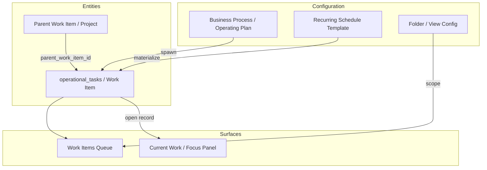

# 4. Domain Model — Work Items V3

**Status:** FROZEN  
**Rule:** Concepts map to **entity · category · metadata · presentation · configuration · relationship · provenance** — not assumed enums.

---

## 4.1 Classification matrix

| Concept | Classification | Storage / source | Notes |
|---------|----------------|------------------|-------|
| **Work Item** | **Entity** | `operational_tasks` row | Operator term; not renamed in DB Phase 1–3 |
| **Follow-up** | **Category** + **presentation** | `metadata.category` | e.g. `follow_up`; icon/copy mapper |
| **Reminder** | **Creation intent** + **presentation** | Draft field / Task Assist intent | May include comms side effect via separate capability |
| **Review** | **Category** + **BP work** | `work_definition_key` + stage template | Often BP-generated |
| **Approval** | **Outcome / action** | Current Work / registered commands | Not a Work Item type |
| **Checklist** | **Configuration** + **relationship** | Stage operating plan field rules | **Authority:** Current Work; WI holds `checklist_ref` only |
| **Compliance** | **Category** + **configuration** | `category` + work definitions | Vertical config, not platform enum |
| **Project** | **Relationship** (parent/child) | `parent_work_item_id` + `shape: project_container` | See §4.3 |
| **Recurring** | **Configuration** + **provenance** | `work_schedule_templates` → generated rows | `metadata.recurrence` binding |
| **BP Work** | **Provenance** + **metadata** | `lifecycle_template`, `department_id`, `lifecycle_stage_key` | Primary row population |
| **Manual Work** | **Provenance** | `source: manual`, sparse metadata | General / Cross-process folder |
| **BOS-generated** | **Provenance** | `source: bos_work_item` or `task_assist` | Same row shape as manual |
| **Module-generated** | **Provenance** | `source: <module_key>` + extension metadata | Must use L2 framework |

---

## 4.2 Core entity: Work Item

### Definition (frozen)

A **Work Item** is an **operational commitment** assigned to an operator (or unassigned) with optional due date, optional record anchor, and extensible metadata — persisted as an `operational_tasks` row.

### Why not a new entity table?

| Alternative | Rejected because |
|-------------|------------------|
| New `work_items` table | Duplicates persistence; breaks BP spawn, Task Assist, Current Work links |
| Task type enum column | Forces taxonomy debates; blocks generic platform |
| Separate task manager product | Violates "one execution platform" goal |

**Implementation implication:** All features extend `operational_tasks` + metadata additively.

---

## 4.3 Parent / child & Projects

### Decision: Parent Work Item (frozen)

Projects are **parent Work Items** with `metadata.shape = "project_container"` and children via `parent_work_item_id`.

| Alternative | Rejected because |
|-------------|------------------|
| Project enum type | Same enum problem |
| Separate `projects` table | Parallel container system |
| Business Process as project | BP is lifecycle, not ad-hoc initiative |
| Saved filter collection only | No progress/rollup semantics |

**Implementation implication:** Phase 2 column or metadata key; Projects folder lists parents; scoped queue for children.

---

## 4.4 Provenance model (frozen)

| `source` / `metadata.provenance` | Meaning |
|----------------------------------|---------|
| `lifecycle_template` | BP stage operating plan spawn |
| `manual` | Operator form/conversation commit |
| `task_assist` | Legacy BOS Task Assist path |
| `bos_work_item` | Unified creation runtime (target) |
| `recurrence` | Schedule template materializer |
| `<module_key>` | Future: processing, comms, etc. |

**Rule:** Provenance is **immutable after commit** (corrections = new row or audit event, not silent rewrite).

---

## 4.5 Ownership model (frozen)

| Role | Field | Semantics |
|------|-------|-----------|
| **Assignee** | `assigned_to_user_id` | Operator responsible for execution |
| **Creator** | `created_by` | Audit; not necessarily assignee |
| **Waiting on** | `metadata.waiting_on` | Blocked on external party; distinct from assignee |

### Waiting state (frozen)

```typescript
type WaitingOnV1 = {
  kind: "person" | "team" | "external" | "record_party";
  label: string;
  entity_ref?: string;
};
```

| Alternative | Rejected because |
|-------------|------------------|
| `status: waiting` enum | Conflates lifecycle with blocking reason |
| Separate `work_item_blocks` table | Over-engineered Phase 1 |
| Infer from Communications | Cross-module inference unreliable |

**Health metric "Waiting":** Count of open items where assignee = me AND `waiting_on` is set.

---

## 4.6 Completion semantics (frozen)

| Action | Behavior |
|--------|----------|
| **Complete** (simple) | `status → completed`; `completed_at` set |
| **Complete with outcome** (BP work) | Delegate to `completeStageWorkWithOutcome` via record context |
| **Dismiss / Cancel** | `status → canceled` |
| **Reschedule** | Update `due_at`; audit |

**Rule:** BP work with configured outcomes SHOULD complete through Current Work path when checklist/outcome effects exist.

| Alternative | Rejected because |
|-------------|------------------|
| Inline outcome picker always in WI detail | Duplicates Current Work; drift risk |
| Auto-complete on comms sent | Silent side effects forbidden |

---

## 4.7 Audit model (frozen)

| Event | Record |
|-------|--------|
| Created | `created_at`, `created_by`, `source`, `proposal_id` |
| Assigned | Patch audit / activity feed |
| Completed / Canceled | Status patch + timestamp |
| BOS propose | Proposal row / thread turn |
| BOS commit | Receipt turn + link to task id |

**Target:** Activity tab in Work Item detail consumes unified audit stream (task patches + related record events).

**Aligns with:** D9 event spine for mutations that change operational truth elsewhere; task row patches for WI-local changes.

---

## 4.8 Checklists (frozen boundary)

| Layer | Owns |
|-------|------|
| Stage operating plan | Checklist item definitions, field rules |
| Current Work | Live checklist state, handoffs, outcomes |
| Work Item | Optional `checklist_ref` pointer; read-only projection in detail tab |

**Forbidden:** Duplicating checklist item storage on `operational_tasks` except ephemeral draft at create time (committed as BP template link, not parallel checklist DB).

---

## 4.9 Recurring Work (frozen)

| Concept | Classification |
|---------|----------------|
| Schedule template | **Configuration** (`work_schedule_templates`) |
| Occurrence instance | **Entity** (`operational_tasks` + `metadata.recurrence`) |
| Missed occurrence | **Audit** + presentation (OVERDUE badge) |

See [05-queue-doctrine.md](./05-queue-doctrine.md) generators + dedicated recurring doc in V3 platform sprint.

---

## 4.10 Manual vs generated (frozen)

All work items share **one row shape**. Distinction is **provenance + metadata**, not separate products.

Operators see the same queue row grammar; breadcrumbs expose BP context when present.

---

## 4.11 Future module-generated work (frozen contract)

Modules MUST NOT invent parallel execution inboxes.

**Approved pattern:**

```
Domain event / operator action
  → module calls createWorkInstance({ provenance, metadata, ... })
  → row appears in Work Items with module breadcrumb
```

**Examples (future):**
- Processing: "Review extracted field" → WI with `source: processing`
- Comms: "Follow up on thread" → WI draft from BOS with comms context seed

---

## 4.12 Domain model diagram


