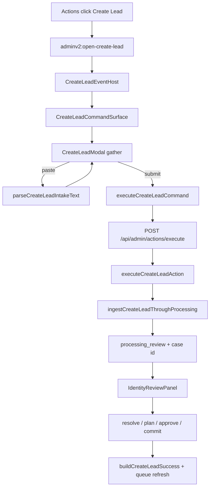
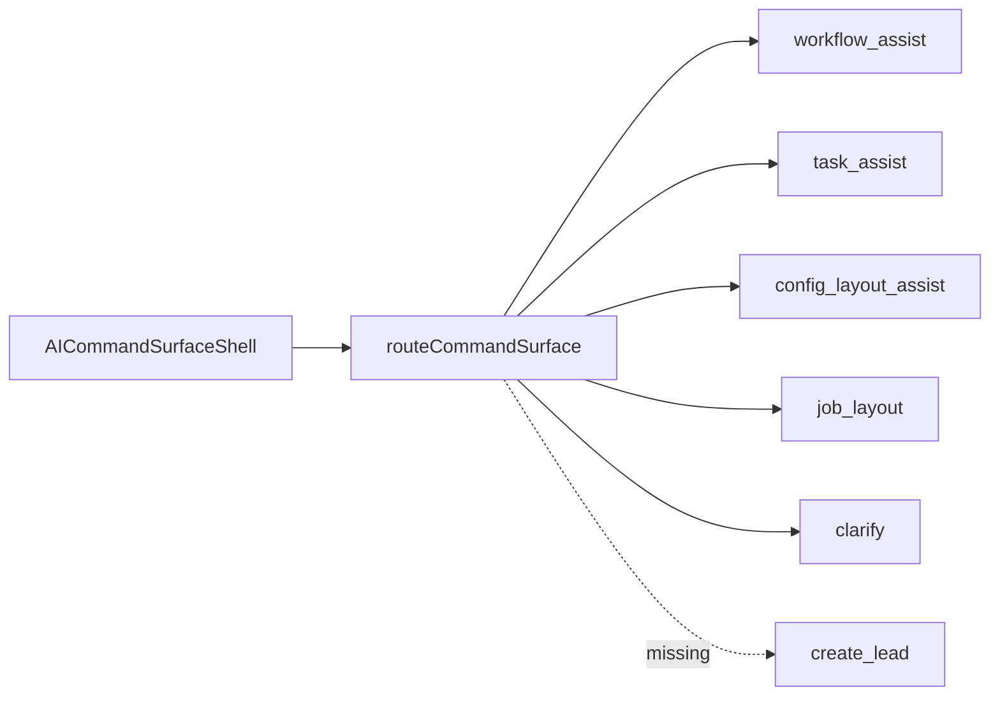

# 01 — Current-State Trace

Code-grounded. Paths relative to repo root. Worktree: `wt2-bos-actionable-interface-plan` @ `origin/staging`.

## Headline findings

1. **Orchestrator cannot create leads.** `routeCommandSurface()` routes only to `workflow_assist | task_assist | config_layout_assist | job_layout | clarify`. No `create_lead` route. `BosCapabilityKey` has no `create_lead`.
2. **“BOS Create Lead” today ≠ conversational Orchestrator.** Paste-parse assist lives *inside* `CreateLeadModal`, wrapped by `ActionWorkspaceBosShell` (visual chrome only).
3. **Command Surface shell/controller is built, tested, and unwired** in production UI (`useCommandSurfaceController`, `CommandSurfaceShell`, `deriveCreateLeadCommandFromBosProposal`). Primary reusable seam.
4. **Create Lead always defers to Processing.** `executeCreateLeadAction` returns `mode: "processing_review"` and never creates person/customer/opportunity at execute time.
5. **`bosProposalSupport` contradicts:** `createLeadAction.bosProposalSupport = true` vs `canonicalActionRegistry` `create_lead.bosProposalSupport = false`.
6. **Canonical command code lives under** `web/lib/platform/commands/**`. `web/lib/adminV2/actions/{createLead,surface}/*` are compatibility shims.

---

## A. BOS

### Entry components

| Component | Path | Role |
|---|---|---|
| `CommandRailBosMount` | `web/app/adminV2/components/CommandRailBosMount.tsx` | Portals BOS into Actions rail or floating overlay |
| `AICommandSurfaceShell` | `web/app/adminV2/components/aiCommandSurface/AICommandSurfaceShell.tsx` | Live Orchestrator chat — **no create_lead card** |
| `AICommandBar` | `web/app/adminV2/components/AICommandBar.tsx` | Dead legacy placeholder (flag hardcoded true) |
| `BosRailPresentation` | `…/aiCommandSurface/bosRail/BosRailPresentation.tsx` | Docked rail chrome |
| `CommandSurfaceThread` | `…/aiCommandSurface/CommandSurfaceThread.tsx` | Transcript turns |
| `ActionWorkspaceBosShell` | `web/components/admin/actions/ActionWorkspaceBosShell.tsx` | BOS-branded modal chrome around Create Lead |

### State ownership

- Orchestrator thread: local React state in `AICommandSurfaceShell` + `sessionStorage` via `commandSurfaceThreadPersistence.ts`.
- Presentation (closed/floating/pinned): `BosPresentationControllerContext`.
- Create Lead gather: local `useState` inside `CreateLeadModal` — **separate** from Orchestrator.

### Parser / proposals

- Paste parser: `parseCreateLeadIntakeText` → `extractFactsFromText` + `mapFactsToActionIntake` (`web/lib/intake/adapt/`).
- Orchestrator NL: slot extract + task/workflow/config parsers → `routeCommandSurface` — no lead route.
- Proposal envelope: `BosProposalEnvelopeV1` + adapters for Task/Workflow/Config/Attention — **no Create Lead adapter**.

### Capability registry

`BOS_CAPABILITY_REGISTRY` (`web/lib/bos/bosCapabilityRegistry.ts`) — 11 capabilities. No `create_lead`. Docs saying “10” are stale.

### Persistence / flags

- Thread: tab `sessionStorage` only (`alloy-adminv2-command-surface-thread`).
- `adminV2AiCommandSurfaceEnabled()` hardcoded `true`.
- Org `metadata.ai_policy` gates assist capabilities; Create Lead itself is RBAC-only (`requireAdminOrOps`).

---

## B. Command runtime

### Registered action

```ts
// web/lib/adminV2/actions/definitions/createLeadAction.ts
actionKey: "create_lead"
confirmationPolicy: "required"
bosProposalSupport: true  // contradicts canonical catalog
requiredContext: { requiresEntityId: false, … }
```

Execute: `POST /api/admin/actions/execute` → `requireAdminOrOps` → `executeCreateLeadAction`.

### Eligibility / required inputs

`buildCreateLeadEligibility` — platform floor `first_name`, `last_name`, `email|phone`; config can add, never remove.

### Command model (reusable, partially unwired)

| Module | Path | Production use |
|---|---|---|
| `deriveCreateLeadCommandState` | `createLeadCommandModel.ts` | Tests + intended BOS |
| `deriveCreateLeadCommandFromBosProposal` | same | Tests only |
| `executeCreateLeadCommand` | `executeCreateLeadCommand.ts` | **Wired** via `CreateLeadCommandSurface` |
| `buildCreateLeadSuccess` | `createLeadSuccess.ts` | **Wired** |
| `useCommandSurfaceController` | `surface/useCommandSurfaceController.ts` | **Unwired** |
| `CommandSurfaceShell` | `components/platform/commands/CommandSurfaceShell.tsx` | **Unwired** |

### Placements today

| Placement | Mechanism |
|---|---|
| Workspace / Work Unit Actions | `applyRegistryResolvedActionClient` → `adminv2:open-create-lead` |
| Host | `CreateLeadEventHost` → `CreateLeadCommandSurface` → `CreateLeadModal` |
| BOS Orchestrator | **None** |

---

## C. Manual Create Lead

`CreateLeadModal` steps: `gather → review → execute → success`.

- Gather fields: `CREATE_LEAD_GATHER_FIELDS` + `resolveCreateLeadActionIntakeSpec`.
- Cascades: `useInquiryChildPlacementCascade` (location/program/room); schedule option set.
- Household: `CreateLeadCommitSelection` multi parent/child.
- Paste → suggestions by confidence; high auto-applied.
- Submit → `executeCreateLeadCommand` → Processing review panel in-modal.
- Success: `buildCreateLeadSuccess`; **no auto-open** of lead (explicit Open Lead); queue refresh via `dispatchOpportunityQueueUpdated`.

Debt: large multi-concern modal; Command Surface swap deferred by design comment in `CreateLeadCommandSurface.tsx`.

---

## D. Processing

Adapter: `ingestCreateLeadThroughProcessing` (`web/lib/pos/processingIdentity/sources/createLeadIntakeAdapter.ts`).

**Case created:** synchronously inside `executeCreateLeadAction`, after minimum validation, **before any identity rows**.

Flow: case → facts → `runCanonicalIdentityResolution` → operator resolutions → immutable plan → approve → execute commit.

Idempotency: SHA-256 of org/actor/selection/identity fields/work_unit → reuse case; commit has separate execution idempotency key.

UI: `IdentityReviewPanel` inline after processing_review response.

---

## E. Configuration

- Gather: platform floor + stage `field_rules` with `record_creation` timing.
- Options: placement_select + option_set_key.
- Placements: canonical catalog `allowedPlacements` (config plane) vs executable `RegisteredAction` (code plane).
- AI policy: not applied to Create Lead today (not a BOS capability).

---

## F. Tests (representative)

- BOS: `web/tests/bos/*`, `web/tests/adminV2/commandSurface*`
- Create Lead action/model: `web/tests/adminV2/actions/createLead*`, `commandSurface*`
- Modal/intake: `web/tests/admin/actions/createLead*`
- Processing: `web/tests/processing/processingIdentity*`, `web/tests/pos/*`
- E2E: Playwright `bos-*.spec.ts`; **no** Playwright Create Lead → Processing commit path

---

## Current-state flow (actual)



## Orchestrator gap



## Doc vs code contradictions

| Claim | Reality |
|---|---|
| Docs: BOS renders CommandSurfaceShell for Create Lead | Shell/controller unwired; modal is live UI |
| Archive docs: executeCreateLead creates person/opportunity | Always Processing review first |
| bos-foundation: 10 capabilities | 11 in registry |
| createLeadAction bosProposalSupport true | canonical catalog false |
| “BOS Create Lead” naming | Modal paste-assist ≠ Orchestrator capability |

## Reusable seams (do not rebuild)

1. `executeCreateLeadCommand` + registered `create_lead`
2. `createLeadCommandModel` + eligibility/preview/success
3. `parseCreateLeadIntakeText` + ActionIntakeSpec
4. `ingestCreateLeadThroughProcessing` + identity plan/approve/execute APIs
5. `CommandSurfaceShell` + `useCommandSurfaceController` (wire them)
6. `CreateLeadOperationalIntake` field/household UI pieces
7. BOS presentation controller + rail mount
8. `dispatchOpportunityQueueUpdated` / Focus Panel open helpers
