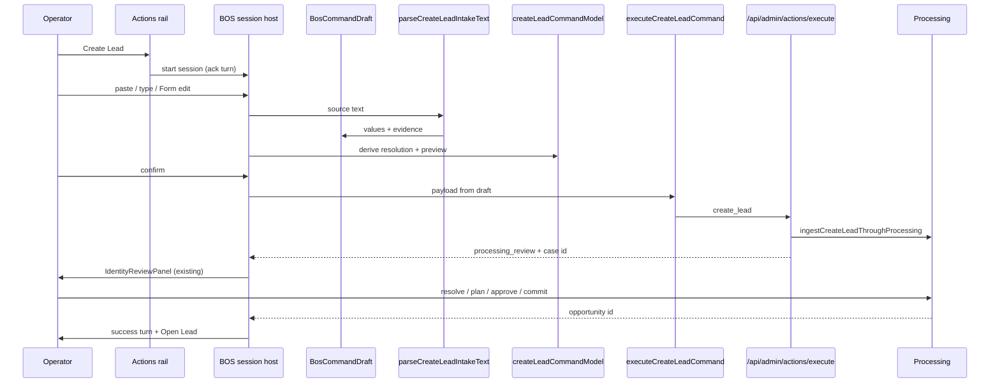

# 05 — Create Lead Reference Flow (V1)

## Goal

Actions → Create Lead opens BOS command session with Conversation | Form, converging on the existing registered `create_lead` path and Processing identity gate.

## Target flow

## Step detail

### 1. Invoke

- `applyRegistryResolvedActionClient` (or successor) calls `startBosCommandSession({ actionKey: "create_lead", … })` instead of only dispatching modal event.
- Compatibility: during migration, event may still open session host; modal primary path removed in Phase 5.
- Immediate ack: “Create Lead. You can describe the inquiry or use Form.”

### 2. Gather (Conversation)

- Operator pastes email/note or types.
- `parseCreateLeadIntakeText` against live `ActionIntakeSpec`.
- Map onto same field keys as Form (`CREATE_LEAD_GATHER_FIELDS` / spec).
- Preserve `unmapped_text` and extra facts in draft/notes.
- Resolve options via same cascade sources (`useInquiryChildPlacementCascade` / option sets) — parity test already exists.
- Ask **only** for `missing_required` (and critical ambiguity). Optional gaps summarized, not interrogated.

### 3. Gather (Form)

- Same draft.
- Reuse `CreateLeadOperationalIntake` field/household editors inside BOS Form region.
- Evidence chips on fields.

### 4. Preview

- `deriveCreateLeadCommandState` / preview builders.
- Side-effect copy must state Processing review precedes record creation.

### 5. Confirm → Execute

- Fingerprint check (draft + preview).
- `executeCreateLeadCommand` with `surface: "bos"` / entryPoint `"bos"`.
- Server RBAC + minimum validation + config binding.

### 6. Processing review

- Unchanged `IdentityReviewPanel` flow hosted in BOS session body (or focused panel region) when `processingCaseId` set.
- No identity writes until commit.

### 7. Success

- `buildCreateLeadSuccess` after commit path returns opportunity id.
- Queue refresh.
- No auto-open.
- Session phase `completed`.

## Field model (unchanged authority)

Platform floor + config `record_creation` requirements. Conversation cannot invent fields outside intake spec. Extra narrative → notes / unmapped preservation.

## Entry points converging

| Entry | V1 behavior |
|---|---|
| Workspace Actions | BOS session |
| Work Unit Actions | BOS session + work_unit context |
| BOS slash `/create lead` | H2 — same factory |
| Briefing CTA | H3 — same factory |
| Legacy modal | Compatibility only until Phase 5 cleanup |

## What V1 must not change

- Processing approval/commit authority
- Platform minimum validation
- Success no-auto-open
- Queue refresh event semantics
- Field-source parity for location/program/room
