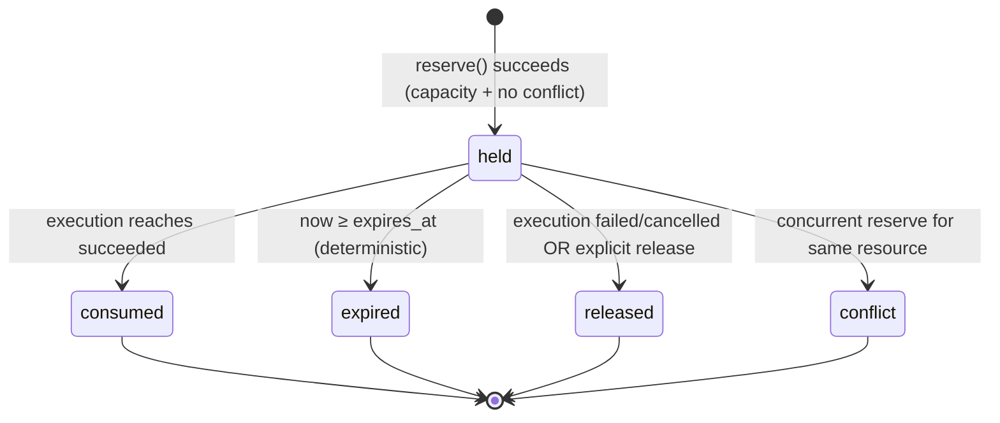
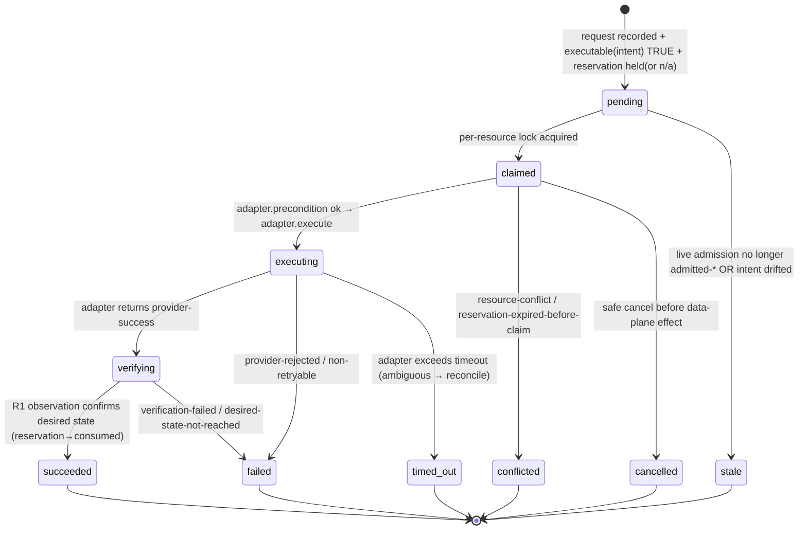

# Runtime Actuation V1 (R3) — Implementation Plan

> **Status:** PLAN — awaiting explicit authorization. No implementation has begun.
> **Sprint:** `runtime-actuator-r3` · slot 6 · branch `agent/claude/6-runtime-actuator-r3` · base `c6836c595`
> **Scope of this document:** architecture discovery + design for the Runtime Actuator. This is a
> sprint execution doc (`docs/sprints/active/…`), **not** canonical doctrine. The authoritative
> invariants remain owned by `scripts/local-dev/RUNTIME-REGISTRY-INSPECTION.md` (R0/R1),
> `scripts/local-dev/RUNTIME-INTENT-ADMISSION.md` (R2), and `scripts/local-dev/SHARED-READ-CORE.md`
> (read-core constitution). This plan **cites** them; it does not restate or relocate them.

## 0. Thesis

`observe → declare → actuate`. R0/R1 **observe**; R2 **declares** a deterministic admission decision
that *reserves nothing*. R3 is the first phase that **actuates**: it realizes an *already-admitted*
Runtime Intent against the data plane, observes the result, and reports authoritative **execution**
state. It owns execution, not policy.

The one hard architectural fact that shapes everything below, **proven from R2 code**:

> There is **no persisted "admission" artifact.** Admission is ephemeral and always recomputed live
> (`lib/admission-core.sh:353-354`; `RUNTIME-INTENT-ADMISSION.md:182-189, 244`). The only persisted
> artifact is the **intent record** (`intents/<worktree>.env`), and the decision it stores
> (`ALLOY_INTENT_DECISION_AT_DECL`, `alloy-runtime-intent:186`) is explicitly a *declaration-time
> snapshot*, **not** an execution authorization.

Therefore R3's execution authority is **not** a file it reads and trusts. It is a **live predicate**:

```
executable(intent) ⇔
      intent record exists for the target worktree                (persisted, identity-checked)
  ∧   live alloy_ad_evaluate(current posture, current capacity) ∈ { admitted-* }   (R2 owns this)
  ∧   intent is NOT stale vs current posture                      (R2 staleness check)
```

R3 computes this predicate by **calling the R2 owner** (`admission-core.sh`), never by re-deriving
posture, isolation class, capacity, admission, or reason codes. If the predicate is false, R3 returns a
typed `blocked` / `not-admitted` / `stale` result and actuates nothing.

---

## A. Current-state map (file:line evidence)

### A.1 R0 — Runtime Registry (observe)
| Concern | Location |
|---|---|
| Registry read interpretation (single owner) | `scripts/local-dev/lib/runtime-core.sh:1-19` |
| Docker read — field-restricted `ps`/`stats` only, secrets physically unreachable | `runtime-core.sh:52-88`, `:331-333` |
| Registry records (parsed, never sourced) at `<root>/runtimes/<ns>.env` | `runtime-core.sh:118-135`; schema in `RUNTIME-REGISTRY-INSPECTION.md:28-49` |
| Reconciliation categories `registered`/`discovered`/`orphaned` | `runtime-core.sh:242-254`; `RUNTIME-REGISTRY-INSPECTION.md:51-54` |
| Capacity observation (`active` count, max) | `runtime-core.sh:347-357`; `alloy_rt_active_runtime_count` |
| The only R0 mutation (writes one registry file; never touches containers) | `scripts/local-dev/alloy-runtime-register:1-125` |

### A.2 R1 — Runtime Inspection (observe)
| Concern | Location |
|---|---|
| Per-namespace observed fields (`container_state`, `health`, ports, mem/cpu) | `runtime-core.sh:269-329` |
| Read-only inspection adapter over the read core | `scripts/local-dev/lib/ro.sh:1-66` |
| `alloy-ro runtime-*` verbs (list/status/capacity/discover/containers) | `RUNTIME-REGISTRY-INSPECTION.md:80-90` |
| Read-only constitution (`ro-capabilities.json`) — all mutation flags false | referenced `RUNTIME-INTENT-ADMISSION.md:264-267` |

### A.3 R2 — Runtime Intent & Admission (declare) — **the authoritative input**
| Concern | Location |
|---|---|
| Isolation resolver (one owner; unsupported → `invalid`, fail closed) | `lib/admission-core.sh:131-143`; table `RUNTIME-INTENT-ADMISSION.md:62-71` |
| Admission evaluator (pure fn of posture + observed capacity) | `admission-core.sh:230-349`; algorithm `RUNTIME-INTENT-ADMISSION.md:86-106` |
| Decisions + reason codes | `RUNTIME-INTENT-ADMISSION.md:142-157` |
| `allowed_next_actions` — declarative tokens for a future Director; **R2 executes none** | `admission-core.sh:209-222`; `RUNTIME-INTENT-ADMISSION.md:159-164` |
| Capacity semantics **1–8** (6 = over-budget grants nothing; 8 = reserves nothing) | `RUNTIME-INTENT-ADMISSION.md:108-122` |
| Shared-compat semantics **9–12** (9 = certified never shares; 11 = unknown ≠ capacity; 12 = no fallback) | `RUNTIME-INTENT-ADMISSION.md:124-140` |
| Intent record (persisted, immutable, parsed-never-sourced) | `admission-core.sh:356-371`; `alloy-runtime-intent:174-192` |
| **Decision stored is a declaration-time snapshot, not authority** | `alloy-runtime-intent:186` (`ALLOY_INTENT_DECISION_AT_DECL`) |
| Admission is ephemeral / recomputed live / reserves nothing | `admission-core.sh:353-354`; `RUNTIME-INTENT-ADMISSION.md:182-189, 243-244` |
| Identity safety of the mutating writer (never slot-only; mission/branch/manifest must match) | `alloy-runtime-intent:82-127`; `RUNTIME-INTENT-ADMISSION.md:200-217` |

### A.4 Director — orchestration layer (out-of-repo)
- **No Director code exists in-repo.** The only "provision/attach/lease/reclaim" strings are declarative
  `allowed_next_actions` tokens (`admission-core.sh:209-222`). Every reference marks Director as *future*:
  `RUNTIME-INTENT-ADMISSION.md:32, 144, 238-239`; `runtime-core.sh:6`; `RUNTIME-REGISTRY-INSPECTION.md:21, 124`.
- Governance is emphatic the toolkit is **not** Director / Company OS / mission orchestration:
  `docs/platform/governance/managed-sprint-operations.md:182`.
- A **real Director process runs out-of-repo**, maintaining a live control-plane state tree at
  `~/.local/state/alloy-dev/director/alloy-director-local-control-plane-v1/` (`events.jsonl`, per-task
  `launch.json`/`session.json`, `notifications.json`) that **no in-repo code references**. R3 must never
  read or write that tree.

### A.5 Toolkit process/runtime lifecycle (the existing actuation surface)
| Concern | Existing owner | Evidence |
|---|---|---|
| Dev **server** start/stop/status | `alloy-dev-start` / `alloy-dev-stop` / `alloy-dev-status` | nohup + `pids/<name>.pid`; ownership-gated SIGTERM, **never auto-SIGKILL** (`alloy-dev-stop:43-73`) |
| **Provider** launch/stop | `alloy_open_tool_for_agent` (`agent.sh:396`) / `alloy_stop_owned_provider` (`sprint-ops.sh:197-244`) | ownership proof required before kill |
| **Browser** lifecycle | `lib/verify.sh:592-682` | `browser-pids/slot<N>.*`; refuses without meta |
| Pause / resume / finish (composes the three owners) | `lib/sprint-ops.sh:619, 653, 1032` | stops **registry-owned only** |
| Reconcile / stale-PID cleanup | `alloy_worker_doctor_one` (`sprint-ops.sh:846-969`) | `--recover` = safe fixes only |
| Resource caps / memory gate | `sprint-ops.sh:246-420`; `alloy-config.example:105-118` | refuse/defer, never auto-kill |
| **Supabase/Docker provision / teardown** | **NO OWNER — does not exist anywhere** | confirmed by grep; `alloy-config.example:111-115` (`ALLOY_MAX_ACTIVE_RUNTIMES` observational only) |

**This is the crux:** the toolkit already owns all *process-level* lifecycle with one consistent
ownership-proven, SIGTERM-only pattern. The one lifecycle concern with **no** owner is
**Supabase/Docker runtime-stack provision/teardown** — the net-new surface R3 introduces.

### A.6 Reusable primitives (compose, do not re-implement)
| Primitive | Location |
|---|---|
| Atomic KV record write (`mktemp`+`mv`) | `lib/common.sh:250-263` (`alloy_write_kv_file`) |
| Safe KV parse (refuses shell-active values) | `lib/read-core.sh:194-200` (`alloy_rc_meta_get`) + `:94-101` (`alloy_rc_is_safe_value`) |
| JSON emit helpers | `read-core.sh:349-359` (`alloy_rc_json_kv[_raw]`, `_escape`) |
| Immutable-record + supersede-archive doctrine | `alloy-runtime-intent:158-192`; `alloy-runtime-register:84-114` |
| Ordered append event log (`{at,event,detail}`) | `lib/manifest.sh:49-53` → `manifest-io.mjs:311-323` |
| Directory `mkdir` lock + PID-staleness (macOS-safe, survives restart) | `lib/lock.sh:5-86` |
| PID liveness / ownership | `common.sh:445-449` (`alloy_pid_alive`), `:456-484` (`alloy_pid_belongs_to_worktree`) |
| ISO timestamp + reproducible override | `common.sh:37-39`; `admission-core.sh:63-66` (`ALLOY_AD_EVAL_NOW`) |
| Runtime-root subdir derivation (single root `$HOME/.local/state/alloy-dev`) | `common.sh:48-67`; `read-core.sh:44-45` |
| Redaction-by-construction (never read secret-bearing fields) | `runtime-core.sh:9-16`; env denylist `verify.sh:195-222` |

### A.7 Tests & certification harness
- Runtime suites use the inline `ok()`/`bad()` JSON-assert style, generate docker fixtures inline via
  `ALLOY_RT_PS_FIXTURE`, pin time with `ALLOY_AD_EVAL_NOW`, and carry mandatory **no-mutation**,
  **read-only-tree**, and **redaction** proofs (`tests/test-runtime-admission.sh:221-252`).
- Reference concurrency test: lock contention (`tests/run-phase1-tests.sh:190-223`). Reference
  idempotency/staleness test: intent staleness (`tests/test-runtime-admission.sh:286-292`).
- Registration is a **hardcoded list** in `tests/run-phase4-tests.sh` (syntax-check loop `:154-187`;
  suite invocations near the runtime block `:367-380`). Wiring R3 = 2 edits there. No auto-discovery.

### A.8 Docs ownership
- R0/R1/R2 doctrine lives in `scripts/local-dev/*.md` (**not** `docs/`). The numbered semantics 1–12 are
  defined in `RUNTIME-INTENT-ADMISSION.md:108-140`; code cites 6/9/11/12.
- The unrelated product OS lives under `docs/platform/runtime/*` — **R3 must not land there.**
- "one owner per concern" law: `docs/platform/foundation/os-runtime-map.md:29`;
  `docs/platform/foundation/platform-decisions.md:130`; toolkit form "one owner, one truth, many
  interfaces" (`RUNTIME-REGISTRY-INSPECTION.md:10`, `RUNTIME-INTENT-ADMISSION.md:18`).
- **"Reservation" is unclaimed positive vocabulary** — it appears only negatively today
  (`admission_reserves_capacity:false`, `ro-capabilities.json:90`). R3 defines it.

---

## B. Ownership table (one owner per concern — stop if any has two)

| # | Concern | Single owner | Phase | R3 relationship |
|---|---|---|---|---|
| 1 | Resource identity (registry, namespace) | `lib/runtime-core.sh` registry | R0 | **consume** (register post-provision via R0 schema) |
| 2 | Observed resource state (container_state/health) | `lib/runtime-core.sh` / `alloy-ro` | R1 | **consume** (verification reads this) |
| 3 | Desired resource state (posture → isolation) | `lib/admission-core.sh` resolver + intent record | R2 | **consume** (never re-derive) |
| 4 | **Policy** (posture/capacity/compat rules) | `lib/admission-core.sh` | R2 | **consume, never duplicate** |
| 5 | Admission decision | `lib/admission-core.sh` (`alloy_ad_evaluate`, live) | R2 | **consume** (call it; gate on result) |
| 6 | Reservation (capacity claim + TTL + conflict) | **`lib/actuation-core.sh`** | **R3 (new)** | **own** |
| 7 | Execution dispatch | **`lib/actuation-core.sh`** + `alloy-runtime-actuate` | **R3 (new)** | **own** |
| 8 | Provider actuation (the data-plane op) | **adapter** (`lib/actuation-adapter-*.sh`) | **R3 (new, data plane)** | **own** |
| 9 | Execution lifecycle / records | **`lib/actuation-core.sh`** (`executions/*.env`) | **R3 (new)** | **own** |
| 10 | Verification *judgement* (did desired state reach?) | **`lib/actuation-core.sh`** | **R3 (new)** | **own** — reads R1 observation (concern #2), decides pass/fail |
| 11 | Retry **orchestration** | Director (out-of-repo) | future | **out of scope** — R3 only *classifies* retryable |
| 12 | Operator approval | Director / operator | future | **out of scope** |
| 13 | Audit trail (execution) | **`lib/actuation-core.sh`** (reusing `alloy_write_kv_file` + append log) | **R3 (new records; reused primitives)** | **own** |
| 14 | Secrets | nobody persists them (adapter subprocess env only) | platform | **redaction-by-construction** |
| 15 | Reconciliation (discovery↔registry) | `lib/runtime-core.sh` (`registered/discovered/orphaned`) | R0/R1 | **consume**; R3 adds execution/reservation reconcile as its own concern |

No concern has two owners. The two subtle boundaries, made explicit:
- **Verification (#10) vs observation (#2):** R1 *observes* container state; R3 *judges* whether the
  observed state satisfies the admitted desired state. Distinct concerns; R3 never adds a second
  observation path — it calls `alloy_rt_ns_field`.
- **Reservation (#6) vs admission (#5):** R2 answers *"is this admissible?"* ignoring reservations (it
  reserves nothing, by doctrine). R3 answers *"can I claim a concrete capacity unit now without
  oversubscription?"* — a new execution-plane concern R2 explicitly disclaims
  (`RUNTIME-INTENT-ADMISSION.md:243`). R3 never changes R2's admission math.

---

## C. Proposed contract

All records are `.env` KV files, **written atomically** (`alloy_write_kv_file`) and **parsed, never
sourced** (`alloy_rc_meta_get`), under the single runtime root. New subdirectories:

```
<runtime-root>/reservations/<reservation-id>.env      # R3 reservation records
<runtime-root>/executions/<execution-id>.env          # R3 execution records (immutable head)
<runtime-root>/executions/<execution-id>.log          # R3 append-only attempt/event log
<runtime-root>/locks/runtime-actuation/<namespace>.lock   # per-resource claim lock (mkdir + PID)
```

### C.1 Canonical actuation request (input to `alloy-runtime-actuate`)
Not a file the caller hands us; assembled and identity-checked by R3 from trusted sources:
```
worktree            (NAME — a bare slot number is refused, per alloy-runtime-intent:82-85)
mission_key         (must equal manifest-derived mission — admission-core.sh:115-124)
operation           ∈ { provision, attach, detach, retire, reconcile }   (V1 set — §G)
--expect-branch / --expect-path   (optional; fail closed on drift)
--reservation-ttl <seconds>       (optional; default from config)
--adapter <supabase|fixture>      (default supabase; fixture only under test root)
```

### C.2 Admitted-intent reference (execution authority — computed, not stored)
```
intent_ref = {
  worktree, mission_key,
  intent_record_path,                 # intents/<worktree>.env must exist
  isolation_class,                    # from intent + live resolver (must agree)
  live_decision,                      # alloy_ad_evaluate(...) NOW — must be admitted-*
  live_reason_code,
  allowed_next_actions,               # authorizes which operation may run
  stale: bool                         # posture drift vs recorded intent → refuse
}
```
The **authorized operation** is derived from `live_decision`:

| live_decision | authorized operations | provisions? | reserves capacity |
|---|---|---|---|
| `admitted-none` | (none — proceed-without-runtime) | no | 0 |
| `admitted-shared-existing` | `attach` (to `shared_candidate`) | no | 0 |
| `admitted-shared-new` | `provision` → `attach` | yes | 1 |
| `admitted-dedicated` | `provision` → `attach` | yes | 1 |
| any `refused-*` | (none) → typed `intent-not-admitted` | no | — |

An operation the live decision does not authorize is refused (`unsupported-operation` /
`intent-not-admitted`) — R3 never substitutes a target or broadens scope.

### C.3 Reservation record
```
ALLOY_RESV_SCHEMA_VERSION=1
ALLOY_RESV_ID=<reservation-id>            # deterministic (see C.8), NOT a timestamp
ALLOY_RESV_MISSION_KEY, ALLOY_RESV_WORKTREE
ALLOY_RESV_ISOLATION_CLASS
ALLOY_RESV_TARGET_NAMESPACE               # existing (shared) or minted (new/dedicated), never caller-free-form
ALLOY_RESV_CAPACITY_UNITS=<0|1>           # from the decision table (C.2)
ALLOY_RESV_STATE=held|consumed|expired|released|conflict
ALLOY_RESV_CREATED_AT, ALLOY_RESV_EXPIRES_AT   # expiry = created + ttl (pinnable via *_EVAL_NOW)
ALLOY_RESV_ADMISSION_FINGERPRINT          # hash of the live decision inputs it was granted against
ALLOY_RESV_EXECUTION_ID                    # back-reference once claimed
```

### C.4 Execution record (immutable head)
```
ALLOY_EXEC_SCHEMA_VERSION=1
ALLOY_EXEC_ID=<execution-id>              # deterministic (C.8), NOT a timestamp
ALLOY_EXEC_MISSION_KEY, ALLOY_EXEC_WORKTREE, ALLOY_EXEC_ISOLATION_CLASS
ALLOY_EXEC_OPERATION
ALLOY_EXEC_TARGET_NAMESPACE
ALLOY_EXEC_RESERVATION_ID
ALLOY_EXEC_INITIATED_BY                   # provenance label (default $USER); Director passes its id
ALLOY_EXEC_ADAPTER                        # supabase | fixture
ALLOY_EXEC_ADMISSION_DECISION_AT_DISPATCH # snapshot for audit (like INTENT_DECISION_AT_DECL)
ALLOY_EXEC_STATE=<state machine, §D>
ALLOY_EXEC_RESULT_CODE                    # failure taxonomy slug or 'ok'
ALLOY_EXEC_RETRYABLE=true|false
ALLOY_EXEC_DESIRED_STATE_REACHED=true|false|unknown
ALLOY_EXEC_STARTED_AT, ALLOY_EXEC_ENDED_AT
ALLOY_EXEC_ATTEMPT_COUNT
```

### C.5 Execution attempt / event log (append-only)
One JSON-ish `{at, attempt, phase, event, detail}` line per transition (reusing the `history[]` append
pattern). Records: preconditions checked, adapter invoked, provider result class, verification result,
lock acquire/release, reservation consume/expire. **Never** provider stdout/stderr verbatim, secrets,
tokens, env dumps, or full command output.

### C.6 Adapter interface (provider-neutral; one reference + one fixture)
Every adapter (a sourced `lib/actuation-adapter-<provider>.sh`) MUST expose:
```
adapter_supported_resource_type()                 -> e.g. "supabase-namespace"
adapter_supported_operations()                    -> subset of { provision attach detach retire health-probe }
adapter_required_context(op)                       -> named inputs it needs (validated by core)
adapter_precondition(op, ctx)                      -> 0 ok | typed-precondition-failure
adapter_execute(op, ctx)                           -> emits typed result; bounded by timeout
adapter_idempotency(op)                            -> "safe-repeat" | "guarded" (core enforces dedup either way)
adapter_timeout_seconds(op)                        -> integer
adapter_classify_error(raw_status)                 -> failure-taxonomy slug + retryable
adapter_verify(op, ctx)                            -> reads R1 observation; desired-state-reached bool
adapter_cancel(op, ctx)                            -> "unsupported" | best-effort-safe   (V1: unsupported)
```
**Hard rule — no arbitrary command channel:** the adapter holds a fixed, code-owned **allowlist of argv
arrays** (e.g. `("supabase" "start" "--workdir" "$validated_path")`). The namespace and workdir are
validated against registry/worktree identity before use. The intent/reservation/execution records
**never** contain executable shell text; there is no `run` primitive and no caller-supplied command.

### C.7 Execution result / failure taxonomy (typed — never one generic string)
Reservation: `reservation-conflict` · `reservation-capacity-exhausted` · `reservation-expired`.
Execution: `invalid-execution-request` · `intent-not-admitted` · `stale-admission` · `target-not-found`
· `unsupported-operation` · `resource-conflict` · `execution-already-in-progress` · `provider-unavailable`
· `provider-rejected` · `timeout` · `ambiguous-provider-result` · `verification-failed` ·
`desired-state-not-reached` · `non-retryable-invariant-violation` · `internal-execution-failure`.
Each carries `retryable: true|false`. `ambiguous-provider-result` and `timeout` are **never** auto-resolved
to success — they route to reconciliation.

### C.8 Idempotency identity
```
execution-id   = short-hash( mission_key · worktree · isolation_class · operation ·
                             target_namespace · admission_fingerprint )
reservation-id = short-hash( mission_key · worktree · isolation_class · target_namespace )
admission_fingerprint = short-hash( isolation_class · decision · reason_code · capacity_required )
```
No timestamps in identity (mission requirement; mirrors doctrine that time is provenance not decision).
Consequences: same admitted intent delivered twice → same `execution-id` →
- terminal `succeeded` head exists → **reuse it** (return the recorded result; no re-execution);
- non-terminal head exists + live claim lock held → `execution-already-in-progress`;
- non-terminal head exists + **stale** lock (dead PID) → reconcile (verify actual state), never assume success.

### C.9 Concurrency boundary
Per-**resource** serialization via a `mkdir` claim lock at `locks/runtime-actuation/<namespace>.lock`
with an `owner.env` holding PID + started-at (reuses the `lock.sh:49-86` pattern). Filesystem + PID
liveness → **survives process restart** (mission requirement: no in-memory-only locks). V1 **serializes
per resource and fails closed** rather than queuing: a second actuation on a held resource returns
`resource-conflict` (retryable), leaving Director to sequence.

### C.10 Retry classification (not orchestration)
R3 sets `retryable` on every terminal failure and stops. It runs **no** retry loop, backoff, or
scheduler — that is Director's (concern #11). Retryable ⇒ Director may re-dispatch the same admitted
intent (same `execution-id`; idempotency applies).

---

## D. State machines (only states the architecture justifies)

### D.1 Reservation lifecycle

Terminal: `consumed`, `expired`, `released`, `conflict`. `held` is the only non-terminal state.

### D.2 Execution lifecycle

Terminal: `succeeded`, `failed`, `timed_out`, `conflicted`, `cancelled`, `stale`.

**States beyond the mission's suggested set, each justified:**
- `stale` — required typed result: R3 must return "admission no longer holds / intent drifted" without
  making a new policy decision (mission §1). Not collapsible into `failed` (it is not an execution
  failure; it is loss of authority).
- The mission's `executing` maps to the data-plane operation phase; `provisioning`/`attaching` are
  **sub-phases** recorded in the event log, not separate head states, to keep the machine minimal.

**Fail-closed invariants:** an execution interrupted in `claimed`/`executing`/`verifying` is **never**
auto-promoted to `succeeded`. Reconciliation must re-derive actual state from R1 observation; if it
cannot, the terminal is `timed_out` (retryable) with `desired_state_reached=unknown`.

---

## E. Sequence diagrams

### E.1 Happy path (admitted-dedicated → provision → attach)
```mermaid
sequenceDiagram
    participant D as Director (out-of-repo)
    participant A as alloy-runtime-actuate (R3)
    participant AD as admission-core (R2)
    participant RV as reservation (R3)
    participant AX as adapter (data plane)
    participant RT as runtime-core (R1 observe)
    D->>A: actuate provision <worktree> --mission k
    A->>AD: alloy_ad_evaluate(live) + intent exists + not stale
    AD-->>A: admitted-dedicated (authorizes provision→attach)
    A->>RV: reserve(1 unit, ttl)  [effective capacity check]
    RV-->>A: held (reservation-id)
    A->>A: acquire per-resource lock; state pending→claimed→executing
    A->>AX: provision(namespace, validated workdir)  [allowlisted argv]
    AX-->>A: provider-success
    A->>RT: verify: container_state active & health healthy?
    RT-->>A: active/healthy
    A->>AX: attach(worktree→namespace); register runtime (R0 schema)
    A->>RV: consume reservation
    A-->>D: succeeded (execution-id, desired_state_reached=true)
```

### E.2 Duplicate delivery — same admitted intent twice
```
2nd delivery → same execution-id →
   terminal succeeded head exists → RETURN recorded result (no re-execution)   [terminal-result reuse]
   non-terminal head + live lock  → execution-already-in-progress (retryable)
```

### E.3 Stale admission
```
actuate → alloy_ad_evaluate(live) ∈ refused-*  OR intent stale=true
       → state pending→stale ; result-code intent-not-admitted / stale-admission
       → NO reservation, NO adapter call ; Director must re-declare
```

### E.4 Concurrent intents on one resource
```
intent X holds locks/runtime-actuation/<ns>.lock
intent Y (different mission) → same <ns> → lock busy (live PID) → conflicted / resource-conflict (retryable)
   (V1 fails closed: serialize per resource, never oversubscribe)
```

### E.5 Provider timeout with ambiguous outcome
```
adapter.execute exceeds adapter_timeout_seconds → state executing→timed_out
   result ambiguous-provider-result ; desired_state_reached=unknown ; retryable=true
   → reconcile reads R1 observation to establish actual state; success is NEVER assumed
   → reservation stays held until reconcile/expiry (no capacity leak, no false consume)
```

### E.6 Provider success but verification failure
```
adapter returns success → verify via R1 → container_state != active / health != healthy
   → state verifying→failed ; result verification-failed / desired-state-not-reached
   → reservation released ; runtime NOT registered as healthy-owned
```

### E.7 Director retry after an ambiguous timeout
```
Director re-dispatches same admitted intent → same execution-id
   prior head = timed_out (retryable) + no live lock
   → reconcile first: if R1 now shows desired state → mark succeeded (adopt), else new attempt
   idempotent: no double-provision (namespace already present ⇒ adapter provision is safe-repeat/guarded)
```

### E.8 Process restart during execution
```
crash while state=executing, lock owner PID dead
   next actuation/doctor: lock is STALE (PID not alive) → reclaim lock
   head is non-terminal → reconcile via R1 observation:
       observed desired state → succeeded (adopt) ; else → timed_out/failed (retryable), reservation released/expired
   never auto-succeed; filesystem lock + PID liveness make authority survive restart
```

---

## F. Threat & authority analysis

| Threat | Mitigation |
|---|---|
| **Arbitrary command injection** | No `run`/generic-command primitive. Adapter holds fixed allowlisted argv arrays; namespace/workdir validated against registry+worktree identity; records never carry shell text; values pass `alloy_rc_is_safe_value`. |
| **Target substitution** | Target namespace derived from the admitted decision (`shared_candidate`) or deterministically minted from verified mission/worktree identity — never caller-free-form. Identity safety mirrors `alloy-runtime-intent:82-127` (slot-only refused; mission/branch/manifest must match). |
| **Replay** | Deterministic `execution-id` (no timestamp); terminal-result reuse; in-progress dedup; reservation-id dedup. |
| **Cross-resource escalation** | Per-resource lock + least-authority adapter context (only the one validated namespace/workdir). No repo-wide or host-wide authority granted. |
| **Stale authorization** | Live `alloy_ad_evaluate` at dispatch + intent staleness check; expired reservations refused; `stale` terminal. |
| **Secret leakage** | Redaction-by-construction (never read `.Env`/`.Command`, per `runtime-core.sh:9-16`); provisioning creds injected into adapter subprocess env only (mirrors `alloy-dev-start` trusted-env), never persisted; event log stores result *classes*, not provider output; env denylist (`verify.sh:195-222`) applied to any captured text. |
| **Forged execution result** | Provider-success is not trusted as truth — `succeeded` requires independent R1 observation (verification). |
| **Audit tampering** | Immutable head + supersede-archive doctrine (`alloy-runtime-intent:158-192`); append-only event log; atomic `mktemp`+`mv` writes. |
| **Provider spoofing** | Adapter is code-owned and selected by a validated `--adapter` enum; fixture adapter only permitted under a fixture/cert runtime root (`alloy_runtime_is_fixture`). |
| **Uncontrolled retry storms** | R3 runs no retry loop; only classifies retryable. Per-resource lock + reservation caps prevent concurrent oversubscription; Director owns backoff. |

---

## G. V1 scope (narrowest end-to-end vertical slice)

**Resource type (V1):** Supabase runtime namespace — the *only* provider R0/R1 recognize
(`RUNTIME-REGISTRY-INSPECTION.md:116`). No second provider.

**Operations (V1)** — derived from R2 `allowed_next_actions`, **not** the generic
start/stop/restart/pause/resume list:
`provision` · `attach` · `detach` · `retire` · `reconcile` (+ internal `health-probe`/`verify`).
The generic pause/resume/restart verbs are **explicitly deferred** — they are not implied by any current
admission next-action, so V1 does not authorize them (mission §4: "Do not assume these exact operations
are all authorized").

**Control plane — fully implemented and real in V1:** reservation (+ conflict + expiry), execution
records + state machine, idempotency (execution-id, terminal reuse, dedup), per-resource locking +
restart reconciliation, verification-via-observe, full failure taxonomy, audit trail, fail-closed
everywhere.

**Data plane — two adapters:**
1. **Fixture adapter** (`lib/actuation-adapter-fixture.sh`) — scripted results injected via env (mirrors
   `ALLOY_RT_PS_FIXTURE`). This is how **all nine demonstrations run hermetically** in CI. Permitted only
   under a fixture/cert runtime root.
2. **Supabase adapter** (`lib/actuation-adapter-supabase.sh`) — the real, allowlisted, bounded argv
   adapter. Implemented so the architecture is genuinely wired to reality, but **its live execution
   against real infrastructure is gated behind explicit operator opt-in and is not exercised by the
   automated suite.** (Recommendation: land the interface + fixture + Supabase adapter code; do not run
   the Supabase adapter against real Docker in this sprint's tests.)

Rationale: this makes the **control plane 100% real and fully tested**, proves the full
admission→reservation→provision→attach→verify vertical end-to-end via the fixture adapter, and satisfies
"do not implement every possible runtime provider" and "prefer the narrowest slice."

---

## H. Explicit non-goals

- No arbitrary shell execution / no generic "run command" primitive.
- No remote fleet management; no deployment orchestration; no cloud autoscaling; no Kubernetes.
- No cross-environment promotion (staging/prod untouched; sprint stays local).
- No new policy engine; no re-derivation of posture/isolation/capacity/admission/reason-codes.
- No Director replacement — no mission sequencing, cross-resource coordination, operator interaction,
  approval, retry orchestration, or reservation *scheduling*.
- No fleet optimization.
- No UI (Director UI is out of scope; V1 adds only read-only `alloy-ro` inspection verbs for the new
  records).
- No modification to R0/R1/R2 contracts or behavior. (If a proven defect blocks R3, **stop and report**
  before touching a prior-phase contract.)
- No generic pause/resume/restart runtime verbs in V1 (deferred — unauthorized by current next-actions).
- No writing into Director's out-of-repo state tree.

---

## I. Test & certification plan

All hermetic, following the `ok()/bad()` JSON-assert convention, inline `ALLOY_RT_PS_FIXTURE`
generation, `ALLOY_AD_EVAL_NOW` (+ a new `ALLOY_ACT_EVAL_NOW`) time-pinning, and the mandatory
no-mutation / read-only-tree / redaction proofs. New suite: `tests/test-runtime-actuator.sh`.

| Class | Cases |
|---|---|
| **Unit** | reservation-id/execution-id determinism (no timestamp); admission_fingerprint stability; expiry math; state-transition guard table. |
| **Contract** | actuation-core sources read-core + runtime-core + admission-core (parity, mirrors `admission-core.sh:276-284`); records parsed-never-sourced; JSON schema fields present. |
| **Adapter** | interface conformance (every required function present); fixture adapter honors scripted result; Supabase adapter argv-allowlist static-grep (no free-form command; namespace/path validated). |
| **Reservation** | reserve within capacity → held; reserve when active+reservations ≥ max → `reservation-capacity-exhausted`; second reserve same resource → `reservation-conflict`. |
| **Reservation expiry** | held then `now ≥ expires_at` (via `ALLOY_ACT_EVAL_NOW` time-travel) → expired; expired reservation not honored; capacity freed. |
| **Provisioning** | admitted-dedicated/shared-new → provision→attach→verify→succeeded (fixture provider-success + fixture observation active/healthy). |
| **Attachment** | admitted-shared-existing → attach only, no provision, capacity 0; worktree→namespace binding recorded. |
| **Detach / Retire** | detach unbinds; retire tears down (fixture) and marks registry orphaned/retired; both ownership-gated, SIGTERM-style discipline (no forced global kill). |
| **Reconciliation** | interrupted non-terminal head + observation shows desired state → adopt `succeeded`; shows absent → `failed/timed_out`; orphaned registry record reconciled. |
| **Idempotency** | duplicate delivery → terminal reuse (no second adapter call — proven via adapter call-log shim); in-progress dup → `execution-already-in-progress`. |
| **Concurrency** | two intents on one namespace → second `resource-conflict` (lock-contention pattern from `run-phase1-tests.sh:190-223`). |
| **Crash / restart** | stale lock (dead PID) reclaimed; non-terminal head never auto-succeeds; reservation expiry frees capacity. |
| **Timeout** | adapter over timeout → `timed_out` + `ambiguous-provider-result` + `desired_state_reached=unknown`; no auto-success. |
| **Verification** | provider-success + observation NOT active → `verification-failed`; runtime not registered healthy-owned. |
| **Security** | no-mutation proof (docker/supabase/lifecycle shims → only `docker ps/stats` ever called); read-only-tree proof for `alloy-ro` verbs; redaction proof (decoy `ALLOY_FAKE_SECRET` never in any record/output; no `.Env`/`.Command` read); argv-allowlist static grep. |
| **Fail-closed** | refused-* / stale / invalid-request / node-unavailable / docker-unavailable → typed refusal, zero data-plane effect. |
| **Integration** | full admission→reservation→provision→attach→verify→succeeded via fixture adapter; plus detach/retire/reconcile end-to-end. |

**Certification:** register in `tests/run-phase4-tests.sh` — add the new binary/lib/suite to the
syntax-check loop (`:154-187`) and a `== Runtime Actuator V1 (R3) ==` `assert_ok` block beside the runtime
suites (`:367-380`). No authenticated browser tests (no operator UI in scope).

---

## J. Migration & compatibility

- **R0/R1/R2 untouched.** R3 is purely additive: new `lib/actuation-core.sh`, new adapters, new mutating
  CLI `alloy-runtime-actuate` (lives **outside** `alloy-ro`, like `alloy-runtime-register`/`-intent`), new
  read-only `alloy-ro runtime-reservation` / `runtime-execution` verbs, new runtime-root subdirs.
- **Existing runtimes keep working.** Discovered/unregistered runtimes remain observable by R0/R1; R3
  actuates only admitted intents and never touches a runtime it was not authorized to.
- **Registry composition, not duplication.** After a verified provision, R3 records the new runtime using
  the **R0 registry schema/owner** (namespace now discoverable → register with owner=mission,
  class=isolation), rather than inventing a parallel registry.
- **No historical execution paths to replace.** Because no Supabase/Docker provisioning existed, there is
  nothing to wrap or migrate. Process-level lifecycle (`alloy-dev-start/stop`, provider, browser) is a
  different concern and is **left entirely untouched** — R3 acts on runtime *stacks*, not dev servers.
- **Rollout is inert by default.** Nothing calls `alloy-runtime-actuate` automatically; Director (or an
  operator) invokes it explicitly. `ALLOY_MAX_ACTIVE_RUNTIMES` semantics are unchanged; R3 adds
  reservation-aware accounting on top without altering R2's admission math.

---

## Planning gate — self-audit

| # | Gate check | Result |
|---|---|---|
| 1 | Every responsibility has exactly one owner | **PASS** — §B table; the two subtle boundaries (verification vs observation; reservation vs admission) are disjoint concerns. |
| 2 | Runtime Intent remains the sole policy owner | **PASS** — R3 calls `alloy_ad_evaluate`, never re-derives posture/isolation/capacity/decision (§0, §B#4-5). |
| 3 | Director remains the orchestration layer | **PASS** — retry orchestration, sequencing, approval, scheduling all out of scope (§H); R3 is the executor beneath Director. |
| 4 | Control plane ⟂ data plane | **PASS** — control plane (dispatch/reservation/records/verify) in `actuation-core.sh`; data plane only inside allowlisted adapters (§C.6, §F). |
| 5 | No arbitrary command channel | **PASS** — no `run` primitive; fixed allowlisted argv; records carry no shell text; `alloy_rc_is_safe_value` gates values (§C.6, §F). |
| 6 | V1 proves idempotency, concurrency safety, verification, auditability | **PASS** — §C.8-C.9, §D-E, §I cover all four hermetically via the fixture adapter. |
| 7 | No R0–R2 behavior silently redefined | **PASS** — additive only; §J; reservation-aware accounting sits on top of, not inside, R2 admission. |
| 8 | "Admitted & ready to execute" proven from code, not inferred | **PASS** — §0: no persisted admission; execution authority is a live predicate over the intent record + live `alloy_ad_evaluate` + staleness (`admission-core.sh:353-354`, `alloy-runtime-intent:186`). |

**Open decisions for authorization (Kelly):**
1. **Supabase adapter live-run.** Recommendation: implement the real adapter code but keep its live
   execution gated/opt-in and out of the automated suite (control plane fully tested via fixture). Confirm
   whether V1 should additionally exercise a real `supabase start/stop` against local Docker.
2. **V1 operation set.** Recommendation: `provision · attach · detach · retire · reconcile` (+ internal
   verify), deferring generic pause/resume/restart. Confirm.
3. **Reservation TTL default** and whether reservation is mandatory for capacity-0 decisions
   (`admitted-none` / `admitted-shared-existing`) — recommendation: reservation recorded but 0 units for
   those, so accounting stays uniform.

**STOP — awaiting explicit authorization before any implementation.**
