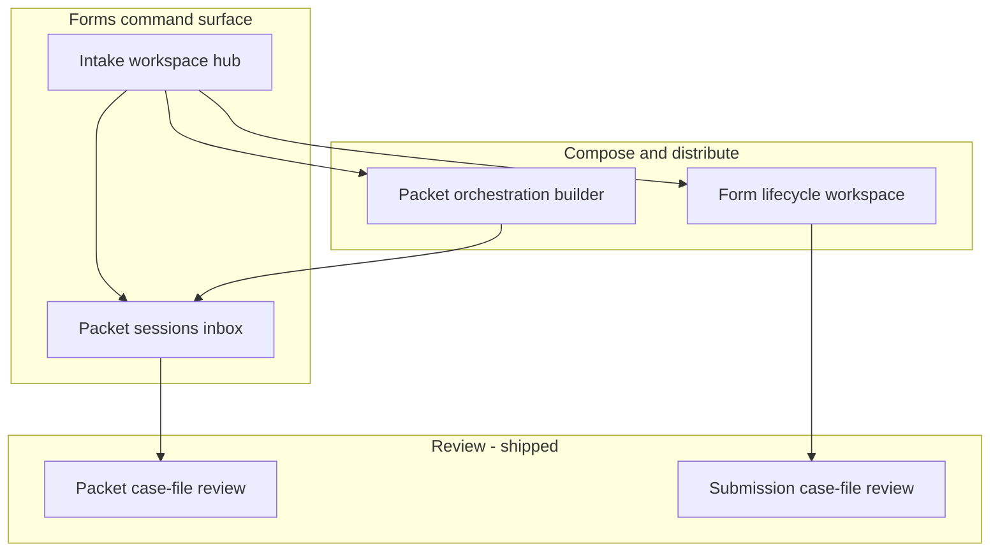
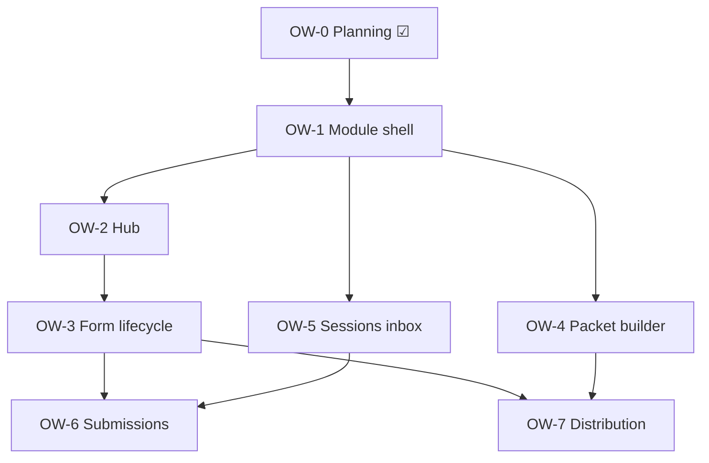

# Alloy — Forms/Documents Operational Workspace Redesign

**Path:** `docs/sprints/archive/05_2026/forms_operational_workspace_redesign.md`  
**Date:** May 2026  
**Status:** **OW-0 complete** · **OW-1 shipped** · **OW-2 shipped** · **OW-3 shipped** · **OW-4 shipped** · **OW-5 shipped** · **OW-6 shipped** · **OW-7 shipped**  
**Scope:** Forms/Documents **operational workspace layer** — hub, form lifecycle, packet orchestration, distribution, session/submission navigation. **Not** review rollup contracts, BOS logic, or forms engine rewrite.

**Related (already shipped):**

| Program | Document |
|---------|----------|
| Visual system PX-0–PX-2 | [`forms_documents_product_experience_refresh.md`](./forms_documents_product_experience_refresh.md) |
| Interaction / case-file doctrine | [`forms_documents_operational_experience_hardening.md`](./forms_documents_operational_experience_hardening.md) |
| Packet review MVP | [`forms_documents_phase_2_packet_review_mvp.md`](./forms_documents_phase_2_packet_review_mvp.md) |
| Product | [`docs/product/documents-and-forms.md`](../../platform/modules/documents-and-forms.md) |

---

## Problem statement

Packet review, BOS assist, and case-file layout now read as **premium operational infrastructure**. The surrounding Forms module still reads as **bootstrap admin CRUD**:

- table-first hubs
- `SectionCard` + legacy hex (`#31394d`, `#59678b`, `#e6e8ec`)
- accordion dumps on form detail
- disconnected routes with weak lifecycle framing
- packet sessions list without review readiness semantics

Operators experience **two products**: modern intake review vs legacy forms admin.

**This sprint closes that gap at the workspace layer** — using PX operational tokens and BOS interaction doctrine, without changing backend semantics.

---

## Part 1 — UX audit (current workspace)

Evidence: code walkthrough May 2026 — `web/app/admin/forms/**`, `web/app/adminV2/forms/**`, shared clients mounted from AdminV2 routes.

### 1.1 Forms hub (`FormsHubClient.tsx`)

| Finding | Evidence | Severity |
|---------|----------|----------|
| **Table-first CRUD** | 8-column `table` of definitions; primary CTA = “Open form workspace” link | High |
| **No operational posture** | No review queue, pending sessions, submission health, or intake activity | High |
| **README-in-card** | `SectionCard` “Forms in Alloy” + numbered list = onboarding doc, not command surface | Medium |
| **Legacy visual system** | `#59678b`, `#00458C`, `SectionCard`, `AdminPageHeader` — not `operationalVisualTokens` | High |
| **Weak status meaning** | “Published version” / “Active” badges — not readiness for intake or review | Medium |
| **Navigation as footnotes** | Packet sessions / definitions = small links under subtitle | Medium |
| **Positive** | Operator purpose column, `operator_context` purpose summary, technical disclosure pattern | Low |

**Emotional read:** “Spreadsheet of forms we manage.”

---

### 1.2 Form detail (`FormDetailClient.tsx`)

| Finding | Evidence | Severity |
|---------|----------|----------|
| **Accordion fatigue** | Five nested `<details>` inside Operator guide + more `SectionCard`s | High |
| **No lifecycle workspace** | Design (schema), publish, distribute, intake, review are separate cards — not one journey | High |
| **Schema dominates visually** | `FormSchemaWorkspace` is largest surface but buried mid-page | Medium |
| **Distribution = config dump** | Public links `SectionCard` with token tables, gray callouts — not “distribution management” | High |
| **Weak review pathway** | “Submissions” = header link only; no pending review count or case-file entry | High |
| **Preview band inconsistent** | One-off bordered gray box — not PX canvas/orientation band | Medium |
| **Positive** | 5-step flow chips in operator guide; preview/public link flows work; packet deep links | Medium |

**Emotional read:** “Configuration utility with help text.”

---

### 1.3 Packet definitions hub (`PacketDefinitionsHubClient.tsx`)

| Finding | Evidence | Severity |
|---------|----------|----------|
| **Bare CRUD page** | Inline create form + list; no orchestration framing | High |
| **Legacy styling** | `#0f172a`, `#e6e8ec` inputs; no module chrome | High |
| **No pipeline view** | Cannot see steps, linked forms health, or distribution state from list | High |
| **Positive** | `addForm` query prefill for cross-link from form detail | Low |

---

### 1.4 Packet definition detail (`PacketDefinitionDetailClient.tsx`)

| Finding | Evidence | Severity |
|---------|----------|----------|
| **Builder feels administrative** | Name/desc fields + step rows in `SectionCard`s — not intake pipeline composer | High |
| **Public links secondary** | Token mint buried; not “launch & distribute” | Medium |
| **No lifecycle preview** | Cannot see “what happens when someone opens this packet” | Medium |
| **Positive** | Step ordering, form picker merge, technical disclosure for ids | Low |

---

### 1.5 Packet sessions (`adminV2/forms/packets/page.tsx`)

| Finding | Evidence | Severity |
|---------|----------|----------|
| **Server list, minimal UX** | Plain `ul` with status + timestamps — no readiness, household, or review urgency | High |
| **Disconnected from review sophistication** | Links to modern `PacketSessionReviewClient` but list feels legacy | High |
| **No filters** | Last 100 only; no awaiting-review lens | Medium |
| **Legacy hex** | `#31394d`, bordered list | High |

---

### 1.6 Submissions list (`FormSubmissionsClient.tsx`)

| Finding | Evidence | Severity |
|---------|----------|----------|
| **Table CRUD** | Status + timestamps; linkage badge only recent UX win | High |
| **Hidden from lifecycle** | Not integrated into form detail journey as primary “intake inbox” | Medium |
| **Weak path to case-file** | Row opens submission detail — mixed legacy `SectionCard` vs partial case-file | High |

---

### 1.7 Submission detail (`FormSubmissionDetailClient.tsx`)

| Finding | Evidence | Severity |
|---------|----------|----------|
| **Split personality** | Partial case-file + `BosReviewSummaryPlaceholder` vs legacy `SectionCard` stacks | High |
| **Not aligned with packet review** | Different hierarchy than `PacketReviewRollupView` | High |

---

### 1.8 Navigation & module chrome

| Finding | Evidence | Severity |
|---------|----------|----------|
| **No Forms module shell** | Routes render clients directly — no persistent nav among Hub / Packets / Sessions / Definitions | High |
| **Breadcrumb-free** | “All forms” links only; weak orientation when deep-linked | Medium |
| **AdminV2 layout** | Provides auth/timezone only — not forms workspace framing | Medium |
| **Positive** | Canonical base `ADMIN_FORMS_UI_BASE = /adminV2/forms` | Low |

---

### 1.9 Cross-cutting gaps

| Gap | Impact |
|-----|--------|
| **PX tokens not adopted** on workspace pages | Visual fracture vs packet review |
| **StatusBadge vs FormsReviewBadge** | Inconsistent readiness language (PX-3 deferred) |
| **Table as default pattern** | Violates operational doctrine (queues are previews; here tables pretend to be truth) |
| **Equal-weight SectionCards** | No orientation → work → technical hierarchy |
| **Missing aggregates** | Review load, pending decisions, recent intake — may need read APIs later (flag per card) |

---

## Part 2 — Operational workspace philosophy

### What Forms/Documents is

**Operational intake infrastructure** for the org:

- **Compose** what families/staff must complete (definitions, versions, packets)
- **Distribute** capture surfaces (public / packet links)
- **Observe** intake activity (submissions, sessions)
- **Review** with human authority (case-file, BOS assist — already strong)
- **Produce** records (documents, linkage — existing engine paths)

### What it is not

- A forms database admin UI
- A generic CRUD generator for `form_definitions`
- A settings screen for JSON blobs

### Workspace design principles

| Principle | Meaning |
|-----------|---------|
| **Lifecycle-first** | Every surface answers “where am I in the intake journey?” |
| **Command, not catalog** | Hub surfaces work queues and health — tables are secondary |
| **One visual family** | `operationalVisualTokens`, case-file canvas, region bands on all module pages |
| **Progressive disclosure** | Technical ids, tokens, schema JSON — collapsed by default |
| **Review is the destination** | Paths to case-file review are first-class, not footer links |
| **Human authority** | Status copy reflects operator decisions — not chatbot suggestions |
| **Calm premium** | Stone canvas, ring surfaces, restrained color — same as PX-2 packet review |

### Module information architecture (target)



---

## Part 3 — Surface redesign plans

### 3.1 Forms hub → **Intake workspace**

**Replace:** definition table as home experience.  
**Keep:** create form action (elevated, not table footer).

**Orientation band (top)**

- Title: **Intake workspace** (or org-configured label)
- Lead: one line on forms + packets + review
- Quick stats row (presentation-only v1 — counts from existing list APIs):
  - Active forms
  - Published forms missing packet use (optional heuristic)
  - Open packet sessions (link to inbox)
  - Sessions awaiting decision (filter link — if count available client-side from sessions fetch)

**Primary lanes (region bands, not cards)**

| Lane | Content | Data source (v1) |
|------|---------|------------------|
| **Review now** | Top N packet sessions needing operator review + link to full inbox | Extend client fetch or lightweight aggregate endpoint (OW-5) |
| **Your forms** | Grouped list (not 8-col table): name, purpose, publish state, last activity | Existing `GET /api/admin/forms` |
| **Packets** | Active definitions with step count + link to builder | Existing packet-definitions API |
| **Recent intake** | Latest submissions across forms (cap 10) | Existing submissions list API |

**Visual:** `opCaseFileCanvas` or module-level `opPageGround`; `OperationalPageHeader`; grouped rows (`opGroupedSurface`); `FormsReviewBadge` for publish/review readiness (OW-4 / PX-3).

**De-emphasize:** long “How Forms usually flow” prose → collapsible **Getting started** disclosure.

---

### 3.2 Form detail → **Lifecycle workspace**

**Replace:** accordion stack + equal SectionCards.

**Layout (single scroll, region separators)**

1. **Orientation band** — form name, publish chip, primary actions: Preview, Create link, **Open intake inbox** (submissions with count)
2. **Lifecycle rail** — horizontal stepper (always visible, not accordion):
   - Design → Publish → Distribute → Intake → Review → Document
   - Each step: status chip + one-line next action + deep link
3. **Design** — `FormSchemaWorkspace` as primary work surface (full width)
4. **Publish** — version band: latest published, publish CTA, compact version list (`opGroupedSurface`)
5. **Distribute** — public links as distribution panel (active links grouped; create link prominent; token-once pattern preserved)
6. **Intake** — embedded submissions preview (last 5) + “View all submissions”
7. **Review** — link to submission case-files; if in packet, link to packet definitions using this form
8. **Technical** — `TechnicalDetailDisclosure` for ids/metadata

**Remove:** five duplicate `<details>` for purpose/who/after/connected/checklist — merge into lifecycle rail + operator guide side panel (single column, `opInsightSupport` text).

---

### 3.3 Packet definitions → **Intake orchestration builder**

**Hub**

- Orchestration list: packet name, step count, active, last session, link to builder + **View sessions**
- Create packet = primary action (modal or band, not top-of-page gray form)

**Detail**

- **Orientation:** packet name, active, step count, **Launch** subsection (mint packet link)
- **Pipeline composer:** vertical step list (drag order later — v1 keep existing save model)
  - Each step: form name, publish health, optional label — row in `opGroupedSurface`
- **Distribution:** packet public links (same patterns as form distribute panel)
- **Sessions:** deep link to filtered packet sessions inbox
- **Technical:** disclosure for definition id / keys

**Feel:** workflow setup, not “edit packet record.”

---

### 3.4 Public links (form + packet)

**Reframe:** **Distribution & intake** region inside lifecycle/builder — not “Public embed links” config table.

| Element | Treatment |
|---------|-----------|
| Create link | Primary action in distribute band |
| Active links | Grouped list: label/prefix, active, expires, created — row actions |
| New token | One-time reveal panel (preserve security copy) |
| Inactive / expired | Muted meta row — not scary red boxes |
| Preview links | Distinct row kind with “Preview” chip |

---

### 3.5 Packet sessions inbox

**Replace:** plain server list page.

**Target:** operational inbox (still read-only v1):

- `OperationalPageHeader` + filters: All | Awaiting review | Completed
- Rows: packet name, household/opportunity label (when available), session status, operator review status, last activity
- Row click → existing `PacketReviewRollupView` page
- Visual: grouped inbox `opGroupedSurface`, readiness chips aligned with packet review

**Note:** richer labels may require rollup snippet or extended list API — card OW-5 scopes presentation + minimal field additions only if already on session row.

---

### 3.6 Submission navigation

| Path | Target |
|------|--------|
| Form detail → Intake lane | Submissions preview + inbox |
| Submissions list | Inbox layout (grouped), linkage badge, case-file link |
| Submission detail | Full alignment with packet case-file components (PX-5 / OW-6) |
| Packet session list | Packet review |
| Opportunity drawer | Already modal review — keep parity copy |

---

## Part 4 — Navigation & orientation strategy

### Forms module shell (new)

Introduce shared layout wrapper for `/adminV2/forms/**`:

```
Intake workspace | Forms | Packet definitions | Packet sessions
```

- Persistent under `adminV2/forms/layout.tsx` (client sub-nav below AdminV2 chrome)
- Highlights current section
- Uses `opPageTitle` / `opMetadata` — no legacy hex

### Breadcrumbs

`Forms / {Form name} / Submissions` — lightweight text trail using `opMetadata`, not heavy bootstrap breadcrumbs.

### Cross-links (canonical)

| From | To |
|------|-----|
| Form detail publish band | Packet definitions `?addForm=` |
| Packet step row | Form lifecycle workspace |
| Hub review lane | Packet session review |
| Session inbox | Packet definition builder |

---

## Part 5 — Implementation cards

**Prefix:** **OW-** (Operational Workspace). Depends on PX-1/PX-2 tokens. Does **not** include PX-3 badge unification (coordinate when touching chips).

### OW-1 — Forms module shell + navigation ☑

**Goal:** One module chrome; end disconnected routes.

**Shipped (May 2026):**

| Component | Path |
|-----------|------|
| Module chrome | `web/components/forms/workspace/FormsWorkspaceChrome.tsx` |
| Page framing | `FormsWorkspaceShell.tsx`, `FormsBreadcrumbs.tsx` |
| Module nav | `FormsModuleNav.tsx`, `web/lib/forms/formsModuleNav.ts` |
| Contextual links | `FormsOperationalLink.tsx` |
| Layout wiring | `web/app/adminV2/forms/layout.tsx` |
| Submissions hub (new route) | `/adminV2/forms/submissions` → `FormsSubmissionsHubClient.tsx` |
| Sessions hub | `PacketSessionsHubClient.tsx` + `packets/page.tsx` |
| Tests | `web/tests/forms/formsWorkspaceShell.test.ts(x)` |

**Headers adopted:** `FormsHubClient`, `FormDetailClient`, `PacketDefinitionsHubClient`, `PacketDefinitionDetailClient`, `FormSubmissionsClient`, `FormSubmissionDetailClient`, `PacketSessionReviewClient`.

**Nav items:** Workspace · Packets · Sessions · Submissions.

**Acceptance:**

- [x] Every `/adminV2/forms/*` page shows consistent nav via layout chrome.  
- [x] Shell uses `operationalVisualTokens` (no legacy hex in chrome/nav).  
- [x] Operational page headers on all listed surfaces.

---

### OW-2 — Intake workspace hub ☑

**Goal:** Replace table-first hub with operational command surface.

**Shipped (May 2026):**

| Area | Detail |
|------|--------|
| Hub UI | `IntakeWorkspaceHubView.tsx` + refactored `FormsHubClient.tsx` |
| Lanes | Review sessions, recent submissions, packet definitions, active forms summary |
| Form library | Grouped list rows (`opGroupedSurface`) — no 8-column table |
| Actions | Primary quick-action band: Review sessions, View submissions, Manage packets, Create form |
| Data | Parallel fetch: existing `GET /api/admin/forms`, `packet-sessions`, `packet-definitions`, `submissions?limit=10` |
| Copy | Instructional `SectionCard` removed; “Getting started” collapsed disclosure only |
| Tests | `web/tests/forms/formsIntakeWorkspaceHub.test.tsx` |

**Acceptance:**

- [x] First screen is operational lanes + canvas, not spreadsheet table.  
- [x] Review path visible above fold (quick actions + sessions lane).  
- [x] No fake counts; empty states operational.  
- [x] Uses `operationalVisualTokens` / PX-2 surfaces.

---

### OW-3 — Form lifecycle workspace ☑

**Goal:** Form detail as lifecycle journey.

**Shipped (May 2026):**

| Area | Detail |
|------|--------|
| Lifecycle rail | `FormLifecycleRail.tsx` + `formLifecyclePresentation.ts` — Design → Publish → Distribute → Intake → Review → Documents |
| Workspace layout | `FormLifecycleWorkspaceLayout.tsx` + refactored `FormDetailClient.tsx` |
| Regions | Build/design (`FormSchemaWorkspace`), publish versions, distribution (`FormDistributionPanel`), intake preview (`FormIntakePreviewPanel`), review + documents |
| Header | Publish state badge, purpose line, primary actions: Preview, Create link, New draft, View submissions |
| Operator guide | Five accordions merged into collapsed `Operator context` disclosure |
| Schema workspace | Removed `SectionCard` wrapper; operational tokens only |
| Tests | `formLifecyclePresentation.test.ts`, `formLifecycleWorkspace.test.tsx`, `formDetailLifecycleWorkspace.test.tsx` |

**Acceptance:**

- [x] Single visible lifecycle rail; state derived from existing data only.  
- [x] No table-first distribution or version lists — grouped surfaces.  
- [x] Draft/publish/schema controls preserved in design region.  
- [x] Technical ids collapsed; no backend semantic changes.

---

### OW-4 — Packet orchestration builder ☑

**Goal:** Packet hub + detail feel like pipeline composition.

**Shipped (May 2026):**

| Area | Detail |
|------|--------|
| Hub | `PacketOrchestrationHubView.tsx` + refactored `PacketDefinitionsHubClient.tsx` |
| Builder | `PacketBuilderWorkspaceLayout.tsx` + refactored `PacketDefinitionDetailClient.tsx` |
| Steps | `PacketStepCompositionEditor.tsx` — ordered pipeline rows with readiness |
| Launch | `PacketDistributionLaunchPanel.tsx` — launch links grouped, tokens secondary |
| Presentation | `packetOrchestrationPresentation.ts` — status labels, step display, session counts |
| Data | Existing APIs only — parallel detail fetch for step counts on hub index |
| Tests | `packetOrchestrationPresentation.test.ts`, `packetOrchestrationWorkspace.test.tsx` |

**Acceptance:**

- [x] Index uses grouped workflow rows, not bare CRUD list.  
- [x] Builder shows overview, steps, distribution, sessions, collapsed technical ids.  
- [x] Create/edit/save steps and mint link behavior preserved.  
- [x] No backend contract changes.

---

### OW-5 — Packet sessions inbox ☑

**Goal:** Session list matches review sophistication.

**Shipped (May 2026):**

| Area | Detail |
|------|--------|
| Inbox UI | `PacketSessionsHubClient.tsx` — grouped lanes: needs review, needs correction, in progress, recently completed |
| Row design | `PacketSessionInboxRow.tsx` — packet name, subject/context, readiness badges, progress, primary action |
| Grouping | `packetSessionsInboxPresentation.ts` — client-side lane resolution from existing session fields |
| Data | Server page expanded select: `operator_review_status`, `launch_context`, `crm_snapshot`, warnings, step counts via `form_packet_session_items` |
| Secondary | Collapsed “All sessions” disclosure |
| Tests | `packetSessionsInbox.test.tsx`, `packetSessionsInboxPresentation.test.ts` |

**Acceptance:**

- [x] List uses operational tokens; not table-first.  
- [x] Review-ready sessions visually prioritized (amber emphasis + review CTA).  
- [x] Operator-friendly status labels via `FormsReviewBadge`.  
- [x] No backend contract or review PATCH changes.

---

### OW-6 — Submissions inbox + submission detail alignment ☑

**Goal:** Clear intake pathways; case-file parity.

**Shipped (May 2026):**

| Area | Detail |
|------|--------|
| Inbox UI | `SubmissionsInboxView.tsx` — grouped lanes: needs review, needs linking, drafts, recently submitted |
| Row design | `SubmissionInboxRowView.tsx` — form name, subject/context, status + linkage badges, primary action |
| Grouping | `submissionInboxPresentation.ts` — client-side lane resolution from status + linkage signals |
| Hub surfaces | `FormsSubmissionsHubClient.tsx`, `FormSubmissionsClient.tsx` — table removed; operational inbox |
| Detail | `SubmissionIntakeCaseFileContent.tsx` + `FormSubmissionDetailClient.tsx` — `IntakeCaseFileLayout` slots |
| Tests | `submissionInboxPresentation.test.ts`, `submissionsInboxWorkspace.test.tsx`, `submissionIntakeCaseFile.test.tsx` |

**Acceptance:**

- [x] Submissions inbox uses operational tokens; not table-first.  
- [x] Review/linking lanes visually prioritized (amber emphasis + review CTA).  
- [x] Standalone submission detail aligns with packet case-file model.  
- [x] Technical details remain collapsed; linkage/PDF actions preserved.  
- [x] No backend contract or payload semantic changes.

---

### OW-7 — Distribution panels (form + packet) ☑

**Goal:** Unified distribute UX.

**Shipped (May 2026):**

| Area | Detail |
|------|--------|
| Shared panel | `DistributionLinksPanel.tsx` — form + packet modes, one-time URL panel, active/inactive link list |
| Presentation | `distributionPresentation.ts` — operational copy, link labels, preview detection |
| Form surface | `FormDistributionPanel.tsx` — thin wrapper; lifecycle orientation uses “Share intake” / “Preview recipient experience” |
| Packet surface | `PacketDistributionLaunchPanel.tsx` — thin wrapper; builder region titled “Distribution” |
| Security | One-time panel: “Copy this link now” + “will not be shown again”; embed credential in collapsed `<details>` |
| Tests | `distributionPresentation.test.ts`, `distributionLinksPanel.test.tsx`; updated lifecycle/packet workspace tests |

**Acceptance:**

- [x] Form and packet distribution share one component family.  
- [x] Public links no longer feel primarily technical (no token prefix as identity).  
- [x] One-time URL security semantics preserved.  
- [x] Preview/create/launch actions remain accessible.  
- [x] No backend contract or token security changes.

---

## Part 6 — Recommended sequencing



| Wave | Cards | Rationale |
|------|-------|-----------|
| **0** | OW-0 ☑ | This document |
| **1** | OW-1 | Nav + shell unblock all pages |
| **2** | OW-2 + OW-5 | Command surfaces (hub + review inbox) — highest emotional impact |
| **3** | OW-3 + OW-4 | Lifecycle + orchestration depth |
| **4** | OW-6 + OW-7 | Submission paths + distribution polish |
| **Parallel** | PX-3 | Badge grammar when touching readiness chips |

**Coordinate:** Opportunity drawer packet review already modern — OW-5 inbox should use same readiness labels as `PacketReviewRollupView`.

---

## Explicit non-goals

| Out of scope | Notes |
|--------------|-------|
| Forms engine / schema model changes | Presentation only |
| New review PATCH semantics | Unchanged |
| Migrations | None |
| AdminV2 global redesign | Forms module only |
| Aggregate APIs (optional) | Defer unless OW-2/OW-5 blocked — prefer existing list endpoints first |
| Drag-and-drop packet reorder | Future enhancement |

---

## Remaining visual debt (post-OW)

- PX-3 unified readiness chips across hub/inbox
- PX-4 motion on disclosure/lifecycle rail
- PX-6 AdminV2 queue/drawer alignment
- Settings vs Forms boundary (documented in product doc — not this sprint)

---

## Verification (when OW ships)

```bash
cd web && npx tsc --noEmit
cd web && npm run lint
cd web && npm run test -- tests/forms/packetReviewCaseFileLayout.test.tsx tests/forms/packetReviewSurfaces.test.tsx
# Add OW-specific tests per card
```

**Manual QA**

1. Land on `/adminV2/forms` — feels like intake command, not table admin  
2. Open form — lifecycle rail visible; distribute + design clearly ordered  
3. Open packet definition — pipeline + launch readable  
4. Packet sessions inbox → case-file review — one cohesive family  
5. No legacy hex on primary paths in touched files  

---

## Suggested commit message (OW-0 doc-only)

```
docs: Forms operational workspace redesign (audit + OW-1–7 plan)

Workspace UX audit; lifecycle/orchestration philosophy; hub, form detail,
packet builder, navigation, and implementation sequencing.
```

---

## Cursor execution order

1. **OW-1** module shell (required first).  
2. **OW-2** hub + **OW-5** sessions inbox (visible transformation).  
3. **OW-3** form lifecycle + **OW-4** packet builder.  
4. **OW-6** submissions + **OW-7** distribution panels.  
5. Do **not** change review contracts or workflow semantics.
