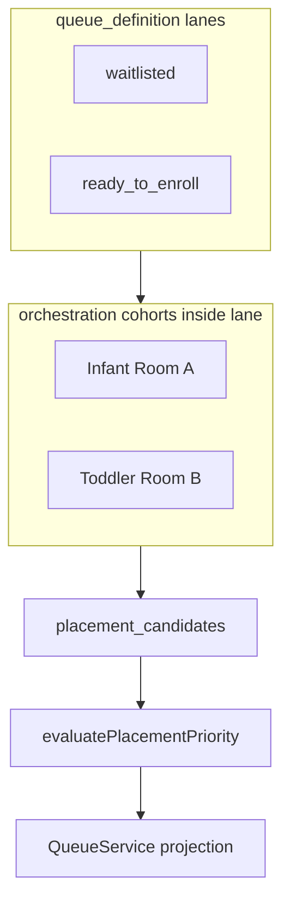

# Waitlist Orchestration Phase 2 — Architecture Proposal

**Status:** **Phase 2 complete (Cards 0–7)** — candidate-row waitlist shipped; pilot with `shadow_mode: true`.  
**Pilot playbook:** [waitlist_orchestration_phase2_pilot_playbook.md](waitlist_orchestration_phase2_pilot_playbook.md)  
**Date:** 2026-05-27  
**Depends on:** [Phase 2 audit](waitlist_orchestration_phase2_audit.md)  
**Implementation plan:** [Phase 2 cards](waitlist_orchestration_phase2_cards.md)

---

## North star

**Operators orchestrate child placement into rooms/programs; the CRM opportunity remains the household inquiry shell.**

```text
Household (customer) ──► Opportunity (inquiry / lifecycle)
                              │
                              ├──► Placement candidate(s) per child × target program/room
                              │         └──► Evaluator + optional overrides + future capacity signals
                              │
                              └──► Queue projection (QueueService) — family row and/or child rows
```

**Non-negotiables (carry forward from V1):**

- **Queues remain projections** — no lifecycle, billing, or capacity decisions from list JSON alone.  
- **Single queue engine** — `QueueService` (+ modules it exclusively calls for row enrichment).  
- **Work units + `queue_definition`** — lanes stay status/config driven; waitlist is not a second entity type.  
- **Explainability** — bucket + reasons + tie-break trace; overrides must be **auditable** and **visible**.  
- **Config / preset layering** — vertical rules in **`PlacementProfile`**, not `if (childcare)` in core sort.

---

## 1. Child-first orchestration doctrine

### 1.1 Concepts

| Concept | Definition | Authority |
|---------|------------|-----------|
| **Placement candidate** | A waitlist-ranked unit: **child (person or customer_member) + target program/room (or room group key) + optional site** | **New logical model** — persisted in Phase 2 Card 1+ |
| **Household shell** | `customer` + `opportunity` — lifecycle, comms, packets, status | **Existing** — unchanged SoT |
| **Cohort** | Scoped set for ordering: e.g. `(org_id, site_id, program_room_key, waitlist_lane)` | **Evaluator input** — not queue row count |
| **Projection row** | What `QueueService` returns — may be **family-anchored** or **child-anchored** per display mode | **Non-authoritative** |

### 1.2 Answers to canonical questions

| Question | Proposal |
|----------|----------|
| **Independent waitlist membership per child?** | **Yes** — each **placement candidate** has its own membership row, priority evaluation, and lifecycle substates. |
| **Independent room/program targeting?** | **Yes** — target is on the **candidate**, not only opportunity metadata. |
| **Independent priority score / bucket?** | **Yes** — evaluate **per candidate**; family view derives **rollup** (e.g. worst tier, eldest wait, linked constraint state). |
| **Independent placement lifecycle?** | **Partial** — substates (`active`, `offered`, `hold`, `withdrawn`, `placed`) on candidate; **opportunity `status_key`** remains enrollment lifecycle gate. |
| **Relation to opportunity** | **Required FK** `opportunity_id`; candidates **must not** outlive inquiry without explicit transfer rules. |
| **Relation to household** | `customer_id` + `customer_member_id` / `person_id` for identity. |
| **Enrollment packets** | Packet items reference **person/OCM** — candidates link to same keys for review. |
| **Future billing/contracts** | Contract lines attach to **child enrollment (job/member)** — candidate carries **`target_start_date`** proposal only until conversion. |

### 1.3 What stays opportunity-level

- **Pipeline status** (`waitlisted`, `ready_to_enroll`, `enrolled`, …).  
- **Operational attention** resolver membership.  
- **Work unit assignment** (`opportunities.work_unit_id`).  
- **Primary contact / comms** threading.  
- **Family-level policies** that are not child-specific (e.g. “do not call before date”) — metadata or household facts.

### 1.4 Evaluator evolution (same contract, richer entity)

Extend **`PlacementEvaluateInput.entity`** to support:

```typescript
// Illustrative — exact types in Card 2
entity:
  | { entity_type: "opportunity"; entity_id: string }           // legacy / rollup
  | { entity_type: "placement_candidate"; entity_id: string }; // Phase 2 default for waitlist lanes
```

**Fact bag** for candidates assembled from:

- OCM row (program interest, desired start, age band)  
- `customer_members` / `persons` (DOB, name)  
- Site / location resolution  
- Household flags (employee, sibling enrolled) — **sourced from joins** with metadata fallback  
- **Linked placement group** facts (see §2)

**Sort tuple** retains shape: **`primary_group_fact_key` → bucket → tie-breakers → stable id** — stable id becomes **`candidate_id`** when entity is candidate.

---

## 2. Linked sibling / household orchestration

### 2.1 Constraint modes (product semantics)

| Mode | Operator meaning | Orchestration behavior |
|------|------------------|------------------------|
| **`independent`** | Each child can enroll when a seat exists | Candidates rank **independently** within shared program groups |
| **`preferred_together`** | Strong preference; may split if operator approves | **Soft link** — boost when siblings adjacent in order; **warning** if only partial seats |
| **`strictly_together`** | No enrollment unless all linked children can start together | **Hard link** — cohort position driven by **slowest / blocking** candidate; offer actions gated |

**Representation (data model direction):**

```text
placement_link_group
  id, org_id, customer_id, opportunity_id
  mode: independent | preferred_together | strictly_together
  notes, created_by, created_at

placement_link_member
  link_group_id, placement_candidate_id
```

**Alternative (lighter V2.0):** `placement_candidate.link_group_id` + `link_mode` duplicated on candidates — acceptable if groups are small; normalize to group table when audit needs group-level notes.

### 2.2 Hold spot semantics

| State | Meaning |
|-------|---------|
| **`hold`** on candidate | Temporary reservation of **capacity slot** (future) or **ordinal lock** (interim) |
| **`hold_expires_at`** | Operator-defined window; auto-release emits event |
| **Strictly-together + hold** | Hold applies to **link group** — releasing one releases all |

**Interim (pre-capacity):** Hold = **pinned ordinal override** within cohort (see §5) without claiming physical seat.

### 2.3 Interaction with forecasting (future)

- **Forecasted opening** satisfies **strictly_together** only when **N contiguous seats** or **N seats same start week** — rule lives in **capacity adapter**, not evaluator core.  
- Evaluator consumes **`capacity_signal`** facts: `expected_openings_count`, `earliest_opening_date` — **optional**, `unknown`-safe.

---

## 3. Program / room grouping doctrine

### 3.1 Canonical grouping semantics

**Primary cohort key** (replaces ad hoc `program_room_group` strings over time):

```text
program_room_cohort_key = f(site_id, program_id | age_band_key, room_id?)
```

| Field | Source |
|-------|--------|
| **`site_id`** | Opportunity `location_id` or org default |
| **`program_id` / `age_band_key`** | Catalog / vertical config — not free-text alone |
| **`room_id`** | Optional — when waitlist is room-specific vs program-level |

**Display label** resolved via config registry — evaluator sorts on **stable key**, UI shows **operator label**.

> **Pilot UI doctrine (May 2026):** Waitlist **queue section headers** group by **org-level program/category** (Infant, Toddler, Preschool, Pre-K) via `resolveOrgProgramCategoryForWaitlist` — not by individual classroom/room and not per-site section headers. **`site_id`** on `placement_candidates` + header location filter narrows which candidate rows appear inside those sections. Classrooms/units remain **location-level** under sites for future capacity, rates, and assignment. Stored `program_room_cohort_key` may still carry finer-grained slugs until a formal org program catalog lands; section grouping normalizes to org category at presentation time.



- **Lanes** = lifecycle filters (unchanged).  
- **Cohorts** = **program/room-first** partitions for ordering and `#n` scope.  
- **No generic “waitlist cohort”** abstraction that isn’t tied to program/room/site.

### 3.3 Age progression compatibility

- Candidates carry **`age_band_key`** + **`as_of_date`** for evaluation clock.  
- **Progression rules** (infant → toddler) are **config transitions** that **spawn or migrate** candidates — not hardcoded in `QueueService`.  
- **Future scheduling:** `room_id` links to classroom schedule entities when built.

### 3.4 Queue / work unit / evaluator / tie-breaker evolution

| Component | Evolution |
|-----------|-----------|
| **`queue_definition`** | Optional `orchestration_profile_id` per lane — **not** embedded rules |
| **`QueueService`** | Load candidates for opportunity IDs in lane → evaluate batch → attach `_placement_priority` per **projection mode** |
| **Evaluator** | Same pure core; presets reference **candidate fact keys** |
| **Tie-breakers** | `wait_since` → candidate.`wait_since`; `desired_start_date` → OCM; add **`link_group_blocking_date`** for strict mode |
| **Operational previews** | Family row shows **rollup** + **per-child chips**; child row mode shows one candidate |

### 3.5 `group_by` config

**Implement or formalize deprecation** in Card 3:

- **Recommended:** Deprecate unused `group_by` in favor of **`primary_group_fact_key` + UI projection mode** — one grouping mechanism.  
- If implemented: `group_by` must reference **registry fact keys**, not React literals.

---

## 4. Manual operational overrides

### 4.1 Principles

1. **Overrides adjust projection order and/or persisted cohort rank — never rewrite bucket truth silently.**  
2. **Policy evaluation still runs** — override stores **delta** vs policy snapshot for explainability.  
3. **Every override is audited** — who, when, reason, expiry.  
4. **Queue rows reflect override outcome** — drawer shows **“Manual: …”** reason line.

### 4.2 Override kinds

| Kind | Semantics | Persistence |
|------|-----------|-------------|
| **Pinned position** | Force ordinal **N** within cohort until released | `placement_override` row with `kind: pin`, `cohort_key`, `position` |
| **Manual tier boost** | Treat as if assigned bucket **without** hiding true policy tier | `kind: tier_boost`, `effective_bucket_key`, `policy_bucket_key` preserved |
| **Temporary operational override** | Expires at `expires_at`; reverts to policy | `kind: temporary` |
| **Operator note** | Explainability only | Linked to override row |

**Coexistence with scoring:**

- **Do not** replace bucket model with opaque score.  
- Optional internal **`sort_precedence`** integer: `override > bucket > tie-breakers` for final tuple.

### 4.3 Explainability payload (drawer + row)

```typescript
// Illustrative shape for _placement_priority extension
{
  policy: { bucket_key, bucket_label, sort_tuple, reasons },
  override?: { kind, label, reason, by, at, expires_at },
  effective: { bucket_label, sort_tuple, scoped_position }
}
```

---

## 5. Predicted openings / forecasting hooks

**Forecasting engine NOT implemented in Phase 2** — Card 6 shipped **metadata + fact hooks only**.

### 5.1 Metadata contract (Card 6 — shipped)

On **`placement_candidates.metadata.placement_forecast_v1`** (JSON; no DDL):

| Field | Purpose |
|-------|---------|
| **`expected_openings_count`** | Informational signal for upcoming seats |
| **`expected_transition_count`** | Graduation/withdrawal pipeline hint |
| **`projected_opening_window`** | Human or coded window (e.g. `fall_2026`) |
| **`projected_capacity_pressure`** | `low` / `moderate` / `high` |
| **`sibling_alignment_window`** | Sibling placement coordination hint |
| **`estimated_wait_window_days`** | Rough wait estimate |
| **`forecast_earliest_start_date`** | Reserved — earliest projected start |
| **`forecast_confidence`** | `high` / `medium` / `low` / `unknown` |
| **`forecast_source`** | e.g. `manual`, `age_transition`, future capacity service |
| **`accepted_not_started`** | Seat logically consumed, not yet attending |
| **`temporary_hold_until`** | Operational hold overlap |

Implementation: `web/lib/orchestration/placement/placementForecastFactContract.ts`, `placementForecastFactsProvider.ts`.

### 5.2 Runtime rules

- Facts merge into evaluator **`FactBag`** as **`unknown`** when absent, **`present`** when metadata supplies values.  
- **Default childcare waitlist profile does not use forecast facts in rules or tie-breakers** — no ordering impact.  
- **Never auto-promote** from forecast without workflow/action.  
- **Capacity service** (future) publishes signals → refresh `placement_forecast_v1` → optional BOS / drawer surfaces.

### 5.3 Queue UI (Card 6)

- At most **one** subtle meta chip per candidate row when hints derive from forecast metadata (`Expected opening soon`, `High demand cohort`, `Likely fall opening`).  
- Rows without forecast metadata unchanged.

### 5.4 Extensibility

- **Sidecar table** `entity_placement_snapshots` (V1 RFC) remains valid for **historical rank**.  
- **Event:** `placement_priority_snapshot_changed` extended with `candidate_id` + `cohort_key`.

---

## 6. Queue / runtime implications

### 6.1 Projection modes (work unit config)

| Mode | Queue row grain | Use case |
|------|-----------------|----------|
| **`family_row`** | One row per opportunity; **embed** `candidates[]` placement summaries | Entity GET, admin read API, lifecycle/comms — **not** waitlist queue list rows |
| **`candidate_row`** | One row per placement candidate (child × **`program_room_cohort_key`**) | **Required** for waitlist queue UI (Card 4.6) |
| **`family_row_expanded`** | Family row with **sort key = best/worst candidate** per policy | Optional alternate; not used for waitlist lanes |

**Recommendation (revised Card 4.6):** Waitlist lanes with Placement V2 use **`candidate_row`** for queue presentation. **`family_row`** remains valid for opportunity lifecycle, drawer/API reads, and eval rollup before fan-out. Multi-child families must **not** merge into one waitlist row with combined cohort labels — siblings surface via **`sibling_context`**, not row merge.

### 6.2 Scoped position semantics (refined)

- **`scoped_waitlist_position`** counts within **`(lane, program_room_cohort_key)`** on **loaded + evaluated** slice — unchanged disclaimer unless **persisted snapshot** enabled.  
- **Persisted mode:** Store **`cohort_ordinal`** on candidate at evaluation time; queue displays stored ordinal (refresh on material change only).

### 6.3 Pagination / global ordering

- **Card 2+** defines **snapshot clock** per cohort (`cohort_ranking_generation_id`) for cross-page stability when persistence on.  
- Until then, **honest copy** about loaded-page scope remains mandatory.

### 6.4 Work unit doctrine

- Stay on **`enrollment_pipeline`** single WU.  
- **Do not** create `waitlist` work unit as SoT.  
- **Needs attention** remains overlay — not merged into placement sort.

---

## 7. UX / workspace semantics (follows orchestration)

**Do not lead with visual redesign.** UX changes **follow** Cards 1–3.

| Recommendation | Rationale |
|----------------|-----------|
| **Default collapsed program/room sections** | Reduces scan load; matches operator “one room at a time” |
| **Candidate row as waitlist unit** | One list row per **`placement_candidate`**; primary label = child; household/parent = secondary context |
| **Sibling link indicator** | Read-only badge + expandable summary from **`sibling_context`** (same opportunity / link group) — **no row merge** |
| **Placement readiness** | Derived from candidate substate + packet completeness — **not** queue-only |
| **Explainability** | Drawer **Placement** section from entity GET — mirrors attention pattern |
| **No room logic in React** | Section keys from API `cohort_key` / labels |

---

## 8. Future financial + enrollment integration (hooks only)

| Domain | Integration point |
|--------|-------------------|
| **Waitlist deposit** | Workflow on transition to `offered` / `hold` — payment entity FK on opportunity or candidate |
| **Enrollment intent** | Packet session completion → candidate `intent_confirmed_at` |
| **Contract timing** | Job/contract `start_date` promoted from candidate `target_start_date` on enroll |
| **Subsidy** | Person/household facts → eligibility fact keys in profile |
| **Revenue / capacity** | Read-only analytics on **cohort snapshots** — never queue row |

---

## 9. Anti-patterns (explicit)

| Anti-pattern | Why forbidden |
|--------------|---------------|
| Family-level queue as SoT | Violates child-centric operations; hides per-room targets |
| Second sort engine in UI | Drift from doctrine |
| Override without audit | Compliance / operator trust failure |
| Hardcoded Infant/Toddler in `QueueService` | Breaks cross-vertical reuse |
| Promotion from queue index | Lifecycle must use entity GET + actions |
| LLM-authored priority reasons | Non-deterministic |

---

## 10. Migration from V1

| V1 behavior | Phase 2 path |
|-------------|--------------|
| Opportunity-only evaluator | **Dual mode:** opportunity rollup + candidate eval; deprecate opportunity-only over time |
| `program_room_group` metadata | **Migrate** to `program_room_cohort_key` via mapping table or seed script |
| `placement_priority_v1` metadata | **Extend** schema version `2` with `projection_mode`, `candidate_policy` — backward compatible defaults |
| `_placement_priority` on rows | **Superset** fields — old clients ignore new keys |
| Shadow mode | Unchanged — compare policy vs override vs legacy SQL |

---

## 11. Card 1 — persisted schema (shipped)

**Migration:** `supabase/migrations/20260527140000_waitlist_orchestration_placement_foundation.sql`

**Wired in later cards:** evaluator (Card 2), `QueueService` (Card 3), drawer/queue UX (Card 4), override merge + APIs (Card 5), forecast columns in `metadata` or Card 6 DDL.

### `placement_candidates`

| Column | Semantics |
|--------|-----------|
| `id`, `org_id` | Primary key; tenant scope |
| `opportunity_id`, `customer_id` | Household inquiry shell (customer denormalized) |
| `opportunity_customer_member_id` | **Required** when `is_synthetic_fallback = false` — inquiry child link |
| `customer_member_id`, `person_id` | Denormalized from OCM / member (trigger may fill from OCM) |
| `site_id` | Optional site (`locations`) |
| `is_synthetic_fallback` | `true` when no OCM child — opportunity-level fallback candidate |
| `program_room_cohort_key` | **Canonical** cohort partition (sort/group); not display-only |
| `program_room_group_label` | V1 display compatibility (from `program_room_group` / `program_label`) |
| `wait_since`, `desired_start_date` | FIFO / start intent inputs for evaluator |
| `status` | `active` \| `paused` \| `withdrawn` \| `placed` |
| `seed_key` | Idempotent backfill (`UNIQUE (org_id, seed_key)` when set) |
| `metadata` | Extension bag (forecast hooks may live here until Card 6) |
| `created_by`, `updated_by` | Operator audit |

**Not present (by design):** `cohort_ordinal`, `rank_score`, `placement_priority_snapshot` — rank stays runtime-derived.

**Uniques:** active/paused rows per `(ocm, cohort)` or per `(opportunity, cohort)` when synthetic.

### `placement_link_groups`

| Column | Semantics |
|--------|-----------|
| `opportunity_id`, `customer_id` | Scope |
| `link_mode` | `independent` \| `preferred_together` \| `strictly_together` |
| `notes`, `metadata` | Operator context |

### `placement_link_group_members`

| Column | Semantics |
|--------|-----------|
| `placement_link_group_id`, `placement_candidate_id` | M:N membership; same `org_id` + `opportunity_id` enforced by trigger |

### `placement_overrides`

| Column | Semantics |
|--------|-----------|
| `placement_candidate_id`, `program_room_cohort_key` | Must match candidate cohort |
| `override_kind` | `pin` \| `tier_boost` \| `temporary` (`temporary` requires `expires_at`) |
| `reason` | Required operator justification (audit) |
| `payload` | Override parameters only (e.g. `pin_ordinal`, `effective_bucket_key`) — **not** rank persistence |
| `is_active`, `expires_at`, `released_by`, `released_at` | Lifecycle |
| `created_by` | Required on insert |

**RLS:** `user_roles` org `SELECT`; `owner`/`admin`/`ops` mutate; `service_role` ALL (admin API path).

---

## 12. Card 2 — runtime foundation (shipped)

| Layer | Status | Notes |
|-------|--------|-------|
| **Cohort mapping** | Shipped | `resolveProgramRoomCohort()` — slug key + human label from V1 metadata |
| **Backfill** | Shipped | `runPlacementCandidateBackfill` — OCM × cohort; synthetic when no children |
| **Read API** | Shipped | `GET /api/admin/opportunities/:id/placement-candidates` |
| **Evaluator adapter** | Shipped | `buildPlacementCandidateFacts`, `evaluatePlacementCandidate`, preset **`childcare_enrollment_waitlist_v2`** |
| **Queue projection** | **Shipped (opt-in)** | `QueueService` → `_placement_priority_v2` when `engine_version: "v2"` |
| **UI** | **Shipped (Cards 4–5)** | Candidate-row projection (`_placement_waitlist_row`); inline manual order; activity events |

**Default link mode:** no `placement_link_groups` row → **`independent`** at fact-build time.

**API response:** `projection_mode: "family_row"`; `candidates[]` with child, cohort, overrides summary — **no rank/ordinal**.

---

## 13. Card 3 — QueueService V2 (shipped)

| Behavior | Detail |
|----------|--------|
| Activation | `metadata.placement_priority_v1.engine_version === "v2"` + registered v2 `profile_id` |
| Payload | `_placement_priority_v2` on opportunity queue rows (legacy `_placement_priority` unchanged when v2 evaluates) |
| Load | `bulkLoadPlacementCandidatesByOpportunity` — batch by page `opportunity_id` |
| Rollup | `computeFamilyPlacementRollup` — strict groups use **max** tuple; family row uses **min** across units |
| Fallback | No active candidates → V1 opportunity evaluator + `fallback_to_v1` on v2 payload |
| Shadow | `shadow_mode: true` → diagnostics only, SQL order preserved |
| Reorder | `shadow_mode: false` → sort evaluated prefix by `family_rollup.sort_tuple` (cap unchanged) |

---

## 14. Card 4 — workspace UI (shipped)

- **Candidate-row projection** — waitlist lanes fan out to `_placement_waitlist_row` (one child × cohort per list row).  
- **`parsePlacementWaitlistCandidateRowVm`** — maps row payload → compact presentation VM.  
- **Grouping** — section headers by `program_room_cohort_key`; opportunity/family context on row (not row merge).  
- **V1 fallback** — existing strip when v2 absent or `fallback_to_v1`.  
- **Standard queue layout** — Card 4.8 alignment with CRM compact row slice.

---

## 15. Card 5 — manual order + activity (shipped)

| Behavior | Detail |
|----------|--------|
| Controls | Inline ↑/↓ within cohort section; required note; “Manually adjusted” chip; reset |
| API | `POST /api/admin/placement-candidates/:id/manual-position` |
| Overrides | `placement_overrides` pin kind; policy eval unchanged |
| Shadow | Adjustments persist + chip; list order unchanged when `shadow_mode: true` |
| Activity | `opportunity_waitlist_manual_adjustment_created\|updated\|released` on opportunity timeline |

---

## 16. Card 6 — forecast hooks (shipped)

- Optional **`placement_candidates.metadata.placement_forecast_v1`** → fact bag in evaluator.  
- At most one subtle **forecast hint chip** on queue row when metadata present.  
- **No capacity engine**, no sort impact by default, no refresh jobs.

---

## 17. Card 7 — closeout (shipped)

- **Settings:** `/adminV2/settings/placement-priority` exposes engine version, shadow mode, profile id/revision.  
- **Pilot playbook:** checklist, QA commands, config reference.  
- **QA scripts:** read-only defaults for V2 gate; npm `qa:waitlist:*` aliases.  
- **Deferred:** waitlist mutator, snapshot workflow events, live pilot sign-off — see [pilot playbook](waitlist_orchestration_phase2_pilot_playbook.md).

### Remaining gaps (future phases)

Capacity/openings engine · classroom transition forecasting · sibling coordination policy · accepted-not-started pipeline · waitlist deposits · full settings UI · BOS placement recommendations · `shadow_mode: false` live pilot · cross-opportunity strict links · persisted rank · Growth interpreter shim.

---

## References

- [Phase 2 audit](waitlist_orchestration_phase2_audit.md)  
- [Implementation cards](waitlist_orchestration_phase2_cards.md)  
- [Pilot playbook](waitlist_orchestration_phase2_pilot_playbook.md)  
- [Priority Placement V1](priority_placement_orchestration_may_2026.md)  
- `docs/archive/2026-06-superseded-system/workspace-system.md`, `docs/product/crm-system.md`

---

*Phase 2 runtime complete — see pilot playbook for enablement steps.*
