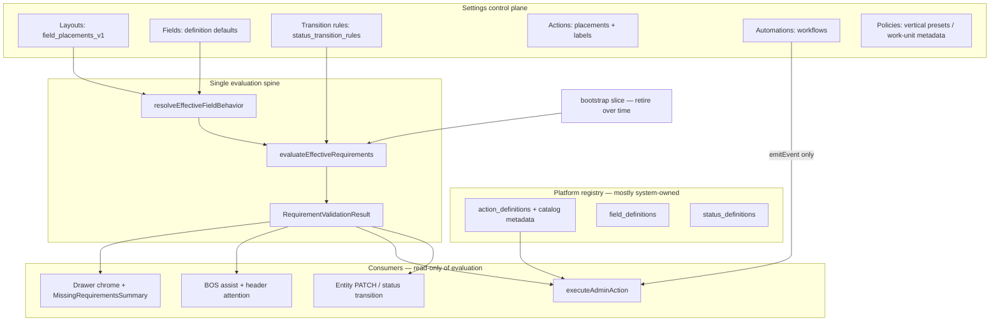

# Lifecycle Configuration & Requirements — Design Package v1

**Path:** `docs/sprints/archive/05_2026/lifecycle_configuration_requirements_design_package_v1.md`  
**Status:** Design package (audit). Implementation: **Phase 1 shipped** — see `web/lib/completion/evaluateEffectiveRequirements.ts`, `lifecycleActionRequirementCatalog.ts`, `adminActionPreflight.ts`, `POST /api/admin/actions/preflight`.  
**Date:** 2026-05-31  
**Sprint:** Lifecycle Configuration & Requirements (follows Lifecycle Alignment closeout)

**Inputs read:**

- `lifecycle_closeout.md`
- `requirement_workflow_configuration_schema_audit.md`
- `canonical_action_catalog_v1.md`
- `action_definition_legacy_mapping_v1.md`
- `person_drawer_runtime_layout_migration.md`
- `required_fields_completion_guardrails_policy.md`
- `required_fields_completion_guardrails_audit.md`
- `childcare_lifecycle_matrix_v1.md`
- `docs/system/configuration-system.md` (four-plane model)
- Code spot-check: `web/lib/completion/*`, `web/lib/fields/*`, `executeApproveEnrollmentAction.ts`, BOS catalog/handoff

---

## Executive summary

Alloy already has the **storage primitives** for a unified lifecycle configuration model. What is missing is **one runtime orchestrator**, **one operator authoring surface**, and **explicit binding** between canonical actions, requirements, workflows, layouts, and BOS.

| Concern | Canonical store (no new table in Phase 1–2) | Runtime today | Target |
|---------|---------------------------------------------|---------------|--------|
| Field/layout requirements | `field_placements_v1` + `field_definitions.requirement_policy` | Opportunity PATCH only; completion ignores layout | Unified evaluator on save + transition + action |
| Transition blockers | `status_transition_rules` + bootstrap code | Parallel paths | Merged `RequirementValidationResult` |
| Action capabilities | `action_definitions` + catalog metadata | Execute handlers + ad hoc validation | `required_before_action` + shared gates |
| Action surfacing | `action_placements` + `condition_config` | Visibility only | Same; BOS uses catalog keys |
| Workflow side effects | `workflows` / `workflow_actions` | Post-event execution | Reference actions; do not duplicate requirement logic |
| BOS guidance | Separate recommendation catalog | Prose keys, draft-message handoff | Read violations + map `recommended_action.key` → registry |

**Doctrine:** Requirements describe **what must be true**. Actions describe **what the operator (or workflow) may do**. Workflows describe **automated side effects after facts change**. Layouts describe **where fields appear and surface-level requiredness**. BOS describes **what to do next** by consuming the same evaluation output — not a parallel rules engine.

---

## 1. Architecture — unified configuration model

### 1.1 Conceptual layers



### 1.2 `EffectiveRequirementRule` (conceptual unit)

One evaluated rule, regardless of storage:

| Property | Purpose |
|----------|---------|
| `source` | `placement` · `definition` · `transition_rule` · `bootstrap` · `action_catalog` |
| `rule_key` | Stable id for Settings catalog + BOS copy |
| `entity_type` | `person` · `opportunity` · `inquiry_child` · `customer` · `household` |
| `field_key` | Optional — field-level rules |
| `requirement_type` | Sprint B vocabulary (`always_required`, `required_before_status_transition`, `required_before_action`, …) |
| `blocking_level` | `hard_block` · `soft_warning` · `recommendation` |
| `scope` | `status_to[]`, `action_key`, `layout_surface`, `profile_key`, `department_id`, `work_unit_id` |
| `predicate` | Optional v1 condition (`field_key`, `op`, `value`) |
| `side_effect` | Optional auto-populate spec (action-only; see §1.5) |

**No duplicate truth:** Do not encode the same gate in workflow JSON, action `payload_schema`, and bootstrap code. Pick one primary store per gate type (see §4).

### 1.3 Attachment model — how requirements bind

| Attachment surface | What it gates | Config home | Phase |
|--------------------|---------------|-------------|-------|
| **Layouts** | Save on drawer surfaces; preview in Assist | `field_placements_v1.surfaces.{surface}.requirement` | Extend person + more surfaces |
| **Field definitions** | Default/fallback when no placement | `requirement_policy` JSON | Keep as fallback |
| **Status transitions** | `status_to` (+ optional `from`, dept, WU) | Field policy `required_before_status_change` **or** `status_transition_rules` | Unify evaluation |
| **Actions** | Execute preflight for `action_key` | Field policy `required_before_action` + action-specific bootstrap (e.g. `approve_enrollment`) | Catalog + evaluator |
| **Workflows** | **Do not store requirements** | N/A — workflows **consume** facts after requirements pass | Workflows trigger on events |

**Workflow relationship (critical):**

- **Workflow-triggered requirements:** None. A workflow runs **after** `emitEvent` when business facts already changed. If a workflow needs data, the **transition or action** that emitted the event must have been blocked until requirements passed.
- **Workflow-generated actions:** Side effects in `workflow_actions` (`update_status`, `set_field`, `send_message`, …) — **not** new `action_placements`. Operator buttons remain registry + placements.
- **Workflow-generated field updates:** Allowed as **side effects** (e.g. set `enrollment_date` on approve). **Auto-populate** belongs in action execute handlers **or** workflow steps referencing the **same field keys** — document in action catalog, implement once.

### 1.4 Actions — capability vs placement vs gates

| Layer | Table / module | Operator-editable? | Owns |
|-------|----------------|-------------------|------|
| **Capability** | `action_definitions` (+ `payload_schema.catalog`) | Labels only (org); handlers system | `action_type`, execute routing, catalog metadata |
| **Placement** | `action_placements` | Yes (V1) | Where/when button visible (`condition_config`) |
| **Gates** | Completion + field policy + transition rules | Future Settings | Whether execute succeeds |

`condition_config` on definitions/placements = **visibility** (`status_key_in`, etc.) — **not** field requiredness.

### 1.5 Auto-populated outputs (action side effects)

Auto-populate is **not** a requirement; it is an **execute contract** documented per canonical action:

| Pattern | Example | Owner |
|---------|---------|-------|
| Stamp on successful execute | `approve_enrollment` → `enrollment_date`, child `enrollment_date` | `executeApproveEnrollmentAction` (+ optional workflow echo) |
| Modal payload → entity fields | `schedule_tour` → `tour_date`, `tour_time` in metadata | Tour booking + transition payload rules |
| Outcome-driven status | `record_tour_outcome` → status per outcome | Execute handler + workflow events |
| Form intake | Public form → opportunity fields | `validateFormPayload` (parallel until reconciled) |

**Rule:** Document in catalog `side_effects`; implement in **one** execute path. Workflows may repeat the same field writes only by calling shared helpers or emitting the same events — not re-deriving gates.

### 1.6 BOS consumption model

BOS should **not** maintain a second requirement engine.

| BOS need | Source |
|----------|--------|
| “What’s missing?” | `evaluateEffectiveRequirements` → `toBosCompletionRequirementPayload` |
| “What should I do?” | `operationalRecommendationCatalog` **mapped to** `action_definitions.key` |
| “Can I invoke it?” | Same evaluation with `phase: action` + `action_key` |
| Handoff mode | `bosAssistHandoffRouting` — prefer registry execute when `recommended_action.key` is canonical |

**Phase 5 target:** `recommended_action.key` = catalog key (`approve_enrollment`, `schedule_tour`, …). Legacy prose keys (`send_first_response`) → alias table (Appendix C in canonical catalog).

**Attention vs requirements:** Needs Attention (`opportunity_attention_rules`) = **signals** (staleness, SLA). Requirements = **blocking truth**. BOS copy merges both: signal explains *why now*; violations explain *what’s blocking*.

### 1.7 Vertical policy without duplicate systems

Childcare-specific **presets** (waitlist tiers, bucket labels, enrollment pipeline queue) live in:

- Work-unit / department **metadata** (e.g. `placement_priority_v1`) — **ranking**, not field requiredness
- Seeds / migrations for bootstrap rules until Settings authoring ships
- `payload_schema.catalog.lifecycle_stage` on actions — surfacing hints only

Platform modules stay industry-agnostic; childcare matrix (§7) is a **preset package**, not a forked evaluator.

---

## 2. Current-state audit

### 2.1 Configuration stores (schema)

| Store | Requirement-relevant content | Settings UI | Enforced on |
|-------|------------------------------|---------------|-------------|
| `field_definitions.requirement_policy` | Full `FieldRequirementPolicyV1` | De-emphasized on Fields; advanced modes locked in Layouts | Opportunity/job PATCH via `enforceDrawerFieldPoliciesOnPatch` |
| `field_placements_v1` | Per-surface requirement + interaction | Editable: opportunity workflow v1 only (3 presets) | Opportunity PATCH |
| `status_transition_rules` | `required_metadata_fields`, `required_payload_fields`, `blocked` | Read-only reference page | `validateStatusTransition` + completion bridge |
| `action_definitions` | `payload_schema`, `condition_config`, `workflow_id` | Catalog + org label; not gates | `executeAdminAction` |
| `action_placements` | Visibility overlays | Editable V1 | `resolveActionsForContext` |
| `workflows` + `workflow_actions` | Side effects | Automations hub | Post-`emitEvent` |
| `record_drawer_layouts` (person) | Variants, section order — **no** `field_placements_v1` | Preview only | Person layout composition |
| Work-unit metadata | Waitlist ranking policy | **Editable** (`placement-priority`) | Placement sort only |
| Forms schema | Field `required` | Forms hub | Submit paths only |

### 2.2 Runtime evaluators (parallel paths)

| Path | Module | Merges layout policy? | Produces `RequirementValidationResult`? |
|------|--------|----------------------|----------------------------------------|
| Drawer field PATCH | `enforceDrawerFieldPoliciesOnPatch` | Yes (opp) | No (legacy violation shape) |
| Person PATCH | `enforcePersonCompletionOnPatch` | No | Yes |
| Opportunity status / action | `enforceOpportunityCompletionOnStatusTransition` | No | Yes (+ transition rules) |
| Action execute | Handlers (`entryLifecycleActions`, `assertApproveEnrollmentAllowed`, …) | Partial | Partial |

**Gap:** Layout-configured requirements and completion bootstrap **do not share one evaluator** on opportunity save/transition (confirmed in requirement_workflow audit).

### 2.3 Actions — implementation vs catalog

From lifecycle closeout + catalog (May 2026):

| Bucket | Count | Notes |
|--------|------:|-------|
| Catalog keys with active execute | ~18 | Universal comms, entry, tour, enrollment placement ui_intents, `approve_enrollment` (gated) |
| Catalog stubs (`is_active=false`) | Remaining matrix keys | Phase 0A metadata |
| Legacy keys still placed | ~8 high-traffic | `quick_message`, `contact_attempted`, `mark_won`, etc. |
| BOS → action invoke | ~15% | Audit only; handoff uses prose keys + draft message |

**`approve_enrollment`:** Shipped with strict gate in `evaluateOpportunityCompletionRequirements` when `action_key === approve_enrollment` (classroom, schedule, child person link, plus shared enrolled transition rules). Auto-stamps `enrollment_date` on opportunity + child person field.

**`mark_won`:** Still active in some surfaces; **no** completion gates — migration plan in closeout, not executed.

### 2.4 BOS

| Component | Role | Uses unified requirements? |
|-----------|------|----------------------------|
| `operationalRecommendationCatalog.ts` | Copy templates + `recommended_action` prose keys | No |
| `buildOperationalRecommendationV1` | Wire payload for drawer/queue | No |
| `bosAssistHandoffRouting.ts` | draft_message vs workflow_assist | Partial — action_family heuristics |
| `bosIntegration.ts` | Export completion evaluators | **Ready** — under-consumed in UI |
| Drawer header attention | Chips + summary from recommendation | Parallel to completion panel |

### 2.5 Settings — four-plane inventory

| Surface | Exists | Editable | Notes |
|---------|--------|----------|-------|
| Fields registry | Yes | Yes | Structure; not primary requiredness for opp/job |
| Field grouping | Yes | Yes | No requirement semantics |
| Layouts — opportunity | Yes | Yes | Sections + `field_placements_v1` (3 presets) |
| Layouts — person | Yes | Read-only preview | Runtime v1 seeded; no field behavior |
| Completion guardrails panel | Yes | **Read-only** | Mirrors bootstrap catalog |
| Workflow automation rules | Yes | **Read-only** | `status_transition_rules` |
| Action buttons | Yes | Placements V1 | No `condition_config` editor |
| Statuses | Yes | Labels/definitions | Not transition requirements |
| Waitlist ranking policy | Yes | **Editable** | Placement ordering — separate from CRM requirements |
| Automations | Yes | Workflow defs | Not requirement authoring |
| Forms | Yes | Related hub | Parallel required model |

### 2.6 Person / employee

- Person layout runtime v1: section order/suppression **config-driven**; summary fields **hardcoded JSX**.
- Employee ID required-when-checked: **policy candidate only** — **not** in bootstrap catalog or evaluators.
- Employee families affect **waitlist ranking** (`tier_staff_community`), not field gates.

---

## 3. Gap analysis

### 3.1 Strategic gaps

| # | Gap | Impact | Priority |
|---|-----|--------|----------|
| G1 | **No single evaluator** | Double enforcement risk; BOS/layout disagree | P0 |
| G2 | **Completion ignores `field_placements_v1`** | Settings layout requiredness not honored on transition | P0 |
| G3 | **No Settings authoring for transition rules** | DB rules invisible/unchangeable | P1 |
| G4 | **Advanced requirement modes not in UI** | `conditionally_required`, `required_before_action` JSON-only | P1 |
| G5 | **Person `field_placements_v1` missing** | Person drawer policies code-only | P1 |
| G6 | **BOS prose keys ≠ catalog keys** | No one-click canonical execute | P1 |
| G7 | **Action gates split** (handler vs completion vs transition) | Inconsistent operator errors | P1 |
| G8 | **Forms vs drawer requiredness** | Intake vs CRM drift | P2 |
| G9 | **Org-configurable financial/paperwork policies** | Matrix describes; not configurable | P2 |
| G10 | **`mark_won` / legacy placements** | Ungated enroll path | P1 |
| G11 | **Workflow requirement duplication risk** | Future sprawl if workflows encode gates | P0 doctrine |
| G12 | **Cross-entity rules in code only** | Inquiry children, household primary | P2 |

### 3.2 Per-question gaps (sprint prompt)

| Question | Today | Gap |
|----------|-------|-----|
| Requirements on layouts | Opp `drawer_overview` only | Person/job surfaces; completion merge |
| Requirements on actions | `approve_enrollment` bootstrap; `required_before_action` parsed not wired broadly | Catalog-wide action preflight |
| Requirements on transitions | `status_transition_rules` + bootstrap | No author UI; not merged with field policies |
| Requirements on workflows | N/A (correct) | Document + enforce: workflows = side effects |
| Workflow-generated actions | Does not exist | Intentionally out of scope |
| BOS same config model | Types exist; catalog separate | Wire evaluation + canonical keys |
| Settings editable | Partial (layouts, placements, ranking) | Transition rules, conditional reqs, policy toggles |

---

## 4. Recommended schema approach

### 4.1 Phase 1–2: no new tables

Extend existing JSON + one orchestrator (per `requirement_workflow_configuration_schema_audit.md`):

| Need | Schema home |
|------|-------------|
| Layout-level requiredness | `field_placements_v1` — extend surfaces (`drawer_overview`, future `inquiry_children`, person variants) |
| Conditional requiredness | `FieldRequirementPolicyV1.condition` (+ optional `conditions[]` v2 later) |
| Transition payload/metadata | `status_transition_rules` (existing columns) |
| Per-field transition/action gates | `requirement_policy.mode` + `status_keys` / `action_keys` |
| Action catalog metadata | `action_definitions.payload_schema.catalog` (already seeded) — add `requirement_rule_keys[]` reference optional |
| Org policy toggles | `departments.metadata` or `work_units.metadata` — **boolean/feature flags only**, not field-level truth |

### 4.2 Optional Phase 3 normalization

Consider `completion_requirement_rules` or `field_placement_policies` table **only if**:

- Audit/reporting across orgs requires SQL queries
- Agent/BOS bulk-apply volume exceeds JSON patch ergonomics

Until then, **`rule_key` + `source`** on `RequirementViolation` is sufficient for BOS + Settings catalog sync.

### 4.3 `status_transition_rules` vs field policy

| Use `status_transition_rules` when | Use field `requirement_policy` when |
|-----------------------------------|-------------------------------------|
| Keys must exist in **payload** at transition time (`tour_date`, `lost_reason`) | Field must be **non-empty on entity** before `status_to` |
| Block transition entirely (`blocked: true`) | Conditional on another field’s value |
| Scoped by `action_key` + dept + WU | Scoped by layout surface / profile |

**Avoid duplicating:** e.g. `tour_date` in both bootstrap code and transition rules — pick DB rule + retire bootstrap when authored.

### 4.4 Action catalog schema additions (metadata only)

Recommend extending `payload_schema.catalog` (not new columns):

```json
{
  "catalog_version": "v1",
  "lifecycle_stage": "enrollment",
  "requirement_gates": {
    "hard_fields": ["program_room_cohort_key", "desired_schedule_type", "desired_start_date"],
    "soft_fields": [],
    "transition_status_to": "enrolled",
    "policy_keys": ["enrollment_operational.packet_approved_required"]
  },
  "auto_populate": [
    { "field_key": "enrollment_date", "entity": "opportunity", "value": "today" }
  ],
  "invoke_phases": ["button", "workflow", "api"]
}
```

Runtime still enforces via evaluator — catalog is **documentation + BOS hints**, not a second engine.

---

## 5. Recommended runtime approach

### 5.1 Rename / unify orchestrator

Introduce **`evaluateEffectiveRequirements`** (or expand `evaluateCompletionRequirements`) to:

1. Resolve entity context (profiles, children, household).
2. Load **effective field policies** via `resolveEffectiveFieldBehavior` for relevant surfaces.
3. Evaluate field policies in phase (`save` | `status_change` | `action`) including `required_before_status_change`, `required_before_action`, `conditionally_required`.
4. Merge **`validateStatusTransitionStructured`** results.
5. Apply **bootstrap slice** only for rules not yet in config (diminishing over time).
6. Return **`RequirementValidationResult`** with `source` on each violation.

### 5.2 Consumer contract

| Consumer | Call pattern |
|----------|--------------|
| Opportunity PATCH | `phase: save` — replace or delegate from `enforceDrawerFieldPoliciesOnPatch` |
| Person PATCH | `phase: save` — existing path + layout policies when person placements exist |
| Status transition (PATCH or action) | `phase: status_change`, `status_to`, optional `action_key` |
| `executeAdminAction` | `phase: action`, `action_key` — **preflight** before handler; handler keeps idempotent side effects |
| BOS Assist / header | `phase: preview` — all `recommendation` + `soft_warning`; hard_block for “blocked” copy |
| Settings preview | Same as BOS preview |

### 5.3 Blocking level defaults (product-tunable)

| Trigger | Default blocking | Override store |
|---------|------------------|----------------|
| `always_required` | hard_block | Org policy (future) |
| `required_on_save` | soft_warning (person email/phone) or hard_block (opp) | Config |
| `required_before_status_transition` | hard_block | Config |
| `required_before_action` | hard_block | Config |
| Layout integrity (hidden required field) | diagnostic only | N/A |

### 5.4 Workflow runtime (unchanged semantics)

```
Operator/UI → executeAdminAction OR PATCH
    → evaluateEffectiveRequirements (preflight)
    → mutate entity + emitEvent
    → executeWorkflowRun(workflow_actions)
```

Workflow actions **must not** bypass preflight. If a workflow needs to set status without operator action, use **system context** with explicit `action_key: system` and platform-invariant rules only.

### 5.5 BOS wiring sequence

1. On drawer load / attention refresh: run preview evaluation → violations list in Assist.
2. Map catalog `recommended_action.key` to `action_definitions.key` (alias table for legacy).
3. `BosDrawerAssistCta` / header Actions: if evaluation passes for `action_key`, show execute; else show missing requirements with `toBosCompletionRequirementPayload`.
4. Keep draft-message path for **communication-first** recommendations without execute stub.

### 5.6 Implementation phases (recommended)

| Phase | Deliverable | New table? |
|-------|-------------|------------|
| **0** | Product sign-off on blocking matrix (§7) + hard_block policy | No |
| **1** | Unified evaluator + merge opportunity PATCH paths | No |
| **2** | Settings: transition rules editor + layout advanced modes | No |
| **3** | Person `field_placements_v1` + PATCH API | No |
| **4** | BOS canonical action keys + preflight handoff | No |
| **5** | Retire bootstrap rules → config; catalog `requirement_gates` metadata | No |
| **6** | Org policy toggles (paperwork, fees) | Optional metadata only |
| **7** | Normalized rules table (if needed) | Maybe |

---

## 6. Settings design proposal

### 6.1 New hub: **Requirements** (or expand Layouts)

Single operator mental model: **“What must be true, when?”**

| Tab | Content | Editable | API |
|-----|---------|----------|-----|
| **By lifecycle stage** | Matrix view (§7) filtered by stage | View + drill-down | Read composite evaluation |
| **By field** | Effective policy per `field_key` | Yes | Existing field-placements PATCH + future person |
| **By transition** | `status_transition_rules` rows | **New: Yes** | New POST/PATCH admin routes |
| **By action** | Gates per catalog `action_key` | Partial | Links to field rules + catalog metadata |
| **System rules** | Bootstrap catalog with “migrating to config” badge | Read-only until empty | — |

Do **not** add workflow requirement editing — link to Automations with explanation.

### 6.2 Keep four-plane separation

| Plane | Requirements role |
|-------|-------------------|
| **Fields** | Structure; link “Required behavior → Requirements hub” |
| **Layouts** | Surface-level overrides (presets + advanced) |
| **Actions** | Placements only; show “Execute requires” read-only from evaluator |
| **Automations** | Side effects; show “Runs after requirements satisfied” |

### 6.3 Editable vs system-owned

| Config | Editable by operator | System-owned |
|--------|---------------------|--------------|
| Layout requiredness presets | Yes | — |
| Conditional predicates (guided) | Yes (Phase 2) | Predicate ops vocabulary |
| Transition payload/metadata rules | Yes (Phase 2) | `entity_type` enum |
| Action placement / label | Yes | `action_type`, handlers |
| Action catalog keys / handlers | — | Platform |
| Bootstrap cross-entity rules | — | Until migrated |
| `executeAdminAction` routing | — | Platform |
| Waitlist ranking factors | Yes | Bucket semantics in preset |
| Financial/paperwork **policy toggles** | Yes (future) | Billing integration |
| BOS catalog templates | — | Platform (copy versioning) |
| `drawerFieldPolicyAdapter` caps | — | System fields never policy-controlled |

### 6.4 Integrity & diagnostics

- Retain **layout integrity** panel: required-but-hidden fields.
- Add **requirement consistency** check: same field_key, different blocking levels across placement vs bootstrap → warning for admins.

### 6.5 BOS/agent readiness

Same PATCH routes as humans (`configuration-system.md`). Agents write `field_placements_v1` and `status_transition_rules` — never raw React or workflow JSON for requirements.

---

## 7. Childcare lifecycle requirement matrix

Operator-facing matrix aligned to `childcare_lifecycle_matrix_v1.md` and canonical actions.  
**Legend:**  
- **R** = required (hard_block)  
- **S** = soft_warning  
- **Rec** = recommendation only  
- **Auto** = system auto-populate on success  
- **Cfg** = org-configurable policy (future)  
- **Code** = bootstrap/handler today  
- **—** = not required

### 7.1 Global attachment patterns (examples from sprint)

| Trigger | Required when | Attachment | Store |
|---------|---------------|------------|-------|
| Employee checked | `is_employee = true` → Employee ID | Person save / status | `conditionally_required` on `employee_id` (future) |
| Approve Enrollment | Classroom, schedule, start date, child identity | `required_before_action` + transition to `enrolled` | Field policy + completion bootstrap |
| Move To Waitlist | Child + program + location interest | `required_before_status_transition` | Bootstrap (move_to_waitlist execute missing) |
| Tour Completed | Tour completed date | Auto on outcome | `record_tour_outcome` execute / booking API |
| Schedule Tour | Tour date + time in payload | Transition rule | `status_transition_rules` (seeded) |

### 7.2 Stage matrix — requirements

| Stage / Status keys | Field / entity requirement | Type | Blocking | Source today | Target store |
|---------------------|---------------------------|------|----------|--------------|--------------|
| **New Lead** (`new_inquiry`) | Parent first + last name | R | hard | `create_lead` handler | `required_before_action:create_lead` |
| | Phone or email | R | hard | `create_lead` handler | same |
| | Primary contact (opp) | R | hard | Code | bootstrap → field policy |
| **Qualification** | Parent phone or email | R | S/hard | Code (partial) | `required_on_save` |
| | Child name, DOB, desired start, schedule | R | hard before waitlist/tour | Code (partial) | config transition |
| **Tour** (`tour_scheduled`, …) | Tour date + time | R | hard | Code + transition rules | `status_transition_rules` |
| | Parent contact for reminders | R | S | — | config |
| | Tour completed date | Auto | — | Booking/outcome API | action side effect |
| **Waitlist** | Child age/program, start, schedule, location | R | hard | Code (enrolled path overlap) | `move_to_waitlist` gates |
| | Waitlist fee | Cfg | hard if policy | — | org metadata policy |
| **Enrollment** | Primary contact + ≥1 child | R | hard | Code | bootstrap |
| | Classroom (`program_room_cohort_key`) | R | hard on approve | Code (`approve_enrollment`) | `required_before_action` |
| | Schedule (`desired_schedule_type`) | R | hard on approve | Code | same |
| | Start date (`desired_start_date`) | R | hard | Code | same |
| | Child person link | R | hard on approve | Code | same |
| | Packet approved | Cfg | hard if policy | **Deferred** (closeout) | org policy key |
| | Registration fee / deposit | Cfg | hard if policy | — | financial module |
| **Active** (`enrolled`) | Start, classroom, schedule | R | Rec/hard | Code (child status) | config |
| **Lost** | Lost reason | R | hard | transition + `mark_lost` | `status_transition_rules` |
| **Withdrawn** | Withdrawal date + reason | R | hard | — | person/member actions (missing) |
| **Person child** | DOB before active/enrolled | R | hard | Code | bootstrap → config |
| **Person parent** | Email or phone | S | soft | Code | config |
| **Household** | Primary contact when guardians | R | hard | Code | bootstrap |
| **Employee** | Employee ID when `is_employee` | R | — | **Not implemented** | `conditionally_required` |

### 7.3 Stage matrix — canonical actions (catalog review)

**Universal (all active pipeline stages unless hidden):**

| action_key | Required inputs | Required fields (entity) | Auto-populate | Stage restrictions | Status |
|------------|-----------------|--------------------------|---------------|-------------------|--------|
| `call_parent` | Phone on record | parent phone | — | universal | existing |
| `send_email` | Recipient email | parent email | — | universal | existing |
| `send_sms` | SMS-capable phone | parent mobile | — | universal | existing |
| `add_note` | Note body | — | activity | universal | existing |
| `create_task` | Title | — | task row | universal | existing |
| `upload_document` | File, doc type | — | document row | enrollment+ (policy) | existing |
| `send_form` | Form id, delivery contact | parent contact method | form link | universal | existing |

**Entry & early pipeline:**

| action_key | Required inputs | Required fields | Auto-populate | Restrictions | Status |
|------------|-----------------|-----------------|---------------|--------------|--------|
| `create_lead` | first_name, last_name, phone\|email | — | opp `new_inquiry`, person+customer | entry | existing |
| `move_to_qualification` | — | parent phone\|email, identity | status → `qualification` | new_lead | existing |
| `schedule_tour` | tour date, time, location | contact for reminders | booking, status → `tour_scheduled` | qualification, waitlist | existing |
| `move_to_waitlist` | — | child, program, start, schedule, location | status → `waitlisted`, placement candidate | multi | **missing** |
| `mark_lost` | lost_reason | — | status → `lost` | multi | existing |

**Tour:**

| action_key | Required inputs | Required fields | Auto-populate | Restrictions | Status |
|------------|-----------------|-----------------|---------------|--------------|--------|
| `confirm_tour` | confirmable booking | active booking | booking confirmed | tour | existing |
| `reschedule_tour` | booking, new slot | — | metadata/tour_date | tour | existing |
| `record_tour_outcome` | outcome enum | completed/no-show booking | status per outcome; **tour completed date** | tour | existing |
| `send_enrollment_packet` | packet def, recipient | contact | packet session | tour, waitlist, enrollment | partial |

**Waitlist:**

| action_key | Required inputs | Required fields | Auto-populate | Restrictions | Status |
|------------|-----------------|-----------------|---------------|--------------|--------|
| `contact_family` | channel | contact | activity | waitlist | missing |
| `remove_from_waitlist` | — | status waitlisted | status change | waitlist | missing |
| `collect_waitlist_fee` / `waive_waitlist_fee` | policy | — | invoice/waiver | waitlist | missing |

**Enrollment:**

| action_key | Required inputs | Required fields | Auto-populate | Restrictions | Status |
|------------|-----------------|-----------------|---------------|--------------|--------|
| `review_enrollment_packet` | pending session | — | review decision | enrollment; runtime gating | existing |
| `request_missing_information` | missing field set | — | comms/task | enrollment | existing |
| `approve_enrollment` | — | classroom, schedule, start date, child identity, primary contact, children | **`enrollment_date`** (opp + child) | enrollment → `enrolled` | existing (gated) |
| `assign_classroom` | cohort key | program_room_cohort_key | — | enrollment | existing (ui_intent) |
| `assign_schedule` | schedule type | desired_schedule_type | — | enrollment | existing |
| `set_start_date` | date | desired_start_date | — | enrollment | existing |
| `reserve_spot` | capacity policy | child member | placement hold | enrollment | stub/deferred |
| Financial quartet | policy | — | payment records | enrollment | missing |

**Exit / active:**

| action_key | Required inputs | Required fields | Auto-populate | Restrictions | Status |
|------------|-----------------|-----------------|---------------|--------------|--------|
| `withdraw_child` | date, reason | — | member withdrawn | active | missing |
| `reopen_lead` | reason (optional) | status lost | status reopen | lost | missing |
| `reenroll_child` | policy | child identity | new/reopened opp | withdrawn | missing |

### 7.4 BOS signal → requirement → action chain

| BOS catalog / signal | Underlying requirement | Canonical action | Readiness |
|--------------------|------------------------|------------------|-----------|
| Stale new inquiry | Parent contact method | `send_email` / `send_sms` / `call_parent` | Partial (comms only) |
| Tour date passed | Tour outcome or reschedule | `record_tour_outcome` / `reschedule_tour` | Partial |
| Packet review pending | Session in review state | `review_enrollment_packet` | Gated in resolver |
| Placement incomplete | Classroom/schedule/start | `assign_*`, `set_start_date` | Not wired |
| Ready to enroll | Approve gates pass | `approve_enrollment` | Gated; BOS not wired |
| Missing documents | Packet correction | `request_missing_information` | Not wired |
| Waitlist opening | Contact family | `contact_family` | Missing action |

### 7.5 Workflow vs action (enrollment examples)

| Business event | Requirement gate | Workflow side effect (after pass) |
|----------------|----------------|-----------------------------------|
| Tour scheduled | `tour_date`, `tour_time` in payload | Reminder workflow |
| Enrollment approved | Approve gates | Welcome email workflow; `enrollment_date` Auto |
| Moved to waitlist | Waitlist field gates | Activity + placement candidate (orchestration) |
| Packet submitted | — (form validation) | Review task / attention signal |

---

## 8. Action ↔ requirement binding specification

### 8.1 Recommended binding rules

| Mechanism | Bind requirements to |
|-----------|---------------------|
| `required_before_action` + `action_keys: ["approve_enrollment"]` | Field-level gates on OCM/person/opp fields |
| `status_transition_rules.action_key` | Payload keys when transition initiated by that action |
| `status_transition_rules.to_status_key` | Metadata keys (no action) |
| Execute handler validation | **Only** for structural inputs (note body, modal selections) — migrate field gates to evaluator |
| `condition_config` | **Never** requirements — visibility only |

### 8.2 Anti-patterns (explicit non-goals)

- Encoding requiredness only in `workflow_conditions` (trigger gating ≠ data validation).
- Duplicating `approve_enrollment` checks inside workflow_actions.
- New BOS-specific requirement tables.
- Per-org custom `action_type` handlers in Settings.
- DB CHECK constraints on custom fields (keep server validation).

---

## 9. Risks and open product decisions

| Decision | Options | Recommendation |
|----------|---------|----------------|
| Packet approved before enroll | Hard gate vs BOS-only sequence | Defer hard gate (closeout); org policy key later |
| `mark_won` demotion | Big-bang vs shadow | Shadow complete; execute demotion migration |
| Bootstrap retirement order | Opp transitions first vs person | Opp + approve path first (highest risk) |
| Forms vs drawer | Unified evaluator vs linked | Phased reconcile; forms keep submit validation short-term |
| Cross-entity rules | Code vs composite config rows | Code + toggles until normalization proven |
| Financial gates | Action preflight vs billing module | Billing owns truth; actions call billing readiness API |

---

## 10. Suggested review checklist

- [ ] Approve unified evaluator architecture (§1, §5)
- [ ] Approve no new tables for Phase 1–2 (§4)
- [ ] Approve Settings **Requirements** hub scope (§6)
- [ ] Approve childcare matrix blocking levels (§7.2)
- [ ] Approve canonical action gate table (§7.3) as product source for migrations
- [ ] Approve BOS → catalog key mapping priority (§5.5, §7.4)
- [ ] Approve workflow side-effect-only doctrine (§1.3, §8)
- [ ] Decide packet/financial org-policy timing (§9)

---

## 11. Related documents (implementation deferred)

| Doc | Role |
|-----|------|
| `requirement_workflow_configuration_schema_audit.md` | Schema inventory (subset merged here) |
| `required_fields_completion_guardrails_policy.md` | Vocabulary + blocking doctrine |
| `canonical_action_catalog_v1.md` | Action authority |
| `lifecycle_closeout.md` | Prior sprint gaps |
| `childcare_lifecycle_matrix_v1.md` | Operator lifecycle language |
| `waitlist_ranking_policy_settings_v2.md` | Placement policy (orthogonal) |
| `docs/system/configuration-system.md` | Four-plane Settings model |

---

## Acceptance (this deliverable)

- [x] Architecture document (§1)
- [x] Current-state audit (§2)
- [x] Gap analysis (§3)
- [x] Recommended schema approach (§4)
- [x] Recommended runtime approach (§5)
- [x] Settings design proposal (§6)
- [x] Childcare lifecycle requirement matrix (§7)
- [x] No code, migrations, or implementation

**Next step after review:** Phase 0 product sign-off on §7 blocking matrix, then Phase 1 unified evaluator implementation sprint.
