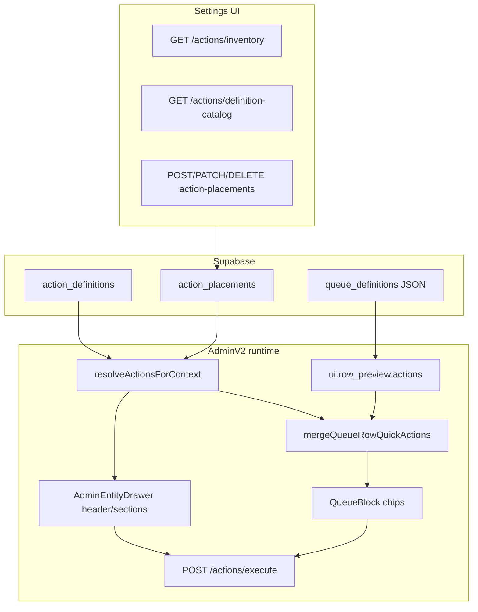

# Action Button Configuration UX + Runtime Sprint (May 2026)

## Card 0 — Audit + source-of-truth map

### Proposed source of truth

| Layer | Source | Responsibility |
|-------|--------|----------------|
| **Action definition** | `action_definitions` (Supabase) + seeds | Key, label, `action_type`, handler payload, `is_active` |
| **Action placement** | `action_placements` (Supabase) + seeds | Surface, slot, scope (`department_id`, `work_unit_id`, `section_key`), order, enabled |
| **Runtime resolve** | `resolveActionsForContext.ts` → `GET /api/admin/actions` | Filter placements + conditions for a surface/context |
| **Queue row preview chips** | Queue definition `ui.row_preview.actions` **merged with** `queue_row` placements | Communication shortcuts (Message) + registry buttons (Update status, tours, etc.) |
| **Drawer/header** | Same registry via `record_header` / `record_section` | `AdminEntityDrawer` + section registry components |
| **Settings** | `GET /api/admin/actions/inventory`, `definition-catalog`, placement CRUD | Org placement create/edit/remove only — no new handlers |
| **Static fallback** | `enrollmentPipelineQueueDefinitionV1.ts`, `queueUiConfig.ts` defaults | Default queue UI when org queue definition JSON lacks `ui.row_preview`; must not override disabled org placements |

### Architecture (runtime)



### Audit answers

1. **Current source of truth?**  
   **Intended:** Supabase `action_definitions` + `action_placements` for all registry-backed buttons; queue definition JSON for row preview action *tokens* (`open`, `message`, legacy `call`/`email`).  
   **Drift:** Queue row registry placements were resolved server-side but **not merged into row chips** (handler existed for `source: "action_registry"` only).

2. **Where do queue row buttons come from today?**  
   - **Primary (work-unit queue):** `queueUi.row_preview.actions` → `buildQueueRowPreviewQuickActionsFromConfig` in work-unit page `queueModel` (`page.tsx`).  
   - **Enrollment canonical default:** `CANONICAL_ENROLLMENT_PIPELINE_QUEUE_DEFINITION_V1` → `["open", "message"]`.  
   - **Legacy fallback path:** `defaultOpportunityQueueItemVm` in `realWorkUnitFromOpportunities.ts` still hardcodes Conversation had / Schedule tour / Lost for non-enrollment-shaped lanes.  
   - **Registry (loaded but not shown):** `GET /api/admin/actions?surface=queue_row` → `opportunityQueueRowResolved` — click handler only, no chip render.

3. **Where do drawer/header buttons come from?**  
   `GET /api/admin/actions?surface=record_header|record_section` → `AdminEntityDrawer` / `OpportunityRecordSectionRegistryActions` → `applyRegistryResolvedActionClient` or execute API. Separate from queue preview tokens.

4. **Executable actions (representative)**  
   | Key | Type | Handler |
   |-----|------|---------|
   | `open_record` | open_drawer | Client drawer |
   | `update_status_add_note` | open_form | Work-unit modal + execute `update_status` |
   | `schedule_tour` / `reschedule_tour` | open_form / start_workflow | Form + workflow |
   | `contact_attempted` | open_form | Form |
   | `mark_lost` / `mark_won` | start_workflow / update_status | executeAdminAction |
   | `add_child`, `add_sibling`, `add_family_member` | open_form | Form modals |
   | Message (queue) | preview token `message` | `crm_message` → Quick Message modal |

5. **Placeholder / internal (hide from Settings)**  
   `send_message_placeholder`, `send_paperwork_placeholder`, `convert_to_enrolled_placeholder`, `add_to_waitlist_placeholder`, keys ending `_placeholder`, `ui_intent` with placeholder intent.

6. **Static fallbacks that can override Supabase**  
   - Org **queue definition JSON** in DB with `ui.row_preview.actions: ["open","call","email"]` overrides canonical file until updated.  
   - `getQueueUiConfig` defaults to `["open"]` only when JSON missing.  
   - Platform **global** placements (`org_id` null) cannot be deleted in Settings; org can add override placement or disable org-owned copy.  
   - Seeds re-insert platform placements on migration (idempotent `WHERE NOT EXISTS`) — will not resurrect **org-disabled** rows.

7. **What must change for config-driven runtime?**  
   - Merge `queue_row` registry placements into `QueueItemVm.quickActions`.  
   - Normalize enrollment preview actions (drop Call/Email).  
   - Settings: remove placement + catalog filter executable-only.  
   - Document dual-source merge for queue rows.

### Why Call/Email still appeared

- Queue definition JSON (org DB) or older static config still listing `call` / `email` in `ui.row_preview.actions`.  
- `buildQueueRowPreviewQuickActionsFromConfig` faithfully renders those tokens when present.  
- Registry path did not replace them with Message.

### Why Update Status disappeared

- `update_status_add_note` is seeded on `surface=queue_row`, `slot=row_inline` (migrations `20260430226000`, `20260430230000`).  
- Registry list was fetched into `opportunityQueueRowResolved` but **never rendered** on row chips — only drawer/header placements were visible.

### Settings dropdown source

`GET /api/admin/actions/definition-catalog` → `filterSettingsActionCatalogDefinitions` in `actionButtonCreateUi.ts` (placeholder key filter).

### Key files

| Area | Path |
|------|------|
| Resolve | `web/lib/admin/actions/resolveActionsForContext.ts` |
| Execute | `web/lib/admin/actions/executeAdminAction.ts` |
| Registry client | `web/lib/admin/actions/applyRegistryResolvedActionClient.ts` |
| Queue merge | `web/lib/workspace/viewModels/mergeQueueRowQuickActions.ts` |
| Preview chips | `web/lib/workspace/viewModels/queueRowPreviewQuickActions.ts` |
| Settings | `web/components/adminV2/settings/ActionPlacementsSettingsClient.tsx` |
| APIs | `web/app/api/admin/action-placements/**`, `web/app/api/admin/actions/**` |
| Work unit | `web/app/adminV2/workspace/dept/.../work-unit/[workUnitId]/page.tsx` |
| Quick Message | `web/lib/adminV2/quickMessageLaunch.ts` |

### Acceptance (Card 0)

- [x] Architecture map and drift points documented  
- [x] Call/Email and Update Status root causes identified  
- [x] Settings catalog source identified  

---

## Implementation cards (1–7)

See `docs/archive/2026-06-superseded-system/actions-and-workflows.md` (Action buttons section) for post-sprint operator-facing summary.

### Verification commands

Tests run from the `web/` package (there is no root `npm test`):

```bash
cd web && npm run test -- tests/ui-v2/enrollmentQueueRowPreviewPolicy.test.ts tests/workspace/mergeQueueRowQuickActions.test.ts tests/adminV2/enrollmentWorkUnitQueueActions.test.ts tests/admin/actionButtonLibraryChooser.test.ts
```

Typecheck: `cd web && npx tsc --noEmit`

Migrations: `supabase db push` (action-definition seeds use `WHERE NOT EXISTS`, not `ON CONFLICT (org_id, key)` — see `docs/archive/2026-06-superseded-system/actions-and-workflows.md`).
