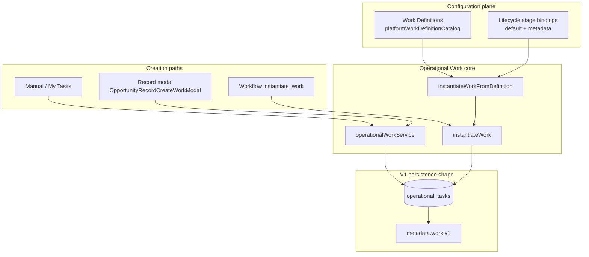

# Operational Work + Opportunity Action Execution — Sprint Closeout

**Path:** `docs/sprints/archive/06_2026/completed/operational_work_and_action_execution_closeout.md`  
**Date:** 2026-06-03  
**Status:** **Closed — promoted to `staging`**  
**Branch:** `staging` (includes `48e0cf48` Operational Work bundle + VM drawer action execution fixes `7a69bdab`, `52b71bcf`)

**Planning docs (sprint inputs, not moved):**

- [`../operational_work_framework_v1.md`](../operational_work_framework_v1.md)
- [`../operational_work_v1_implementation_plan.md`](../operational_work_v1_implementation_plan.md)
- [`../operational_work_v1_phase_b_implementation_plan.md`](../operational_work_v1_phase_b_implementation_plan.md)
- [`../operational_work_v1_phase_c_instantiate_work_plan.md`](../operational_work_v1_phase_c_instantiate_work_plan.md)
- [`../operational_work_v1_ux_placement_audit.md`](../operational_work_v1_ux_placement_audit.md)
- [`../tasks_v2_operational_work_framework.md`](../tasks_v2_operational_work_framework.md)
- [`../operational_work_creation_model_discovery.md`](../operational_work_creation_model_discovery.md)

**Related closeouts:**

- [`readiness_phase_1_closeout.md`](./readiness_phase_1_closeout.md)
- [`lifecycle_builder_hardening_closeout.md`](./lifecycle_builder_hardening_closeout.md)
- [`lifecycle_canonical_vocabulary.md`](./lifecycle_canonical_vocabulary.md)

---

## 1. Executive Summary

### Problem

Alloy operators needed a **durable, platform-owned model for human obligations** — not ad hoc task rows scattered across UI surfaces, and not conflated with Readiness evaluation or Needs Attention surfacing. At the same time, opportunity drawer **registry actions** (Create Task, Schedule Tour, Record Tour Outcome, etc.) had regressed during AdminV2 VM drawer cutover: modals never opened, success was silent, and refreshes were overly broad.

### Why this sprint mattered

This sprint established **Operational Work** as Alloy's execution home for human obligations and wired the first end-to-end creation paths (manual, record-level, workflow-driven). Without this layer, Lifecycle and Readiness could describe *what should be true*, and Needs Attention could surface *awareness*, but the platform had no canonical place to track *what someone should do next* and whether it was done.

The VM drawer action fixes restored operator trust in the primary enrollment CRM surface — the place where most operational work is created and completed today.

### Major milestone achieved

**Operational Work is now a first-class platform primitive.**

Alongside Lifecycle, Readiness, Needs Attention, Actions, and BOS, Operational Work now forms part of Alloy’s core operating model and is expected to remain a long-lived platform capability rather than a feature-specific implementation.

Before this sprint, Alloy could identify issues, evaluate readiness, and surface awareness — but it did not have a canonical execution framework for human obligations. Operational Work fills that gap.

The platform can now:

- Define work
- Create work
- Assign work
- Complete work
- Deduplicate work
- Track provenance
- Create work from workflows
- Surface work across operator experiences

This is not a UI polish pass or a task-list refactor. It is a durable platform layer that future modules — enrollment, billing, compliance, subsidy, and beyond — can build on without inventing parallel obligation models.

### First complete execution loop

Alloy now has its first complete end-to-end execution loop:

```
Lifecycle
        ↓
Event
        ↓
Workflow
        ↓
Operational Work
        ↓
Human Action
        ↓
System Update
```

Previous systems could evaluate conditions and surface awareness. Operational Work introduces a durable mechanism for **assigning responsibility** and **tracking completion**.

The enrollment tour path demonstrates this loop in production: a record moves through lifecycle stages, a tour-scheduled event fires a workflow, the workflow instantiates `record_tour_outcome` work, an operator completes that obligation (and may execute registry actions such as recording the outcome), and underlying record truth updates — after which lifecycle, readiness, and attention signals re-evaluate from authoritative state.

### Fit in the Alloy operating model

Readiness, Needs Attention, and Operational Work are **complementary and intentionally separate**:

- **Readiness** identifies what is missing.
- **Needs Attention** identifies what requires awareness.
- **Operational Work** identifies, assigns, and tracks what someone must do.

Readiness does not create work. Needs Attention does not create work. Operational Work does not determine readiness.

Each layer answers a different operator question. Together they form Alloy's evaluation → awareness → execution stack without collapsing responsibilities into a single system.

| Layer | Role | Relationship to Operational Work |
|-------|------|----------------------------------|
| **Lifecycle** | Configured stage flow for records | Work Definitions may bind to lifecycle stages (catalog defaults); work instances carry lifecycle context snapshots at creation but do not own stage truth |
| **Readiness** | Evaluates required information | **Never creates work**; work may reference readiness gaps as context; completing work does not imply readiness satisfied |
| **Needs Attention** | Surfaces operational awareness | **Never creates work**; overdue/unfulfilled work may project attention signals |
| **Operational Work** | Tracks human obligations | **Execution home** — Work Definitions → Work Instances → assignee/due/status |
| **Actions** | Executes side effects (`executeAdminAction`) | `create_task` opens record work modal; other actions mutate truth; work completion is separate from action execution |
| **Automations / Workflows** | Event-driven orchestration | `instantiate_work` workflow action creates deduped work instances with workflow provenance |
| **BOS** | Assist / recommend | May reference open work and suggested actions; does not own work persistence |

**Locked spine (unchanged):**

```
Signals (lifecycle, readiness, attention, events, schedules)
        ↓
Work Definition (config — outcome intent, category, suggested actions)
        ↓
Work Instance (runtime — assignee, due, status, subject link)
        ↓
Operator completes work ──optional──▶ Actions / Workflows mutate truth
        ↓
Signals re-evaluate → attention may clear; readiness may improve
```

---

## 2. Operational Work Framework Summary

### Architecture overview



### Work Definitions

**Location:** `web/lib/admin/operationalWork/platformWorkDefinitionCatalog.ts`

Platform-owned catalog entries describe reusable work templates:

| Field | Purpose |
|-------|---------|
| `key` | Stable identity (`manual_ad_hoc`, `contact_family`, `record_tour_outcome`, …) |
| `display_name` / `description` / `outcome_intent` | Operator and builder semantics |
| `default_shape` | V1: `"task"` only |
| `category` | follow_up, tour, intake, other, … |
| `due_policy` | e.g. offset from create |
| `assignee_policy` | creator, record_owner (schema supports role; not resolved in V1) |
| `allowed_subjects` | entity types work may attach to |
| `dedupe_policy` | none \| definition_subject \| definition_subject_period |
| `suggested_action_keys` | Registry actions that pair with this definition |
| `platform_enabled` | Gate for picker visibility |

**Stage bindings:** `PLATFORM_DEFAULT_WORK_DEFINITION_STAGE_BINDINGS` filters picker options by lifecycle stage when no custom metadata exists.

### Work Instances

**V1 shape:** rows in `operational_tasks`, enriched with **Operational Work view** via `attachOperationalWorkView` / `metadata.work` v1.

| Concept | V1 mapping |
|---------|------------|
| Work Instance | `operational_tasks` row |
| Subject link | `entity_type` + `entity_id` |
| Assignee | `assigned_to_user_id` |
| Due | `due_at` |
| Status | open / completed / canceled |
| Definition key | `metadata.work.work_definition_key` |
| Provenance | `metadata.work.provenance` |
| Dedupe key | `metadata.work.dedupe_key` |

### `instantiateWork`

**Location:** `web/lib/admin/operationalWork/operationalWorkService.ts`

Canonical server entry for **programmatic** work creation (workflows, future automations):

1. Normalize provenance (`OperationalWorkInstantiateProvenance`)
2. Resolve dedupe policy from definition + request
3. Build dedupe key (`org | definition | subject [| period]`)
4. If dedupe enabled → find open matching instance → return existing (`deduped: true`)
5. Else create via `createOperationalTask` with instantiate metadata
6. Optionally sync opportunity `next_follow_up_at` from open tasks

**Returns:** `InstantiateWorkResult` with `created | deduped | skipped` semantics.

### `instantiateWorkFromDefinition`

**Location:** `web/lib/admin/operationalWork/instantiateWorkFromDefinition.ts`

Bridge from **Work Definition catalog** → `instantiateWork`:

- Resolves definition from catalog
- Applies `buildInstantiateRequestFromDefinition` (title, due, assignee hints, subject validation)
- Delegates to `instantiateWork`

Used by: create modal (when `work_definition_key` provided), workflow handler, tests.

### Dedupe model

**Location:** `web/lib/admin/operationalWork/operationalWorkDedupe.ts`

| Policy | Behavior |
|--------|----------|
| `none` | Always create (`manual_ad_hoc` default) |
| `definition_subject` | One open instance per org + definition + subject fingerprint |
| `definition_subject_period` | Same + period key (schema ready; recurrence not shipped) |

**Subject fingerprint:** `org:entityType:entityId` or explicit override; unlinked → `org:unlinked`.

### Provenance model

**Location:** `web/lib/admin/operationalWork/operationalWorkMetadata.ts`

Provenance records *who/what created* the instance:

| Source | Example |
|--------|---------|
| `manual` | Operator via My Tasks or record modal |
| `workflow` | `instantiate_work` action with run + step ids |
| `action` | Future: direct action side-effect |

Stored in `metadata.work.provenance` and mapped to legacy `source` fields where needed for API compatibility.

### Workflow integration

**Contract (C1):** `instantiate_work` action type with validated payload (`parseInstantiateWorkWorkflowActionPayload`)

**Handler (C2):** `executeInstantiateWorkWorkflowAction` in workflow run path

**Provenance (C3):** `buildInstantiateWorkWorkflowProvenance` attaches workflow run context

**Seed (C4):** Migration `20260605120000_enrollment_record_tour_outcome_instantiate_work.sql` — on tour scheduled, instantiate `record_tour_outcome` work for the opportunity

### Manual creation

| Surface | Path |
|---------|------|
| My Tasks panel | `MyTasksCreateTaskCard` → API POST |
| Record drawer | Header action `create_task` → `OpportunityRecordCreateWorkModal` |
| API | `POST /api/admin/operational-tasks` with optional `work_definition_key` |

Manual ad hoc uses `manual_ad_hoc` definition with weak dedupe.

### Assignment model

- **Create-time:** definition `assignee_policy` (creator / record_owner) or explicit picker
- **Post-create:** `OperationalWorkAssigneeSelect` + `PATCH /api/admin/operational-tasks/[id]` with `assigned_to_user_id`
- **Workspace filters:** mine / unassigned / all (My Tasks)

### Completion model

- **Service:** `completeWorkInstance` → `completeOperationalTask` (sets completed_at, status)
- **API:** PATCH route supports completion
- **UI:** inline complete on opportunity compact strip; My Tasks card actions
- **Not shipped:** registry `complete_task` action key (deferred — completion is direct API/service, not action registry)

---

## 3. Work Completed

### PR1 — Operational Work facade

**Commit area:** `web/lib/admin/operationalWork/` (introduced in sprint bundle)

| Deliverable | Location |
|-------------|----------|
| Framework types + metadata v1 | `operationalWorkTypes.ts`, `operationalWorkMetadata.ts` |
| Facade service | `operationalWorkService.ts` — create, list, summarize, complete, cancel |
| Dedupe helpers | `operationalWorkDedupe.ts` |
| Assignee enrichment | `operationalWorkAssigneeEnrichment.ts` |
| Public exports | `index.ts` |
| Service tests | `tests/admin/operationalWork/operationalWorkService.test.ts` |

**Exit criteria met:** Single server facade over `operationalTasksService`; metadata v1 attached to all work views; no schema migration required.

---

### PR2 — Record-level work creation

| Deliverable | Location |
|-------------|----------|
| Create Work modal with definition picker | `OpportunityRecordCreateWorkModal.tsx` |
| Picker helpers | `createWorkModalDefinitionPicker.ts` |
| Header action wiring | `create_task` in opportunity drawer (Legacy + VM paths) |
| API validation for definitions | `operational-tasks/route.ts` |
| Contract tests | `opportunityRecordCreateWorkModal.test.ts`, picker tests |

**Exit criteria met:** Operators create work from opportunity drawer with optional template; subject pre-linked to opportunity.

---

### PR3 — Assignment and completion

| Deliverable | Location |
|-------------|----------|
| Assignee select component | `OperationalWorkAssigneeSelect.tsx` |
| PATCH assignee | `operational-tasks/[id]/route.ts` |
| My Tasks filters (mine/unassigned) | `MyTasksPanel.tsx` |
| Inline complete on strip | `OpportunityOperationalCompactStrip.tsx` |
| `completeWorkInstance` facade | `operationalWorkService.ts` |

**Partial:** Registry `complete_task` action **not implemented** — completion works via API/UI direct paths only.

---

### Phase A — `instantiateWork`

| Deliverable | Location |
|-------------|----------|
| `instantiateWork` contract + dedupe | `operationalWorkService.ts` |
| Instantiate metadata builder | `operationalWorkMetadata.ts` |
| Dedupe lookup | `findOpenOperationalTaskForInstantiateDedupe` in `operationalTasksService.ts` |
| Tests | `operationalWorkInstantiate.test.ts` |

---

### Phase B1 — Definition catalog

| Deliverable | Location |
|-------------|----------|
| Platform catalog | `platformWorkDefinitionCatalog.ts` |
| Definition types | `workDefinitionTypes.ts` |
| Resolver | `resolveWorkDefinition.ts` |
| Stage bindings | `PLATFORM_DEFAULT_WORK_DEFINITION_STAGE_BINDINGS` |
| Tests | `platformWorkDefinitionCatalog.test.ts`, `resolveWorkDefinition.test.ts` |

**Catalog keys (V1):** `manual_ad_hoc`, `contact_family`, `collect_missing_information`, `record_tour_outcome`, `follow_up_after_tour`, `schedule_tour` (platform-enabled subset).

---

### Phase B2 — Definition execution bridge

| Deliverable | Location |
|-------------|----------|
| `instantiateWorkFromDefinition` | `instantiateWorkFromDefinition.ts` |
| Request builder | `buildInstantiateRequestFromDefinition.ts` |
| Tests | `instantiateWorkFromDefinition.test.ts`, `buildInstantiateRequestFromDefinition.test.ts` |

---

### Phase B3 — Definition picker

| Deliverable | Location |
|-------------|----------|
| Modal definition dropdown | `OpportunityRecordCreateWorkModal.tsx` |
| Stage-filtered options | `createWorkModalDefinitionPicker.ts` |
| API `work_definition_key` on POST | `operational-tasks/route.ts` |
| Tests | `createWorkModalDefinitionPicker.test.ts`, route validation tests |

---

### Phase C1 — Workflow contract

| Deliverable | Location |
|-------------|----------|
| Action payload types + parser | `workflowInstantiateWork/parseInstantiateWorkWorkflowActionPayload.ts` |
| Output schema | `instantiateWorkWorkflowActionOutputs.ts` |
| Tests | `parseInstantiateWorkWorkflowActionPayload.test.ts` |

---

### Phase C2 — Workflow handler

| Deliverable | Location |
|-------------|----------|
| `executeInstantiateWorkWorkflowAction` | `workflowInstantiateWork/executeInstantiateWorkWorkflowAction.ts` |
| Actor policy | `workflowInstantiateWorkActorPolicy.ts` |
| Workflow run integration | `web/lib/agent/workflowRun.ts` (action dispatch) |
| Tests | `executeInstantiateWorkWorkflowAction.test.ts` |

---

### Phase C3 — Workflow provenance

| Deliverable | Location |
|-------------|----------|
| Provenance builder | `buildInstantiateWorkWorkflowProvenance.ts` |
| Metadata normalization | `normalizeInstantiateProvenance` in metadata module |
| Tests | provenance covered in handler + instantiate tests |

---

### Phase C4 — Seed workflow

| Deliverable | Location |
|-------------|----------|
| Seed migration | `supabase/migrations/20260605120000_enrollment_record_tour_outcome_instantiate_work.sql` |
| Seed constants + tests | `enrollmentRecordTourOutcomeWorkflowSeed.ts`, `enrollmentRecordTourOutcomeWorkflowSeed.test.ts` |

**Behavior:** When enrollment pipeline fires tour-scheduled event, workflow instantiates `record_tour_outcome` work (deduped per opportunity).

---

### VM Drawer Action Execution Fixes

**Commits:** `7a69bdab`, `52b71bcf` on `staging`

#### Root causes

1. **Silent no-ops:** Opportunity drawer VM cutover (`OpportunityDrawerVmRuntime`) did not mount registry modal listeners that lived only in `AdminEntityDrawerLegacy`.
2. **Wrong routing:** Action dispatch keyed only on `action_type`, missing registry-specific modal keys.
3. **Broken overlay:** Modal portal path incompatible with VM drawer shell.
4. **State bleed:** Modal state not cleared on opportunity switch.
5. **Silent success:** No feedback after direct registry executes; full drawer reload on minor mutations.
6. **Build break:** Stale `runtimeDebug={null}` prop on Legacy drawer after type cleanup.

#### What broke

- Create Task, Schedule Tour, Record Tour Outcome, Add Note, Send Form — modals failed to open in VM path
- Successful actions gave no operator feedback
- Tour save triggered unnecessary full payload refresh
- Vercel `tsc` failed on `DrawerProps` mismatch

#### What was fixed

| Fix | Location |
|-----|----------|
| VM registry modal hook | `useOpportunityDrawerVmRegistryModals.tsx` |
| VM header actions hook | `useOpportunityDrawerVmHeaderActions.ts` |
| Modals via `overlayChildren` | `OpportunityDrawerVmRuntime.tsx` |
| Route by action **key** | registry action resolution |
| Opportunity switch cleanup | `prevOidRef` pattern |
| Direct action feedback banner | `OpportunityDrawerRegistryActionFeedbackBanner.tsx`, `useOpportunityDrawerRegistryActionFeedback.ts` |
| Modal-local feedback | `ActionModalStatusMessage.tsx` |
| Targeted refresh | `opportunityDrawerTargetedRefresh.ts` |
| Tour record patch | `patchOpportunityDrawerVmDisplayRecord.ts` |
| Build fix | removed `runtimeDebug` from Legacy drawer |
| Tests | `opportunityDrawerActionUx.test.ts` (8/8) |

#### Lessons learned

1. **Parity hooks must move with cutover** — when routing changes (Legacy → VM), mount points for modals, feedback, and refresh must be explicitly duplicated or shared, not assumed.
2. **Action key is the stable contract** — `action_type` alone is insufficient when multiple registry entries share types.
3. **Feedback placement follows interaction context** — modal actions → in-modal status; direct executes → header banner.
4. **Targeted refresh preserves AdminV2 reveal doctrine** — patch + scoped events beat full drawer reload.
5. **Typecheck on commit path** — VM/Legacy split increases drift risk; run `tsc --noEmit` before promote.

---

## 4. Current Runtime State

### My Tasks

**Location:** `web/app/adminV2/components/MyTasksPanel.tsx`

| Behavior | Detail |
|----------|--------|
| Visibility | Top nav badge + panel (`OperationalTasksNavBadge`) |
| Create | `MyTasksCreateTaskCard` — ad hoc task, links optional |
| List | Workspace-scoped open tasks with mine / unassigned / all filters |
| Assignee | Editable on cards |
| Complete | Card action → PATCH complete |
| Label | Still "Tasks" / "My Tasks" (rename deferred until checklists) |

### Opportunity work strip

**Location:** `OpportunityOperationalCompactStrip.tsx`

| Behavior | Detail |
|----------|--------|
| Legacy drawer | Rendered in `AdminEntityDrawerLegacy` above fold |
| VM drawer | **Gap:** strip wiring in VM path incomplete; VM inquiry column uses `fetchEnabled={false}` — strip may not live-update until follow-up |
| Display | Open work chips with assignee + inline complete |
| Detail | `OperationalTaskDetailPopover` |

### Header Actions

| Action | Behavior |
|--------|----------|
| `create_task` | Opens `OpportunityRecordCreateWorkModal` with definition picker |
| `schedule_tour` | Opens tour schedule modal; success patches record + scoped refresh |
| `record_tour_outcome` | Modal with in-modal feedback |
| Direct registry executes | Preflight panel + header feedback banner |
| Create task refresh | Dispatches `ADMIN_V2_OPPORTUNITY_OPERATIONAL_TASKS_REFRESH` |

### Workflow-created work

| Trigger | Result |
|---------|--------|
| Tour scheduled (enrollment seed workflow) | Deduped `record_tour_outcome` instance on opportunity |
| Provenance | `workflow` source with run id in metadata |
| Operator visibility | Appears in opportunity strip + My Tasks (if assigned to viewer) |

---

## 5. Known Gaps

### High-priority follow-ups during Layout Configuration

The Operational Work sprint is complete. These items are **not blockers to starting Layout Configuration** — they are follow-ups best addressed while drawer and queue IA is actively being configured.

| Follow-up | Rationale |
|-----------|-----------|
| **VM Opportunity Work strip refresh parity** | The VM Opportunity Work strip should render and live-refresh correctly in the VM drawer runtime. Complete this during the Layout Configuration sprint while drawer section placement is in flux — not as a prerequisite to beginning layout work |
| **Contract test updates for VM router** | `opportunityOperationalCompactStrip.contract.test.ts` fails — tests still assert Legacy `AdminEntityDrawer.tsx` wiring |
| **Tour schedule UX tests** | `opportunityTourScheduleUx.test.ts` partially fails — same VM migration debt |

### Can wait until after Layout Config

| Gap | Notes |
|-----|-------|
| Work Definitions Builder editor (B4/B5) | Catalog is code-owned; builder is config UI |
| Recurring work + period dedupe execution | Schema/policy exist; scheduler not built |
| Checklist work shape | `default_shape` locked to `task` |
| Aggregation policies | Multi-instance rollups not defined |
| Work ownership beyond user assignment | Role/team assignee policies in schema only |
| Work intelligence / reporting | Operational analytics deferred |
| Registry `complete_task` action | Direct completion sufficient for V1 |
| My Tasks → "My Work" rename | When checklists ship |
| Needs Attention projection from overdue work | Attention sprint scope |
| Full action UX polish pass | Incremental hardening done; broader pass after layout stable |

---

## 6. Validation Summary

### Tests run

| Suite | Result |
|-------|--------|
| `tests/admin/operationalWork/**` | **136/137 pass** (19/20 files) |
| `tests/admin/actions/opportunityDrawerActionUx.test.ts` | **8/8 pass** |
| `tests/adminV2/viewModel/drawerLinkedGraphNavigation.test.ts` | **Pass** (after `runtimeDebug` removal) |

### Build status

| Check | Status |
|-------|--------|
| `npx tsc --noEmit` | **Pass** on staging (`52b71bcf`) |
| Vercel staging deploy | **Pass** after `runtimeDebug` fix |

### Known failing tests (non-blockers)

| Test | Why failing | Why not blocker |
|------|-------------|-----------------|
| `opportunityOperationalCompactStrip.contract.test.ts` (1 test) | Asserts strip import in monolithic `AdminEntityDrawer.tsx`; production routes through VM/Legacy router | Runtime behavior works in Legacy path; VM parity tracked as pre-Layout gap |
| `opportunityTourScheduleUx.test.ts` (5/8) | Same router migration — tests target pre-VM file paths | Tour schedule works in staging manual QA; fix tests with VM parity work |

---

## 7. Recommended Next Sprint

### Immediate next sprint: **Layout Configuration**

**Why:** Layout V2 foundation landed (`76fc9785` merge). Operational Work UX placement depends on stable drawer/queue IA. Building layout config now avoids rework on work strip, header actions, and section ordering.

**Dependencies:**

- Layout V2 foundation (`layout-v2-foundation` merge)
- Operational Work facade + create/assign/complete (this sprint)
- AdminV2 runtime performance doctrine (protected — UI-only layout work)

**Scope recommendation:**

1. Config-driven drawer sections and queue blocks
2. Close VM operational work strip parity
3. Update contract tests for VM router
4. Defer Work Definitions Builder until layout surfaces stable

**Risks:**

| Risk | Mitigation |
|------|------------|
| Layout changes break reveal gates | Follow adminv2-runtime-performance doctrine; UI-only diffs |
| VM/Legacy dual paths diverge | Shared hooks pattern from action execution fixes |
| Scope creep into Work Definitions Builder | Explicit deferral — catalog remains code-owned |

### Suggested starting prompt (next sprint)

```
Layout Configuration sprint — build on Layout V2 foundation already merged to staging.

Goals:
1. Wire config-driven drawer sections and queue block placement for enrollment/opportunity surfaces.
2. Close VM drawer parity for OpportunityOperationalCompactStrip (render + refresh on task create/complete).
3. Update opportunityOperationalCompactStrip and tour schedule contract tests for VM router paths.
4. Preserve AdminV2 runtime performance doctrine — no reveal gate changes unless explicitly scoped.

Do not start Work Definitions Builder editor — defer until layout IA is stable.

Load:
- docs/sprints/archive/06_2026/completed/operational_work_and_action_execution_closeout.md
- docs/system/adminv2-runtime-performance-doctrine.md
- Layout V2 foundation docs and d226d295 / 76fc9785 merge artifacts
```

---

## Future direction

Operational Work is expected to become the foundation for:

- Tasks
- Checklists
- Reviews
- Approvals
- Compliance work
- Billing work
- Subsidy work
- BOS-generated execution recommendations

The framework was intentionally designed to support **multiple future work shapes** beyond the V1 task implementation. Work Definitions describe outcome intent and policy; Work Instances carry runtime assignee, due, and status; provenance and dedupe apply regardless of shape. V1 ships task-shaped instances in `operational_tasks`, but the abstraction does not assume tasks are the only or final form of operational work.

As Alloy expands across industries and operational domains, new shapes should extend this framework — not fork parallel obligation systems.

---

## Promotion record

| Item | Value |
|------|-------|
| Sprint branch | `cursor/lifecycle-v2` (operational work bundle `48e0cf48`) |
| Promotion target | `staging` |
| Staging HEAD at closeout | `52b71bcf` |
| Conflicts on promote | **None** — sprint work already contained in `staging` history |
| Uncommitted at closeout | `web/tsconfig.tsbuildinfo` only (not committed) |

---

*End of sprint closeout — Operational Work V1 + Opportunity Action Execution.*
