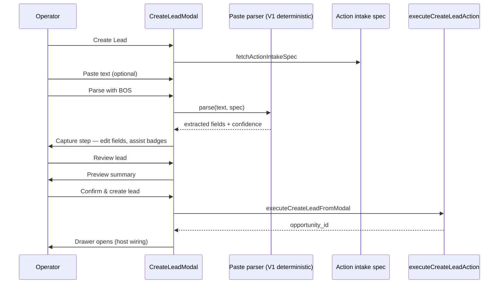

# Create Lead Action UX Foundation

**Path:** `docs/sprints/archive/06_2026/create_lead_action_ux_foundation.md`  
**Date:** 2026-06-08  
**Status:** Closed — superseded by `docs/system/action-workspace-foundation.md` (Action Workspace V1)

## Goal

Make **Create Lead** the reference pattern for Alloy action UX: friendly intake, paste-assisted draft, operator review/approval, then existing execute path.

**Principle:** BOS assists. User approves. Platform executes.

---

## 1. Current-state audit (pre-sprint)

| Area | Finding |
|------|---------|
| **Action key** | `create_lead` (builder base action `create_record`) |
| **Placement** | Workspace right rail (dept + work-unit pages), registry via `applyRegistryResolvedActionClient` → `adminv2:open-create-lead` event |
| **Modal** | `CreateLeadModal` — dynamic fields from intake spec; capture → preview → confirm |
| **Intake spec** | `GET /api/admin/lifecycle/action-intake-spec` → `resolveCreateLeadActionIntakeSpec` from lifecycle `field_rules` + org palette |
| **Required fields** | Platform floor: person first/last; at-least-one phone/email; dept rules merged; child required rules downgraded to recommended at capture |
| **Execute** | `POST /api/admin/actions/execute` → `executeCreateLeadAction` (person, customer, opportunity, link, status event) |
| **Post-create** | Dept page: `openDrawer`; work-unit page: `invalidate` + `openDrawer` |
| **BOS** | Not wired on create path before this sprint; config-layout assist precedent only |
| **Gaps** | Raw form feel; no paste path; no assist badges; child_* payload not persisted on execute (follow-up) |

---

## 2. Proposed UX flow (delivered)



### Steps

1. **Intake** — welcome copy, large paste area, Parse & continue or Enter manually
2. **Capture** — compact paste panel + grouped fields from spec + source/notes extras
3. **Preview** — read-only summary; explicit confirm CTA
4. **Success** — host opens opportunity drawer (existing behavior)

---

## 3. Implementation

| Piece | Location |
|-------|----------|
| Parser types + swap boundary | `web/lib/lifecycle/actionIntakePasteParserTypes.ts` |
| V1 deterministic parser | `web/lib/lifecycle/parseCreateLeadIntakeText.ts` |
| Apply extraction to draft | `web/lib/lifecycle/applyActionIntakePasteExtraction.ts` |
| Reusable modal shell | `web/components/admin/opportunity/actions/ActionIntakeModalShell.tsx` |
| Paste panel | `web/components/admin/opportunity/actions/ActionIntakePastePanel.tsx` |
| Field groups + assist badges | `web/components/admin/opportunity/actions/ActionIntakeFieldGroups.tsx` |
| Create Lead modal | `web/components/admin/opportunity/actions/CreateLeadModal.tsx` |
| Intake notes on create | `web/lib/admin/actions/entryLifecycleActions.ts` (`metadata.intake_notes`) |
| Tests | `web/tests/lifecycle/actionIntakePasteParser.test.ts` |

### Parser V1 scope

- Email, phone, labeled parent/child/source/program/date lines
- Heuristic parent name from first name-like line
- Leftover narrative → `intake_notes` (low confidence)
- **Not** full AI — `ActionIntakePasteParser` interface allows swap-in later

### Reuse pattern for future actions

1. Resolve `ActionIntakeSpec` server-side
2. `ActionIntakeModalShell` + optional `ActionIntakePastePanel`
3. `ActionIntakeFieldGroups` for spec-driven fields
4. Preview step before `executeAdminAction`
5. Inject parser via `ActionIntakePasteParser` boundary

---

## 4. Follow-ups

- Persist child_* fields on execute (inquiry child insert pattern)
- **Program / schedule / room selects (not textboxes)** — see [`program_interest_configurable_model_audit.md`](./program_interest_configurable_model_audit.md) + [`location_scoped_programs_configuration_design.md`](./location_scoped_programs_configuration_design.md): shared select convergence, location-first cascade, Settings → Locations tabs (Programs under Locations, not standalone)
- AI-backed parser behind same `ActionIntakePasteParser` interface
- Server-side execute validation against intake spec
- Success toast inline before drawer open (optional polish)
- Extend hybrid intake to additional `action_key` values

---

## 5. Test plan

```bash
cd web && npm run test -- tests/lifecycle/actionIntakePasteParser.test.ts tests/lifecycle/actionIntakeSpecResolver.test.ts
cd web && npx tsc --noEmit
```

Manual:

1. Workspace → Create Lead → paste sample inquiry → Parse → verify fields + Review badges
2. Edit a BOS-filled field → badge clears
3. Submit without required fields → blocked on capture
4. Confirm → drawer opens with new lead
5. Registry right-rail Create Lead still opens same modal
