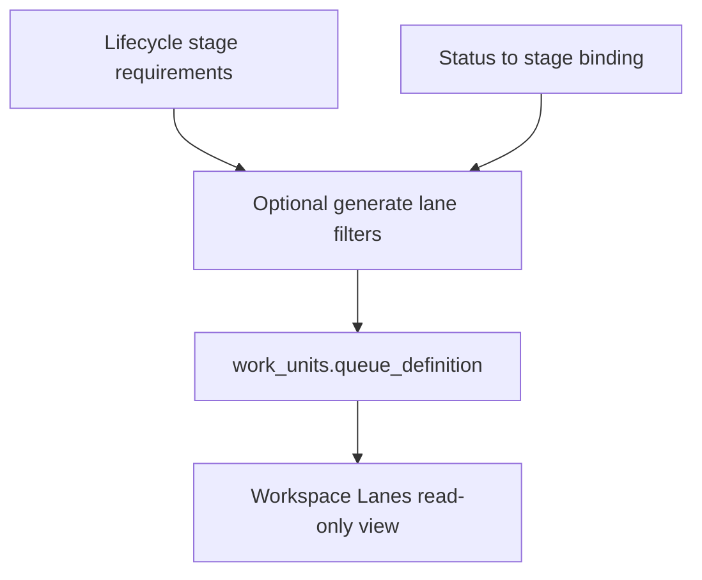
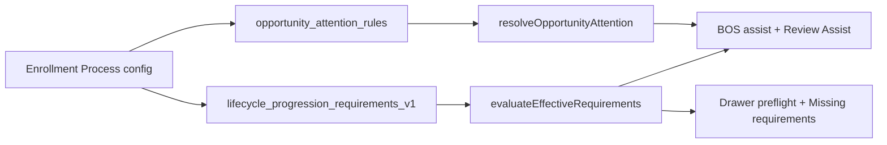

# Enrollment Process Configuration Hub — Spec v1

**Path:** `docs/sprints/archive/06_2026/enrollment_process_configuration_hub_spec_v1.md`  
**Status:** Design spec (no implementation in this pass)  
**Date:** May 2026  
**Sprint:** Lifecycle Runtime & Configuration Alignment — **final deliverable** (Settings IA / operator UX)

**Source of truth:** [`enrollment_operations_configuration_ux_audit.md`](./enrollment_operations_configuration_ux_audit.md)

**Explicit non-goals for this spec:**

- No new rules engine  
- No runtime redesign (`evaluateEffectiveRequirements`, queue service, action execute paths stay as-is)  
- No storage redesign (same tables and metadata keys; hub is **navigation + framing + links + optional read APIs**)  
- No additional lifecycle logic, Work Units expansion, or Fields expansion in this sprint  

---

## 1. North star

### 1.1 The question

> **“If I am an Enrollment Director, how do I configure my enrollment process?”**

### 1.2 The answer (one sentence)

Configure the **Lead → Enrolled journey** on the **Enrollment Process** hub—stage by stage—then use linked surfaces for **names** (Statuses), **workspace lanes** (Work Units), **buttons** (Actions), **urgency** (Needs Attention), and **data capture** (Fields & Record Layouts).

### 1.3 Design principles

| Principle | Implication |
|-----------|-------------|
| **Lifecycle is the spine** | Six operator stages order all enrollment Settings copy and hub navigation |
| **Process vs capture** | Lifecycle configures **objects** (Person, Child, Program); Fields configures **fields** (First Name, DOB) |
| **Work Units are operational** | Lanes mirror the process; they are not where directors define business rules |
| **Compose, don’t duplicate** | Hub **embeds or deep-links** existing pages; does not re-implement editors |
| **Advanced is rare** | JSON, transition rules, and registry tools stay behind **Advanced** |
| **BOS consumes, doesn’t configure** | BOS reads evaluation output; it does not get a parallel configuration tree |

---

## 2. Primary navigation hierarchy

### 2.1 Settings top level (target)

```text
Settings
├── Organization          (Departments, Locations, Users, Communications, KPIs)
├── Enrollment Process    ← NEW primary hub (replaces scattered “Enrollment Operations” tile list as entry)
│   ├── Overview
│   ├── Stages            → per-stage panels (spine = today’s Lifecycle editor)
│   ├── Workspace Lanes   → reframed Work Units (operational view)
│   ├── Statuses & Labels
│   ├── Action Buttons
│   ├── Needs Attention
│   └── Related           (Tour availability, Waitlist ranking, Forms — links only)
├── Record Setup          (Fields, Record Layouts, Record Labels, Relationships, Option Lists)
├── Actions & Automation  (Automations, Config proposals — non-enrollment or cross-cutting)
├── Documents & Forms
└── Advanced              (Diagnostics sidebar + collapsed technical tools)
```

### 2.2 Route map (proposed)

| Nav item | Route | Reuses today |
|----------|-------|--------------|
| **Enrollment Process — Overview** | `/adminV2/settings/enrollment-process` | New shell; links + dept selector + journey diagram |
| **Stages** (Lifecycle) | `/adminV2/settings/enrollment-process/stages` or **keep** `/adminV2/settings/lifecycle` with breadcrumb | `LifecycleStagesRequirementsHub` |
| **Workspace Lanes** | `/adminV2/settings/enrollment-process/lanes` or alias `/adminV2/settings/work-units` | `WorkUnitsClient` (presentation change only in later phase) |
| **Statuses & Labels** | `/adminV2/settings/enrollment-process/statuses` or filter query on statuses | Statuses page |
| **Action Buttons** | `/adminV2/settings/enrollment-process/actions` | Actions page |
| **Needs Attention** | `/adminV2/settings/enrollment-process/attention` | Attention & SLA page |
| **Related** | Anchors on overview | Tour availability, placement-priority, forms |

**Compatibility:** Existing URLs remain valid indefinitely; hub adds **canonical** paths and redirects or breadcrumbs from old tiles.

### 2.3 Settings index change (target)

| Today | Target |
|-------|--------|
| **Enrollment Operations** group with 6+ separate tiles | **One** hero tile: **Enrollment Process** — *Configure Lead → Enrolled* |
| Lifecycle, Work Units, Statuses, Attention, Tour, Waitlist as peer tiles | Sub-entries reachable only from hub **or** “All enrollment settings” expandable list |
| Record Setup separate | Unchanged — **explicitly not** under Enrollment Process |

### 2.4 Hub chrome (wireframe-level)

```text
┌─────────────────────────────────────────────────────────────────┐
│ Enrollment Process                                               │
│ Configure how families move from Lead to Enrolled.               │
│ Department: [ Enrollment ▼ ]                                     │
├─────────────────────────────────────────────────────────────────┤
│ [Overview] [Stages] [Workspace Lanes] [Statuses] [Actions] [Attention] │
├─────────────────────────────────────────────────────────────────┤
│  (tab content)                                                   │
└─────────────────────────────────────────────────────────────────┘
```

**Overview tab content:**

- Six-stage journey strip (Lead … Enrolled) — click → Stages tab with stage selected  
- Checklist: “Configured / Using defaults” per stage (requirements override yes/no)  
- Links: Tour availability, Waitlist ranking, Forms & packets  
- One paragraph: Fields and layouts are under **Record Setup**, not here  

---

## 3. What belongs under Enrollment Process (the hub)

The **Enrollment Process** is a **navigation and framing layer**, not a new config store.

| Belongs on hub | Does not belong on hub |
|----------------|-------------------------|
| Dept scope selector (shared across tabs) | Field definitions |
| Journey overview & stage tabs | Raw JSON editors |
| Aggregated read-only summaries (lane list, status list per stage) | Workflow builder |
| Deep links into sub-editors with **stage context** query params | New action handler registration |
| “Using platform defaults” vs “Custom” badges per stage | Person/child bootstrap rule editing |
| Optional future: “Apply suggested lane layout” **wizard** (confirm step) | Communications provider setup |

**Storage touched through hub (unchanged keys):**

- `departments.metadata.lifecycle_progression_requirements_v1`  
- `work_units.queue_definition` (via Work Units advanced only)  
- `status_definitions`  
- `action_placements`  
- `departments.metadata.opportunity_attention_rules`  

---

## 4. What belongs under Lifecycle (Stages tab)

**Role:** **Process spine** — what must be true to advance at each stage.

### 4.1 Operator owns here

| Item | UI control | Storage |
|------|------------|---------|
| Required **objects** per stage (Person, Child, Program, …) | Checkboxes | `lifecycle_progression_requirements_v1` |
| Recommended objects | Checkboxes | Same |
| Save / Reset stage to platform defaults | Buttons | Same |
| Department scope | Selector | `departments` row |

### 4.2 Read-only on Lifecycle (with links)

| Item | Presentation |
|------|----------------|
| Nested **field names** under each object | Indented list — **“Included fields (edit in Fields)”** |
| **Where stage appears** | Work unit name + queue labels + statuses (live org data when available) |
| **Typical actions** | Chips + link **Configure visibility → Action Buttons** filtered by stage |
| **Attention signals** | Bullet list + link **Edit thresholds → Needs Attention** |

### 4.3 Never on Lifecycle

- Field-level required toggles  
- `queue_definition` JSON  
- Status label text inputs (link to Statuses)  
- New action creation  
- Attention bucket JSON  

### 4.4 Stage panel layout (spec)

```text
┌─ Qualification ─────────────────────────────────────────────────┐
│ Requirements (editable)                                          │
│   ☑ Child    ☑ Program                                           │
│     └ First Name, Last Name, Date of Birth or Age Group  [Fields]│
│   ☐ Desired Schedule (recommended)                               │
│ [Save] [Reset to Default]                                        │
├──────────────────────────────────────────────────────────────────┤
│ Where this stage appears (read-only, live when wired)            │
│   Pipeline: Follow Up queue · Statuses: Contacted, Qualification │
│   [Open Workspace Lanes]                                         │
├──────────────────────────────────────────────────────────────────┤
│ Staff actions (read-only + link)  [Open Action Buttons]          │
│ Attention (read-only + link)      [Open Needs Attention]         │
└──────────────────────────────────────────────────────────────────┘
```

### 4.5 Vocabulary guardrail

| Term in UI | Meaning |
|------------|---------|
| **Stage** | Operator stage: Lead, Qualification, Tour, Waitlist, Enrollment, Enrolled |
| **Status** | CRM `status_key` with display label |
| **CRM lifecycle stage** | Internal `metadata.lifecycle_stage` enum — **never** shown as primary label; migrate to **operator stage binding** |

---

## 5. What belongs under Work Units (Workspace Lanes tab)

**Role:** **Operational view** of where staff work—not the place to define process meaning.

### 5.1 Operator owns here

| Item | UI |
|------|-----|
| Which **department** owns enrollment pipeline | Table filter / assignment |
| Work unit **name**, description, active | Simple form |
| **Add Work Unit** (non-pipeline WUs only in v1; pipeline seeded) | Button |
| Lane **read-only list** derived from `queue_definition` | Cards: label, description, status keys in plain language |

### 5.2 Advanced (collapsed)

| Item | Why advanced |
|------|----------------|
| Queue definition JSON textarea | Implementation artifact |
| Queue bucket editor (beta) | Power users |
| Queue preview / sample items | Diagnostics |
| `work_units.metadata` runtime keys | Implementer |
| **Regenerate lanes from Enrollment Process** | Future confirm dialog — writes `queue_definition` |

### 5.3 Copy standard

- Page title: **Workspace Lanes** (subtitle: *Where enrollment stages appear in the workspace.*)  
- Cross-link at top: *Stage requirements are configured on **Stages**.*  
- Do **not** say “configure your lifecycle” on this page  

### 5.4 Relationship to Lifecycle



**v1 hub:** read-only mirror + link; generation is **Phase 2** of hub implementation.

---

## 6. What belongs under Statuses (Statuses & Labels tab)

**Role:** **Vocabulary and binding** — what families and reports see; which stage a status belongs to.

### 6.1 Operator owns here

| Item | UI |
|------|-----|
| Display **label** per `status_key` | Existing Statuses editor |
| **Sort order** | Existing |
| **Active** / visibility flags | Existing |

### 6.2 New binding (future metadata — spec only)

| Field | Purpose |
|-------|---------|
| `metadata.enrollment_operator_stage` | One of: `lead` \| `qualification` \| `tour` \| `waitlist` \| `enrollment` \| `enrolled` |

**Do not** overload CRM `lifecycle_stage` (intake/execution/decision) for operator UI.

### 6.3 Hub integration

- **Global tab:** full status table with **Stage** column  
- **From Stages tab:** deep link `?stage=qualification` filters statuses for that stage  
- Lifecycle shows **read-only** status chips per stage  

### 6.4 Out of scope on Statuses

- Requirement policy  
- Queue filters (derived from binding + platform defaults)  

---

## 7. What belongs under Actions (Action Buttons tab)

**Role:** **Affordances** — where known buttons appear, not what they do.

### 7.1 Operator owns here

| Item | UI |
|------|-----|
| Enable placement per **surface** (drawer header, section, queue row, right rail) | Existing Actions UI |
| Order / slot | Existing |
| Entity filter (opportunity) | Existing |

### 7.2 Stage context (hub enhancement)

| Enhancement | Behavior |
|-------------|----------|
| Entry from Stages tab | `?stage=tour` highlights actions tagged for that stage in catalog |
| Read-only on Stages | Typical actions list + “Open Action Buttons” |
| **Suggested placements** (future) | After saving stage requirements, optional “Apply suggested button visibility” — merges `action_placements`, never deletes custom rows |

### 7.3 Platform-owned (not Settings)

| Item | Owner |
|------|--------|
| `action_definitions` handlers | Engineering / migrations |
| `condition_config` expressions | Advanced or generated |
| New action keys | Registry + engineering |

---

## 8. What belongs under Needs Attention (Needs Attention tab)

**Role:** **Urgency** — when records surface as needing staff action.

### 8.1 Operator owns here

| Item | UI |
|------|-----|
| Bucket **labels**, enablement, order | Existing Attention & SLA |
| **Threshold hours** per reason | Existing |
| SLA wait buckets | Existing |
| Priority weights (if exposed) | Existing |

### 8.2 Hub integration

| On Stages tab | On Attention tab |
|---------------|------------------|
| Read-only list of buckets relevant to stage | Full editor |
| Link with `?focus=bucket_key` | Dept selector (shared) |

### 8.3 Platform-owned

| Item | Owner |
|------|--------|
| `attentionPlatformCatalog` reason codes | Platform |
| Resolver logic | Code |

### 8.4 Related tiles (not inside Attention tab)

- **Tour availability** — scheduling windows  
- **Waitlist ranking** — placement priority metadata on WU/dept  

Linked from **Overview** only.

---

## 9. What belongs under Fields (Record Setup — outside hub)

**Role:** **Entity capture** — fields exist independent of pipeline stage.

### 9.1 Operator owns here

| Surface | Owns |
|---------|------|
| **Fields** | Labels, help text, visibility, option sets references |
| **Record Layouts** | Section order, `field_placements_v1` required-on-layout, editability |
| **Option Lists** | Dropdown values |
| **Record Labels** | Entity display names |

### 9.2 Relationship to Enrollment Process

| Enrollment Process shows | Fields owns |
|--------------------------|------------|
| “Child required before waitlist” | “Date of birth required when saving child” |
| Link: **Edit field rules** | Bootstrap + layout evaluators |

### 9.3 Copy block (required wherever nested fields appear)

> **Field detail is guidance.** Lifecycle controls whether a **child** is required before moving forward. **Fields** and **Record Layouts** control individual field requiredness on profiles and drawers.

### 9.4 Explicitly not under Enrollment Process

- Stage-scoped field policies (future would still use layout + bootstrap, not lifecycle metadata)  
- Person vs child vs opportunity **definition**  

---

## 10. Advanced / Admin-only

Consolidate under **Settings → Advanced** or per-page **Advanced** `<details>`:

| Surface | Advanced content | Audience |
|---------|------------------|----------|
| Workspace Lanes | `queue_definition` JSON, bucket beta editor, metadata panel | Implementer / support |
| Actions | `condition_config` viewer/editor (when built) | Power user |
| Settings sidebar | Workflow automation rules (`status_transition_rules`) | Admin |
| Settings sidebar | Field grouping bulk (`field_section_definitions`) | Admin |
| Platform | Action registry seeds, migrations | Engineering |
| Diagnostics | Runtime metadata catalog RO panels | Support |

**Enrollment Directors** should complete Lead → Enrolled configuration without opening Advanced.

---

## 11. Future BOS integration

BOS does **not** receive a separate enrollment configuration tree. It **consumes** the same spine as runtime.

### 11.1 Data flow (unchanged architecture)



### 11.2 BOS behaviors (future-friendly)

| BOS surface | Reads | Proposes (HITL) | Does not |
|-------------|-------|-----------------|----------|
| **Review Assist / operational recommendations** | `evaluateEffectiveRequirements` violations | Next best action keys from catalog | Change lifecycle metadata without apply path |
| **Task Assist** | Communication objectives + record context | Draft message | Change stage requirements |
| **Config Assist** | Layout snapshots | Layout proposals (`config_layout_assist_proposals`) | Queue JSON |
| **Orchestrator routing** | Context + deterministic routing | Route to capability | Bypass preflight |

### 11.3 Hub ↔ BOS UX (future)

| Feature | Spec |
|---------|------|
| Stages tab sidebar | “What BOS will cite” — read-only missing-requirement examples from evaluator |
| No “BOS rules” tab | BOS stays assist layer per `docs/product/bos-foundation.md` |
| Config proposals tile | Remains under **Actions & Automation**, linked from Overview |

### 11.4 Copy doctrine for BOS

- BOS explains **why** an action is blocked using **same labels** as Lifecycle (Person, Child, Program)  
- BOS must not invent parallel requirement vocabulary  

---

## 12. Recommended implementation order

Phases are **UI/IA only** unless noted.

| Phase | Scope | Effort | Depends on |
|-------|--------|--------|------------|
| **H0** | Publish this spec + audit; no code | Done | — |
| **H1** | Hub shell: route `/enrollment-process`, overview, sub-nav, dept selector, breadcrumbs; Settings index single tile | M | — |
| **H2** | Stages tab = current Lifecycle page embedded; improved field guidance links | S | H1 |
| **H3** | Vocabulary: `enrollment_operator_stage` on status metadata + Statuses column + filtered deep links | M | H1 |
| **H4** | Workspace Lanes tab: rename chrome, read-only lane cards, hide JSON by default, lifecycle cross-link | M | H1 |
| **H5** | Live “Where appears” on Stages (read org `enrollment_pipeline` + statuses) | M | H3, H4 |
| **H6** | Actions + Attention entry with `?stage=` context | S | H1, H3 |
| **H7** | Optional generate lane proposal + confirm (writes queue_definition) | L | H3, H5 |
| **H8** | Optional suggested action placements merge | L | H6 |
| **H9** | Advanced consolidation + redirects from old tiles | S | H1–H6 |

**Do not schedule in this program:** new evaluator, new tables, Work Units domain CRUD, Fields modal redesign.

---

## 13. Risks

| Risk | Impact | Mitigation |
|------|--------|------------|
| Hub perceived as “new system” while storage unchanged | Operator confusion | Clear “same settings, organized by stage” copy; preserve old URLs |
| Two lifecycle vocabularies persist | Misconfiguration | H3 binding field; ban CRM `lifecycle_stage` in operator UI |
| Lane generation overwrites custom queues | Production incident | Diff + confirm; never silent write; scope to `enrollment_pipeline` only |
| Nested fields still look editable | Support tickets | Mandatory “Edit in Fields” links; no field checkboxes on Stages |
| Engineering builds rules engine anyway | Scope creep | Spec non-goals in PR template; audit as gate |
| BOS diverges from lifecycle labels | Trust loss | Single label map in `lifecycleProgressionRequirementsCatalog` for UI + BOS |
| Partial hub ships without live lane data | Disappointment | Badge “Reference layout” until H5; honest copy |

---

## 14. Migration path from current Settings IA

### 14.1 Current state (May 2026 post-sprint)

| Asset | Route | Status |
|-------|-------|--------|
| Lifecycle editor | `/adminV2/settings/lifecycle` | Editable dept stage requirements |
| Work Units | `/adminV2/settings/work-units` | Partial; JSON in modal |
| Statuses | `/adminV2/settings/statuses` | Editable |
| Actions | `/adminV2/settings/actions` | Editable |
| Attention | `/adminV2/settings/attention-sla-rules` | Editable |
| Settings index | `/adminV2/settings` | Enrollment Operations group, multiple tiles |

### 14.2 Migration waves

**Wave A — Navigation only (low risk)**

1. Add `/adminV2/settings/enrollment-process` overview + sub-nav.  
2. Replace index tiles with one **Enrollment Process** entry.  
3. Keep all existing routes; add breadcrumbs: `Enrollment Process > Stages`.  
4. Redirect optional: `/settings/lifecycle` → canonical under hub.

**Wave B — Presentation (medium risk)**

1. Rename Work Units chrome to **Workspace Lanes**; collapse JSON.  
2. Strengthen field guidance links on Stages.  
3. Add cross-links (already started) consistently on all enrollment pages.

**Wave C — Binding & live data (medium risk)**

1. Ship `enrollment_operator_stage` metadata + admin API.  
2. Wire Stages “Where appears” to org pipeline.  
3. Statuses filtered views from hub.

**Wave D — Optional automation (higher risk)**

1. Lane generation wizard.  
2. Suggested placements merge.  

### 14.3 Tile mapping table

| Old index tile | Hub destination |
|----------------|-----------------|
| Lifecycle | Stages |
| Work Units & Queues | Workspace Lanes |
| Statuses | Statuses & Labels |
| Action Buttons | Action Buttons |
| Attention & SLA | Needs Attention |
| Tour availability | Overview → Related |
| Waitlist ranking | Overview → Related |
| Forms & packets | Overview → Related (external forms hub) |

| Stays outside hub | Reason |
|-------------------|--------|
| Fields, Record Layouts | Entity capture, not stage |
| Automations, Config proposals | Cross-cutting automation |
| Organization tiles | Not enrollment-specific |

### 14.4 Operator communication

One-time in-app note (when H1 ships):

> **Enrollment settings moved.** Configure your Lead → Enrolled process from **Settings → Enrollment Process**. Field labels and drawer layouts remain under **Record Setup**.

---

## 15. Acceptance criteria (when hub is built)

| # | Criterion |
|---|-----------|
| 1 | Enrollment Director can open one hub and reach all six stage requirement editors without hunting tiles |
| 2 | No field-level checkbox exists on Stages |
| 3 | Work Units default view shows no raw JSON |
| 4 | Every enrollment sub-page links back to hub and to Stages |
| 5 | Fields & Record Layouts are linked from nested field guidance, not duplicated |
| 6 | Advanced contains JSON, transition rules, and condition_config |
| 7 | No new metadata keys beyond spec-approved bindings (H3) |
| 8 | Runtime preflight unchanged — hub passes existing tests |

---

## 16. References

| Doc | Role |
|-----|------|
| `enrollment_operations_configuration_ux_audit.md` | Problem framing and ownership matrix |
| `settings_configuration_ia_cleanup_pass.md` | Tile audit and editability table |
| `lifecycle_runtime_configuration_alignment_sprint.md` | Runtime alignment (shipped) |
| `lifecycle_configuration_requirements_design_package_v1.md` | Evaluator spine (do not duplicate) |
| `docs/system/configuration-system.md` | Four-plane control plane |
| `docs/product/bos-foundation.md` | BOS consume-only doctrine |

---

## 17. Sprint closeout statement

**Lifecycle Runtime & Configuration Alignment Sprint** delivers:

- **Runtime:** aligned preflight, placements, NA buckets, Settings lifecycle MVP (dept overrides).  
- **UX (this spec):** the **target** operator configuration experience—implementation is a **follow-on hub program** (H1–H9), not an extension of lifecycle logic in this sprint.

**Final deliverable for configuration UX:** this document + the UX audit. **No further lifecycle, Work Units, or Fields implementation** under this sprint charter.
