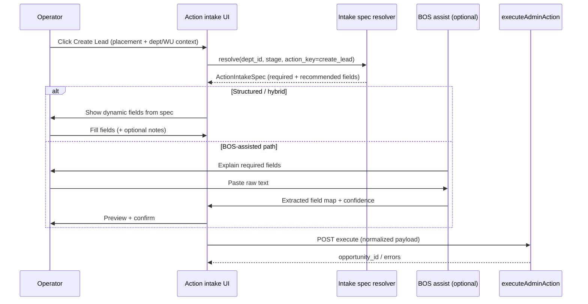

# Lifecycle Action Intake Model — Design Before Build

**Path:** `docs/sprints/archive/06_2026/lifecycle_action_intake_model.md`  
**Status:** Design / audit only — **no implementation in this sprint**  
**Date:** 2026-05-31  
**Principle:** Connect Lifecycle Builder **required information** to **action execution** through a single **action intake** contract. Reuse platform actions, forms, BOS, and the existing requirement evaluator — do not add a parallel rules engine.

**Related:**

- `docs/sprints/archive/06_2026/lifecycle_actions_model_simplification.md` — configured actions (empty by default; lifecycle-wide vs stage-specific)
- `docs/sprints/archive/06_2026/lifecycle_builder_guided_board_prefetch.md` — stage bootstrap (field rules, form coverage)
- `docs/sprints/archive/05_2026/lifecycle_configuration_requirements_design_package_v1.md` — unified requirements spine
- `docs/sprints/archive/05_2026/lifecycle_information_matrix_v1.md` — capture-first vs execute-now actions
- `docs/product/bos-foundation.md` — BOS doctrine (propose/approve; platform executes)
- `docs/archive/2026-06-superseded-system/actions-and-workflows.md` — `executeAdminAction`, events, workflows

---

## Executive summary

Today, **Create Lead** (`create_lead` / builder base action `create_record`) collects a **fixed** modal shape (parent first/last, phone/email) and validates in **`executeCreateLeadAction`** with **hardcoded** rules. Lifecycle Builder can configure **per-stage field requirements** (`lifecycle_progression_requirements_v1.field_rules`), but those rules are **not yet the source of truth** for the Create Lead intake UI or for blocking submit on that action.

The proposed model introduces an **Action Intake Spec**: at action click time, resolve **what must be collected** from the lifecycle context (department, stage, action key, optional intent), drive **structured fields** and/or **BOS-assisted paste → extract → preview → confirm**, then call the existing **`POST /api/admin/actions/execute`** path with a normalized payload.

**Forms** remain the durable definition/coverage surface for “does this published form satisfy requirements for intent X?” **BOS** remains assistive — it must not silently execute Create Lead; it prepares and explains, operator confirms, platform executes.

---

## 1. Proposed model

### 1.1 Concepts

| Concept | Definition |
|---------|------------|
| **Lifecycle required information** | Department-scoped rules in `departments.metadata.lifecycle_progression_requirements_v1` — per operator stage: `field_rules.required_rule_ids` / `recommended_rule_ids`, merged with platform defaults via `effectiveFieldRulesForStage`. |
| **Action** | Surfaced via `action_definitions` + `action_placements`; execution via `executeAdminAction` (or modal capture-first, then execute). |
| **Action intake** | Operator-facing collection step **before** `executeAdminAction` mutates truth for capture-first actions. |
| **Action Intake Spec** | Resolved list of fields to collect for this click: rule_id, entity, display label, required vs recommended, binding hints (`field_key`, `form_capture_keys`, value paths). |
| **Intake mode** | `structured` · `bos_assisted` · `hybrid` (structured required fields + optional “additional notes” free text). |
| **Form intent** | Operational purpose of a form (`enrollment_lead`, etc.) — used for **coverage validation**, not as the only intake path. |

### 1.2 Resolution flow (design target)



### 1.3 Binding rules

| Rule | Detail |
|------|--------|
| **Source of required fields** | For stage-scoped actions (e.g. Create Lead on Lead stage), use **`effectiveFieldRulesForStage(stage, department.metadata)`** — same merge as Settings and form coverage. |
| **Lifecycle-wide actions** | Use union or “entry stage” policy (e.g. Lead defaults) — product decision in V1: **Lead stage rules** when `action_scope=lifecycle` and primary entity is opportunity entry. |
| **Child fields on create** | Example “Child First Name” on Lead: spec includes `inquiry_child` rules; V1 may **recommend** on create and **require** before downstream execute-now actions (matches `lifecycle_information_matrix_v1` doctrine). |
| **Preflight timing** | **Capture-first** (`create_lead`): validate at **submit** against intake spec + existing handler checks. **Execute-now** (`approve_enrollment`, …): keep **`evaluateOpportunityActionPreflight`** on existing opportunity. |
| **Execution** | Always **`executeAdminAction`** / `executeCreateLeadAction` — BOS never writes opportunities directly. |
| **Audit** | Intake confirmation emits same correlation/event patterns as today’s action execute. |

### 1.4 Action Intake Spec (shape — conceptual)

```ts
type ActionIntakeSpec = {
  action_key: "create_lead";
  department_id: string;
  operator_stage: "lead"; // LifecycleOperatorStage when mappable
  mode: "structured" | "bos_assisted" | "hybrid";
  required: IntakeFieldSpec[];
  recommended: IntakeFieldSpec[];
  copy: { title: string; help: string; bos_prompt?: string };
};

type IntakeFieldSpec = {
  rule_id: string;           // e.g. person:first_name
  entity: "person" | "child" | "opportunity" | ...;
  field_label: string;       // configured label (Phone not Mobile)
  field_key: string | null;  // org field_definitions key when bound
  form_capture_keys: string[]; // from lifecycleFieldRuleBindings
  value_kind: "text" | "phone" | "email" | "date" | ...;
};
```

Resolver lives server-side (e.g. extend stage-bootstrap or dedicated `GET …/action-intake-spec`) so client and BOS share one truth.

### 1.5 BOS role (strict)

| BOS may | BOS may not |
|---------|-------------|
| Explain which fields are required and why (from spec) | Insert/update `opportunities` / `persons` directly |
| Accept pasted narrative (email, call notes, web form dump) | Bypass org scope or permissions |
| Propose extracted values per `rule_id` / `field_key` | Auto-execute `create_lead` without explicit operator confirm |
| Show diff/preview vs empty spec | Invent fields not in spec (warn as “unmapped”) |

Pattern precedent: **Config Layout Assist** `field-setup` draft → operator confirm → proposal (`buildProposalFromFieldSetupConfirm`) — adapt to **operational intake propose**, not configuration PATCH.

---

## 2. Existing infrastructure to reuse

### 2.1 Create Lead / create record action

| Piece | Location | Behavior today |
|-------|----------|----------------|
| Registry key | `action_definitions.key` = `create_lead` | Builder maps `create_record` → `create_lead` (`lifecycleStageBaseActions.ts`) |
| Client routing | `applyRegistryResolvedActionClient.ts` | `form_key === "create_lead"` → `openCreateLead` / `adminv2:open-create-lead` |
| Modal UI | `CreateLeadModal.tsx` | Fixed: first name, last name, email, phone; local `canSubmit` |
| Execute | `entryLifecycleActions.ts` → `executeCreateLeadAction` | Hardcoded required: first, last, phone **or** email; creates person, customer, opportunity |
| API | `POST /api/admin/actions/execute` | Sentinel `CREATE_LEAD_ACTION_ENTITY_ID` when no entity yet |
| Context | Payload `context.department_id`, `context.work_unit_id` | Passed from workspace placement |

**Gap:** Modal and execute path do **not** read `lifecycle_progression_requirements_v1.field_rules`.

### 2.2 Lifecycle required information (Settings + metadata)

| Piece | Location | Reuse for intake |
|-------|----------|------------------|
| Authoring | `LifecycleStageFieldRequirementsEditor`, `PATCH …/lifecycle-requirements` | Operators configure Lead requirements (Person First Name, etc.) |
| Storage | `lifecycle_progression_requirements_v1` on `departments.metadata` | Same store intake resolver reads |
| Merge | `effectiveFieldRulesForStage`, `effectiveFieldRulesForDepartment` | Same effective rules as form coverage |
| Palette | `mergeLifecycleFieldPaletteForStage` + `lifecycleFieldRuleBindings` | Labels (Phone), `field_key`, `form_capture_keys` |
| Runtime eval | `lifecycleFieldRuleEvaluator.ts`, `evaluateLifecycleFieldRulesForPreflight` | Used for **existing opportunity** preflight slices — pattern for validating filled intake payload |
| Catalog labels | `lifecycleFieldRequirementsCatalog.ts`, `lifecycleProgressionRequirementsCatalog.ts` | Platform defaults when no dept override |

### 2.3 Action preflight / effective requirements

| Piece | Location | Applies to Create Lead? |
|-------|----------|-------------------------|
| Unified evaluator | `evaluateEffectiveRequirements.ts` | **No** at click — no opportunity row yet |
| Opportunity preflight | `evaluateOpportunityActionPreflight` → `adminActionPreflight.ts` | **No** — `create_lead` not in `LIFECYCLE_PREFLIGHT_ACTION_KEYS` |
| Preflight API | `POST /api/admin/actions/preflight` | Could evaluate **draft payload** pre-submit (extension) |
| Blocked UI | `ActionPreflightBlockedPanel.tsx`, drawer integration | Pattern for showing missing fields with guidance |
| BOS preflight enrich | `enrichOperationalRecommendationPreflight.ts` | Uses `evaluateEffectiveRequirements` on **existing** records — not create |

**Doctrine** (`lifecycle_information_matrix_v1.md`): `create_lead` is **capture-first** — preflight at click is optional; **submit validation** is mandatory.

### 2.4 Forms framework

| Piece | Location | Reuse for intake |
|-------|----------|------------------|
| Schema | `lib/forms/schema`, published `form_definition_versions` | Structured intake can mirror form field types |
| Operational intent | `operationalIntentTemplates.ts`, `FormOperationalIntentPicker` | **`enrollment_lead`** intent ↔ Create Lead purpose |
| Intake routing | `applyFormLeadCaptureIntake.ts`, `applyFormIntakeSafe.ts` | Parallel path: family submits form → creates lead (not operator modal) |
| Coverage | `enrollmentProcessFormCoverage.ts`, Form Coverage card | **`coverageStateForFieldRule`** compares published form captures to **same `field_rules`** intake should use |
| Intent ↔ stage | `INTAKE_TYPE_OPERATOR_STAGES` | `enrollment_lead` → `lead` stage |

**Alignment:** Form Coverage answers “does form X satisfy requirements for intent?” — Action intake answers “collect requirements to run action now.” Same underlying `field_rules`, different surface.

### 2.5 BOS / AI assist (no lead-intake parser today)

| Piece | Location | Reuse pattern |
|-------|----------|----------------|
| Doctrine | `docs/product/bos-foundation.md` | Human-in-the-loop; platform executes |
| Command surface | `AICommandSurfaceShell.tsx`, `routeCommandSurface` | Routing only — not field extraction |
| Config assist confirm | `config-layout-assist/field-setup/confirm` | **Preview + confirm** UX precedent |
| Operational assist | `bosAssistHandoffRouting.ts`, Task Assist | Draft comms / tasks — different domain |
| Review assist | `BosReviewSummaryPlaceholder.tsx` | Intake **review** copy patterns |
| Drawer handoff | `triggerBosDrawerAssistHandoff` | Optional “Work with BOS” alongside intake |

**Gap:** No `operational_intake_assist` capability that maps paste → `person:first_name` etc.

### 2.6 Action execution pipeline (keep as SoT)

```
Placement click → applyRegistryResolvedActionClient
  → capture-first: open modal / form
  → submit → POST /api/admin/actions/execute
    → executeAdminAction → executeCreateLeadAction (create_lead)
    → emitEvent / workflow (downstream)
```

Workflows and events **after** create remain unchanged (`created_via: create_lead` in opportunity metadata).

### 2.7 Lifecycle Builder bootstrap (recent)

| Piece | Location | Note |
|-------|----------|------|
| Stage bootstrap | `GET /api/admin/lifecycle-builder/stage-bootstrap` | Already returns `field_requirements` for operator stage |
| Configured actions | `loadLifecycleBuilderConfiguredActions` | Separate concern — surfacing buttons, not intake shape |

Intake spec can extend bootstrap or add sibling endpoint to avoid duplicate fetches.

---

## 3. Gap list

| # | Gap | Impact |
|---|-----|--------|
| G1 | **No Action Intake Spec resolver** tied to `action_key` + dept + stage | Builder requirements don’t drive Create Lead UI |
| G2 | **Create Lead modal is static** | Cannot add Child First Name / program fields without code changes |
| G3 | **`create_lead` not in lifecycle preflight catalog** | No shared “missing requirements” panel before submit (only local modal rules) |
| G4 | **Submit validation ignores `field_rules`** | `executeCreateLeadAction` uses fixed strings, not `evaluateLifecycleFieldRulesForPreflight` on draft |
| G5 | **No BOS paste → field extraction** for CRM intake | Operators cannot use hybrid intake |
| G6 | **Action config has no `intake_mode` or `intake_intent`** | Cannot declare “this placement uses enrollment_lead intent” in metadata |
| G7 | **Form coverage vs action intake not linked in UX** | Coverage card doesn’t open from Create Lead flow |
| G8 | **Lifecycle-wide Create Lead scope** (new model) vs Lead-only requirements | Policy needed: which stage’s `field_rules` apply when scope=lifecycle |
| G9 | **Child required on create** vs doctrine | Matrix says child **rec** on lead create, **req** before tour/waitlist — intake spec must encode policy per action |
| G10 | **Phone label** | `resolveLifecycleFieldPaletteDisplayLabel` fixes Mobile override; intake must use palette labels everywhere |
| G11 | **No draft payload preflight API** for create_lead | `POST /api/admin/actions/preflight` expects `opportunity_id` |
| G12 | **BOS must not auto-execute** | Guardrails in capability registry still needed when intake assist is added |

---

## 4. Recommended V1 flow — Create Lead

### 4.1 Scope (V1)

- **Action:** `create_lead` only (builder: `create_record` → `create_lead`).
- **Context:** Builder-owned department + current operator stage **Lead** (`lead`) when stage key maps; workspace `department_id` / `work_unit_id` from placement context.
- **Requirements source:** `effectiveFieldRulesForStage("lead", department.metadata)` + palette labels.
- **Modes:** **Structured first**; **hybrid** (structured + optional notes field) as stretch; **BOS-assisted** as V1.1 if structured ships first.

### 4.2 Operator flow (V1 structured)

1. Operator clicks **Create Lead** (department or work unit rail).
2. Client requests **Action Intake Spec** (`action_key=create_lead`, `department_id`, `stage_key=lead`).
3. Modal renders **dynamic required/recommended fields** from spec (grouped by entity: Person, Child, …).
4. Client validates locally; optional **`POST /api/admin/actions/preflight`** with **draft payload** + sentinel entity (extension) returning same violation shape as drawer preflight.
5. On submit → existing **`executeCreateLeadFromModal`** / `postAdminActionExecute` with normalized `first_name`, `last_name`, `phone`, `email`, plus **extension bag** for child fields when added.
6. Server: **`executeCreateLeadAction`** + new **spec-based validation** (reject with field-level errors matching `ActionPreflightUiPayload` shape).
7. On success → navigate/open opportunity drawer as today.

### 4.3 Requirement policy for V1 (explicit)

| Field class | V1 policy |
|-------------|-----------|
| Person first/last, phone or email | **Required** (keep parity with today + spec) |
| Child first name (if in spec) | **Recommended** in UI; **not blocking** create (aligns with information matrix) |
| Location / vertical | **Hidden or auto** from workspace context (existing execute uses org vertical + optional location) |

### 4.4 Acceptance criteria (V1)

- Changing Lead required fields in Lifecycle Builder **changes** Create Lead modal within one refresh (spec refetch).
- Labels match Settings (**Phone**, not Mobile).
- Submit blocked with clear violations when required spec fields empty.
- No new parallel execution engine; **`create_lead` execute path** remains authoritative.
- Configured actions list stays **empty until operator adds** — unrelated to intake spec.

---

## 5. Forms vs BOS-assisted intake — recommendation

### 5.1 Roles

| Surface | Best for | Why |
|---------|----------|-----|
| **Structured form (dynamic modal)** | **V1 default** for operator Create Lead | Deterministic, accessible, matches execute payload, easy to validate against `field_rules`, works offline/low-latency |
| **Published forms (family-facing)** | Async capture; coverage validation | Already routed via `enrollment_lead` intent; different channel |
| **BOS-assisted paste** | High-volume call/email centers; messy notes | Reduces typing; needs extraction quality + confirm step + guardrails |

### 5.2 Recommendation

1. **Ship V1 structured intake** driven by Action Intake Spec (resolver + dynamic modal + spec-based server validation).
2. **Keep Form Coverage** as the compliance surface: “Select/create a form that satisfies Create Lead requirements” — link from intake modal footer (optional).
3. **Add V1.1 hybrid**: optional “Additional notes” (free text, not mapped to execute) + store on opportunity metadata/activity if desired.
4. **Add V1.2 BOS-assisted** as optional tab/mode on same modal:
   - Uses spec for required field list and explanations.
   - Extraction returns **proposed** `Record<string, unknown>` keyed by `rule_id`.
   - Preview maps into structured fields; operator edits; confirm → execute.
   - Register as new **BOS capability** with **no apply** except returning proposal to UI.

**Do not** replace structured fields with BOS-only for V1 — risk, latency, and audit complexity are higher.

### 5.3 When forms are “enough”

If org publishes an **enrollment_lead** form whose captures satisfy all **required** `field_rules` for Lead, Form Coverage already shows **satisfies**. That form is for **public/family** intake, not replacing staff Create Lead unless product routes staff through “send form” action instead.

---

## 6. Implementation phases (future — not this sprint)

| Phase | Deliverable |
|-------|-------------|
| **P0** | `resolveActionIntakeSpec({ orgId, departmentId, actionKey, stageKey })` server module + tests |
| **P1** | Dynamic Create Lead modal + spec-based validation in `executeCreateLeadAction` |
| **P2** | Draft preflight API for capture-first actions (optional opportunity sentinel) |
| **P3** | BOS operational intake assist (paste → extract → preview) |
| **P4** | `action_definitions.metadata.intake` (`mode`, `form_intent`) for builder-configured actions |

---

## 7. Open product decisions

1. **Lifecycle-wide Create Lead:** Use Lead stage `field_rules` always, or separate “lifecycle entry” requirement profile?
2. **Child fields on create:** Recommended only vs required for specific verticals?
3. **Multi-person households:** Single primary person only in V1 (current) — spec should not imply multi-guardian without execute support.
4. **Where intake lives:** Modal only vs right-rail panel vs full-page — UX pass after spec works.
5. **Whether send_form action** should share same intake spec machinery with different execute path.

---

## 8. Audit checklist (files reviewed)

| Area | Primary paths |
|------|----------------|
| Create Lead execute | `web/lib/admin/actions/entryLifecycleActions.ts`, `executeAdminAction.ts` |
| Create Lead UI | `web/components/admin/opportunity/actions/CreateLeadModal.tsx`, `entryLifecycleActionClient.ts` |
| Action routing | `web/lib/admin/actions/applyRegistryResolvedActionClient.ts` |
| Preflight | `web/lib/admin/actions/adminActionPreflight.ts`, `web/lib/completion/lifecycleActionRequirementCatalog.ts`, `web/lib/completion/evaluateEffectiveRequirements.ts` |
| Lifecycle requirements | `web/lib/completion/lifecycleProgressionRequirementsConfig.ts`, `web/lib/lifecycle/lifecycleFieldRuleEvaluator.ts`, `web/app/api/admin/departments/[departmentId]/lifecycle-requirements/route.ts` |
| Form coverage / intake | `web/lib/lifecycle/enrollmentProcessFormCoverage.ts`, `web/lib/forms/intake/applyFormLeadCaptureIntake.ts`, `web/lib/forms/operationalIntentTemplates.ts` |
| Builder | `web/lib/lifecycle/buildLifecycleStageBootstrap.ts`, `web/lib/lifecycle/loadLifecycleBuilderConfiguredActions.ts` |
| BOS | `web/app/adminV2/components/aiCommandSurface/AICommandSurfaceShell.tsx`, `web/lib/agent/configLayoutAssist/configLayoutAssistFieldSetup.ts`, `docs/product/bos-foundation.md` |

---

## 9. Explicit non-goals (this document)

- Implementing intake resolver, UI, or BOS extractor.
- Changing workflow engine or event catalog for create.
- Replacing `action_placements` or enrollment process hub actions list behavior.
- Auto-seeding configured actions or starter templates.

---

*Next suggested doc update after implementation: `docs/system/configuration-system.md` § Action intake + `docs/product/crm-system.md` Create Lead path.*
